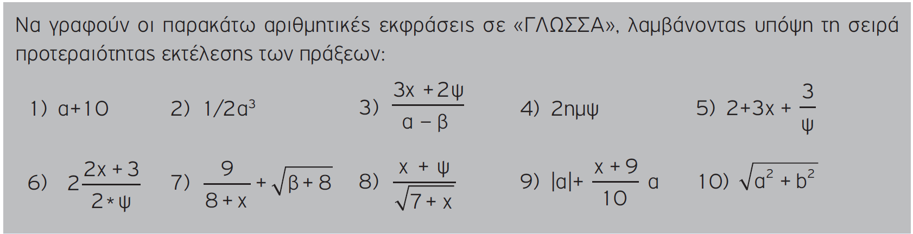

class: cover-page, center, middle, inverse

ΠΛΗΡΟΦΟΡΙΚΗ
===========

## Γ' ΓΕΝΙΚΟΥ ΛΥΚΕΙΟΥ

### Oμάδα Προσανατολισμού Σπουδών Οικονομίας & Πληροφορικής

???
§ &sect;    &#167;
± &plusmn;  &#177;
… &hellip;  &#8230;
ℹ           &#8505;
← &larr;    &#8592;
→ &rarr;    &#8594;
↔ &harr;    &#8596;
⇎           &#8654;
⇏           &#8655;
⇒ &rArr;    &#8658;
⇔ &hArr;    &#8660;
∈ &isin;    &#8712;
∞ &infin;   &#8734;
∩ &cap;     &#8745;
∪ &cup;     &#8746;
≅ &cong;    &#8773;
≈ &asymp;   &#8776;
≟           &#8799;
≠ &ne;      &#8800;
≡ &equiv;   &#8801;
≤ &le;      &#8804;
≥ &ge;      &#8805;
✓           &#10003;
✗          &#10007;
🛈          &#128712;
📖
💡

---
name: contents

## Περιεχόμενα

.contents[

]

---
layout: true

## 1.1 Η έννοια πρόβλημα

---
> Με τον όρο **Πρόβλημα** εννοείται **μια κατάσταση** η οποία 
- χρήζει αντιμετώπισης, 
- απαιτεί λύση, 
- η δε λύση της δεν είναι γνωστή, ούτε προφανής.

.footnote[
  [ΑΕΠΠ - Βιβλίο Μαθητή, §1.1, σελ.15](books/22-0203.pdf#page=16)
]

---
layout: true

## 1.2 Κατανόηση προβλήματος ***

> Η οποιαδήποτε προσπάθεια αντιμετώπισης ενός προβλήματος είναι καταδικασμένη σε αποτυχία αν προηγουμένως δεν έχει γίνει απόλυτα κατανοητό το πρόβλημα που τίθεται. 
>
> Η κατανόηση ενός προβλήματος αποτελεί συνάρτηση δύο παραγόντων: 
- της **σωστής διατύπωσης** εκ μέρους του δημιουργού του και 
- της αντίστοιχα **σωστής ερμηνείας** από τη μεριά εκείνου που καλείται να το αντιμετωπίσει. 
>
> Η μορφή με την οποία παρουσιάζεται ένα πρόβλημα μπορεί να είναι
οποιαδήποτε αρκεί να μπορεί να γίνει αντιληπτή από μία από τις πέντε
ανθρώπινες αισθήσεις.
>
> Σε κάθε περίπτωση τα προβλήματα θα πρέπει να γίνουν απολύτως
κατανοητά πριν γίνει κάθε προσπάθεια αντιμετώπισής τους.
>
> Η κατανόηση ενός προβλήματος εξαρτάται σε μεγάλο βαθμό από τη διατύπωσή του. 
>
> Οποιοδήποτε μέσο μπορεί να χρησιμοποιηθεί για να αποδοθεί η διατύπωση ενός προβλήματος. Συνηθέστερο από όλα είναι ο **λόγος**, είτε ο ***προφορικός*** είτε ο ***γραπτός***.

.footnote[
  [ΑΕΠΠ - Βιβλίο Μαθητή, §1.2, σελ.17](books/22-0203.pdf#page=18)
]

---
layout: true

### Σαφήνεια διατύπωσης

---

> Ο λόγος σαν μέσο επικοινωνίας και συνεννόησης πρέπει να χαρακτηρίζεται από **σαφήνεια**. 

> ***Άστοχη χρήση ορολογίας***, ***λανθασμένη σύνταξη***, είναι δύο στοιχεία που μπορούν να προκαλέσουν παρερμηνείες και παραπλανήσεις. 

> Η ικανότητα εκφοράς σωστού προφορικού και γραπτού λόγου αποτελεί μεγάλο προτέρημα για κάθε άτομο. 

> Η παρερμηνεία είναι δυνατή ακόμα και σε περιπτώσεις όπου όλοι οι λεξικολογικοί και συντακτικοί κανόνες κρατούνται με ευλάβεια.

> Σημαντικός ακόμα παράγοντας στη σωστή αντιμετώπιση ενός προβλήματος είναι η **αποσαφήνιση του χώρου** στον οποίο αναφέρεται. 

> Η πληροφορία αυτή παρέχεται επίσης από την εκφώνηση του προβλήματος.

> Τα δεδομένα του προβλήματος είναι αυτά που θα μας παρέχουν αυτήν την πληροφορία.

.footnote[
  [ΑΕΠΠ - Βιβλίο Μαθητή, §1.2, σελ.17](books/22-0203.pdf#page=18)
]

---

**Παράδειγμα 1**

Ένας πολυάσχολος επιχειρηματίας απευθύνεται στη σύζυγό του και της ζητά να φροντίσει για την αγορά αναμνηστικών δώρων για μερικούς παιδικούς του φίλους, που πρόκειται να συναντήσει μετά από πάρα πολλά χρόνια. Η σύζυγος του ζητάει να της δώσει κάποια χαρακτηριστικά γνωρίσματα των φίλων του, έτσι ώστε να γίνει πιο εύκολη η επιλογή των δώρων.
Τελικά, αυτά που πληροφορείται η σύζυγος από τον επιχειρηματία σχετικά με τους φίλους του είναι πως:
- Ο Γιάννης και η Μαρία είναι παντρεμένοι. 
- Ο Χρήστος είναι αθλητικός τύπος.
- Η Ελένη είναι προϊσταμένη σε τράπεζα.

Πράγματι, η σύζυγος φρόντισε και αγόρασε τα δώρα για τους φίλους του επιχειρηματία και τα έστειλε στο γραφείο του. Η παραλαβή των δώρων των φίλων του έκρυβε για τον επιχειρηματία μια έκπληξη. Τα δώρα που παρέλαβε ήταν τρία, ενώ ο ίδιος περίμενε τέσσερα. Επικοινώνησε αμέσως με τη σύζυγό του, η οποία όμως τον διαβεβαίωσε ότι έκανε τις επιλογές της ακριβώς σύμφωνα με τις πληροφορίες που της είχε ο ίδιος δώσει σχετικά με τους φίλους του. Το ένα από τα τρία δώρα προοριζόταν για το ζευγάρι των φίλων του. Στην πραγματικότητα όμως ζευγάρι φίλων δεν υπήρχε. Αμέσως έγινε κατανοητή η αιτία της παραπλάνησης.

Δραστηριότητα ΔΤ5 (τετράδιο μαθητή)

---

> Με τον όρο **δεδομένο** δηλώνεται οποιοδήποτε στοιχείο μπορεί να γίνει αντιληπτό από έναν τουλάχιστον παρατηρητή με μία από τις πέντε αισθήσεις του.
>
> Με τον όρο **πληροφορία** αναφέρεται οποιοδήποτε γνωσιακό στοιχείο προέρχεται από επεξεργασία δεδομένων.
>
> Ο όρος **επεξεργασία δεδομένων** δηλώνει εκείνη τη διαδικασία κατά την οποία ένας "μηχανισμός" δέχεται δεδομένα, τα επεξεργάζεται σύμφωνα με έναν προκαθορισμένο τρόπο και αποδίδει πληροφορίες.
>
> _Επί χιλιετίες ο "μηχανισμός" επεξεργασίας των δεδομένων ήταν και εξακολουθεί να είναι ο ανθρώπινος εγκέφαλος. Στις μέρες μας, ένας άλλος "μηχανισμός" επεξεργασίας δεδομένων είναι ο υπολογιστής._

Δραστηριότητα ΔΤ1 (τετράδιο μαθητή)

.footnote[
  [ΑΕΠΠ - Βιβλίο Μαθητή, §1.2, σελ.19](books/22-0203.pdf#page=20)
]

---
layout: true

## 1.3 Δομή προβλήματος

---
> Η κατανόηση του προβλήματος είναι βασική προϋπόθεση για να γίνει στη συνέχεια δυνατή η σωστή αποτύπωση της δομής του. 

> Η καταγραφή της δομής ενός προβλήματος σημαίνει αυτόματα ότι έχει αρχίσει η διαδικασία ανάλυσης του προβλήματος σε άλλα απλούστερα.

> Με τη σειρά τους τα νέα προβλήματα μπορούν να αναλυθούν σε άλλα, ακόμη πιο απλά. 

> Η διαδικασία αυτή της ανάλυσης μπορεί να συνεχιστεί μέχρις ότου τα επιμέρους προβλήματα που προέκυψαν θεωρηθούν αρκετά απλά και η αντιμετώπισή τους χαρακτηριστεί ως δυνατή.

.footnote[
  [ΑΕΠΠ - Βιβλίο Μαθητή, §1.3, σελ.19](books/22-0203.pdf#page=20)
]

---
> Με τον όρο **δομή** ενός προβλήματος αναφερόμαστε 
- στα συστατικά του μέρη, 
- στα επιμέρους τμήματα που το αποτελούν καθώς επίσης και 
- στον τρόπο που αυτά τα μέρη συνδέονται μεταξύ τους.

.footnote[
  [ΑΕΠΠ - Βιβλίο Μαθητή, §1.3, σελ.19](books/22-0203.pdf#page=20)
]

---
> Η δυσκολία αντιμετώπισης των προβλημάτων ελαττώνεται όσο περισσότερο προχωράει η ανάλυσή τους σε απλούστερα προβλήματα.

> Ο κατακερματισμός ενός προβλήματος σε άλλα απλούστερα είναι μια από τις διαδικασίες που ενεργοποιούν και αμβλύνουν τόσο τη σκέψη, αλλά κυρίως την αναλυτική ικανότητα  του ατόμου.

.footnote[
  [ΑΕΠΠ - Βιβλίο Μαθητή, §1.3, σελ.19](books/22-0203.pdf#page=20)
]

---
> Η ανάλυση αυτή του προβλήματος σε άλλα απλούστερα αναδύει παράλληλα και τη δομή του προβλήματος. Για τη γραφική απεικόνιση της δομής ενός προβλήματος χρησιμοποιείται συχνότατα η **διαγραμματική αναπαράσταση**. Σύμφωνα με αυτή:
>
> - το αρχικό πρόβλημα αναπαρίσταται από ένα ορθογώνιο παραλληλόγραμμο
> - κάθε ένα από τα απλούστερα προβλήματα στα οποία αναλύεται ένα οποιοδήποτε πρόβλημα αναπαρίσταται επίσης από ένα ορθογώνιο παραλληλόγραμμο
> - τα παραλληλόγραμμα που αντιστοιχούν στα απλούστερα προβλήματα στα οποία αναλύεται ένα οποιοδήποτε πρόβλημα σχηματίζονται ένα επίπεδο χαμηλότερα. Έτσι σε κάθε κατώτερο επίπεδο, δημιουργείται η γραφική αναπαράσταση των προβλημάτων στα οποία αναλύονται τα προβλήματα του αμέσως υψηλότερου επιπέδου.

[![](https://mermaid.ink/img/pako:eNqtVl1PG1cQ_Sur-2yQDTYYV8oTr31qn7rOgxU7ASnGyLWlpggJZ5dQJBIpn23ziVT1zRhtwDJr7PgfzP1LPTNzdzFgoz4EBNq9M3fOmZkz9-6OedCo1kzJPGpWtje8n9d_KG95-KGXPr2ksQ0pphH1bWhf2D2KbUADjz5RZDs0tIdiHtoXNL7vLSzc8-jYduwRXdLA_kGDNJTa_kKYDnbuUZ9OKbphfYv1iMZ0IqARfbvafy2oer_y6R_AB3DteYg3pgFonsDxUCiC7yGNPcScYGPM9Pk1sAecC5OmrseJwZMmHl0Ad0TR_fmIr336V8J9xV8PGwYKtIecJvYpxxkAAoEjPPbtc7qw-8hFCsaJdeEaYgmJwV04n4NIZJ9xXQA3VtIZD_FQJ_DpujQ4KMVMP7RH9kDX-jT0NGf47wsDZ0DEHn3llzvyeePy0RoiSMzMgM24dK6hIuXLMFxi5n2B-IdwH6Rl1BJIMl0xB-yZQN_oumu2T28kbCzcO3QmNm6_S1j2pOpSWBcGG6YMQ0DH2DiRNMLprGdCv_PpLdxPWQuIJD3cZ-2hRAfCJvjOiH_OSVaV0kVb0Bi6VMGG8BtMtV7aA-dzXkXzA5aMJ-gBeAylXwKWcJgxSG7-fHovkJEbC5a8U3GozXWpMbI0t8ey0vZesRURsTdrItIzIhWf5v5Nyhkmypku0Vx6f_tii6G9I-Ejk4PBxEM_UTYXL8IC8mUGZ1qNmaDJVIA--saziYZ3kFIg85kK9JXCv1ddzDxGpkdKZy5wsPboVh9hcSU7w_8u3Eda9aSXcgpx_a-1zdH4cBeNM2xLR0QOrzlAISePGQfpET_eAPk4C4RnmUXvuVQkwu1TaiRrbHQqOuWS_y86et7oBHDuuuheoquOvFaWn3z6Ir5dVpA7bZPznK-i6aE8l7kLRDgdmbR0OO-uuwP7PGdIp-ZOYx3gIuxoB7hclypUFprwUVX2heJEpujkSqhaCH5n_cvjDRpffDqWy3UCrj3uCZ80nEjnWio8Q7EeudO3w63wKbIccPAbSgUmfD0lI5Zu35ee9SUMo_PgqfnSFb2P9XFye3KaokiZVy4o_5qMqdea9cpmFR8VO5xd2bQ2avVa2ZTwWK09rLQft8qmvLUL10q71fjpydYDU2o127WMaTbajzZM6WHl8a94a29XK63a-mYFHyf1dHW7svVLo1FPttSqm61G80f9ipGPGXExpR3zmynlFpeK2Wy2UFxZy2Vz-Xx-KWOemNJSPreYza0Vi6urheX8cmGlsJsxv0vU7OKa_qxmV4pruUJ-dfc_VbeQ9w?type=png)](https://mermaid.live/edit#pako:eNqtVl1PG1cQ_Sur-2yQDTYYV8oTr31qn7rOgxU7ASnGyLWlpggJZ5dQJBIpn23ziVT1zRhtwDJr7PgfzP1LPTNzdzFgoz4EBNq9M3fOmZkz9-6OedCo1kzJPGpWtje8n9d_KG95-KGXPr2ksQ0pphH1bWhf2D2KbUADjz5RZDs0tIdiHtoXNL7vLSzc8-jYduwRXdLA_kGDNJTa_kKYDnbuUZ9OKbphfYv1iMZ0IqARfbvafy2oer_y6R_AB3DteYg3pgFonsDxUCiC7yGNPcScYGPM9Pk1sAecC5OmrseJwZMmHl0Ad0TR_fmIr336V8J9xV8PGwYKtIecJvYpxxkAAoEjPPbtc7qw-8hFCsaJdeEaYgmJwV04n4NIZJ9xXQA3VtIZD_FQJ_DpujQ4KMVMP7RH9kDX-jT0NGf47wsDZ0DEHn3llzvyeePy0RoiSMzMgM24dK6hIuXLMFxi5n2B-IdwH6Rl1BJIMl0xB-yZQN_oumu2T28kbCzcO3QmNm6_S1j2pOpSWBcGG6YMQ0DH2DiRNMLprGdCv_PpLdxPWQuIJD3cZ-2hRAfCJvjOiH_OSVaV0kVb0Bi6VMGG8BtMtV7aA-dzXkXzA5aMJ-gBeAylXwKWcJgxSG7-fHovkJEbC5a8U3GozXWpMbI0t8ey0vZesRURsTdrItIzIhWf5v5Nyhkmypku0Vx6f_tii6G9I-Ejk4PBxEM_UTYXL8IC8mUGZ1qNmaDJVIA--saziYZ3kFIg85kK9JXCv1ddzDxGpkdKZy5wsPboVh9hcSU7w_8u3Eda9aSXcgpx_a-1zdH4cBeNM2xLR0QOrzlAISePGQfpET_eAPk4C4RnmUXvuVQkwu1TaiRrbHQqOuWS_y86et7oBHDuuuheoquOvFaWn3z6Ir5dVpA7bZPznK-i6aE8l7kLRDgdmbR0OO-uuwP7PGdIp-ZOYx3gIuxoB7hclypUFprwUVX2heJEpujkSqhaCH5n_cvjDRpffDqWy3UCrj3uCZ80nEjnWio8Q7EeudO3w63wKbIccPAbSgUmfD0lI5Zu35ee9SUMo_PgqfnSFb2P9XFye3KaokiZVy4o_5qMqdea9cpmFR8VO5xd2bQ2avVa2ZTwWK09rLQft8qmvLUL10q71fjpydYDU2o127WMaTbajzZM6WHl8a94a29XK63a-mYFHyf1dHW7svVLo1FPttSqm61G80f9ipGPGXExpR3zmynlFpeK2Wy2UFxZy2Vz-Xx-KWOemNJSPreYza0Vi6urheX8cmGlsJsxv0vU7OKa_qxmV4pruUJ-dfc_VbeQ9w)

.footnote[
  [ΑΕΠΠ - Βιβλίο Μαθητή, §1.3, σελ.21](books/22-0203.pdf#page=22)
]

---
> Η διαγραμματική αναπαράσταση προσφέρει μια απτή απεικόνιση της δομής του προβλήματος. 

> Η δημιουργία του σχετικού διαγράμματος βοηθάει τόσο στην καλύτερη κατανόηση του ίδιου του προβλήματος, όσο και στη σχεδίαση της λύσης του.

.footnote[
  [ΑΕΠΠ - Βιβλίο Μαθητή, §1.3, σελ.21](books/22-0203.pdf#page=22)
]

---
layout: true

## 1.4 Καθορισμός απαιτήσεων ***

---
> Η σωστή επίλυση ενός προβλήματος προϋποθέτει 
- τον επακριβή προσδιορισμό των **δεδομένων** που παρέχει το πρόβλημα. 
- Απαιτεί επίσης τη λεπτομερειακή καταγραφή των **ζητούμενων** που αναμένονται σαν αποτελέσματα της επίλυσης του προβλήματος.

.footnote[
  [ΑΕΠΠ - Βιβλίο Μαθητή, §1.4, σελ.21](books/22-0203.pdf#page=22)
]

---
### Δεδομένα

> Θα πρέπει να δοθεί μεγάλη προσοχή στην ανίχνευση των δεδομένων ενός προβλήματος. 
>
> Επισημαίνεται πως δεν είναι πάντοτε εύκολο να διακρίνει κάποιος τα δεδομένα. 
>
> Υπάρχουν πολλές περιπτώσεις προβλημάτων όπου τα δεδομένα θα πρέπει να "ανακαλυφθούν" μέσα στα λεγόμενα του προβλήματος. 
>
> Η διαδικασία αυτή απαιτεί προσοχή, συγκέντρωση και σκέψη. 
>
> Μεθοδολογία προσδιορισμού των δεδομένων ενός προβλήματος δεν υπάρχει, ούτε και μεθοδολογία εντοπισμού και αποσαφήνισης των ζητούμενων ενός προβλήματος.
>
> Ο έλεγχος των δεδομένων μπορεί να οδηγήσει και πάλι στην είσοδο

.footnote[
  [ΑΕΠΠ - Βιβλίο Μαθητή, §1.4, σελ.21-22](books/22-0203.pdf#page=22)
]

---
### Ζητούμενα

> Το ίδιο προσεκτικά θα πρέπει να αποσαφηνιστούν και τα ζητούμενα του προβλήματος. 

> Δεν είναι πάντοτε ιδιαίτερα κατανοητό τι ακριβώς ζητάει ένα πρόβλημα. 

> Σε μια τέτοια περίπτωση θα πρέπει να θέτονται μια σειρά από ερωτήσεις με στόχο τη διευκρίνιση πιθανών αποριών σχετικά με τα ζητούμενα, τον τρόπο παρουσίασής τους, το εύρος τους κ.λπ. 

> Οι ερωτήσεις αυτές μπορούν να απευθύνονται είτε στο δημιουργό του προβλήματος, είτε στον ίδιο μας τον εαυτό αν εμείς καλούμαστε να αντιμετωπίσουμε το πρόβλημα.

.footnote[
  [ΑΕΠΠ - Βιβλίο Μαθητή, §1.4, σελ.22](books/22-0203.pdf#page=23)
]

---
> … τα στάδια αντιμετώπισης ενός προβλήματος είναι τρία:
>
> - **κατανόηση**, όπου απαιτείται η σωστή και πλήρης αποσαφήνιση των δεδομένων και των ζητούμενων του προβλήματος
> - **ανάλυση**, όπου το αρχικό πρόβλημα διασπάται σε άλλα επιμέρους απλούστερα προβλήματα
> - **επίλυση**, όπου υλοποιείται η λύση του προβλήματος, μέσω της λύσης των επιμέρους προβλημάτων.

[](https://mermaid.live/edit#pako:eNpVj78KwjAQh1-l3Ny-QASnrk46SZbQpH-gSUpMBikFQd1cHFx8BkE6dZC-wuWVTJWC3nT38R13vxYyzQUQKAxrymiTLqiKQuEde3_CHkd_wcEfcUiSJV5xxAe-_HkCs_kHJ-vmD_j8sSAGKYxkFQ932mmLgi2FFBRIaLnImastBaq6oDJn9XqvMiDWOBGD0a4o58E1nFmRViy8K4HkrN4F2jC11VrOkuCV1Wb1zfWJ170Be8libw)

.footnote[
  [ΑΕΠΠ - Βιβλίο Μαθητή, §1.4, σελ.25](books/22-0203.pdf#page=26)
]

---

Παράδειγμα 3 σελ. 22 βιβλίο μαθητή & Παράδειγμα 1 σελ. 9 τετράδιο μαθητή

Δραστηριότητα ΔΤ3, ΔΣ2

2013 Επαναληπτικές / Α2
Να περιγράψετε τα στάδια αντιμετώπισης ενός προβλήματος. (μονάδες 6)
§1.4, σ.25

---
layout: true
name: 2.1

## 2.1 Τι είναι αλγόριθμος

---
> **Αλγόριθμος** είναι 
- μια ***πεπερασμένη*** σειρά ενεργειών, 
  - ***αυστηρά καθορισμένων*** και 
  - ***εκτελέσιμων σε πεπερασμένο χρόνο***, 
- που στοχεύουν στην επίλυση ενός προβλήματος.

### Παραδείγματα
- Παρασκευή σαλάτας
- Παρασκευή τοστ
- Πλύσιμο ρούχων στο πλυντήριο

.footnote[
  [ΑΕΠΠ - Βιβλίο Μαθητή, §2.1, σελ.33](books/22-0203.pdf#page=34)
]

---
layout: true
template: 2.1
class: long

---
> Κάθε αλγόριθμος απαραίτητα ικανοποιεί τα επόμενα κριτήρια.
>
> - **Είσοδος (input)**. Καμία, μία ή περισσότερες τιμές δεδομένων πρέπει να δίνονται ως είσοδοι στον αλγόριθμο. Η περίπτωση που δεν δίνονται τιμές δεδομένων εμφανίζεται, όταν ο αλγόριθμος δημιουργεί και επεξεργάζεται κάποιες πρωτογενείς τιμές με τη βοήθεια συναρτήσεων παραγωγής τυχαίων αριθμών ή με τη βοήθεια άλλων απλών εντολών.
> - **Έξοδος (output)**. Ο αλγόριθμος πρέπει να δημιουργεί τουλάχιστον μία τιμή δεδομένων ως αποτέλεσμα προς το χρήστη ή προς έναν άλλο αλγόριθμο.
> - **Καθοριστικότητα (definiteness)**. Κάθε εντολή πρέπει να καθορίζεται χωρίς καμία αμφιβολία για τον τρόπο εκτέλεσής της. Λόγου χάριν, μία εντολή διαίρεσης πρέπει να θεωρεί και την περίπτωση όπου ο διαιρέτης λαμβάνει μηδενική τιμή.
> - **Περατότητα (finiteness)**. Ο αλγόριθμος να τελειώνει μετά από πεπερασμένα βήματα εκτέλεσης των εντολών του. Μία διαδικασία που δεν τελειώνει μετά από ένα συγκεκριμένο αριθμό βημάτων δεν αποτελεί αλγόριθμο, αλλά λέγεται απλά υπολογιστική διαδικασία (computational procedure).
> - **Αποτελεσματικότητα (effectiveness)**. Κάθε μεμονωμένη εντολή του αλγορίθμου να είναι απλή. Αυτό σημαίνει ότι μία εντολή δεν αρκεί να έχει ορισθεί, αλλά πρέπει να είναι και εκτελέσιμη.
>
> Η έννοια του αλγορίθμου δεν συνδέεται αποκλειστικά και μόνο με προβλήματα της Πληροφορικής.

.footnote[
  [ΑΕΠΠ - Βιβλίο Μαθητή, §2.1, σελ.33](books/22-0203.pdf#page=34)
]

---
layout: true
class: long

## 2.2 Σπουδαιότητα αλγορίθμων

---
> Η έννοια του αλγορίθμου είναι θεμελιώδης για την επιστήμη της Πληροφορικής.
> Η Πληροφορική μπορεί να ορισθεί ως η επιστήμη που μελετά τους αλγορίθμους από τις ακόλουθες σκοπιές:
>
> - **Υλικού** (hardware). ***Η ταχύτητα εκτέλεσης ενός αλγορίθμου επηρεάζεται από τις διάφορες τεχνολογίες υλικού***, δηλαδή από τον τρόπο που είναι δομημένα σε μία ενιαία αρχιτεκτονική τα διάφορα συστατικά του υπολογιστή (δηλαδή ανάλογα με το αν ο υπολογιστής έχει κρυφή μνήμη και πόση, ανάλογα με την ταχύτητα της κύριας και δευτερεύουσας μνήμης κ.ο.κ.).
> - **Γλωσσών Προγραμματισμού** (programming languages). ***Το είδος της γλώσσας προγραμματισμού που χρησιμοποιείται*** (δηλαδή, χαμηλότερου ή υψηλότερου επιπέδου) ***αλλάζει τη δομή και τον αριθμό των εντολών ενός αλγορίθμου***. Γενικά μία γλώσσα που είναι χαμηλότερου επιπέδου (όπως η assembly ή η γλώσσα C) είναι ταχύτερη από μία άλλη γλώσσα που είναι υψηλοτέρου επιπέδου (όπως η Basic ή Pascal). Ακόμη, σημειώνεται ότι διαφορές συναντώνται μεταξύ των γλωσσών σε σχέση με το πότε εμφανίσθηκαν.
> - **Θεωρητική** (theoretical). Το ερώτημα που συχνά τίθεται είναι ***αν πράγματι υπάρχει ή όχι κάποιος αποδοτικός αλγόριθμος για την επίλυση ενός προβλήματος***. Η εξέταση αυτού του ερωτήματος απαιτεί μεγάλη θεωρητική κατάρτιση. Ωστόσο η προσέγγιση αυτή είναι ιδιαίτερα σημαντική, γιατί προσδιορίζει τα όρια της λύσης που θα βρεθεί σε σχέση με ένα συγκεκριμένο πρόβλημα.
> - **Αναλυτική** (analytical). Μελετώνται ***οι υπολογιστικοί πόροι*** (computer resources) ***που απαιτούνται από έναν αλγόριθμο***, όπως για παράδειγμα το μέγεθος της κύριας και της δευτερεύουσας μνήμης, ο χρόνος για λειτουργίες CPU και για λειτουργίες εισόδου/εξόδου κλπ.

.footnote[
  [ΑΕΠΠ - Βιβλίο Μαθητή, §2.3, σελ.34-35](books/22-0203.pdf#page=35)
]

---
layout: true

## 2.3 Περιγραφή και αναπαράσταση αλγορίθμων ***

???
2012 Επαναληπτικές / Α4
Να περιγράψετε τα προβλήματα που είναι δυνατόν να παρουσιαστούν κατά την αναπαράσταση ενός αλγορίθμου, αν χρησιμοποιηθεί ελεύθερο κείμενο και φυσική γλώσσα κατά βήματα. (μονάδες 5)
§2.3, σ.35

---

> Διάφοροι τρόποι αναπαράστασης ενός αλγορίθμου:
>
> - με **ελεύθερο κείμενο (free text)**, που αποτελεί τον πιο ανεπεξέργαστο και αδόμητο τρόπο παρουσίασης αλγορίθμου. Έτσι εγκυμονεί τον κίνδυνο ότι μπορεί εύκολα να οδηγήσει σε μη εκτελέσιμη παρουσίαση παραβιάζοντας το τελευταίο χαρακτηριστικό των αλγορίθμων, δηλαδή την αποτελεσματικότητα.
> - με **διαγραμματικές τεχνικές (diagramming techniques)**, που συνιστούν ένα γραφικό τρόπο παρουσίασης του αλγορίθμου. Από τις διάφορες διαγραμματικές τεχνικές που έχουν επινοηθεί, η πιο παλιά και η πιο γνωστή ίσως, είναι το διάγραμμα ροής (flow chart). Ωστόσο η χρήση διαγραμμάτων ροής για την παρουσίαση αλγορίθμων δεν αποτελεί την καλύτερη λύση, γι’ αυτό και εμφανίζονται όλο και σπανιότερα στη βιβλιογραφία και στην πράξη.
> - με **φυσική γλώσσα (natural language)** κατά βήματα. Στην περίπτωση αυτή χρειάζεται προσοχή, γιατί μπορεί να παραβιασθεί το τρίτο βασικό χαρακτηριστικό ενός αλγορίθμου, όπως προσδιορίσθηκε προηγουμένως, δηλαδή το κριτήριο του καθορισμού.
> - με **κωδικοποίηση (coding)**, δηλαδή με ένα πρόγραμμα γραμμένο είτε σε μία ψευδογλώσσα είτε σε κάποια γλώσσα προγραμματισμού που όταν εκτελεσθεί θα δώσει τα ίδια αποτελέσματα με τον αλγόριθμο.

.footnote[
  [ΑΕΠΠ - Βιβλίο Μαθητή, §2.3, σελ.35](books/22-0203.pdf#page=36)
]

---
layout: true

## 4.1 Ανάλυση προβλημάτων

---

> Η ανάλυση ενός προβλήματος σε ένα σύγχρονο υπολογιστικό περιβάλλον περιλαμβάνει:
>
> - την καταγραφή της υπάρχουσας πληροφορίας για το πρόβλημα,
> - την αναγνώριση των ιδιαιτεροτήτων του προβλήματος,
> - την αποτύπωση των συνθηκών και προϋποθέσεων υλοποίησής του
>
> και στη συνέχεια:
>
> - την πρόταση επίλυσης με χρήση κάποιας μεθόδου, και
> - την τελική επίλυση με χρήση υπολογιστικών συστημάτων.

.footnote[
  [ΑΕΠΠ - Βιβλίο Μαθητή, §4.1, σελ.77](books/22-0203.pdf#page=78)
]

---
> Έτσι, κατά την ανάλυση ενός προβλήματος θα πρέπει να δοθεί απάντηση σε καθεμία από τις επόμενες ερωτήσεις:
>
> 1. Ποια είναι τα δεδομένα και το μέγεθος του προβλήματος,
> 1. Ποιες είναι οι συνθήκες που πρέπει να πληρούνται για την επίλυση του προβλήματος,
> 1. Ποια είναι η πλέον αποδοτική μέθοδος επίλυσής τους (σχεδίαση αλγορίθμου),
> 1. Πώς θα καταγραφεί η λύση σε ένα πρόβλημα (π.χ. σε ψευδογλώσσα), και
> 1. Ποιος είναι ο τρόπος υλοποίησης στο συγκεκριμένο υπολογιστικό σύστημα (π.χ. επιλογή γλώσσας προγραμματισμού).

.footnote[
  [ΑΕΠΠ - Βιβλίο Μαθητή, §4.1, σελ.77](books/22-0203.pdf#page=78)
]

---
> … οι μέθοδοι ανάλυσης και επίλυσης των προβλημάτων παρουσιάζουν ιδιαίτερο ενδιαφέρον για τους εξής λόγους:
>
> - παρέχουν ένα γενικό πρότυπο κατάλληλο για την επίλυση προβλημάτων ευρείας κλίμακας,
> - μπορούν να αναπαρασταθούν με κοινές δομές δεδομένων και ελέγχου (που υποστηρίζονται από τις περισσότερες σύγχρονες γλώσσες προγραμματισμού),
> - παρέχουν τη δυνατότητα καταγραφής των χρονικών και "χωρικών" απαιτήσεων της μεθόδου επίλυσης, έτσι ώστε να μπορεί να γίνει επακριβής εκτίμηση των αποτελεσμάτων.

.footnote[
  [ΑΕΠΠ - Βιβλίο Μαθητή, §4.1, σελ.78-79](books/22-0203.pdf#page=79)
]

---

### Παραδείγματα

Παράδειγμα βιβλίου μαθητή σελ. 77 & ΔΤ4 τετραδίου σελ. 39

---
layout: true

## 6.1 Η έννοια του προγράμματος

---
> Η επίλυση ενός προβλήματος με τον υπολογιστή περιλαμβάνει, όπως έχει ήδη αναφερθεί, τρία εξίσου σημαντικά στάδια.
>
> - Τον ακριβή προσδιορισμό του προβλήματος.
> - Την ανάπτυξη του αντίστοιχου αλγορίθμου.
> - Τη διατύπωση του αλγορίθμου σε κατανοητή μορφή από τον υπολογιστή.
>
> Ο προγραμματισμός ασχολείται με το τρίτο αυτό στάδιο, τη δημιουργία του προγράμματος δηλαδή του συνόλου των εντολών που πρέπει
να δοθούν στον υπολογιστή, ώστε να υλοποιηθεί ο αλγόριθμος για την
επίλυση του προβλήματος. 
>
> Το πρόγραμμα, το οποίο γράφεται σε κάποια γλώσσα προγραμματισμού, δεν είναι απλά η υλοποίηση του αλγορίθμου,
αλλά βασικό στοιχείο του είναι τα δεδομένα και οι δομές δεδομένων επί
των οποίων ενεργεί. 
>
> Αναφέρθηκε ήδη ότι οι αλγόριθμοι και οι δομές δεδομένων είναι μια αδιάσπαστη ενότητα.
>
> Οι γλώσσες
προγραμματισμού
αναπτύχθηκαν με
σκοπό την επικοινωνία
του ανθρώπου
(προγραμματιστή) με τη
μηχανή (υπολογιστή).


.footnote[
  [ΑΕΠΠ - Βιβλίο Μαθητή, §6.1, σελ.105](books/22-0203.pdf#page=106)
]

---
> Ο προγραμματισμός είναι αυτός που δίνει την εντύπωση ότι οι υπολογιστές είναι έξυπνες μηχανές που επιλύουν τα πολύπλοκα προβλήματα.
>
> Η εντύπωση αυτή όμως είναι απλώς μία ψευδαίσθηση. 
> 
> Ο υπολογιστής, ως γνωστόν, είναι μία μηχανή που καταλαβαίνει μόνο δύο καταστάσεις, οι οποίες αντιπροσωπεύονται με δύο αριθμούς, το μηδέν και το ένα, τα ψηφία του δυαδικού συστήματος. 
>
> Το μόνο πράγμα που κάνει ο υπολογιστής είναι στοιχειώδεις ενέργειες σε ακολουθίες αυτών των δύο ψηφίων, αλλά αυτές τις ενέργειες τις εκτελεί με ασύλληπτη ταχύτητα. 
> 
> Ο υπολογιστής
μπορεί απλά να αποθηκεύει στη μνήμη τις ακολουθίες των δυαδικών ψηφίων, να τις ανακτά, να κάνει στοιχειώδεις αριθμητικές πράξεις με αυτές
και να τις συγκρίνει.

.footnote[
  [ΑΕΠΠ - Βιβλίο Μαθητή, §6.1, σελ.105](books/22-0203.pdf#page=106)
]
---
layout: true
name: 6.4

## 6.4 Τεχνικές σχεδίασης προγραμμάτων

---

> Από την αρχή της εμφάνισης των υπολογιστών γίνονται συνεχείς προσπάθειες ανάπτυξης μεθοδολογιών και τεχνικών προγραμματισμού, που θα εξασφαλίζουν τη δημιουργία απλών και κομψών προγραμμάτων, την εύκολη γραφή τους όσο και την κατανόησή τους.

.footnote[
  [ΑΕΠΠ - Βιβλίο Μαθητή, §6.4, σελ.116](books/22-0203.pdf#page=116)
]

---

### 6.4.1 Ιεραρχική σχεδίαση προγράμματος

> Η τεχνική της **ιεραρχικής σχεδίασης** και επίλυσης ή η διαδικασία σχεδίασης "από επάνω προς τα κάτω" όπως συχνά ονομάζεται (top-down program design) περιλαμβάνει 
> - τον καθορισμό των βασικών λειτουργιών ενός προγράμματος, σε ανώτερο επίπεδο, και στη συνέχεια 
> - τη διάσπαση των λειτουργιών αυτών σε όλο και μικρότερες λειτουργίες, μέχρι το τελευταίο επίπεδο που οι λειτουργίες είναι πολύ απλές, ώστε να επιλυθούν εύκολα.

.footnote[
  [ΑΕΠΠ - Βιβλίο Μαθητή, §6.4.1, σελ.116](books/22-0203.pdf#page=117)
]

---

> **Σκοπός** της ιεραρχικής σχεδίασης είναι η διάσπαση του προβλήματος σε μια σειρά από απλούστερα υποπροβλήματα, τα οποία να είναι εύκολο να επιλυθούν οδηγώντας στην επίλυση του αρχικού προβλήματος.
>
> Η **ιεραρχική σχεδίαση** ή **ιεραρχικός προγραμματισμός** χρησιμοποιεί τη στρατηγική της συνεχούς διαίρεσης του προβλήματος σε υποπροβλήματα.
>
> Για την υποβοήθηση της ιεραρχικής σχεδίασης χρησιμοποιούνται διάφορες διαγραμματικές τεχνικές, όπως αυτή που παρουσιάζεται:

[](https://mermaid.live/edit#pako:eNqFkl1LwmAUx7_KONcqbrnXoCtvu6qrnBfDLRXcJmuDTAQ1CwQTKq3bbrrLRFQsX_AbnOcrdTZRQoz2MHZe_v_fs8PzVCHnmhZokPeMcoE7Tx_rDkcPPmbwjTVYB8esgSNc0hpx7B7XlK5xQe8YhzhizSwXj59w-JTBPn6zW9KOWZuanxz2cIoTUi5xgCsqrrI7-sb0zuo7WOhdUjTc0zyH4DlrsQdWZ20SzTjalnysRfgFTiPfBwl-b3CQvAH2MttuOF3Une5PNiP4ANfZ_2n9wzTWCWlc9J939AkzShZEbrAufuEM5zjd8nsb1sshFg1JARUm5KFD2PO8_uGZ054t1g1TKjbJFS6IgW15tlE06cirIUkHv2DZlg4ahaZ1aQQlXwfdqZHUCHz3rOLkQPO9wIqB5wb5AmiXRumKsqBsGr6VLhp0dexdtWw4F65rby2WWfRd73Rzx6KrFklAq8I1aLykJFRZkUVVlkRJEGNQAU3gk4lUUhJ4NaUIKYFXlFoMbiJmMiFLKYkX5SNJVFWBF-TaDyjwZ4Y)

.footnote[
  [ΑΕΠΠ - Βιβλίο Μαθητή, §6.4.1, σελ.116](books/22-0203.pdf#page=117)
]

---

### 6.4.2 Τμηματικός προγραμματισμός

> Η ιεραρχική σχεδίαση προγράμματος υλοποιείται με τον **τμηματικό προγραμματισμό**. 
>
> Μετά την ανάλυση του προβλήματος σε αντίστοιχα υποπροβλήματα, κάθε υποπρόβλημα αποτελεί ανεξάρτητη **ενότητα** (module), που γράφεται ξεχωριστά από τα υπόλοιπα τμήματα προγράμματος.
>
> Η σωστή διαίρεση του αρχικού προβλήματος σε υποπροβλήματα και κατά συνέπεια του αρχικού προγράμματος σε τμήματα προγράμματος είναι μία διαδικασία αρκετά πολύπλοκη και θα εξεταστεί σε επόμενο κεφάλαιο.
>
> Εδώ πρέπει να σημειωθεί ότι ο **τμηματικός προγραμματισμός** 
> - διευκολύνει τη δημιουργία του προγράμματος, 
> - μειώνει τα λάθη και 
> - επιτρέπει την ευκολότερη 
>   - παρακολούθηση, 
>   - κατανόηση και 
>   - συντήρηση του προγράμματος από τρίτους.

.footnote[
  [ΑΕΠΠ - Βιβλίο Μαθητή, §6.4.2, σελ.116-117](books/22-0203.pdf#page=117)
]

---

### 6.4.3 Δομημένος προγραμματισμός

> Η μεθοδολογία που σήμερα έχει επικρατήσει απόλυτα και σχεδόν όλες οι
σύγχρονες γλώσσες προγραμματισμού υποστηρίζουν είναι ο **δομημένος προγραμματισμός** (structured programming). 
> 
> Ο δομημένος προγραμματισμός παρουσιάστηκε στα μέσα του 1960.
> 
> Συγκεκριμένα το 1964 σε ένα συνέδριο στο Ισραήλ παρουσιάστηκε ένα κείμενο των Bohm και Jacopini με τις θεωρητικές αρχές του δομημένου προγραμματισμού. 
> 
> Οι απόψεις τους δεν έγιναν αρχικά ευρύτερα γνωστές και αποδεκτές, αλλά το 1968 ο καθηγητής Edsger Dijkstra δημοσίευσε
ένα κείμενο που έκανε ιδιαίτερη αίσθηση και έμελλε να αλλάξει σταδιακά
τον τρόπο προγραμματισμού καθώς και τις ίδιες τις γλώσσες προγραμματισμού. 
>
> Ο τίτλος της μελέτης αυτής ήταν "GO TO Statement Considered Harmful - η εντολή GOTO θεωρείται επιβλαβής" και θεμελίωνε το δομημένο προγραμματισμό. 
> 
> Χρειάστηκε όμως να περάσουν αρκετά χρόνια, ώστε
να αρχίσει να διαδίδεται η χρήση του δομημένου προγραμματισμού.

.footnote[
  [ΑΕΠΠ - Βιβλίο Μαθητή, §6.4.3, σελ.117](books/22-0203.pdf#page=117)
]

---

> Την εποχή εκείνη δεν υπήρχε μία μεθοδολογία για την ανάπτυξη των προγραμμάτων, τα προγράμματα ήταν μεγάλα και ιδιαίτερα μπερδεμένα με αποτέλεσμα να ξοδεύεται πάρα πολύς χρόνος τόσο στη συγγραφή όσο κύρια στη διόρθωση και τη μετέπειτα συντήρησή τους. 
>
> Βασικός λόγος για τα προβλήματα αυτά ήταν η αλόγιστη χρήση μίας εντολής, της εντολής GOTO που χρησιμοποιούμενη άλλαζε διαρκώς τη ροή του προγράμματος.
>
> Ο δομημένος προγραμματισμός αναπτύχθηκε από την ανάγκη να υπάρχει μία κοινή μεθοδολογία στην ανάπτυξη των προγραμμάτων και τη μείωση
των εντολών GOTO που χρησιμοποιούνται στο πρόγραμμα.

.footnote[
  [ΑΕΠΠ - Βιβλίο Μαθητή, §6.4.3, σελ.117](books/22-0203.pdf#page=117)
]

---

#### GOTO: Το μαύρο πρόβατο του προγραμματισμού

> Στην ιστορία του προγραμματισμού καμία άλλη εντολή δεν συζητήθηκε τόσο πολύ όσο η εντολή
GOTO (πήγαινε). 
>
> Η εντολή GOTO έχει ως αποτέλεσμα την αλλαγή της ροής του προγράμματος, της διακλάδωσης σε μία άλλη εντολή του προγράμματος εκτός από την επόμενη. 
>
> Η εντολή αυτή χώρισε τους προγραμματιστές σε δύο αντιμαχόμενες ομάδες. 
>
> Η μία αποτελείτο από φανατικούς υποστηρικτές της χρήσης του GOTO, οι οποίοι με τη χρήση της έλυναν εύκολα και αβασάνιστα προβλήματα
της ανάπτυξης των προγραμμάτων τους και η δεύτερη με πολέμιους που έβλεπαν ότι η εντολή αυτή
ήταν υπεύθυνη για τη δυσκολία στην αρχική σχεδίαση της λύσης, στην παρακολούθηση και κατανόηση του προγράμματος και τέλος στη συντήρηση. 
>
> Ο δομημένος προγραμματισμός προήλθε από
την ανάγκη του περιορισμού της ανεξέλεγκτης χρήσης του GOTO.
>
> Η χρήση της εντολής αυτής θα παρουσιαστεί με ένα απλό παράδειγμα, ενώ για λόγους σύγκρισης δίνεται ο ψευδοκώδικας με χρήση της δομής επιλογής, όπως παρουσιάστηκε στα προηγούμενα κεφάλαια.
---

```
ΑΝ Αριθμός>0 TOTE GOTO 1
AN Aριθμός=0 TOTE GOTO 2
ΓΡΑΨΕ ʽΑρνητικόςʼ
GOTO 4
1:ΓΡΑΨΕ ʽΘετικόςʼ
GOTO 4
2: ΓΡΑΨΕ ʽΜηδένʼ
GOTO 4
4:! Συνέχεια,
...
ΑΝ Αριθμός>0 ΤΟΤΕ ΓΡΑΨΕ ʽΘετικόςʼ
ΑΛΛΙΩΣ_ΑΝ Αριθμός=0 ΤΟΤΕ ΓΡΑΨΕ ʽΜηδένʼ  
ΑΛΛΙΩΣ ΓΡΑΨΕ ʽΑρνητικόςʼ
ΤΕΛΟΣ_ΑΝ
```

> Η χρήση του GOTO κάνει ακόμα και αυτό το μικρό τμήμα προγράμματος δύσκολο στην κατανόησή
του και στην παρακολούθησή του.

---

> Όλες οι σύγχρονες γλώσσες προγραμματισμού υποστηρίζουν το δομημένο προγραμματισμό και
διαθέτουν εντολές που καθιστούν τη χρήση του GOTO περιττή. 
>
> Για λόγους όμως συμβατότητας με
τις παλιότερες εκδόσεις τους καθώς και για λόγους συντήρησης παλιών προγραμμάτων, μερικές τη
διατηρούν στο ρεπερτόριο των εντολών τους.
>
> Στη συνέχεια η εντολή GOTO δεν θα μας απασχολήσει και καλό είναι να μη χρησιμοποιείται στην ανάπτυξη προγραμμάτων.

---

> Ο **δομημένος προγραμματισμός** δεν είναι απλώς ένα είδος προγραμματισμού, είναι μία μεθοδολογία σύνταξης προγραμμάτων που έχει **σκοπό**
> - να βοηθήσει τον προγραμματιστή στην ανάπτυξη σύνθετων προγραμμάτων, 
> - να μειώσει τα λάθη, 
> - να εξασφαλίσει την εύκολη κατανόηση των προγραμμάτων και 
> - να διευκολύνει τις διορθώσεις και τις αλλαγές σε αυτά.
>
> Ο δομημένος προγραμματισμός στηρίζεται 
> - στη χρήση τριών και μόνο **στοιχειωδών λογικών δομών**, 
>   - τη δομή της **ακολουθίας**, 
>   - τη δομή της **επιλογής** και 
>   - τη δομή της **επανάληψης**. 
> 
> Όλα τα προγράμματα μπορούν να γραφούν χρησιμοποιώντας μόνο αυτές τις τρεις δομές καθώς και συνδυασμό τους. 

.footnote[
  [ΑΕΠΠ - Βιβλίο Μαθητή, §6.4.3, σελ.119](books/22-0203.pdf#page=120)
]

---

#### Πλεονεκτήματα του δομημένου προγραμματισμού

> 1. Δημιουργία απλούστερων προγραμμάτων.
> 1. Άμεση μεταφορά των αλγορίθμων σε προγράμματα.
> 1. Διευκόλυνση ανάλυσης του προγράμματος σε τμήματα.
> 1. Περιορισμός των λαθών κατά την ανάπτυξη του προγράμματος.
> 1. Διευκόλυνση στην ανάγνωση και κατανόηση του προγράμματος από τρίτους.
> 1. Ευκολότερη διόρθωση και συντήρηση.

.footnote[
  [ΑΕΠΠ - Βιβλίο Μαθητή, §6.4.3, σελ.119](books/22-0203.pdf#page=120)
]

---
layout: true
name: 6.3

## 6.3 Φυσικές και τεχνητές γλώσσες

---

> Οι γλώσσες προγραμματισμού αναπτύχθηκαν για να μπορεί ο προγραμματιστής να δίνει τις εντολές που πρέπει να εκτελέσει ο υπολογιστής. 
>
> Χρησιμοποιούνται δηλαδή για την επικοινωνία του ανθρώπου και της μηχανής, όπως αντίστοιχα οι φυσικές γλώσσες χρησιμοποιούνται για την επικοινωνία μεταξύ των ανθρώπων. 
> 
> Οι γλώσσες προγραμματισμού, που είναι τεχνητές γλώσσες, ακολουθούν τις βασικές έννοιες και αρχές της γλωσσολογίας, επιστήμη που μελετά τις φυσικές γλώσσες.
>
> Μία γλώσσα προσδιορίζεται από 
> - το **αλφάβητό** της, 
> - το **λεξιλόγιό** της, 
> - τη **γραμματική** της και τέλος 
> - τη **σημασιολογία** της.

.footnote[
  [ΑΕΠΠ - Βιβλίο Μαθητή, §6.3, σελ.115](books/22-0203.pdf#page=116)
]

---

> - **Αλφάβητο** μίας γλώσσας καλείται το σύνολο των στοιχείων που χρησιμοποιείται από τη γλώσσα.
> - Το **λεξιλόγιο** αποτελείται από ένα υποσύνολο όλων των ακολουθιών που δημιουργούνται από τα στοιχεία του αλφαβήτου, τις λέξεις που είναι δεκτές από τη γλώσσα.
> - Η **Γραμματική** αποτελείται από το τυπικό ή τυπολογικό (accidence) και το συντακτικό (syntax).
>   - **Τυπικό** είναι το σύνολο των κανόνων που ορίζει τις μορφές με τις οποίες μία λέξη είναι αποδεκτή.
>   - **Συντακτικό** είναι το σύνολο των κανόνων που καθορίζει τη νομιμότητα της διάταξης και της σύνδεσης των λέξεων της γλώσσας για τη δημιουργία προτάσεων. Η γνώση του συντακτικού επιτρέπει τη δημιουργία σωστών προτάσεων στις φυσικές γλώσσες, ενώ στις γλώσσες προγραμματισμού τη δημιουργία σωστών εντολών.
> - Η **σημασιολογία** (Semantics) είναι το σύνολο των κανόνων που καθορίζει το νόημα των λέξεων και κατά επέκταση των εκφράσεων και προτάσεων που χρησιμοποιούνται σε μία γλώσσα. Στις γλώσσες προγραμματισμού οι οποίες είναι τεχνητές γλώσσες, ο δημιουργός της γλώσσας αποφασίζει τη σημασιολογία των λέξεων της γλώσσας.

.footnote[
  [ΑΕΠΠ - Βιβλίο Μαθητή, §6.3, σελ.115](books/22-0203.pdf#page=116)
]

---
template: 6.3
class: no-justify

### Διαφορές φυσικών και τεχνητών γλωσσών

> **Μία βασική διαφορά μεταξύ φυσικών και τεχνητών γλωσσών είναι η δυνατότητα εξέλιξής τους.**
>
> **Οι φυσικές γλώσσες εξελίσσονται συνεχώς**, νέες λέξεις δημιουργούνται, κανόνες γραμματικής και σύνταξης αλλάζουν με την πάροδο του χρόνου και αυτό γιατί η γλώσσα χρησιμοποιείται για την επικοινωνία μεταξύ ανθρώπων, που εξελίσσονται και αλλάζουν ανάλογα με τις εποχές και τον κοινωνικό περίγυρο.
>
> **Αντίθετα οι τεχνητές γλώσσες χαρακτηρίζονται από στασιμότητα**, αφού κατασκευάζονται συνειδητά για ένα συγκεκριμένο σκοπό.
>
> **Ωστόσο συχνά οι γλώσσες προγραμματισμού βελτιώνονται και μεταβάλλονται από τους δημιουργούς τους, με σκοπό να διορθωθούν αδυναμίες ή να καλύψουν μεγαλύτερο εύρος εφαρμογών ή τέλος να ακολουθήσουν τις νέες εξελίξεις.**
>
> Οι γλώσσες προγραμματισμού **αλλάζουν** 
> - **σε επίπεδο διαλέκτου** (για παράδειγμα GW-Basic και QuickBasic) ή 
> - **σε επίπεδο επέκτασης** (για παράδειγμα Basic και Visual Basic).

.footnote[
  [ΑΕΠΠ - Βιβλίο Μαθητή, §6.3, σελ.116](books/22-0203.pdf#page=117)
]

---
layout: true
name: 6.7

## 6.7 Προγραμματιστικά περιβάλλοντα

---
layout: true
template: 6.7

### Μεταγλωττιστής και Διερμηνευτής

---

> Κάθε πρόγραμμα που γράφτηκε σε οποιαδήποτε γλώσσα προγραμματισμού πρέπει να μετατραπεί σε μορφή αναγνωρίσιμη και εκτελέσιμη από τον υπολογιστή, δηλαδή σε εντολές γλώσσας μηχανής.
>
> Η μετατροπή αυτή επιτυγχάνεται με τη χρήση ειδικών μεταφραστικών προγραμμάτων. Υπάρχουν δύο μεγάλες κατηγορίες τέτοιων προγραμμάτων, οι **μεταγλωττιστές** (compilers) και οι **διερμηνευτές** (interpreters).

.footnote[
  [ΑΕΠΠ - Βιβλίο Μαθητή, §6.7, σελ.120](books/22-0203.pdf#page=121)
]

---

> Ο **μεταγλωττιστής** δέχεται στην είσοδο ένα πρόγραμμα γραμμένο σε μια γλώσσα υψηλού επιπέδου και παράγει ένα ισοδύναμο πρόγραμμα σε γλώσσα μηχανής. Το τελευταίο μπορεί να εκτελείται οποτεδήποτε από τον υπολογιστή και είναι τελείως ανεξάρτητο από το αρχικό πρόγραμμα. 
>
> Αντίθετα ο **διερμηνευτής** διαβάζει μία προς μία τις εντολές του αρχικού προγράμματος και για καθεμία εκτελεί αμέσως μια ισοδύναμη ακολουθία εντολών μηχανής.
>
> Το αρχικό πρόγραμμα λέγεται **πηγαίο πρόγραμμα** (source), ενώ το πρόγραμμα που παράγεται από το μεταγλωττιστή λέγεται **αντικείμενο πρόγραμμα** (object).

.footnote[
  [ΑΕΠΠ - Βιβλίο Μαθητή, §6.7, σελ.121](books/22-0203.pdf#page=122)
]

---

> Το **αντικείμενο πρόγραμμα** είναι μεν σε μορφή κατανοητή από τον υπολογιστή, αλλά συνήθως δεν είναι σε θέση να εκτελεστεί. 
>
> Χρειάζεται να συμπληρωθεί και να συνδεθεί με άλλα τμήματα προγράμματος απαραίτητα για την εκτέλεσή του, τμήματα που είτε τα γράφει ο προγραμματιστής είτε βρίσκονται στις **βιβλιοθήκες** (libraries) της γλώσσας. 
>
> Το πρόγραμμα που επιτρέπει αυτή τη σύνδεση ονομάζεται **συνδέτης – φορτωτής** (linker-loader). 
>
> Το αποτέλεσμα του συνδέτη είναι η παραγωγή του **εκτελέσιμου προγράμματος** (executable), το οποίο είναι το τελικό πρόγραμμα που εκτελείται από τον υπολογιστή. 
>
> Για το λόγο αυτό η συνολική διαδικασία αποκαλείται **μεταγλώττιση** και **σύνδεση**.

[](https://mermaid.live/edit#pako:eNqFkU1Lw0AQhv9KmJNCWpqYr0bw5FEverMpdGm2H9AkJSZgLT3UVkTopbW9eRA8q5RapF_4D2b_ktMm6k13YZndeeZ92Zk2lAOXgw3VkDVr0snZoeNLtHBY2HOghEPRFXe4wKUYpIknehngTHRximva05ID-0UpkzmScFTAR5yLPqVmuBL3ok_xQvTofBU3xVRhlMAPqQNuthAucY5vpDfHDX5Kf5ul2YdEaFzAZ3FLZe_4QlIfv07jBJgkThP6RZ_0V4T1yHH9nw_I4PHQY3WXGtTeog5ENe5xB2wKXV5hcSNywPE7hLI4Cs5bfhnsKIy5DGEQV2tgV1jjkm5x02URP64zarT389pk_kUQeN8l3K1HQXiaTGQ3mB0CdhuuwFYMK5s3LVPPm4ZuqLoMLbBVJZfVcoaq5DVL1VTFsjoyXO80c1nT0AxF1w9MU9ENU9c6X9FW1AU)

.footnote[
  [ΑΕΠΠ - Βιβλίο Μαθητή, §6.7, σελ.121](books/22-0203.pdf#page=122)
]

---

#### Λάθη Προγράμματος

> Η δημιουργία του εκτελέσιμου προγράμματος γίνεται μόνο στην περίπτωση που το αρχικό πρόγραμμα δεν περιέχει **συντακτικά λάθη**. 
>
> Τις περισσότερες φορές κάθε πρόγραμμα αρχικά θα έχει λάθη. 
>
> Τα λάθη του προγράμματος είναι γενικά δύο ειδών, 
> - **λογικά** και 
> - **συντακτικά**. 

.footnote[
  [ΑΕΠΠ - Βιβλίο Μαθητή, §6.7, σελ.121](books/22-0203.pdf#page=122)
]

---

#### Λάθη Προγράμματος

> Τα **λογικά λάθη** εμφανίζονται ***μόνο στην εκτέλεση***, ενώ τα **συντακτικά λάθη** ***στο στάδιο της μεταγλώττισης***.
>
> - Τα **λογικά λάθη** που ***είναι τα πλέον σοβαρά και δύσκολα στη διόρθωσή τους*** οφείλονται σε 
>   - σφάλματα κατά την υλοποίηση του αλγορίθμου, ενώ 
> - τα **συντακτικά λάθη** οφείλονται σε 
>   - αναγραμματισμούς ονομάτων εντολών, 
>   - παράλειψη δήλωσης δεδομένων 
> και πρέπει πάντα να διορθωθούν, ώστε να παραχθεί το τελικό εκτελέσιμο πρόγραμμα.

.footnote[
  [ΑΕΠΠ - Βιβλίο Μαθητή, §6.7, σελ.121](books/22-0203.pdf#page=122)
]

---

#### Λάθη Προγράμματος

> Ο μεταγλωττιστής ή ο διερμηνευτής ανιχνεύει λοιπόν τα συντακτικά λάθη και εμφανίζει κατάλληλα διαγνωστικά μηνύματα. 
>
> Το στάδιο που ακολουθεί είναι η διόρθωση των λαθών. 
>
> Το διορθωμένο πρόγραμμα επαναϋποβάλλεται για μεταγλώττιση και η διαδικασία αυτή επαναλαμβάνεται, μέχρις ότου εξαλειφθούν πλήρως όλα τα λάθη.

.footnote[
  [ΑΕΠΠ - Βιβλίο Μαθητή, §6.7, σελ.121-122](books/22-0203.pdf#page=122)
]

---

> Η χρήση **μεταγλωττιστή** έχει το **μειονέκτημα** ότι, προτού χρησιμοποιηθεί ένα πρόγραμμα, πρέπει να περάσει από τη διαδικασία της μεταγλώττισης και σύνδεσης. 
>
> Από την άλλη μεριά η χρήση **διερμηνευτή** έχει το **πλεονέκτημα** της άμεσης εκτέλεσης και συνεπώς και της άμεσης διόρθωσης. 
>
> **Όμως** η εκτέλεση του προγράμματος καθίσταται πιο αργή, σημαντικά μερικές φορές, από εκείνη του ισοδύναμου εκτελέσιμου προγράμματος που παράγει ο μεταγλωττιστής. 
> 
> Πάντως τα σύγχρονα προγραμματιστικά περιβάλλοντα παρουσιάζονται συνήθως με μεικτές υλοποιήσεις, όπου χρησιμοποιείται διερμηνευτής κατά τη φάση δημιουργίας του προγράμματος και μεταγλωττιστής για την τελική έκδοση και εκμετάλλευση του προγράμματος.

.footnote[
  [ΑΕΠΠ - Βιβλίο Μαθητή, §6.7, σελ.122](books/22-0203.pdf#page=122)
]

---

> Για την αρχική σύνταξη των προγραμμάτων και τη διόρθωσή τους στη συνέχεια χρησιμοποιείται ένα ειδικό πρόγραμμα που ονομάζεται **συντάκτης** (editor). 
>
> Ο συντάκτης είναι ουσιαστικά ένας μικρός επεξεργαστής κειμένου, με δυνατότητες όμως που διευκολύνουν τη γρήγορη γραφή των εντολών των προγραμμάτων.
>
> Για τη δημιουργία, τη μετάφραση και την εκτέλεση ενός προγράμματος απαιτούνται τουλάχιστον τρία προγράμματα: 
> - ο **συντάκτης**, 
> - ο **μεταγλωττιστής** και 
> - ο **συνδέτης**. 
>
> Τα σύγχρονα προγραμματιστικά περιβάλλοντα παρέχουν αυτά τα προγράμματα με ενιαίο τρόπο.

.footnote[
  [ΑΕΠΠ - Βιβλίο Μαθητή, §6.7, σελ.122](books/22-0203.pdf#page=123)
]

---

> Το κάθε προγραμματιστικό περιβάλλον έχει φυσικά διαφορετικά εργαλεία και ιδιότητες. 
>
> Για παράδειγμα, ένα περιβάλλον οπτικού (visual) προγραμματισμού πρέπει να περιέχει οπωσδήποτε και ειδικό συντάκτη που
να διευκολύνει τη δημιουργία γραφικών αντικειμένων (για παράδειγμα,
φόρμες, λίστες, παράθυρα διαλόγου) παρέχοντας στον προγραμματιστή
τα αντίστοιχα γραφικά εργαλεία.

.footnote[
  [ΑΕΠΠ - Βιβλίο Μαθητή, §6.7, σελ.122](books/22-0203.pdf#page=123)
]

---

- Δεδομένου ότι η ΓΛΩΣΣΑ κάνει χρήση μεταγλωττιστή, θα εκτελεστεί το παρακάτω κομμάτι κώδικα; Για ποιο λόγο;
  - Θα εμφανιστεί κάτι στην οθόνη;
- Αν, αντίθετα, γινόταν χρήση διερμηνευτή, θα είχαμε κάποια έξοδο;

```
ΓΡΑΨΕ 1
ΓΡΑΨΕ 2
ΓΡΑΨΕ,3
```

---

- Θα εκτελεστούν οι παρακάτω εντολές;
- Αν υπάρχουν λάθη, τι είδους είναι το καθένα;
  - Συντακτικό ή Λογικό;

```
x <- 1.000        ! Θέλαμε να αποθηκεύσουμε την τιμή 1000
y <- 1.000.000    ! Θέλαμε να αποθηκεύσουμε την τιμή 1000000

```

---

#### Παραδείγματα (Θέματα Πανελλαδικών)

- [2009 / Θέμα 1ο - Γ.2][themata_2009] ([Λύσεις][lyseis_2009])
  - Συντακτικά & Λογικά λάθη

---
layout: true

## 7.1 Το αλφάβητο της ΓΛΩΣΣΑΣ

---

Αποτελείται από:

- **Γράμματα**
  - Κεφαλαία ελληνικού αλφαβήτου (`Α-Ω`)
  - Πεζά ελληνικού αλφαβήτου (`α-ω`)
  - Κεφαλαία λατινικού αλφαβήτου (`Α-Ζ`)
  - Πεζά λατινικού αλφαβήτου (`a-z`)
- **Ψηφία**
  - `0-9`
- **Ειδικοί χαρακτήρες**
  - `. , : _ '`
  - `+ - * / ^`
  - `= < >`
  - `[ ] ( )`
  - `! &`
  - _κενός χαρακτήρας_

.footnote[
  [ΑΕΠΠ - Βιβλίο Μαθητή, §7.1, σελ.127-128](books/22-0203.pdf#page=128)
]

---

Όλοι οι υπόλοιποι χαρακτήρες επιτρέπονται **μόνο** σε σχόλια και σε σταθερές χαρακτήρων:

```
ΓΡΑΨΕ 'Εmail: test@example.com'
ΓΡΑΨΕ 'Password: ******'

!Password:  $#@%&!
```

---

layout: true
class: no-justify

## 7.2 Τύποι δεδομένων

---

> - **Ακέραιος τύπος (ΑΚΕΡΑΙΕΣ)**: Ο τύπος αυτός περιλαμβάνει τους ακέραιους που είναι γνωστοί από τα μαθηματικά. Οι ακέραιοι μπορούν να είναι θετικοί, αρνητικοί ή μηδέν.
>   - Παραδείγματα ακεραίων: `1`, `3409`, `0`, `-980`.
> - **Πραγματικός τύπος (ΠΡΑΓΜΑΤΙΚΕΣ)**: Ο τύπος αυτός περιλαμβάνει τους πραγματικούς αριθμούς που γνωρίζουμε από τα μαθηματικά.
>   - Οι αριθμοί `3.14159`, `2.71828`, `-112.45`, `0.45` είναι πραγματικοί αριθμοί.
>   - Και οι πραγματικοί αριθμοί μπορούν να είναι θετικοί, αρνητικοί ή μηδέν.
> - **Χαρακτήρας (ΧΑΡΑΚΤΗΡΕΣ)**: Ο τύπος αυτός αναφέρεται τόσο σε ένα χαρακτήρα όσο και μία σειρά χαρακτήρων. Τα δεδομένα αυτού του τύπου μπορούν να περιέχουν οποιονδήποτε χαρακτήρα παράγεται από το πληκτρολόγιο.
>   - Παραδείγματα χαρακτήρων είναι `'Κ'`, `'Κώστας'`, `'σήμερα είναι Τετάρτη'`, `'Τα πολλαπλάσια του 15 είναι'`.
>   - Οι χαρακτήρες πρέπει υποχρεωτικά να βρίσκονται μέσα σε απλά εισαγωγικά, `' '`.
>   - Τα δεδομένα αυτού του τύπου, επειδή περιέχουν τόσο αλφαβητικούς όσο και αριθμητικούς χαρακτήρες, ονομάζονται συχνά αλφαριθμητικά.
>   - Η διαφορά ενός αριθμού που είναι δηλωμένος σαν «Ακέραιος» ή «Πραγματικός», από τον αριθμό που είναι δηλωμένος σαν «Χαρακτήρας», είναι ότι ο πρώτος μπορεί να συμμετάσχει σε αριθμητικές πράξεις, ενώ ο δεύτερος δεν μπορεί.
> - **Λογικός (ΛΟΓΙΚΕΣ)**: Αυτός ο τύπος δέχεται μόνο δύο τιμές: `ΑΛΗΘΗΣ` και `ΨΕΥΔΗΣ`. Οι τιμές αντιπροσωπεύουν αληθείς ή ψευδείς συνθήκες.

.footnote[
  [ΑΕΠΠ - Βιβλίο Μαθητή, §7.2, σελ.128](books/22-0203.pdf#page=129)
]

---

> Στην πραγματικότητα τα δεδομένα καταχωρούνται στη μνήμη του υπολογιστή καταλαμβάνοντας συγκεκριμένο αριθμό θέσεων (`bytes`). 
>
> Ανάλογα με τον τύπο του δεδομένου και το διατιθέμενο αριθμό bytes ποικίλλει και το εύρος τιμών που μπορούν να λάβουν.
> 
> Έτσι στον υπολογιστή διαθέτουμε ένα υποσύνολο ακεραίων ή πραγματικών αριθμών. 
>
> Συνήθεις τύποι δεδομένων στις διάφορες γλώσσες προγραμματισμού είναι 
> - ο ακέραιος (`integer`) σε `1`, `2` ή `4` `bytes` και 
> - ο πραγματικός (`real`) σε `4` ή `8` `bytes`.

[](https://mermaid.live/edit#pako:eNpVkTFPwkAUx79K85KmSyG0tqU9EydWJ51sGRp7QBPaknJNxKaJGhcHBxBdXBxMnNAQJAqR8A1ev5LHEYzc9L97v_d_L__L4TwJKBCQ5TyMQ0akXGEdGlGFKK0kpX2mFIUse3E79Xsd6bRx6MUSPzh08bW8L69wjQsJxzjHTy5_cIKr8g5XTalSOZJw5OKwvMYFfvPSV3nL1RIn5U1z57LFHlx8wykHp7jk0DtXcw5J-9TYxWc-YyZM1vixMxlty498lnDf2CyEwT7w5OKLKM74MtN_y4AKEU0jPwx4EPmmyQMRggeEy4C2_KzLPPDigqN-xpKTQXwOhKUZVSFNsnYHSMvv9vkt6wU-o43Q54FFf689Pz5LkmjXQoOQJenxNnnxAQIBksMFEM2yq07drptO3TIt3VRhAETXalWjZumaY9i6oWu2XahwKTxr1bplWJp54Gi6aTiOrRe_f4zFbg)

.footnote[
  [ΑΕΠΠ - Βιβλίο Μαθητή, §7.2, Σημείωση, σελ.128](books/22-0203.pdf#page=129)
]

---

Γιατί είναι αναγκαίοι oι τύποι δεδομένων και η δήλωσή τους;

- `9` ≠ `9.0`
- `9` ≠ `'9'`
  - `9` ⇒ `00001001`
  - `'9'` ⇒ `00111001`
- `ABC` ≟ `4276803`
  - `ABC` ⇒ `01000001 01000010 01000011`
  - `4276803` ⇒ `00000000010000010100001001000011`
- `2005` ≠ `'2005'`
  - `2005` ⇒ `‭00000000000000000000011111010101‬`
  - `'2005'` ⇒ `‭00110010‬ ‭00110000‬ ‭00110000‬ ‭00110101‬`
- `ΑΛΗΘΗΣ` ≠ `'ΑΛΗΘΗΣ'`
  - `ΑΛΗΘΗΣ` ⇒ `1`
  - `'ΑΛΗΘΗΣ'` ⇒ `1110010001 1110011011 1110010111 1110011000 1110010111 1110100011`

Γιατί υπάρχουν ακέραιες και πραγματικές τιμές, ενώ οι ακέραιοι είναι υποσύνολο των πραγματικών;

.footnote[
  [Πίνακας ASCII](http://www.asciitable.com/)
]

---

### Παραδείγματα (Θέματα Πανελλαδικών)

- [2009 / Θέμα 1ο - Δ][themata_2009] ([Λύσεις][lyseis_2009])
  - Αντιστοίχιση

---
layout: true

## 7.3 Σταθερές

---
> Οι σταθερές (constants) είναι προκαθορισμένες τιμές που δεν μεταβάλλονται κατά τη διάρκεια εκτέλεσης του προγράμματος.
>
>  Οι σταθερές είναι αντίστοιχου τύπου δεδομένων, δηλαδή
> - **ακέραιες**, 
> - **πραγματικές**, 
> - **αλφαριθμητικές** (χαρακτήρες) ή 
> **λογικές**.

#### Συμβολικές σταθερές

> Η ΓΛΩΣΣΑ επιτρέπει την αντιστοίχιση σταθερών τιμών με ονόματα, εφόσον αυτά δηλωθούν στην αρχή του προγράμματος (στο τμήμα δήλωσης σταθερών, βλέπε παρακάτω).

.footnote[
  [ΑΕΠΠ - Βιβλίο Μαθητή, §7.3, σελ.128](books/22-0203.pdf#page=129)
]

---

### Σύνταξη

```
ΣΤΑΘΕΡΕΣ
  <Όνομα-1> = <σταθερή-τιμή-1>
  <Όνομα-2> = <σταθερά-τιμή-2>
  …
  <Όνομα-ν> = <σταθερά-τιμή-ν>
```

---

### Παραδείγματα

```
ΣΤΑΘΕΡΕΣ
  π = 3.14159
  e = 2.71828                       ! Δεσμευμένη λέξη; → E(x)
  μαθητές_ανά_τάξη = 27
  ΦΠΑ = 0.24                        ! Γιατί όχι Φ.Π.Α. = 24%;
  ΟΝΟΜΑ_ΣΧΟΛΕΙΟΥ = 'ΓΕΛ Άργους Ορεστικού'
```

> Τα ονόματα των σταθερών «ΦΠΑ», «π» κλπ. μπορούν να χρησιμοποιηθούν μέσα στο πρόγραμμα και να αντιπροσωπεύουν τις τιμές που έχουμε ορίσει. 
>
> Οι τιμές αυτές δεν μπορούν να αλλάξουν κατά τη διάρκεια εκτέλεσης του προγράμματος. 
>
> Η χρήση ονομάτων σταθερών κάνει το πρόγραμμα πιο κατανοητό και κατά συνέπεια ευκολότερο να διορθωθεί και να συντηρηθεί.

---

### Ονόματα (Κανόνες)

> Κάθε πρόγραμμα, καθώς και τα δεδομένα που χρησιμοποιεί (συμβολικές σταθερές και μεταβλητές) έχουν ένα όνομα, με το οποίο αναφερόμαστε σε αυτά. 
>
> Τα ονόματα αυτά μπορούν να αποτελούνται από 
> - γράμματα πεζά ή κεφαλαία του ελληνικού ή του λατινικού αλφαβήτου (`Α-Ω`, `Α-Ζ`), 
> - ψηφία (`0-9`) καθώς και 
> - τον χαρακτήρα κάτω παύλα (underscore) (`_`), ενώ **πρέπει υποχρεωτικά να αρχίζουν με γράμμα**.
>
> Απαγορεύονται τα ακόλουθα:
> - Ο πρώτος χαρακτήρας του ονόματος να είναι αριθμός
> - Η ύπαρξη σημείων στίξεως ή ειδικών συμβόλων, όπως: +, -, /, [, ], &, # κ.λπ., εκτός από το σύμβολο της κάτω παύλας ( _ )
> - Επειδή μερικές λέξεις χρησιμοποιούνται από την ίδια τη ΓΛΩΣΣΑ για συγκεκριμένους λόγους, όπως οι λέξεις `ΠΡΟΓΡΑΜΜΑ`, `ΑΚΕΡΑΙΕΣ`, `ΠΡΑΓΜΑΤΙΚΕΣ`, `ΑΝ` κλπ., αυτές οι λέξεις δεν μπορούν να χρησιμοποιηθούν ως ονόματα και αποκαλούνται **δεσμευμένες λέξεις**.

.footnote[
  [ΑΕΠΠ - Βιβλίο Μαθητή, §7.3, σελ.129](books/22-0203.pdf#page=129)
]

---

### Παραδείγματα

Ονόματα που είναι αποδεκτά από τη ΓΛΩΣΣΑ:

- `Α`
- `Όνομα`
- `Τιμή`
- `Τυπική_Απόκλιση`
- `Α100`
- `ΦΠΑ`
- `μέγιστο`
- `Υπολογισμός_Ταχύτητας`

Ονόματα που δεν είναι αποδεκτά:

- `100Α`
- `Φ.Π.Α.`
- `Μέση Τιμή`
- `Κόστος$`
- `ΑΚΕΡΑΙΕΣ`

---

### Παραδείγματα 

Ποιο από τα παρακάτω ονόματα, είναι σωστά ή λάθος και γιατί;
1. α1       
1. Β_1        
1. Β_       
1. 1_Φ            
1. χ23
1. 23χ
1. 256
1. χ+ψ
1. χ/ψ
1. χ!1
1. α& 
1. ΠΡΟΓΡΑΜΜΑ 
1. Άννα    
1. Τιμή_Αγοράς   
1. ‘ΜΑΡΙΑ’
1. ΑΛΗΘΗΣ  
1. Ψευδής1

---

### Παρατηρήσεις

- Είναι αναγκαία η χρήση σταθερών;
- Μπορεί να χρησιμοποιηθούν μεταβλητές στη θέση των σταθερών;
- Ποια πλεονεκτήματα έχει η χρήση τους;
- Γιατί δεν χρειάζεται η δήλωση τύπου μιας σταθεράς;
- Μια σταθερά δεν μπορεί να είναι στα αριστερά μιας εντολής εκχώρησης ***

---
layout: true

## 7.4 Μεταβλητές

---

> Σ’ ένα πρόγραμμα χρησιμοποιούμε διάφορες τιμές, τις οποίες επεξεργαζόμαστε.
>  
> Μια μεταβλητή παριστάνει μία ποσότητα που η τιμή της μπορεί να μεταβάλλεται.
> 
> Οι μεταβλητές που χρησιμοποιούνται σε ένα πρόγραμμα αντιστοιχούνται από το μεταγλωττιστή σε συγκεκριμένες θέσεις μνήμης του υπολογιστή. 
>
> Για να γνωρίζουμε σε ποια περιοχή μνήμης είναι η τιμή που θέλουμε να χρησιμοποιήσουμε, δίνουμε όνομα σε κάθε περιοχή. Το όνομα αυτό είναι το **όνομα** της μεταβλητής.
> 
> Η **τιμή** της μεταβλητής είναι η τιμή που βρίσκεται στην αντίστοιχη(ες) θέση(εις) μνήμης και όπως αναφέρθηκε μπορεί να μεταβάλλεται κατά τη διάρκεια της εκτέλεσης του προγράμματος.
>
> Συνεπώς, **η μεταβλητή εκφράζει μια περιοχή μνήμης** και όταν δώσουμε τιμή στη μεταβλητή, η τιμή αυτή αποθηκεύεται στην περιοχή μνήμης με το αντίστοιχο όνομα.

.footnote[
  [ΑΕΠΠ - Βιβλίο Μαθητή, §7.4, σελ.129-130](books/22-0203.pdf#page=130)
]

---

> Σε μια μεταβλητή, κατά τη διάρκεια εκτέλεσης του προγράμματος, μπορούμε να αλλάξουμε όσες φορές θέλουμε την τιμή της. Όμως, κάθε φορά χάνεται η προηγούμενη τιμή και αντικαθίσταται με τη νέα τιμή της.
>
> Ενώ η τιμή της μεταβλητής μπορεί να αλλάζει κατά την εκτέλεση του προγράμματος, **αυτό που μένει υποχρεωτικά αναλλοίωτο είναι ο τύπος της μεταβλητής**.
>
> Η ΓΛΩΣΣΑ επιτρέπει τη χρήση μεταβλητών των τεσσάρων τύπων που αναφέρθηκαν, δηλαδή ακεραίων, πραγματικών, χαρακτήρων και λογικών, ενώ **η δήλωση του τύπου κάθε μεταβλητής γίνεται υποχρεωτικά στο τμήμα δήλωσης μεταβλητών**.
>
> Το όνομα κάθε μεταβλητής ακολουθεί τους κανόνες δημιουργίας ονομάτων, δηλαδή αποτελείται από γράμματα, ψηφία καθώς και τον χαρακτήρα `_`, ενώ **το όνομα κάθε μεταβλητής είναι μοναδικό για κάθε πρόγραμμα**.

.footnote[
  [ΑΕΠΠ - Βιβλίο Μαθητή, §7.4, σελ.129-130](books/22-0203.pdf#page=130)
]

---

### Μεταβλητή σε μαθηματικά και προγραμματισμό

Στον προγραμματισμό η μεταβλητή δεν αντιπροσωπεύει κάποιον άγνωστο (π.χ. σε μια εξίσωση).

Κάθε μεταβλητή αναφέρεται σε μια περιοχή μνήμης, όπου είναι αποθηκευμένη μία τιμή. Την τιμή αυτή μπορούμε να την ανακτήσουμε ανά πάσα στιγμή (_εφόσον η μεταβλητή έχει αρχικοποιηθεί_).

Οι μεταβλητές στον προγραμματισμό θυμίζουν περισσότερο τα `MS`, `M+`, `M-`, `MR` στα "κομπιουτεράκια" χειρός

- `MS` ⇔ `Μ <- x`
- `M+` ⇔ `Μ <- Μ + x`
- `M-` ⇔ `Μ <- Μ - x`
- `MR` ⇔ `ΓΡΑΨΕ Μ`

---

### Σύνταξη

```
ΜΕΤΑΒΛΗΤΕΣ
  <τύπος-1>: <Λίστα-μεταβλητών-1>
  <τύπος-2>: <Λίστα-μεταβλητών-2>
  …
  <τύπος-ν>: <Λίστα-μεταβλητών-ν>
```

---

### Παραδείγματα

```
ΜΕΤΑΒΛΗΤΕΣ
  ΠΡΑΓΜΑΤΙΚΕΣ: Εμβαδόν, Α
  ΑΚΕΡΑΙΕΣ: ΤΙΜΗ, Ν
  ΧΑΡΑΚΤΗΡΕΣ: Όνομα
  ΛΟΓΙΚΕΣ: Έλεγχος
```

---
> … το όνομα των μεταβλητών μπορεί να είναι οποιοσδήποτε συνδυασμός χαρακτήρων, είναι καλή πρακτική να χρησιμοποιούνται ονόματα τα οποία να υπονοούν το περιεχόμενό τους, κάνοντας το πρόγραμμα ευκολότερο στην ανάγνωσή του και στην κατανόησή του.
>
> Για παράδειγμα, στην περίπτωση του υπολογισμού του εμβαδού είναι προτιμότερη η χρήση του ονόματος `ΕΜΒΑΔΟ` για την αντίστοιχη μεταβλητή, από ένα όνομα που αποτελείται από ένα μόνο γράμμα όπως `Ε` ή `Α` ή ένα οποιοδήποτε τυχαίο όνομα που δεν ανάγει στο πραγματικό περιεχόμενο της μεταβλητής όπως `Τιμή`.
>
> **Συνιστάται τα ονόματα των μεταβλητών και των σταθερών να ανάγουν στο περιεχόμενό τους.**

.footnote[
  [ΑΕΠΠ - Βιβλίο Μαθητή, §7.3, σελ.130](books/22-0203.pdf#page=131)
]

---

### Παραδείγματα

Στον παρακάτω πίνακα στην 1η στήλη δίνεται ο τύπος της μεταβλητής και στη 2η στήλη η τιμή μιας μεταβλητής. Να αντιστοιχιστούν οι τύποι των μεταβλητών της πρώτης στήλης, στις τιμές των μεταβλητών της δεύτερης στήλης.

| **Τύπος μεταβλητής** 	| **Τιμή μεταβλητής** 	|
|----------------------	|---------------------	|
| 1. ΑΚΕΡΑΙΕΣ          	| Α. ΑΛΗΘΗΣ           	|
| 2. ΠΡΑΓΜΑΤΙΚΕΣ       	| Β. 2345             	|
| 3. ΛΟΓΙΚΕΣ           	| Γ. 56.9             	|
| 4. ΧΑΡΑΚΤΗΡΕΣ        	| Δ. 'ΑΛΗΘΗΣ'         	|
|                      	| Ε. Ψευδής           	|
|                      	| ΣΤ. '90.89'         	|
|                      	| Ζ. -30.89           	|
|                      	| Η. 'Άννα'           	|

---

### Παράδειγμα

Δίνονται οι μεταβλητές με τις αντίστοιχες τιμές τους

```
α <- 10.89
β <- ‘Πρόγραμμα’
γ <- 275
δ <- ’Αληθής’
x <- 45
y <- Ψευδής
ζ <- ‘Νίκος’
κ <- – 56
λ <- -206.9
ε <- ’– 4’
```

Να γραφεί το τμήμα του προγράμματος που ορίζουμε τις μεταβλητές, δηλώνοντας τις παραπάνω στους αντίστοιχους τύπους τους.

---
layout: true

## 7.5 Αριθμητικοί τελεστές

---
> Οι αριθμητικοί τελεστές και οι αντίστοιχες πράξεις είναι:

| ΑΡΙΘΜΗΤΙΚΟΣ ΤΕΛΕΣΤΗΣ | ΠΡΑΞΗ                       | ΠΑΡΑΔΕΙΓΜΑΤΑ               |
|:--------------------:|:---------------------------:|:-------------------------- |
| `+`                  | Πρόσθεση                    | `3+5` και επιστρέφει 8     |
| `-`                  | Αφαίρεση                    | `5-2` και επιστρέφει 3     |
| `*`                  | Πολλαπλασιασμός             | `2*4` και επιστρέφει 8     |
| `/`                  | Διαίρεση                    | `5/2` και επιστρέφει 2.5   |
| `^`                  | Ύψωση σε δύναμη             | `2^3` και επιστρέφει 8     |
| `DIV`                | Ακέραια διαίρεση            | `5 DIV 2` και επιστρέφει 2 |
| `MOD`                | Υπόλοιπο ακέραιας διαίρεσης | `5 MOD 2` και επιστρέφει 1 |

.footnote[
  [ΑΕΠΠ - Βιβλίο Μαθητή, §7.5, σελ.131](books/22-0203.pdf#page=132)
]

---

### `DIV` και `MOD`

- Ο τελεστής `DIV` χρησιμοποιείται για τον υπολογισμό του πηλίκου μιας διαίρεσης ακεραίων αριθμών, ενώ 
- ο τελεστής `MOD` για το υπόλοιπο.
Π.χ. `7 DIV 2 = 3` και `7 DIV 2 = 1`

```
x MOD y ∈ [0, y-1]

!Πηλίκο × Διαιρέτης + Υπόλοιπο = Διαιρετέος (επαλήθευση διαίρεσης)

(x DIV y) * y + (x MOD y) = x


x DIV 0 → ?       x MOD 0 → ?

x DIV 1 → x       x MOD 1 → 0

x DIV x → 1       x MOD x → 0

x DIV y → 0       x MOD y → y,    όταν x < y
```

---

### Συχνές χρήσεις του `DIV` και του `MOD`

--

- Έλεγχος αν ένας αριθμός είναι πολλαπλάσιο του N.

--
  - `x MOD N = 0`

--
- Έλεγχος αν ένας αριθμός είναι άρτιος ή περιττός.

--
  - `x MOD 2 = 0` και `x MOD 2 = 1`

--
- Ποιο είναι το τελευταίο ψηφίο ενός ακέραιου αριθμού;

--
  - `x MOD 10`

--
- Ποιο είναι το πρώτο ψηφίο ενός τριψήφιου, τετραψήφιου ακέραιου κ.λπ.;

--
  - `x DIV 100`, `x DIV 1000` κ.λπ;

--
- Τι μέρα είναι η 100η μέρα ενός έτους, αν η πρώτη μέρα του είναι Κυριακή;

--
- Αν ένα σινεμά έχει 4 σειρές με 5 καθίσματα σε κάθε σειρά, σε ποια σειρά και ποια γραμμή θα καθήσει ο 13ος θεατής;

---
layout: true

## 7.6 Συναρτήσεις

---

> Πολλές γνωστές συναρτήσεις από τα μαθηματικά χρησιμοποιούνται συχνά και περιέχονται στη ΓΛΩΣΣΑ. Οι συναρτήσεις αυτές είναι:

| Συνάρτηση | Λειτουργία                        |
| --------- |:--------------------------------- |
| `ΗΜ(Χ)`   | Υπολογισμός ημιτόνου              |
| `ΣΥΝ(Χ)`  | Υπολογισμός συνημιτόνου           |
| `ΕΦ(Χ)`   | Υπολογισμός εφαπτομένης           |
| `Τ_Ρ(Χ)`  | Υπολογισμός τετραγωνικής ρίζας    |
| `ΛΟΓ(Χ)`  | Υπολογισμός φυσικού λογαρίθμου    |
| `Ε(Χ)`    | Υπολογισμός του `e`<sup>`x`</sup> |
| `Α_Μ(Χ)`  | Ακέραιο μέρος του `Χ`             |
| `Α_Τ(Χ)`  | Απόλυτη τιμή του `Χ`              |

.footnote[
  [ΑΕΠΠ - Βιβλίο Μαθητή, §7.6, σελ.131](books/22-0203.pdf#page=132)
]

---

### Παρατηρήσεις

- oι συναρτήσεις `ΗΜ()`, `ΣΥΝ()` και `ΕΦ()` δέχονται παράμετρο σε μοίρες
- το ακέραιο μέρος `Α_Μ()` ενός αριθμού `x` ορίζεται, όπως στα μαθηματικά ο ακέραιος, με την ιδιότητα `Α_Μ(x) <= x < Α_Μ(x) + 1`,
- η απόλυτη τιμή `Α_Τ()` δέχεται αριθμητική παράμετρο, είτε ακέραιο αριθμό και επιστρέφει ακέραιο, είτε πραγματικό αριθμό και επιστρέφει πραγματικό

.footnote[
  Οδηγίες διδασκαλίας … κατά το Σχολικό Έτος 2024-2025, σελ. 7
]
---

### `DIV` και `Α_Μ()`

```
!Είναι ισοδύναμες οι δύο εκφράσεις;
!Τι τύπου είναι οι μεταβλητές x & y, στην κάθε περίπτωση;

x DIV y ≟ Α_Μ(x/y)
```

---
layout: true

## 7.7 Αριθμητικές εκφράσεις

---

> Όταν μια τιμή προκύπτει από υπολογισμό, τότε αναφερόμαστε σε **εκφράσεις** (expressions). 

> Για τη σύνταξη μιας αριθμητικής έκφρασης χρησιμοποιούνται
> - **αριθμητικές σταθερές**, 
> - **μεταβλητές**, 
> - **συναρτήσεις**, 
> - **αριθμητικοί τελεστές** και 
> - **παρενθέσεις**. 
> 
> Οι αριθμητικές εκφράσεις υλοποιούν απλές ή σύνθετες μαθηματικές πράξεις.
>
> Κάθε έκφραση παριστάνει μια συγκεκριμένη αριθμητική τιμή, η οποία βρίσκεται μετά την εκτέλεση των πράξεων. 
>
> Γι' αυτό **είναι απαραίτητο όλες οι μεταβλητές που εμφανίζονται σε μια έκφραση να έχουν οριστεί προηγούμενα**, δηλαδή να έχουν κάποια τιμή.

.footnote[
  [ΑΕΠΠ - Βιβλίο Μαθητή, §7.7, σελ.131](books/22-0203.pdf#page=132)
]

---

### Προτεραιότητα / Ιεραρχία

> Οι πράξεις που παρουσιάζονται σε μια έκφραση εκτελούνται σύμφωνα με την επόμενη ιεραρχία:
>
> 1. Ύψωση σε δύναμη (`^`)
> 1. Πολλαπλασιασμός και διαίρεση (`*, /, DIV, MOD`)
> 1. Πρόσθεση και αφαίρεση (`+, -`)
>
> Όταν η ιεραρχία είναι ίδια, τότε οι πράξεις εκτελούνται από τ' αριστερά προς τα δεξιά. 
> Σε πολλές όμως περιπτώσεις είναι απαραίτητο να προηγηθεί μια πράξη χαμηλότερης ιεραρχίας. 
> Αυτό επιτυγχάνεται με την εισαγωγή των **παρενθέσεων**.
> Σε περίπτωση που υπάρχει παρένθεση στην αριθμητική έκφραση, τότε εκτελούνται πρώτα οι πράξεις στη παρένθεση σύμφωνα με την παραπάνω ιεραρχία.
>
> #### Παρατήρηση
> **Πάντα πρέπει να χρησιμοποιούνται ζεύγη παρενθέσεων.**
> 
> Διαφορετικός αριθμός αριστερών από δεξιές παρενθέσεις στην ίδια έκφραση είναι ένα από τα πιο συνηθισμένα λάθη.

.footnote[
  [ΑΕΠΠ - Βιβλίο Μαθητή, §7.7, σελ.131](books/22-0203.pdf#page=132)
]

---

### Αναγκαιότητα παρενθέσεων

- Σε κλάσματα, όταν υπάρχει αριθμητική έκφραση σε αριθμητή ή παρονομαστή
  - Στον αριθμητή, όταν σε αριθμητική έκφραση εκτός παρένθεσης υπάρχει κάποιος τελεστής χαμηλότερης προτεραιότητας από τον `/` (με άλλα λόγια οι `+` και `-`)
  - Στον παρονομαστή, **πάντα** όταν υπάρχει αριθμητικός τελεστής εκτός παρένθεσης (πέραν του `^`, που έχει μεγαλύτερη προτεραιότητα)
- Σε αριθμητική έκφραση σε δύναμη

```
(-β + Τ_Ρ(Δ)) / (2*α)

2*x / Α_Τ(x-y)
2*a / (3*y)

Δ^(1/2) ! ⇔ Τ_Ρ(Δ)

!Ποια παρένθεση μπορεί να παραληφθεί;

(2*x) / y
x / (2*y)
```

---

### Ακέραια ή πραγματική έκφραση;

- Αν σε μια έκφραση υπάρχει έστω και μία πραγματική σταθερά ή μεταβλητή, τότε το αποτέλεσμα είναι πραγματικός αριθμός, εκτός και αν γίνεται χρήση της συνάρτησης `Α_Μ`
- Όλες οι συναρτήσεις δίνουν ως αποτέλεσμα πραγματικό αριθμό, εκτός της `Α_Μ`, που επιστρέφει πάντα ακέραιο, και της `Α_Τ` που το αποτέλεσμά της έχει τον ίδιο τύπο με την παράμετρό της.
- Ο τελεστής `/` δίνει πάντα πραγματικό αριθμό ως αποτέλεσμα.
- Ο τελεστής `^` μπορεί να δώσει είτε ακέραιο είτε πραγματικό αριθμό ως αποτέλεσμα.

```
ΓΡΑΨΕ 7/2  !3.5
ΓΡΑΨΕ 8/2  !4.0

ΓΡΑΨΕ 2^3  !8
ΓΡΑΨΕ 2^-1 !0.5

ΔΙΑΒΑΣΕ x
y <- 2^x   !Το y πρέπει να δηλωθεί στις πραγματικές
```

---

### Παραδείγματα συναρτήσεων



Να βρεθούν οι τιμές που δίνουν οι παρακάτω μαθηματικές εκφράσεις:
1. `(20 div 2)*2^2/2`
2. `(Τ_Ρ(49) + 1) mod 3`
3. `Α_Μ(7/2) + 4^ 2`
4. `20 / 2 / 4`
5. `1 2 mod 2 + 10 / 4`
6. `12 div 2 + 6 mod 2^2`

---

### Παραδείγματα (Θέματα Πανελλαδικών)

- [2005 / Θέμα 1ο - Δ][themata_2005]
  - Αριθμητική έκφραση σε ΓΛΩΣΣΑ
- [2008 επαν. / Θέμα 1ο - Δ][themata_epan_2008] ([Λύσεις][lyseis_epan_2008])
  - Αριθμητική έκφραση σε ΓΛΩΣΣΑ
- [2015 επαν. / Θέμα Α5][themata_epan_2015] ([Λύσεις][lyseis_epan_2015])
  - Αριθμητική έκφραση σε ΓΛΩΣΣΑ
  - Περιττές παρενθέσεις
- [2018 επαν. / Θέμα Α2][themata_epan_2018] ([Λύσεις][lyseis_epan_2018])
  - Αριθμητική έκφραση σε ΓΛΩΣΣΑ
- [2020 επαν. (Νέο Σύστημα) / Θέμα Α5][themata_epan_ns_2020]
  - Αριθμητική έκφραση σε ΓΛΩΣΣΑ

---
layout: true

## 2.4.1 Δομή Ακολουθίας

---
> Η ακολουθιακή δομή εντολών (σειριακών βημάτων) χρησιμοποιείται πρακτικά για την αντιμετώπιση απλών προβλημάτων, όπου είναι δεδομένη η σειρά εκτέλεσης ενός συνόλου ενεργειών. 
>
> Ένα απλό παράδειγμα από την καθημερινή ζωή είναι η ακολουθία οδηγιών μίας συνταγής μαγειρικής με στόχο την κατασκευή ενός φαγητού. 
>
> Τα βήματα και οι ποσότητες που πρέπει να ακολουθηθούν είναι συγκεκριμένα και οι οδηγίες απόλυτα καθορισμένες και σαφείς.

.footnote[
  [ΑΕΠΠ - Βιβλίο Μαθητή, §2.4.1, σελ.36](books/22-0203.pdf#page=36)
]

---
class: long

> - **Σταθερές** (constants). Με τον όρο αυτό αναφερόμαστε σε προκαθορισμένες τιμές που παραμένουν αμετάβλητες σε όλη τη διάρκεια της εκτέλεσης ενός αλγορίθμου. Οι σταθερές διακρίνονται σε
>   - αριθμητικές, π.χ. `123`, `+5`, `-1.25`
>   - αλφαριθμητικές (χαρακτήρων) π.χ. `'Τιμή'`, `'Κατάσταση αποτελεσμάτων'`
>   - λογικές που είναι ακριβώς δύο, `Αληθής` και `Ψευδής`
> - **Μεταβλητές** (variables). Μια μεταβλητή είναι ένα γλωσσικό αντικείμενο, που χρησιμοποιείται για να παραστήσει ένα στοιχείο δεδομένου. Στη μεταβλητή εκχωρείται μια τιμή, η οποία μπορεί να αλλάζει κατά τη διάρκεια εκτέλεσης του αλγορίθμου. Ανάλογα με το είδος της τιμής που μπορούν να λάβουν, οι μεταβλητές διακρίνονται σε αριθμητικές, αλφαριθμητικές και λογικές.
> - **Τελεστές** (operators). Πρόκειται για τα γνωστά σύμβολα που χρησιμοποιούνται στις διάφορες πράξεις. Οι τελεστές διακρίνονται σε αριθμητικούς, λογικούς και συγκριτικούς.
> - **Εκφράσεις** (expressions). Οι εκφράσεις διαμορφώνονται από τους <u>τελεστέους</u> (operands), που είναι <u>σταθερές και μεταβλητές</u> και από τους <u>τελεστές</u>. Η διεργασία αποτίμησης μιας έκφρασης συνίσταται στην απόδοση τιμών στις μεταβλητές και στην εκτέλεση των πράξεων. Η τελική τιμή μιας έκφρασης εξαρτάται από την ιεραρχία των πράξεων και τη χρήση των παρενθέσεων. Μια έκφραση μπορεί να αποτελείται από μια μόνο μεταβλητή ή σταθερά μέχρι μια πολύπλοκη μαθηματική παράσταση.

.footnote[
  [ΑΕΠΠ - Βιβλίο Μαθητή, §2.4.1, σελ.37](books/22-0203.pdf#page=38)
]

---
layout: true

## 7.8 Εντολή εκχώρησης

---

### Σύνταξη & Λειτουργία

```
<Όνομα-Μεταβλητής> <- <έκφραση>
```

> Υπολογίζεται η τιμή της έκφρασης στη δεξιά πλευρά και εκχωρείται η τιμή αυτή στη μεταβλητή, που αναφέρεται στην αριστερή πλευρά.
>
> **Σημαντικό:** Σε μια εντολή εκχώρησης η μεταβλητή και η έκφραση πρέπει να είναι του ιδίου τύπου.
>
> Μια εντολή εκχώρησης σε καμία περίπτωση δεν πρέπει να εκλαμβάνεται ως εξίσωση. 
> 
> Στην εξίσωση το αριστερό μέλος ισούται με το δεξιό, ενώ στην εντολή εκχώρησης η τιμή του δεξιού μέλους εκχωρείται, μεταβιβά-
ζεται, αποδίδεται στη μεταβλητή του αριστερού μέλους. 
>
> Για το λόγο αυτό ως τελεστής εκχώρησης χρησιμοποιείται το σύμβολο `<-` προκειμένου να διαφοροποιείται από το ίσον ( `=` ). 
>
> Ωστόσο, ας σημειωθεί, ότι οι διάφορες γλώσσες προγραμματισμού χρησιμοποιούν διαφορετικά σύμβολα για το σκοπό αυτό.

.footnote[
  [ΑΕΠΠ - Βιβλίο Μαθητή, §7.8, σελ.132](books/22-0203.pdf#page=133)
]

---

### Παρατηρήσεις

> Σε μια εντολή εκχώρησης η μεταβλητή που βρίσκεται στο αριστερό μέρος αυτής δύναται να υπάρχει και στο δεξί μέρος της.
>
> Για παράδειγμα:
> - `α <- α+1` Αύξηση της μεταβλητής α κατά +1. Δηλαδή η νέα τιμή του α είναι η παλιά συν ένα (μετρητής)
> - `α <- α+χ` Αύξηση της μεταβλητής α κατά χ. Δηλαδή η νέα τιμή του σ είναι η παλιά συν τη τιμή της μεταβλητής χ (αθροιστής)
>
> Δεν επιτρέπεται στο αριστερό μέρος της εντολής εκχώρησης να υπάρχει πράξη ή μια οποιαδήποτε παράσταση ή τιμή. 
> Το μόνο που επιτρέπεται είναι το όνομα_μεταβλητής

---

### Παραδείγματα

```
Α <- 132
ΜΗΝΑΣ <- 'Ιανουάριος'
π <- 3.14                   ! Καλύτερα σε σταθερά

Περίμετρος <- 2 * π * R
ΕΜΒΑΔΟΝ <- π * R ^ 2

Δ <- β^2 - 4*α*γ
ρ1 <- (-β + Τ_Ρ(Δ)) / (2*α)

x <- x + 1
```

---

### Παραδείγματα

Ποιες από τις παρακάτω εντολές είναι σωστές, ποιες είναι λάθος και γιατί;
1. `αβ <- x1` 
2. `α+β <- x1` 
3. `α1 <- α+β` 
4. `α <- 3+2*6^2` 
5. `2ψ <- ψ` 
6. `ΑΛΗΘΗΣ <- α` 
7. `Επώνυμο <- ΝΙΚΟΣ` 
8. `Επώνυμο <- ’ΝΙΚΟΣ’` 
9. `α*3 <- 2*α*β` 
10. `done <- ΨΕΥΔΗΣ` 

---

### Παραδείγματα (συνέχεια)

Ποιες από τις παρακάτω εντολές είναι σωστές, ποιες είναι λάθος και γιατί;
11. `α_ <- α1`
12. `Β <- ’ΓΡΑΨΕ’`
13. `x <- Όνομα`
14. `z <- A>B`
15. `z1 <- ’A>B’`
16. `Α <- 3*(5+6^2)/2`
17. `Προϊόν <- Ονομα_Προϊόντος`
18. `Πρ <- ’Η/Υ’`
19. `Σημαία <- 5>2*5`
20. `Νίκος <- ’ΜΑΡΙΑ’`

---

### Παραδείγματα (Θέματα Πανελλαδικών)

- [2009 / Θέμα 1ο - Β.2][themata_2009] ([Λύσεις][lyseis_2009])
  - Εκφράσεις σε εντολές εκχώρησης
- [2012 / Θέμα Α2][themata_2012] ([Λύσεις][lyseis_2012])
  - Συμπλήρωση (_εκτός του 3_)
- [2015 / Θέμα Α4 - α.][themata_2015] ([Λύσεις][lyseis_2015])
  - Ισοδύναμη εντολή εκχώρησης

---

### Αντιμετάθεση μεταβλητών

```
προσωρινή <- α
α <- β
β <- προσωρινή
```

--

```
!Η ακόλουθη υλοποίηση κάνει επίσης αντιμετάθεση
!(αριθμητικών) μεταβλητών
!Υπάρχει κάποιο όφελος;

α <- α + β
β <- α - β
α <- α - β
```

---

### Ποσοστά

- Υπολογισμός Φ.Π.Α.
  - `φπα <- τιμή * 0.24`
  - `τιμή <- τιμή + φπα`
  - `τιμή <- τιμή + τιμή * 0.24`
  - `τιμή <- τιμή * 1.24`
- Υπολογισμός έκπτωσης
  - `έκπτωση <- τιμή * 0.10`
  - `τιμή <- τιμή - έκπτωση`
  - `τιμή <- τιμή - τιμή * 0.10`
  - `τιμή <- τιμή * 0.90`

#### Συχνά λάθη

- `τιμή <- τιμή * 0.24`
- `τιμή <- τιμή - 0.10`

---
layout: true
name: 7.9

## 7.9 Εντολές εισόδου-εξόδου

---

> Σχεδόν όλα τα προγράμματα υπολογιστή δέχονται κάποια δεδομένα, τα επεξεργάζονται, υπολογίζουν τα αποτελέσματα και τέλος τα εμφανίζουν.
>
> Τα δεδομένα εισάγονται κατά τη διάρκεια της εκτέλεσης του προγράμματος από μία μονάδα εισόδου, για παράδειγμα το πληκτρολόγιο, και
τα αποτελέσματα γράφονται σε μία μονάδα εξόδου, για παράδειγμα την οθόνη.
>
> Η ΓΛΩΣΣΑ υποστηρίζει 
> - για την **εισαγωγή δεδομένων** από το πληκτρολόγιο την εντολή `ΔΙΑΒΑΣΕ` και 
> - για την **εμφάνιση των αποτελεσμάτων** την εντολή `ΓΡΑΨΕ`.

---
layout: true
template: 7.9

### `ΔΙΑΒΑΣΕ`

---

> Η εντολή `ΔΙΑΒΑΣΕ` ακολουθείται πάντοτε από ένα ή περισσότερα ονόματα μεταβλητών. 
>
> Αν υπάρχουν περισσότερες από μία μεταβλητές, τότε αυτές χωρίζονται με κόμμα (,). 
>
> Κατά την εκτέλεση του προγράμματος η εντολή `ΔΙΑΒΑΣΕ` διακόπτει την εκτέλεσή του και το πρόγραμμα περιμένει την εισαγωγή από το πληκτρολόγιο τιμών, που θα εκχωρηθούν στις μεταβλητές. 
>
> Μετά την ολοκλήρωση της εντολής η εκτέλεση του προγράμματος συνεχίζεται με την επόμενη εντολή.

.footnote[
  [ΑΕΠΠ - Βιβλίο Μαθητή, §7.9, σελ.133](books/22-0203.pdf#page=134)
]

---

#### Σύνταξη

```
ΔΙΑΒΑΣΕ <λίστα-μεταβλητών>
```

> Η εκτέλεση της εντολής οδηγεί στην είσοδο τιμών από το πληκτρολόγιο και την εκχώρησή τους στις μεταβλητές που αναφέρονται.

#### Παραδείγματα

```
ΔΙΑΒΑΣΕ Ποσότητα, Τιμή
```

---
layout: true
template: 7.9

### `ΓΡΑΨΕ`

---

> Η εντολή `ΓΡΑΨΕ` έχει ως αποτέλεσμα την εμφάνιση τιμών στη μονάδα εξόδου. 
>
> Συσκευή εξόδου μπορεί να είναι η οθόνη του υπολογιστή, ο εκτυπωτής, βοηθητική μνήμη ή γενικά οποιαδήποτε συσκευή εξόδου έχει οριστεί στο πρόγραμμα. 
> 
> Για τα παραδείγματα αυτού του κεφαλαίου θεωρούμε ότι η εμφάνιση γίνεται πάντοτε στην οθόνη.
> 
> Η λίστα των στοιχείων μπορεί να περιέχει σταθερές τιμές και ονόματα μεταβλητών. 
>
> Κατά την εκτέλεση του προγράμματος η εντολή ΓΡΑΨΕ προκαλεί την εμφάνιση στην οθόνη των σταθερών τιμών. 
>
> Όταν κάποιο όνομα μεταβλητής περιέχεται στη λίστα, τότε αρχικά ανακτάται η τιμή της και στη συνέχεια η τιμή αυτή εμφανίζεται στην οθόνη.
> 
> Η χρήση της εντολής `ΓΡΑΨΕ` είναι κυρίως η εμφάνιση μηνυμάτων από τον υπολογιστή, καθώς και αποτελεσμάτων που περιέχονται στις μεταβλητές.

.footnote[
  [ΑΕΠΠ - Βιβλίο Μαθητή, §7.9, σελ.133](books/22-0203.pdf#page=134)
]

---

#### Σύνταξη

```
ΓΡΑΨΕ <λίστα-στοιχείων>
```

> Χρησιμοποιείται για την εμφάνιση σταθερών τιμών καθώς και των τιμών των μεταβλητών που αναφέρονται στη λίστα.

#### Παραδείγματα

```
ΓΡΑΨΕ 'Η τετραγωνική ρίζα του ', Α, ' είναι: ', ΡΙΖΑ
```

---

#### Συζήτηση

- Προσοχή στις περίπλοκες `ΓΡΑΨΕ`, όταν έχουμε κόμματα μέσα σε `'…'` αλλά και εκτός
  - `ΓΡΑΨΕ 'Τα α=', α, ', β=', β, ', γ=', γ, ' έχουν ΜΟ=', (α+β+γ)/3`
- Τι λογικό λάθος πιθανότατα υπάρχει παρακάτω;
  - `ΓΡΑΨΕ 'x=', x, ' y=', 'y'`

---
layout: true

## 7.10 Δομή προγράμματος

---

Η δομή του προγράμματος στη «ΓΛΩΣΣΑ» είναι η παρακάτω:

```
ΠΡΟΓΡΑΜΜΑ <όνομα προγράμματος>
ΣΤΑΘΕΡΕΣ
  <δήλωση σταθερών>
ΜΕΤΑΒΛΗΤΕΣ
  <δήλωση μεταβλητών>
ΑΡΧΗ
  …
  … <εντολές προγράμματος>
  …
ΤΕΛΟΣ_ΠΡΟΓΡΑΜΜΑΤΟΣ <όνομα προγράμματος>
```

**ΣΗΜΕΙΩΣΗ**: Σύμφωνα με παλαιότερη διευκρίνιση τα

- `ΤΕΛΟΣ_ΠΡΟΓΡΑΜΜΑΤΟΣ`
- `ΤΕΛΟΣ_ΠΡΟΓΡΑΜΜΑΤΟΣ <όνομα προγράμματος>`

είναι και τα δύο αποδεκτά

.footnote[
  [ΑΕΠΠ Παράρτημα Α, Οδηγίες Μελέτης Μαθητή (2η Έκδοση), §1.1, σελ.7](books/22-0259.pdf#page=8)
]

---
class: long

> Όπως κάθε εντολή ακολουθεί αυστηρούς συντακτικούς κανόνες, έτσι και ολόκληρο το πρόγραμμα έχει αυστηρούς κανόνες για τον τρόπο που δομείται.
>
> - Η πρώτη εντολή κάθε προγράμματος είναι υποχρεωτικά η επικεφαλίδα του προγράμματος, η οποία είναι η λέξη `ΠΡΟΓΡΑΜΜΑ` ακολουθούμενη από το όνομα του προγράμματος. Το τελευταίο πρέπει να υπακούει στους κανόνες δημιουργίας ονομάτων της ΓΛΩΣΣΑΣ.
> - Στη συνέχεια ακολουθεί το τμήμα δήλωσης των σταθερών του προγράμματος, αν βέβαια το πρόγραμμά μας χρησιμοποιεί σταθερές.
> - Αμέσως μετά είναι το τμήμα δήλωσης μεταβλητών, όπου δηλώνονται υποχρεωτικά τα ονόματα όλων των μεταβλητών καθώς και ο τύπος τους.
> - Ακολουθεί το κύριο μέρος του προγράμματος, που περιλαμβάνει όλες τις εκτελέσιμες εντολές. Οι εντολές αυτές περιλαμβάνονται υποχρεωτικά ανάμεσα στις λέξεις `ΑΡΧΗ` και `ΤΕΛΟΣ_ΠΡΟΓΡΑΜΜΑΤΟΣ`.
> - Τέλος, αν το πρόγραμμα χρησιμοποιεί διαδικασίες (βλ. κεφ. 10), αυτές γράφονται μετά το `ΤΕΛΟΣ_ΠΡΟΓΡΑΜΜΑΤΟΣ`.
> - Κάθε εντολή γράφεται σε ξεχωριστή γραμμή. Αν μία εντολή πρέπει να συνεχιστεί και στην επόμενη γραμμή, τότε ο πρώτος χαρακτήρας αυτής της γραμμής πρέπει να είναι ο χαρακτήρας `&`.
> - Αν ο πρώτος χαρακτήρας είναι το θαυμαστικό (`!`), σημαίνει ότι αυτή η γραμμή περιέχει σχόλια και όχι εκτελέσιμες εντολές. Δηλαδή, τη γραμμή αυτή την αγνοεί ο υπολογιστής κατά την εκτέλεση του προγράμματος. Τα σχόλια, μας βοηθούν να γράφουμε επεξηγήσεις σε διάφορα σημεία του προγράμματος.

.footnote[
  [ΑΕΠΠ - Βιβλίο Μαθητή, §7.10, σελ.134](books/22-0203.pdf#page=135)
]

---

### Παράδειγμα 1
Να διαβασθούν δύο αριθμοί, να υπολογισθεί και να εκτυπωθεί το άθροισμά τους.

```
ΠΡΟΓΡΑΜΜΑ Παράδειγμα1
ΜΕΤΑΒΛΗΤΕΣ
  ΠΡΑΓΜΑΤΙΚΕΣ : α, β, γ
ΑΡΧΗ
  ΔΙΑΒΑΣΕ α, β
  γ <- α + β
  ΓΡΑΨΕ γ
ΤΕΛΟΣ_ΠΡΟΓΡΑΜΜΑΤΟΣ Παράδειγμα1
```

Λύση με **διάγραμμα ροής**:

[](https://mermaid.live/edit#pako:eNo9kL1OwzAUhV_FuhMVaZvEaZNYCIk2YmOCiaaD1bg_UhNXwRGUqhJ_EmJgQII3YASktmIABt7g-pUwKcWTfc93zrXODHoyEcCgP5anvSHPFTmK4oyYs7fVwQd9qW_xrVsh1eouaXXq-Igf-IJLXOhrfCe4sAgu6921o1VS7Q6uyE7VaGTbiH9au9Qik_CEn_pG3-sLfbfOWG38Ucnsm73P-Ipf-K2vuhWwIBV5ykeJ-eXsF4xBDUUqYmDmmog-L8YqhjibG5QXSh5Osx4wlRfCglwWgyGwPh-fmFcxSbgS0YgPcp7-Tyc8O5Yy3VhEMlIyP1jXUrZTIsBmcAbMDWth4DQ8u-mHIXWangVTYJ5fo34Q2NRtUMenAZ1bcF5m2rXQbdKG67muFwSOb3vzHw05gn8)

---

### Παράδειγμα 2

Το επόμενο πρόγραμμα υπολογίζει το συνολικό κόστος παραγγελιών υπολογιστών. Το πρόγραμμα διαβάζει από το πληκτρολόγιο την ποσότητα της παραγγελίας και την τιμή του ενός υπολογιστή, υπολογίζει και γράφει το συνολικό κόστος καθώς και το αντίστοιχο κόστος του
ΦΠΑ. Ο συντελεστής ΦΠΑ είναι 18%.

```
ΠΡΟΓΡΑΜΜΑ Κόστος_Υπολογιστών
! Πρόγραμμα υπολογισμού κόστους παραγγελίας υπολογιστών
ΣΤΑΘΕΡΕΣ
  ΦΠΑ = 0.18
ΜΕΤΑΒΛΗΤΕΣ
  ΑΚΕΡΑΙΕΣ: Ποσότητα, Τιμή_μονάδας, Κόστος
  ΠΡΑΓΜΑΤΙΚΕΣ: Αξία_ΦΠΑ, Συνολικό_κόστος
ΑΡΧΗ
  ! Εισαγωγή δεδομένων
  ΓΡΑΨΕ 'Δώσε την ποσότητα της παραγγελίας'
  ΔΙΑΒΑΣΕ Ποσότητα

  ΓΡΑΨΕ 'Δώσε την τιμή του υπολογιστή'
  ΔΙΑΒΑΣΕ Τιμή_μονάδας

  ! Υπολογισμοί
  Κόστος <- Ποσότητα * Τιμή_μονάδας
  Αξία_ΦΠΑ <- Κόστος * ΦΠΑ
  Συνολικό_κόστος <- Κόστος + Αξία_ΦΠΑ

  ! Εμφάνιση αποτελεσμάτων
  ΓΡΑΨΕ 'Το κόστος των', Ποσότητα, 'υπολογ. είναι ', Κόστος
  ΓΡΑΨΕ 'Η αξία του ΦΠΑ είναι', Αξία_ΦΠΑ
  ΓΡΑΨΕ 'Το συνολικό κόστος είναι', Συνολικό_κόστος
ΤΕΛΟΣ_ΠΡΟΓΡΑΜΜΑΤΟΣ
```

---

### Παρατηρήσεις

- Κάθε μεταβλητή πρέπει να έχει τιμή πριν χρησιμοποιηθεί (π.χ. όταν εμφανίζεται σε μια έκφραση). Για να πάρει τιμή μια μεταβλητή υπάρχουν τρεις τρόποι:
  - όταν είναι όρισμα μιας εντολής εισόδου, π.χ. `ΔΙΑΒΑΣΕ x`
  - όταν είναι στην αριστερή μεριά μιας εντολής εκχώρησης, π.χ. `x <- α + β`
  - όταν αποτελεί παράμετρος ενός υποπρογράμματος (`ΔΙΑΔΙΚΑΣΙΑ`), το οποίο της αλλάζει τιμή
- Η στοίχιση των εντολών (indentation) **δεν** είναι υποχρεωτική, αλλά είναι καλή πρακτική.

---

### Παραδείγματα

1. Ποια είναι η τελική τιμή της μεταβλητής α, όταν εκτελεστούν οι παρακάτω εντολές, αν σαν είσοδο δεδομένων από
το πληκτρολόγιο δώσουμε τις τιμές 5, 10 και 25.

```
ΔΙΑΒΑΣΕ α
β <- 2^3+α
ΔΙΑΒΑΣΕ γ,β
α <- β + γ + α
```

2. Δίνεται το παρακάτω τμήμα προγράμματος:

```
α <- 3
χ <- 10 * α
έλεγχος <- Αληθής
ψ <- χ<α
έλεγχος <- έλεγχος ΚΑΙ ψ
α <- α +χ
```
Να γίνει ο πίνακας τιμών.

---

### Παραδείγματα

3. Τι εμφανίζει το παρακάτω τμήμα προγράμματος;

```
α <- 3^2
ΓΡΑΨΕ 'α =', α
β <- 5
ΓΡΑΨΕ 'β=', β
γ <- α*β
ΓΡΑΨΕ 'α*β= ', γ
```

4. Σε μια εταιρεία οι αποδοχές ενός υπαλλήλου καθορίζονται από το βασικό μισθό, τα επιδόματα και τις κρατήσεις.
- Ο βασικός μισθός είναι 537€. 
- Το επίδομα για κάθε υπάλληλο είναι 12€ για κάθε χρόνο εργασίας.
- Οι κρατήσεις είναι 15% για φόρο επί του βασικού μισθού και 2% για χαρτόσημο επί του βασικού μισθού.
Να γραφεί πρόγραμμα σε «ΓΛΩΣΣΑ», το οποίο να διαβάζει το όνομα του υπαλλήλου και τα χρόνια υπηρεσίας του στην εταιρεία. Στη συνέχεια να υπολογίζει το επίδομα και τις κρατήσεις του και τέλος να εμφανίζει το βασικό μισθό, το επίδομα, τις κρατήσεις κάθε μια χωριστά και το μισθό που του καταβάλλεται.

---
layout: true
name: 8.1

## 8.1 Εντολές Επιλογής

---
layout: true
template: 8.1

### Λογική Έκφραση

---

> Για τη σύνταξη μιας **λογικής έκφρασης** ή **συνθήκης** χρησιμοποιούνται 
> - σταθερές, 
> - μεταβλητές, 
> - αριθμητικές παραστάσεις, 
> - συγκριτικοί και λογικοί τελεστές, καθώς και 
> - παρενθέσεις. 
> 
> Στις λογικές εκφράσεις γίνεται σύγκριση της τιμής μίας έκφρασης, που βρίσκεται αριστερά από το συγκριτικό τελεστή με την τιμή μιας άλλης έκφρασης που βρίσκεται δεξιά. Το αποτέλεσμα είναι μία <u>λογική τιμή `ΑΛΗΘΗΣ` ή `ΨΕΥΔΗΣ`</u> <sup>1</sup>.

.footnote[
  <sup>1</sup> Λογική τιμή ⇔ Λογική σταθερά

  [ΑΕΠΠ - Βιβλίο Μαθητή, §8.1, σελ.139](books/22-0203.pdf#page=140)
]

---

> - Οι συγκρίσεις γίνονται σε δεδομένα αριθμητικά, αλφαριθμητικά και λογικά.
> - Η σύγκριση μεταξύ δύο αριθμών γίνεται με προφανή τρόπο.
>   - Στην περίπτωση των **πραγματικών** αριθμών θεωρούμε ότι οι αριθμοί μπορούν να έχουν άπειρο αριθμό ψηφίων.
> - Η σύγκριση ατομικών **χαρακτήρων** στηρίζεται στην αλφαβητική σειρά, για παράδειγμα το 'α' θεωρείται μικρότερο από το 'β'.
>   - Η σύγκριση αλφαριθμητικών δεδομένων βασίζεται στη σύγκριση χαρακτήρα προς χαρακτήρα σε κάθε θέση μέχρις ότου βρεθεί κάποια διαφορά, για παράδειγμα η λέξη 'κακός' θεωρείται μικρότερη από τη λέξη 'καλός' αφού το γράμμα κ προηγείται του γράμματος λ.
> - Η σύγκριση **λογικών** έχει έννοια μόνο στην περίπτωση του ίσου `=` και του διάφορου `<>`, αφού οι τιμές που μπορούν να έχουν είναι `ΑΛΗΘΗΣ` και `ΨΕΥΔΗΣ`.

.footnote[
  [ΑΕΠΠ - Βιβλίο Μαθητή, §8.1, σελ.139](books/22-0203.pdf#page=140)
]

---
layout: true
template: 8.1

### Συγκριτικοί τελεστές

---

| Τελεστής | Ελεγχόμενη σχέση | Μαθημ. σύμβολο  |
|:--------:|:---------------- |:---------------:|
| `=`      | Ισότητα          |                 |
| `<>`     | Ανισότητα        | `≠`             |
| `>`      | Μεγαλύτερο από   |                 |
| `>=`     | Μεγαλύτερο ή ίσο | `≥`             |
| `<`      | Μικρότερο        |                 |
| `<=`     | Μικρότερο ή ίσο  | `≤`             |

.footnote[
  [ΑΕΠΠ - Βιβλίο Μαθητή, §8.1, σελ.139](books/22-0203.pdf#page=139)
]

--

#### Προσοχή

- Ποια άλλη χρήση έχει το `=`;
- ~~`=<`~~ & ~~`=>`~~
- `<-` & `<=`

---

> Όταν αριθμητικοί και συγκριτικοί τελεστές συνδυάζονται σε μια έκφραση, οι αριθμητικές πράξεις εκτελούνται πρώτες. 
> Ακόμη, οι λογικοί τελεστές έχουν χαμηλότερη ιεραρχία από τους συγκριτικούς.
> 
> Οι συγκρίσεις γίνονται σε δεδομένα αριθμητικά, αλφαριθμητικά και λογικά.
> Η σύγκριση μεταξύ δύο αριθμών γίνεται με προφανή τρόπο. 
> Στην περίπτωση των πραγματικών αριθμών θεωρούμε ότι οι αριθμοί μπορούν να έχουν άπειρο αριθμό ψηφίων.
> Η σύγκριση ατομικών χαρακτήρων στηρίζεται στην αλφαβητική σειρά, για παράδειγμα το 'α' θεωρείται μικρότερο από το 'β'.
> Η σύγκριση αλφαριθμητικών δεδομένων βασίζεται στη σύγκριση χαρακτήρα προς χαρακτήρα σε κάθε θέση μέχρις ότου βρεθεί κάποια διαφορά, για παράδειγμα η λέξη 'κακός' θεωρείται μικρότερη από τη λέξη 'καλός' αφού το γράμμα κ προηγείται του γράμματος λ.
> Η σύγκριση λογικών έχει έννοια μόνο στην περίπτωση του ίσου ( = ) και του διάφορου (<>), αφού οι τιμές που μπορούν να έχουν είναι ΑΛΗΘΗΣ και ΨΕΥΔΗΣ.

.footnote[
  [ΑΕΠΠ - Βιβλίο Μαθητή, §8.1, σελ.139](books/22-0203.pdf#page=140)
]

---

#### Σύγκριση χαρακτήρων

```
'Α' < 'ΑΒ'

'Χ' < 'Ψ'

'ΓΙΑΝΗΣ' < 'ΓΙΑΝΝΗΣ'

'Γ' < 'ΓΙΑΝΝΗΣ' < 'ΓΙΩΡΓΟΣ' < 'ΓΩΓΩ'

'100' < '9'

'1' < '10' < '100' < '11' < '2' < '20'
```

.footnote[
  Σύμφωνα με τη λεξικογραφική διάταξη των χαρακτήρων. [Πίνακας ASCII](http://www.asciitable.com/)
]

---

### Προσοχή

```
'ΑΛΗΘΗΣ' < 'ΨΕΥΔΗΣ' ⇒ ΑΛΗΘΗΣ

 ΑΛΗΘΗΣ  <  ΨΕΥΔΗΣ  ⇒ ?       !Δεν ορίζεται
```

---

#### Συγκριτικοί τελεστές σε εντολή εκχώρησης

```
ΔΙΑΒΑΣΕ α, β, γ
ΜΟ <- (α + β + γ) / 3

πέρασες <- (ΜΟ >= 9.5)
ΓΡΑΨΕ 'Πέρασες την τάξη; ', πέρασες
```

---

#### Παραδείγματα (Θέματα Πανελλαδικών) ***

- [2012 / Θέμα Α2][themata_2012] ([Λύσεις][lyseis_2012])
  - Συμπλήρωση

---
layout: true
template: 8.1

### Σύνθετες Εκφράσεις

---

> Σε πολλά προβλήματα οι επιλογές δεν αρκεί να γίνονται με απλές λογικές παραστάσεις όπως αυτές οι οποίες αναφέρθηκαν, αλλά χρειάζεται να συνδυαστούν μία ή περισσότερες λογικές παραστάσεις. 
> Αυτό επιτυγχάνεται με τη χρήση των τριών βασικών λογικών τελεστών `ΟΧΙ`, `ΚΑΙ`, `Ή`.

.footnote[
  [ΑΕΠΠ - Βιβλίο Μαθητή, §8.1, σελ.140](books/22-0203.pdf#page=141)
]

---

#### Λογικοί τελεστές & Άλγεβρα Boole

| Πρόταση Α | Πρόταση Β | Α ΚΑΙ Β (Σύζευξη) | Α Ή Β (Διάζευξη) | ΌΧΙ Α (Άρνηση) |
| --------- | --------- | ----------------- | ---------------- | -------------- |
| ΑΛΗΘΗΣ    | ΑΛΗΘΗΣ    | **ΑΛΗΘΗΣ**        | ΑΛΗΘΗΣ           | ΨΕΥΔΗΣ         |
| ΑΛΗΘΗΣ    | ΨΕΥΔΗΣ    | ΨΕΥΔΗΣ            | ΑΛΗΘΗΣ           | ΨΕΥΔΗΣ         |
| ΨΕΥΔΗΣ    | ΑΛΗΘΗΣ    | ΨΕΥΔΗΣ            | ΑΛΗΘΗΣ           | ΑΛΗΘΗΣ         |
| ΨΕΥΔΗΣ    | ΨΕΥΔΗΣ    | ΨΕΥΔΗΣ            | **ΨΕΥΔΗΣ**       | ΑΛΗΘΗΣ         |

##### Παρατηρήσεις

```
ΑΛΗΘΗΣ  Η  Χ   ⇔   Χ  Η  ΑΛΗΘΗΣ   ⇒   ΑΛΗΘΗΣ

ΨΕΥΔΗΣ ΚΑΙ Χ   ⇔   Χ ΚΑΙ ΨΕΥΔΗΣ   ⇒   ΨΕΥΔΗΣ
```

.footnote[
  [ΑΕΠΠ - Βιβλίο Μαθητή, §2.4.4, σελ.43](books/22-0203.pdf#page=43)
]

---

#### Παραδείγματα

- `0 < Χ < 5`
  - `0 < X ΚΑΙ Χ < 5` ⇔ `Χ > 0 ΚΑΙ Χ < 5`

--
- `Χ = 1 ή 2 ή 3`
  - `Χ = 1 Η Χ = 2 Η Χ = 3`

--
- `X ∈ (-∞, 4]`
  - `X <= 4` ⇔ `X < 4 Η X = 4`

--
- `X ∈ [1, 20]`
  - `X >= 1 ΚΑΙ X <=20`

--
- `X ∈ (-∞, 0] ∪ (10, +∞)`
  - `X <= 0 Η X > 10`

--

> Η ιεραρχία των λογικών τελεστών είναι μικρότερη των αριθμητικών.

.footnote[
  [ΑΕΠΠ - Βιβλίο Μαθητή, §8.1, σελ.140](books/22-0203.pdf#page=141)
]

---
> Σε περίπτωση που υπάρχει παρένθεση στη λογική έκφραση, τότε εκτελούνται πρώτα οι πράξεις στην παρένθεση σύμφωνα με την παραπάνω ιεραρχία. Στη περίπτωση που σε μια έκφραση συνυπάρχουν περισσότερα από ένα είδη πράξεων, τότε η ιεραρχία των πράξεων είναι η εξής:
>
> 1. Αριθμητικοί τελεστές
> 1. Συγκριτικοί τελεστές και
> 1. Λογικοί τελεστές.

…

> Οι πράξεις σε μια λογική έκφραση εκτελούνται με την παρακάτω ιεραρχία:
>
> 1. ΟΧΙ
> 1. ΚΑΙ
> 1. Ή

.footnote[
  [ΑΕΠΠ Παράρτημα Α, Οδηγίες Μελέτης Μαθητή (2η Έκδοση), §1.5, σελ.14](books/22-0259.pdf#page=15)
]

---

#### Λογική άρνηση / Συμπληρωματικές Εκφράσεις

```
ΟΧΙ(Α<>Β)          ⇔   Α=Β

ΟΧΙ(Α>Β)           ⇔   Α<=Β

ΟΧΙ(Χ>0 ΚΑΙ Υ>0)   ⇔   Χ<=0 Η Υ<=0

ΟΧΙ(Α=1 Η Α=2)     ⇔   Α<>1 ΚΑΙ Α<>2
```

---

#### Παραδείγματα
Να βρεθεί ποια από τις παρακάτω εκφράσεις είναι Αληθής ή Ψευδής, αν η μεταβλητή Κ έχει την τιμή 12, η μεταβλητή Λ την τιμή 6 και η μεταβλητή Μ την τιμή 2.
1. `Κ>Λ ΚΑΙ (Κ<Μ Ή Μ<=Λ)`
2. `Κ=Λ+Μ+4 ΚΑΙ (Κ<Λ Ή Κ+Μ>Λ)`
3. `Κ>Λ ΚΑΙ Κ<Μ ΚΑΙ Μ<Λ`
4. `(Κ>Λ ΚΑΙ Μ<Λ) Ή (Λ<>Μ ΚΑΙ Κ<Μ)`


---
#### Παραδείγματα (Θέματα Πανελλαδικών)

- [2010 επαν. / Θέμα Α1][themata_epan_2010] ([Λύσεις][lyseis_epan_2010])
  - Υπολογισμός λογικών εκφράσεων
- [2014 / Θέμα Α2 & Α3][themata_2014] ([Λύσεις][lyseis_2014])
  - Λογικοί τελεστές, συγκριτικοί τελεστές, εκφράσεις, λογικές σταθερές
  - Αποτίμηση σύνθετης λογικής έκφρασης
- [2015 / Θέμα Α5 - α.][themata_2015] ([Λύσεις][lyseis_2015])
  - Εντολές εκχώρησης
  - Λογικές εκφράσεις
- [2020 επαν. (Νέο Σύστημα) / Θέμα Α3][themata_epan_ns_2020]
  - Αποτίμηση σύνθετης λογικής έκφρασης

---
layout: true

## 2.4 Βασικές συνιστώσες/εντολές ενός αλγορίθμου

---
layout: true
name: 2.4.2

## 2.4.2 Δομή Επιλογής

---
> … η διαδικασία της επιλογής περιλαμβάνει τον έλεγχο κάποιας συνθήκης που μπορεί να έχει δύο τιμές (`Αληθής` ή `Ψευδής`) και ακολουθεί η απόφαση εκτέλεσης κάποιας ενέργειας με βάση την τιμή της λογικής αυτής συνθήκης

.footnote[
  [ΑΕΠΠ - Βιβλίο Μαθητή, §2.4.2, σελ.38](books/22-0203.pdf#page=38)
]

---
template: 2.4.2
layout: true

### Απλή Επιλογή

---

#### Σύνταξη

```
ΑΝ <συνθήκη> ΤΟΤΕ
  <εντολές>
ΤΕΛΟΣ_ΑΝ
```

---

#### Διάγραμμα Ροής

```flowchart
st=>start: Αρχή
e=>end: Τέλος
op=>operation: εντολές
cond=>condition: συνθήκη

st->cond
cond(yes, left)->op->e
cond(no, right)->e
```

---

#### Παράδειγμα

```
ΔΙΑΒΑΣΕ β
ΑΝ β >= 10 ΤΟΤΕ
  ΓΡΑΨΕ 'Προαγωγή'
ΤΕΛΟΣ_ΑΝ
```

---
template: 2.4.2
layout: true

### Σύνθετη Επιλογή

---

#### Σύνταξη

```
ΑΝ <συνθήκη> ΤΟΤΕ
  <εντολές-1>
ΑΛΛΙΩΣ
  <εντολές-2>
ΤΕΛΟΣ_ΑΝ
```

--
- Υπάρχει περίπτωση να μην εκτελεστεί τίποτα από τις `<εντολές-1>`, `<εντολές-2>`;

--
- Υπάρχει περίπτωση να εκτελεστούν **και** οι `<εντολές-1>` **αλλά και** οι `<εντολές-2>`;

---

#### Διάγραμμα Ροής

```flowchart
st=>start: Αρχή
e=>end: Τέλος
opy=>operation: εντολές-ναι
opn=>operation: εντολές-όχι
cond=>condition: συνθήκη

st->cond
cond(yes, left)->opy->e
cond(no, right)->opn->e
```

---

#### Παράδειγμα

```
ΔΙΑΒΑΣΕ β
ΑΝ β >= 10 ΤΟΤΕ
  ΓΡΑΨΕ 'Προαγωγή'
ΑΛΛΙΩΣ
  ΓΡΑΨΕ 'Παραπομπή'
ΤΕΛΟΣ_ΑΝ
```

---
layout: true

## 2.4.3 Διαδικασίες πολλαπλών επιλογών

---

> Οι διαδικασίες των πολλαπλών επιλογών εφαρμόζονται στα προβλήματα όπου μπορεί να ληφθούν διαφορετικές αποφάσεις ανάλογα με την τιμή που παίρνει μία έκφραση.

### Σύνταξη

```
ΑΝ <συνθήκη-1> ΤΟΤΕ
  <εντολές-1>
ΑΛΛΙΩΣ_ΑΝ <συνθήκη-2> ΤΟΤΕ
  <εντολές-2>
…
[ΑΛΛΙΩΣ
  <εντολές-ν>]
ΤΕΛΟΣ_ΑΝ
```

.footnote[
  [ΑΕΠΠ - Βιβλίο Μαθητή, §2.4.3, σελ.40](books/22-0203.pdf#page=41)
]

---

### `ΑΝ…ΤΟΤΕ…ΑΛΛΙΩΣ_ΑΝ`

##### **Παράδειγμα 4**. Ανάθεση γραμμάτων σε αριθμούς Να διαβασθεί ένας ακέραιος και να εκτυπωθεί το αντίστοιχο γράμμα της αλφαβήτου αν ο ακέραιος έχει τιμή 1 ή 2 ή 3, διαφορετικά να εκτυπωθεί η λέξη “άγνωστος”.

```
ΔΙΑΒΑΣΕ α
ΑΝ α = 1 ΤΟΤΕ
  ΓΡΑΨΕ 'Α'
ΑΛΛΙΩΣ_ΑΝ α = 2 ΤΟΤΕ
  ΓΡΑΨΕ 'Β'
ΑΛΛΙΩΣ_ΑΝ α = 3 ΤΟΤΕ
  ΓΡΑΨΕ 'Γ'
ΑΛΛΙΩΣ
  ΓΡΑΨΕ 'Άγνωστος'
ΤΕΛΟΣ_ΑΝ
```

.footnote[
  [ΑΕΠΠ - Βιβλίο Μαθητή, §2.4.3, σελ.41](books/22-0203.pdf#page=42)
]

---

### Παρατηρήσεις

- Δεν υπάρχει περίπτωση να εκτελεστούν μαζί τα `<εντολές-1>`, `<εντολές-2>`, `<εντολές-3>`, `<εντολές-ν>`
- Το κομμάτι `ΑΛΛΙΩΣ` δεν ειναι υποχρεωτικό
  - Αν υπάρχει τότε:
     - είναι πάντα στο τέλος
     - σίγουρα θα εκτελεστεί κάτι από τις εντολές μέσα στην `ΑΝ`

---

### Διάγραμμα Ροής

```flowchart
st=>start: Αρχή
e=>end: Τέλος
op1=>operation: εντολές-1
op2=>operation: εντολές-2
opn=>operation: εντολές-ν
opo=>operation: εντολές-αλλιώς
cond1=>condition: συνθήκη-1
cond2=>condition: συνθήκη-2
condn=>condition: συνθήκη-v

st->cond1
cond1(yes, left)->op1->e
cond1(no, right)->cond2->e
cond2(yes, left)->op2->e
cond2(no, right)->condn->e
condn(yes, left)->opn->e
condn(no, right)->opo->e
```

.footnote[
  [ΑΕΠΠ - Βιβλίο Μαθητή, §2.4.3, σελ.41](books/22-0203.pdf#page=42)
]

---
layout: true

## 2.4.4 Εμφωλευμένες Διαδικασίες

---
> Πολλαπλές επιλογές μπορούν να γίνουν και με μία εμφωλευμένη δομή.

### Παράδειγμα 6. Χαρακτηρισμός ατόμων

> Να διαβάζονται δύο αριθμοί που αντιστοιχούν στο ύψος και βάρος ενός άνδρα. Να εκτυπώνεται ότι ο άνδρας είναι “ελαφρύς”, αν το βάρος του είναι κάτω από 80 κιλά, ή να εκτυπώνεται “βαρύς” στην αντίθετη περίπτωση. Επίσης να εκτυπώνεται “κοντός” αν το ύψος του είναι κάτω από 1.70, αλλιώς να εκτυπώνεται “ψηλός”.

--
- Μπορεί να υλοποιηθεί χωρίς τη χρήση εμφωλευμένων εντολών `ΑΝ`;

.footnote[
  [ΑΕΠΠ - Βιβλίο Μαθητή, §2.4.4, σελ.42](books/22-0203.pdf#page=43)
]

---
class: long

### Διάγραμμα Ροής

```flowchart
st=>start: Αρχή
e=>end: Τέλος
cond1=>condition: συνθήκη-1
cond2=>condition: συνθήκη-2
cond3=>condition: συνθήκη-3
op1=>operation: εντολές-1
op2=>operation: εντολές-2
op3=>operation: εντολές-3
op4=>operation: εντολές-4

st->cond1
cond1(yes, left)->cond2->e
cond1(no, right)->cond3->e
cond2(yes, left)->op1->e
cond2(no, right)->op2->e
cond3(yes, left)->op3->e
cond3(no, right)->op4->e
```

.footnote[
  [ΑΕΠΠ - Βιβλίο Μαθητή, §2.4.3, σελ.43](books/22-0203.pdf#page=44)
]

---

### Παραδείγματα (Θέματα Πανελλαδικών)

- Διάγραμμα Ροής → Ψευδογλώσσα
  - [2006 / Θέμα 2ο - 1][themata_2006]
- Αλγόριθμος → Διάγραμμα Ροής
  - [2015 επαν. / Θέμα Β1][themata_epan_2015] ([Λύσεις][lyseis_epan_2015])
  - [2018 επαν. / Θέμα Β1][themata_epan_2018] ([Λύσεις][lyseis_epan_2018])

---
layout: true
name: 8.1.1

## 8.1.1 Εντολή ΑΝ

---

> Η δομή επιλογής υλοποιείται στη ΓΛΩΣΣΑ με την εντολή `ΑΝ`. 
> Η εντολή `ΑΝ` εμφανίζεται με τρεις διαφορετικές μορφές. 
> - Την απλή εντολή `ΑΝ…ΤΟΤΕ`, 
> - την εντολή `ΑΝ…ΤΟΤΕ…ΑΛΛΙΩΣ` και τέλος 
> - την εντολή `ΑΝ…ΤΟΤΕ…ΑΛΛΙΩΣ_ΑΝ`. 
> Κάθε εντολή `ΑΝ` πρέπει να κλείνει με `ΤΕΛΟΣ_ΑΝ`.
>
> Στην απλούστερη μορφή της η εντολή `ΑΝ` ελέγχει τη συνθήκη και αν αυτή ισχύει (είναι αληθής), τότε εκτελούνται οι εντολές που περιλαμβάνονται μεταξύ των λέξεων `ΤΟΤΕ` και `ΤΕΛΟΣ_ΑΝ`.

.footnote[
  [ΑΕΠΠ - Βιβλίο Μαθητή, §8.1.1, σελ.140](books/22-0203.pdf#page=141)
]

---
template: 8.1.1
layout: true

### Απλή Επιλογή

---

#### Σύνταξη & Λειτουργία

```
ΑΝ <συνθήκη> ΤΟΤΕ       ! Η συνθήκη είναι μια λογική έκφραση
  <εντολή-1>
  <εντολή-2>
  …
  <εντολή-ν>
ΤΕΛΟΣ_ΑΝ
```

--

> Αν η συνθήκη ισχύει, τότε εκτελούνται οι εντολές που βρίσκονται μεταξύ των λέξεων `ΤΟΤΕ` και `ΤΕΛΟΣ_ΑΝ`, σε αντίθετη περίπτωση οι εντολές αυτές αγνοούνται. Η εκτέλεση του προγράμματος συνεχίζεται με την εντολή που ακολουθεί τη δήλωση `ΤΕΛΟΣ_ΑΝ`

.footnote[
  [ΑΕΠΠ - Βιβλίο Μαθητή, §8.1.1, σελ.140](books/22-0203.pdf#page=141)
]

---

#### Παραδείγματα

```
ΑΝ αριθμός > 0 ΤΟΤΕ
  ΓΡΑΨΕ 'Ο αριθμός είναι θετικός'
  Πλήθος_θετικών <- Πλήθος_θετικών + 1
ΤΕΛΟΣ_ΑΝ
```

---
template: 8.1.1
layout: true
name: if-else

### Σύνθετη Επιλογή (Γενική Μορφή)

---
> Συχνά η εντολή `ΑΝ` εκτός από το τμήμα των εντολών, που εκτελούνται όταν η λογική έκφραση είναι Αληθής, περιέχει και το τμήμα των εντολών που εκτελούνται, αν δεν ισχύει η συνθήκη (είναι `Ψευδής`).
>
> Η μορφή αυτής της εντολής ονομάζεται `ΑΝ…ΤΟΤΕ…ΑΛΛΙΩΣ`.
>
> …
>
> Η γενική μορφή της εντολής `ΑΝ` καλύπτει την επιλογή μιας από δύο εναλλακτικές περιπτώσεις.

---

#### Σύνταξη & Λειτουργία

```
ΑΝ <συνθήκη> ΤΟΤΕ       ! Η συνθήκη είναι μια λογική έκφραση
  <εντολή-1>
  <εντολή-2>
  …
  <εντολή-ν>
ΑΛΛΙΩΣ
  <εντολή-1>
  <εντολή-2>
  …
  <εντολή-ν>
ΤΕΛΟΣ_ΑΝ
```

--

> Αν η συνθήκη ισχύει, τότε εκτελούνται οι εντολές που βρίσκονται μεταξύ των λέξεων `ΤΟΤΕ` και `ΑΛΛΙΩΣ`, διαφορετικά εκτελούνται οι εντολές μεταξύ `ΑΛΛΙΩΣ` και `ΤΕΛΟΣ_ΑΝ`. 
> Η εκτέλεση του προγράμματος συνεχίζεται με την εντολή που ακολουθεί τη δήλωση `ΤΕΛΟΣ_ΑΝ`.

.footnote[
  [ΑΕΠΠ - Βιβλίο Μαθητή, §8.1.1, σελ.141](books/22-0203.pdf#page=142)
]

---

#### Παράδειγμα

```
ΑΝ αριθμός > 0 ΤΟΤΕ
  ΓΡΑΨΕ 'Ο αριθμός είναι θετικός'
  Πλήθος_θετικών <- Πλήθος_θετικών + 1
ΑΛΛΙΩΣ
  ΓΡΑΨΕ 'Ο αριθμός είναι αρνητικός ή 0'
  Πλήθος_μη_θετικών <- Πλήθος_μη_θετικών + 1
ΤΕΛΟΣ_ΑΝ
```

---
layout: true
template: if-else

#### Μετατροπές

---

Αντιστροφή της συνθήκης / λογικής έκφρασης

```
ΑΝ x > 0 ΤΟΤΕ
  ΓΡΑΨΕ 'Θετικός'
ΑΛΛΙΩΣ
  ΓΡΑΨΕ 'Μη θετικός'
ΤΕΛΟΣ_ΑΝ
```

--

```
ΑΝ x <= 0 ΤΟΤΕ
  ΓΡΑΨΕ 'Μη θετικός'
ΑΛΛΙΩΣ
  ΓΡΑΨΕ 'Θετικός'
ΤΕΛΟΣ_ΑΝ
```

---

Εντολή που εκτελείται σε κάθε περίπτωση

```
ΑΝ Χ > 0 ΤΟΤΕ
  Μ <- 'Θετικός'
  ΓΡΑΨΕ Μ
ΑΛΛΙΩΣ
  Μ <- 'Μη θετικός'
  ΓΡΑΨΕ Μ
ΤΕΛΟΣ_ΑΝ
```

--

```
ΑΝ Χ > 0 ΤΟΤΕ
  Μ <- 'Θετικός'
ΑΛΛΙΩΣ
  Μ <- 'Μη θετικός'
ΤΕΛΟΣ_ΑΝ
ΓΡΑΨΕ Μ
```

---

Η εντολή `y <- x` μπορεί να μπει μέσα στην `ΑΝ`;

```
y <- x
ΑΝ x >= 0 ΤΟΤΕ
  y <- y + 1
ΤΕΛΟΣ_ΑΝ
```

--

```
ΑΝ x >= 0 ΤΟΤΕ
  y <- x
  y <- y + 1
ΑΛΛΙΩΣ
  y <- x
ΤΕΛΟΣ_ΑΝ
```

---

Η εντολή `ΔΙΑΒΑΣΕ x` μπορεί να μπει μέσα στην `ΑΝ`;

```
ΔΙΑΒΑΣΕ x
ΑΝ x >= 0 ΤΟΤΕ
  ΓΡΑΨΕ x
ΤΕΛΟΣ_ΑΝ
```

--

```
ΑΝ x >= 0 ΤΟΤΕ    !Σφάλμα
  ΔΙΑΒΑΣΕ x
  ΓΡΑΨΕ x
ΑΛΛΙΩΣ
  ΔΙΑΒΑΣΕ x
ΤΕΛΟΣ_ΑΝ
```

---
template: 8.1.1
layout: true

### Εμφωλευμένες εντολές `ΑΝ`

---
> Όταν οι εναλλακτικές περιπτώσεις είναι περισσότερες από τις δύο, τότε μπορούν να χρησιμοποιηθούν πολλές εντολές `ΑΝ` η μία μέσα στην άλλη, οι εμφωλευμένες εντολές `ΑΝ`, όπως ονομάζονται.

#### Ορισμός

> Εμφωλευμένα `ΑΝ` ονομάζονται δύο ή περισσότερες εντολές της μορφής `ΑΝ…ΤΟΤΕ…ΑΛΛΙΩΣ` που περιέχονται η μία μέσα στην άλλη.

.footnote[
  [ΑΕΠΠ - Βιβλίο Μαθητή, §8.1.1, σελ.141-142](books/22-0203.pdf#page=142)
]

---

#### Παράδειγμα

```
ΔΙΑΒΑΣΕ Βάρος, Ύψος
ΑΝ Βάρος < 80 ΤΟΤΕ
  ΑΝ Ύψος < 1.70 ΤΟΤΕ
    ΓΡΑΨΕ 'Ελαφρύς, κοντός'
  ΤΕΛΟΣ_ΑΝ
ΤΕΛΟΣ_ΑΝ
```

--

> Η χρήση εμφωλευμένων εντολών `ΑΝ` οδηγεί συνήθως σε πολύπλοκες δομές που αυξάνουν την πιθανότητα του λάθους καθώς και τη δυσκολία κατανόησης του προγράμματος. Πολύ συχνά οι εντολές που έχουν γραφεί με εμφωλευμένα ΑΝ, μπορούν να γραφούν πιο απλά χρησιμοποιώντας σύνθετες εκφράσεις ή την εντολή  επιλογής `ΑΝ…ΤΟΤΕ…ΑΛΛΙΩΣ_ΑΝ`.

--

```
ΔΙΑΒΑΣΕ Βάρος, Ύψος
ΑΝ Βάρος < 80 ΚΑΙ Ύψος < 1.70 ΤΟΤΕ
  ΓΡΑΨΕ 'Ελαφρύς, κοντός'
ΤΕΛΟΣ_ΑΝ
```

.footnote[
  [ΑΕΠΠ - Βιβλίο Μαθητή, §8.1.1, σελ.142](books/22-0203.pdf#page=143)
]

---
template: 8.1.1
layout: true
name: else-ifs

### Πολλαπλές Επιλογές

---

#### Σύνταξη

```
ΑΝ <συνθήκη-1> ΤΟΤΕ           ! Η συνθήκη είναι μια λογική έκφραση
  <εντολή-1>
  <εντολή-2>
  …
  <εντολή-ν>
ΑΛΛΙΩΣ_ΑΝ <συνθήκη-2> ΤΟΤΕ    ! Η συνθήκη είναι μια λογική έκφραση
  <εντολή-1>
  <εντολή-2>
  …
  <εντολή-ν>
  …
ΑΛΛΙΩΣ
  <εντολή-1>
  <εντολή-2>
  …
  <εντολή-ν>
ΤΕΛΟΣ_ΑΝ
```

.footnote[
  [ΑΕΠΠ - Βιβλίο Μαθητή, §8.1.1, σελ.142-143](books/22-0203.pdf#page=143)
]

---

#### Λειτουργία

> Εκτελούνται οι εντολές που βρίσκονται στο αντίστοιχο τμήμα, όταν η συνθήκη είναι αληθής. 
> Η εκτέλεση του προγράμματος συνεχίζεται με την εντολή που ακολουθεί τη δήλωση `ΤΕΛΟΣ_ΑΝ`.

.footnote[
  [ΑΕΠΠ - Βιβλίο Μαθητή, §8.1.1, σελ.143](books/22-0203.pdf#page=144)
]

---

#### Παράδειγμα

```
ΑΝ αριθμός > 0 ΤΟΤΕ
  ΓΡΑΨΕ 'Ο αριθμός είναι θετικός'
  Πλήθος_θετικών <- Πλήθος_θετικών + 1
ΑΛΛΙΩΣ_ΑΝ αριθμός < 0 ΤΟΤΕ
  ΓΡΑΨΕ 'Ο αριθμός είναι αρνητικός'
  Πλήθος_αρνητικών <- Πλήθος_ αρνητικών + 1
ΑΛΛΙΩΣ
  ΓΡΑΨΕ 'O αριθμός είναι 0'
  Πλήθος_0 <- Πλήθος_0 + 1
ΤΕΛΟΣ_ΑΝ
```

---
layout: true
template: 8.1.1

##### **Παράδειγμα**. … (πωλήσεις υπολογιστών) υποθέτουμε ότι η τιμή των υπολογιστών εξαρτάται από την ποσότητα παραγγελίας. Συγκεκριμένα ισχύουν οι παρακάτω τιμές αγοράς υπολογιστών.

---

| ΠΟΣΟΤΗΤΑ     | ΤΙΜΗ ΜΟΝΑΔΑΣ |
| ------------ | ------------ |
| 1-50         | 580          |
| 51-100       | 520          |
| 101-200      | 470          |
| πάνω από 200 | 440          |

.footnote[
  [ΑΕΠΠ - Βιβλίο Μαθητή, §8.1.1, σελ.143](books/22-0203.pdf#page=144)
]

---
Ο υπολογισμός με χρήση εμφωλευμένων εντολών `ΑΝ` είναι:

```
ΑΝ Ποσότητα <= 50 ΤΟΤΕ
  Κόστος <- Ποσότητα * 580
ΑΛΛΙΩΣ
  ΑΝ Ποσότητα <= 100 ΤΟΤΕ
    Κόστος <- Ποσότητα * 520
  ΑΛΛΙΩΣ
    ΑΝ Ποσότητα <= 200 ΤΟΤΕ
      Κόστος <- Ποσότητα * 470
    ΑΛΛΙΩΣ
      Κόστος <- Ποσότητα * 440
    ΤΕΛΟΣ_ΑΝ
  ΤΕΛΟΣ_ΑΝ
ΤΕΛΟΣ_ΑΝ
```

.footnote[
  [ΑΕΠΠ - Βιβλίο Μαθητή, §8.1.1, σελ.143](books/22-0203.pdf#page=144)
]

---
Το ίδιο πρόγραμμα με τη χρήση της εντολής `ΑΝ…ΤΟΤΕ…ΑΛΛΙΩΣ_ΑΝ` έχει ως εξής:

```
ΑΝ Ποσότητα <= 50 ΤΟΤΕ
  Κόστος <- Ποσότητα * 580
ΑΛΛΙΩΣ_ΑΝ Ποσότητα <= 100 ΤΟΤΕ
  Κόστος <- Ποσότητα * 520
ΑΛΛΙΩΣ_ΑΝ Ποσότητα <= 200 ΤΟΤΕ
  Κόστος <- Ποσότητα * 470
ΑΛΛΙΩΣ
  Κόστος <- Ποσότητα * 440
ΤΕΛΟΣ_ΑΝ
```

> Να αποφεύγεται, αν είναι δυνατόν, η χρήση των εμφωλευμένων `ΑΝ`, και στη θέση τους να χρησιμοποιούνται απλούστερες δομές που διευκολύνουν την ανάγνωση και την κατανόηση του προγράμματος.

.footnote[
  [ΑΕΠΠ - Βιβλίο Μαθητή, §8.1.1, σελ.144](books/22-0203.pdf#page=145)
]

---

> Ένα συχνό λάθος που παρατηρείται στα προγράμματα είναι ο <u>έλεγχος περιττών συνθηκών</u>. 
> Οι επιπλέον έλεγχοι αυξάνουν την πολυπλοκότητα του προγράμματος. 
> Στο προηγούμενο παράδειγμα για το οποίο θεωρούμε ότι η ποσότητα είναι θετικός αριθμός, ένα παράδειγμα περιττών ελέγχων είναι το ακόλουθο:

```
ΑΝ Ποσότητα <= 50 ΤΟΤΕ
  Κόστος <- Ποσότητα * 580
ΑΛΛΙΩΣ_ΑΝ Ποσότητα > 50 ΚΑΙ Ποσότητα <= 100 ΤΟΤΕ
  Κόστος <- Ποσότητα * 520
ΑΛΛΙΩΣ_ΑΝ Ποσότητα > 100 ΚΑΙ Ποσότητα <= 200 ΤΟΤΕ
  Κόστος <- Ποσότητα * 470
ΑΛΛΙΩΣ
  Κόστος <- Ποσότητα * 440
ΤΕΛΟΣ_ΑΝ
```

.footnote[
  [ΑΕΠΠ - Βιβλίο Μαθητή, §8.1.1, σελ.144](books/22-0203.pdf#page=145)
]

---
layout: true
template: 8.1.1

### Μετατροπές

---

Να γραφεί ισοδύναμο τμήμα κώδικα, χωρίς τη χρήση εμφωλευμένων `ΑΝ`

```
ΑΝ x > 0 ΤΟΤΕ
  ΑΝ y > 0 ΤΟΤΕ
    ΓΡΑΨΕ 'x, y θετικοί'
  ΤΕΛΟΣ_ΑΝ
ΤΕΛΟΣ_ΑΝ
```

--

```
ΑΝ x > 0 ΚΑΙ y > 0 ΤΟΤΕ
  ΓΡΑΨΕ 'x, y θετικοί'
ΤΕΛΟΣ_ΑΝ

```

---

Να γραφεί ισοδύναμο τμήμα κώδικα, χωρίς τη χρήση εμφωλευμένων `ΑΝ`

```
ΑΝ x > 0 ΤΟΤΕ
  ΑΝ y > 0 ΤΟΤΕ
    ΓΡΑΨΕ 'x, y θετικοί'
  ΑΛΛΙΩΣ
    ΓΡΑΨΕ 'x θετικός | y αρνητικός ή μηδέν'
  ΤΕΛΟΣ_ΑΝ
ΤΕΛΟΣ_ΑΝ
```

--

```
ΑΝ x > 0 ΚΑΙ y > 0 ΤΟΤΕ
  ΓΡΑΨΕ 'x, y θετικοί'
ΑΛΛΙΩΣ_ΑΝ x > 0 ΚΑΙ y <= 0 ΤΟΤΕ
  ΓΡΑΨΕ 'x θετικός | y αρνητικός ή μηδέν'
ΤΕΛΟΣ_ΑΝ

```

---

Να γραφεί ισοδύναμο τμήμα κώδικα, χωρίς τη χρήση εμφωλευμένων `ΑΝ`

```
ΑΝ x > 0 ΤΟΤΕ
  ΑΝ y > 0 ΤΟΤΕ
    ΓΡΑΨΕ 'x, y θετικοί'
  ΑΛΛΙΩΣ
    ΓΡΑΨΕ 'x θετικός | y αρνητικός ή μηδέν'
  ΤΕΛΟΣ_ΑΝ
ΑΛΛΙΩΣ
   ΓΡΑΨΕ 'x αρνητικός ή μηδέν'
ΤΕΛΟΣ_ΑΝ
```

--

```
ΑΝ x > 0 ΚΑΙ y > 0 ΤΟΤΕ
  ΓΡΑΨΕ 'x, y θετικοί'
ΑΛΛΙΩΣ_ΑΝ x > 0 ΚΑΙ y <= 0 ΤΟΤΕ
  ΓΡΑΨΕ 'x θετικός | y αρνητικός ή μηδέν'
ΑΛΛΙΩΣ !_ΑΝ x <= 0 ΤΟΤΕ
  ΓΡΑΨΕ 'x αρνητικός ή μηδέν'
ΤΕΛΟΣ_ΑΝ

```

---

Να γραφεί ισοδύναμο τμήμα κώδικα, χωρίς τη χρήση λογικών τελεστών

```
ΑΝ x = 1 Η x = 2 ΤΟΤΕ
  ΓΡΑΨΕ 'Η τιμή είναι 1 ή 2'
ΤΕΛΟΣ_ΑΝ
```

--

```
ΑΝ x = 1 ΤΟΤΕ
  ΓΡΑΨΕ 'Η τιμή είναι 1 ή 2'
ΤΕΛΟΣ_ΑΝ

ΑΝ x = 2 ΤΟΤΕ                 !Ή και με ΑΛΛΙΩΣ_ΑΝ
  ΓΡΑΨΕ 'Η τιμή είναι 1 ή 2'
ΤΕΛΟΣ_ΑΝ
```

```
ΕΠΙΛΕΞΕ x
  ΠΕΡΙΠΤΩΣΗ 1, 2
    ΓΡΑΨΕ 'Η τιμή είναι 1 ή 2'
ΤΕΛΟΣ_ΕΠΙΛΟΓΩΝ
```

---

Να γραφεί ισοδύναμο τμήμα κώδικα, χωρίς τη χρήση λογικών τελεστών

```
ΑΝ x > 0 Η y > 0 ΤΟΤΕ
  ΓΡΑΨΕ 'Ένας τουλάχιστον θετικός αριθμός'
ΤΕΛΟΣ_ΑΝ
```

--

```
ΑΝ x > 0 ΤΟΤΕ
  ΓΡΑΨΕ 'Ένας τουλάχιστον θετικός αριθμός'
ΑΛΛΙΩΣ_ΑΝ y > 0 ΤΟΤΕ
  ΓΡΑΨΕ 'Ένας τουλάχιστον θετικός αριθμός'
ΤΕΛΟΣ_ΑΝ
```

---
class: long

Να γραφεί ισοδύναμο τμήμα κώδικα, χωρίς τη χρήση λογικών τελεστών

```
ΑΝ β >= 18 ΤΟΤΕ
  …
ΑΛΛΙΩΣ_ΑΝ β < 18 ΚΑΙ β >= 14 ΤΟΤΕ
  …
ΑΛΛΙΩΣ_ΑΝ β < 14 ΚΑΙ β >= 10 ΤΟΤΕ
  …
ΑΛΛΙΩΣ
  …
ΤΕΛΟΣ_ΑΝ
```

--

```
ΑΝ β >= 18 ΤΟΤΕ
  …
ΑΛΛΙΩΣ_ΑΝ β >= 14 ΤΟΤΕ
  …
ΑΛΛΙΩΣ_ΑΝ β >= 10 ΤΟΤΕ
  …
ΑΛΛΙΩΣ
  …
ΤΕΛΟΣ_ΑΝ
```

---
layout: true
template: 8.1.1

### Παραδείγματα (Θέματα Πανελλαδικών)

---

#### Ασκήσεις μετατροπών μεταξύ διαφορετικών μορφών της εντολής `ΑΝ`

- Μετατροπή Σύνθετης `ΑΝ` σε Απλή
  - [2019 επαν. / Θέμα Α4][themata_epan_2019] ([Λύσεις][lyseis_epan_2019])
- Περιττοί έλεγχοι σε Πολλαπλή Επιλογή
  - [2006 επαν. / Θέμα 1ο - Β][themata_epan_2006]
- Μετατροπή Πολλαπλής Επιλογής σε Εμφωλευμένες και αντίστροφα
  - [2009 επαν. / Θέμα 1ο - Γ][themata_epan_2009] ([Λύσεις][lyseis_epan_2009])
  - [2011 επαν. / Θέμα Α2][themata_epan_2011] ([Λύσεις][lyseis_epan_2011])
  - [2015 / Θέμα Α4 - β.][themata_2015] ([Λύσεις][lyseis_2015])
  - [2015 επαν. / Θέμα Β2][themata_epan_2015] ([Λύσεις][lyseis_epan_2015])
  - [2018 επαν. / Θέμα Β1][themata_epan_2018] ([Λύσεις][lyseis_epan_2018])
- Μετατροπή Σύνθετης `ΑΝ` σε εκχώρηση & λογική έκφραση
  - [2011 / Θέμα Α4][themata_2011] ([Λύσεις][lyseis_2011])

---
layout: true
name: 8.1.2

## 8.1.2 Εντολή `ΕΠΙΛΕΞΕ`

---

### Σύνταξη & λειτουργία

> Αν οι εναλλακτικές περιπτώσεις επιλογής είναι πολλές, μπορεί να χρησιμοποιηθεί η εντολή `ΕΠΙΛΕΞΕ`, η γενική μορφή της οποίας είναι:

```
ΕΠΙΛΕΞΕ <έκφραση>
  ΠΕΡΙΠΤΩΣΗ <λίστα-τιμών-1>
    <εντολές-1>
  ΠΕΡΙΠΤΩΣΗ <λίστα-τιμών-2>
    <εντολές-2>
  …
  ΠΕΡΙΠΤΩΣΗ ΑΛΛΙΩΣ
    <εντολές-αλλιώς>
ΤΕΛΟΣ_ΕΠΙΛΟΓΩΝ
```

--

> Υπολογίζεται η τιμή της έκφρασης και εκτελούνται οι εντολές που ανήκουν στην αντίστοιχη περίπτωση τιμών. Αν η τιμή της έκφρασης δεν αντιστοιχεί σε καμία περίπτωση, τότε εκτελούνται οι εντολές αλλιώς.

---
layout: true
name: 3.1-2
class: new-book

## 3.1 Εντολή `ΕΠΙΛΕΞΕ` ***

???
Επιστροφή και σε [§2.4.3](#2.4.3)

---

```
ΕΠΙΛΕΞΕ <έκφραση>
  ΠΕΡΙΠΤΩΣΗ <λίστα-τιμών-1>
    <εντολές-1>
  ΠΕΡΙΠΤΩΣΗ <λίστα-τιμών-2>
    <εντολές-2>
  …
  ΠΕΡΙΠΤΩΣΗ ΑΛΛΙΩΣ
    <εντολές-αλλιώς>
ΤΕΛΟΣ_ΕΠΙΛΟΓΩΝ
```

> - **<έκφραση>**: είναι μια μεταβλητή, η τιμή της οποίας θα ελεγχθεί με τις τιμές που δίνονται στις `ΠΕΡΙΠΤΩΣΕΙΣ` και ανάλογα σε ποια `ΠΕΡΙΠΤΩΣΗ` ανήκει θα εκτελεστούν οι αντίστοιχες εντολές ή η πράξη, που υπολογίζει την τιμή της. Δηλαδή, η `<έκφραση>` μπορεί να είναι:
>   - Μεταβλητή
>   - Αριθμητική πράξη
>   - Συγκριτική πράξη
> - **<λίστα-τιμών-Ν>**: οι τιμές που μπορεί να πάρει μια έκφραση. Οι τιμές αυτές μπορεί να είναι <u>διακριτές τιμές</u>, <u>περιοχή τιμών από…έως</u> ή να υπακούν σε <u>μια συνθήκη</u>.

.footnote[
  [ΠΛΗΡΟΦΟΡΙΚΗ - Βιβλίο Μαθητή - Συμπληρωματικό Εκπαιδευτικό Υλικό, §3.1, σελ.75](books/22-0260.pdf#page=76)
]

---

```
ΕΠΙΛΕΞΕ <έκφραση>
  ΠΕΡΙΠΤΩΣΗ <λίστα-τιμών-1>
    <εντολές-1>
  ΠΕΡΙΠΤΩΣΗ <λίστα-τιμών-2>
    <εντολές-2>
  …
  ΠΕΡΙΠΤΩΣΗ ΑΛΛΙΩΣ
    <εντολές-αλλιώς>
ΤΕΛΟΣ_ΕΠΙΛΟΓΩΝ
```

### Τρόπος εκτέλεσης

> Κατά την εκτέλεση της εντολής υπολογίζεται η τιμή της έκφρασης και στη συνέχεια εκτελούνται οι εντολές που ανήκουν στην αντίστοιχη περίπτωση τιμών. Στην περίπτωση που η τιμή έκφρασης δεν αντιστοιχεί σε καμία περίπτωση, τότε εκτελούνται οι εντολές της `ΠΕΡΙΠΤΩΣΗΣ_ΑΛΛΙΩΣ`. Η `ΠΕΡΙΠΤΩΣΗ_ΑΛΛΙΩΣ` είναι προαιρετική. Η εκτέλεση του προγράμματος συνεχίζεται με την εντολή που ακολουθεί μετά το `ΤΕΛΟΣ_ΕΠΙΛΟΓΩΝ`.

.footnote[
  [ΠΛΗΡΟΦΟΡΙΚΗ - Βιβλίο Μαθητή - Συμπληρωματικό Εκπαιδευτικό Υλικό, §3.1, σελ.75](books/22-0260.pdf#page=76)
]

---
layout: true

## 2.4.3 Διαδικασίες πολλαπλών επιλογών

---

### `ΕΠΙΛΕΞΕ…ΤΕΛΟΣ_ΕΠΙΛΟΓΩΝ`

##### **Παράδειγμα 5**. Επιλογή ορίων Να εισαχθεί ένας ακέραιος που αντιστοιχεί σε μια ηλικία και να βρεθεί σε ποια όρια εντάσσεται η δεδομένη ηλικία εμφανίζοντας σχετικό μήνυμα.

```
ΓΡΑΨΕ 'Σε ποια ηλικία άρχισες να μαθαίνεις προγραμματισμό;'
ΔΙΑΒΑΣΕ age
ΕΠΙΛΕΞΕ age
  ΠΕΡΙΠΤΩΣΗ < 0
    ΓΡΑΨΕ 'Είπαμε ηλικία…'
  ΠΕΡΙΠΤΩΣΗ < 5
    ΓΡΑΨΕ 'Μάλλον τα παραλές!'
  ΠΕΡΙΠΤΩΣΗ < 60
    ΓΡΑΨΕ 'Μπράβο'
  ΠΕΡΙΠΤΩΣΗ < 100
    ΓΡΑΨΕ 'Ποτέ δεν είναι αργά'
  ΠΕΡΙΠΤΩΣΗ ΑΛΛΙΩΣ
    ΓΡΑΨΕ 'Κάλλιο αργά παρά ποτέ'
ΤΕΛΟΣ_ΕΠΙΛΟΓΩΝ
```

.footnote[
  [ΑΕΠΠ - Βιβλίο Μαθητή, §2.4.3, σελ.42](books/22-0203.pdf#page=43)
]

---
layout: true
template: 3.1-2
name: switch-examples

### Παραδείγματα

---

##### **Παράδειγμα 1**. Κωδικός καταστημάτων

```
ΠΡΟΓΡΑΜΜΑ Πόλη_καταστήματος
ΜΕΤΑΒΛΗΤΕΣ
  ΑΚΕΡΑΙΕΣ: κωδικός
ΑΡΧΗ
  ΓΡΑΨΕ 'Δώσε τον κωδικό του καταστήματος:'
  ΔΙΑΒΑΣΕ κωδικός

  ΕΠΙΛΕΞΕ κωδικός
    ΠΕΡΙΠΤΩΣΗ 1, 2, 3, 4
      ΓΡΑΨΕ 'Αθήνα'
    ΠΕΡΙΠΤΩΣΗ 5, 6
      ΓΡΑΨΕ 'Θεσσαλονίκη'
    ΠΕΡΙΠΤΩΣΗ ΑΛΛΙΩΣ
      ΓΡΑΨΕ 'Δεν υπάρχει αυτός ο κωδικός καταστήματος.'
  ΤΕΛΟΣ_ΕΠΙΛΟΓΩΝ

ΤΕΛΟΣ_ΠΡΟΓΡΑΜΜΑΤΟΣ Πόλη_καταστήματος
```

**Σημείωση** Διευκρινίζεται ότι μια έγκυρη σύνταξη της εντολής ΕΠΙΛΕΞΕ στη ΓΛΩΣΣΑ είναι **και** η ακόλουθη:
```
ΕΠΙΛΕΞΗ κωδικός
  ΠΕΡΙΠΤΩΣΗ 1..4    ! 1 <= κωδικός <= 4
    ΓΡΑΨΕ 'Αθήνα'
  ΠΕΡΙΠΤΩΣΗ 5..6    ! 5 <= κωδικός <= 6
    ΓΡΑΨΕ 'Θεσσαλονίκη'
  ΠΕΡΙΠΤΩΣΗ ΑΛΛΙΩΣ  ! κωδικός < 1 Ή κωδικός > 6
    ΓΡΑΨΕ 'Δεν υπάρχει αυτός ο κωδικός καταστήματος.'
ΤΕΛΟΣ_ΕΠΙΛΟΓΩΝ
```

.footnote[
  [ΠΛΗΡΟΦΟΡΙΚΗ - Βιβλίο Μαθητή - Συμπληρωματικό Εκπαιδευτικό Υλικό, §3.1, σελ.76](books/22-0260.pdf#page=77)
]

---

##### **Παράδειγμα 2**. Άρτιος ή περιττός αριθμός

```
ΠΡΟΓΡΑΜΜΑ άρτιος_περιττός
ΜΕΤΑΒΛΗΤΕΣ
  ΑΚΕΡΑΙΕΣ: x
ΑΡΧΗ
  ΓΡΑΨΕ 'Δώσε ένα αριθμό από το 1 μέχρι το 1000:'
  ΔΙΑΒΑΣΕ x

  ΕΠΙΛΕΞΕ x MOD 2
    ΠΕΡΙΠΤΩΣΗ 0
      ΓΡΑΨΕ 'Άρτιος'
    ΠΕΡΙΠΤΩΣΗ 1
      ΓΡΑΨΕ 'Περιττός'
  ΤΕΛΟΣ_ΕΠΙΛΟΓΩΝ

ΤΕΛΟΣ_ΠΡΟΓΡΑΜΜΑΤΟΣ άρτιος_περιττός
```

.footnote[
  [ΠΛΗΡΟΦΟΡΙΚΗ - Βιβλίο Μαθητή - Συμπληρωματικό Εκπαιδευτικό Υλικό, §3.1, σελ.77](books/22-0260.pdf#page=78)
]

---

##### **Παράδειγμα 2**. Άρτιος ή περιττός αριθμός (παραλλαγή)

```
ΠΡΟΓΡΑΜΜΑ άρτιος_περιττός
ΜΕΤΑΒΛΗΤΕΣ
  ΑΚΕΡΑΙΕΣ: x
ΑΡΧΗ
  ΓΡΑΨΕ 'Δώσε ένα αριθμό από το 1 μέχρι το 1000:'
  ΔΙΑΒΑΣΕ x

  ΕΠΙΛΕΞΕ (x MOD 2 = 0)
    ΠΕΡΙΠΤΩΣΗ ΑΛΗΘΗΣ
      ΓΡΑΨΕ 'Άρτιος'
    ΠΕΡΙΠΤΩΣΗ ΨΕΥΔΗΣ
      ΓΡΑΨΕ 'Περιττός'
  ΤΕΛΟΣ_ΕΠΙΛΟΓΩΝ

ΤΕΛΟΣ_ΠΡΟΓΡΑΜΜΑΤΟΣ άρτιος_περιττός
```

---

##### **Παράδειγμα 3**. Τέλη κυκλοφορίας αυτοκινήτων

```
ΠΡΟΓΡΑΜΜΑ τέλη_κυκλοφορίας1
ΜΕΤΑΒΛΗΤΕΣ
  ΑΚΕΡΑΙΕΣ: κ
ΑΡΧΗ
  ΓΡΑΨΕ 'Δώσε κυβισμό αυτοκινήτου:'
  ΔΙΑΒΑΣΕ κ
  ΕΠΙΛΕΞΕ κ
    ΠΕΡΙΠΤΩΣΗ <= 1000
      ΓΡΑΨΕ 'ΤΕΛΗ = 100€' !Μπορεί να λυθεί με μία μόνο ΓΡΑΨΕ;
    ΠΕΡΙΠΤΩΣΗ <= 1299
      ΓΡΑΨΕ 'ΤΕΛΗ = 120€'
    ΠΕΡΙΠΤΩΣΗ <= 1800
      ΓΡΑΨΕ 'ΤΕΛΗ = 250€'
    ΠΕΡΙΠΤΩΣΗ ΑΛΛΙΩΣ
      ΓΡΑΨΕ 'ΤΕΛΗ = 600€'
  ΤΕΛΟΣ_ΕΠΙΛΟΓΩΝ
ΤΕΛΟΣ_ΠΡΟΓΡΑΜΜΑΤΟΣ τέλη_κυκλοφορίας1
```

.footnote[
  [ΠΛΗΡΟΦΟΡΙΚΗ - Βιβλίο Μαθητή - Συμπληρωματικό Εκπαιδευτικό Υλικό, §3.1, σελ.78-79](books/22-0260.pdf#page=79)
]

---

##### **Παράδειγμα 4**. Μετατροπή `ΕΠΙΛΕΞΕ` σε `ΑΝ…ΑΛΛΙΩΣ_ΑΝ…`

```
ΠΡΟΓΡΑΜΜΑ τέλη_κυκλοφορίας2
ΜΕΤΑΒΛΗΤΕΣ
  ΑΚΕΡΑΙΕΣ: κ
ΑΡΧΗ
  ΓΡΑΨΕ 'Δώσε κυβισμό αυτοκινήτου:'
  ΔΙΑΒΑΣΕ κ
  ΑΝ κ <= 1000 ΤΟΤΕ
    ΓΡΑΨΕ 'ΤΕΛΗ = 100€' !Μπορεί να λυθεί με μία μόνο ΓΡΑΨΕ;
  ΑΛΛΙΩΣ_ΑΝ κ <= 1299 ΤΟΤΕ
    ΓΡΑΨΕ 'ΤΕΛΗ = 120€'
  ΑΛΛΙΩΣ_ΑΝ κ <= 1800 ΤΟΤΕ
    ΓΡΑΨΕ 'ΤΕΛΗ = 250€'
  ΑΛΛΙΩΣ
    ΓΡΑΨΕ 'ΤΕΛΗ = 600€'
  ΤΕΛΟΣ_ΑΝ
ΤΕΛΟΣ_ΠΡΟΓΡΑΜΜΑΤΟΣ τέλη_κυκλοφορίας2
```

.footnote[
  [ΠΛΗΡΟΦΟΡΙΚΗ - Βιβλίο Μαθητή - Συμπληρωματικό Εκπαιδευτικό Υλικό, §3.1, σελ.79](books/22-0260.pdf#page=80)
]

---
layout: true
template: switch-examples

##### **Παράδειγμα 5**. Μετατροπή `ΑΝ…ΑΛΛΙΩΣ_ΑΝ…` σε `ΕΠΙΛΕΞΕ`

---

```
ΠΡΟΓΡΑΜΜΑ άρτιος_περιττός_μονοψήφιος_2
ΜΕΤΑΒΛΗΤΕΣ
  ΑΚΕΡΑΙΕΣ: x
ΑΡΧΗ
  ΓΡΑΨΕ 'Δώσε μονοψήφιο αριθμό:.'
  ΔΙΑΒΑΣΕ x
  ΑΝ (x=2) Η (x=4) Η (x=6) Η (x=8) ΤΟΤΕ
    ΓΡΑΨΕ 'Άρτιος'
  ΑΛΛΙΩΣ_ΑΝ (x=1) Η (x=3) Η (x=5) Η (x=7) Η (x=9) ΤΟΤΕ
    ΓΡΑΨΕ 'Περιττός'
  ΑΛΛΙΩΣ_ΑΝ x=0 ΤΟΤΕ
    ΓΡΑΨΕ 'Μηδέν'
  ΑΛΛΙΩΣ
    ΓΡΑΨΕ 'ο αριθμός δεν είναι μονοψήφιος...'
  ΤΕΛΟΣ_ΑΝ
ΤΕΛΟΣ_ΠΡΟΓΡΑΜΜΑΤΟΣ άρτιος_περιττός_μονοψήφιος_2
```

.footnote[
  [ΠΛΗΡΟΦΟΡΙΚΗ - Βιβλίο Μαθητή - Συμπληρωματικό Εκπαιδευτικό Υλικό, §3.1, σελ.79](books/22-0260.pdf#page=80)
]

---

```
ΠΡΟΓΡΑΜΜΑ άρτιος_περιττός_μονοψήφιος_1
ΜΕΤΑΒΛΗΤΕΣ
  ΑΚΕΡΑΙΕΣ: x
ΑΡΧΗ
  ΓΡΑΨΕ 'Δώσε μονοψήφιο αριθμό:.'
  ΔΙΑΒΑΣΕ x
  ΕΠΙΛΕΞΕ x
    ΠΕΡΙΠΤΩΣΗ 2, 4, 6, 8
      ΓΡΑΨΕ 'Άρτιος'
    ΠΕΡΙΠΤΩΣΗ 1, 3, 5, 7, 9
      ΓΡΑΨΕ 'Περιττός'
    ΠΕΡΙΠΤΩΣΗ 0
      ΓΡΑΨΕ 'Μηδέν'
    ΠΕΡΙΠΤΩΣΗ ΑΛΛΙΩΣ
      ΓΡΑΨΕ 'ο αριθμός δεν είναι θετικός μονοψήφιος...'
  ΤΕΛΟΣ_ΕΠΙΛΟΓΩΝ
ΤΕΛΟΣ_ΠΡΟΓΡΑΜΜΑΤΟΣ άρτιος_περιττός_μονοψήφιος_1
```

.footnote[
  [ΠΛΗΡΟΦΟΡΙΚΗ - Βιβλίο Μαθητή - Συμπληρωματικό Εκπαιδευτικό Υλικό, §3.1, σελ.79](books/22-0260.pdf#page=80)
]

---

### Ερωτήσεις - Ασκήσεις

Ενότητα [§3.1.2](books/22-0260.pdf#page=82)

---

#### Παραδείγματα (Θέματα Πανελλαδικών)

- `ΕΠΙΛΕΞΕ` → `ΑΝ`
  - [2020 (Νέο Σύστημα) / Θέμα Β1][themata_ns_2020] ([Λύσεις][lyseis_ns_2020])
- `ΑΝ` → `ΕΠΙΛΕΞΕ`
  - [2021 / Θέμα Α4][themata_2021]

---
layout: true
template: 8.1

### Κλιμακωτές ασκήσεις

---
class: longer

#### Παράδειγμα

> Μία εταιρεία ταχυδροµικών υπηρεσιών εφαρµόζει για τα έξοδα αποστολής ταχυδροµικών επιστολών εσωτερικού και
εξωτερικού, χρέωση σύµφωνα µε τον παρακάτω πίνακα:

| Βάρος επιστολής σε γραµµάρια | Χρέωση εσωτερικού σε Ευρώ | Χρέωση εξωτερικού σε Ευρώ |
| ---------------------------- | ------------------------- | --------------------------|
| από 0 έως και 500            | 2,0                       | 4,8                       |
| από 500 έως και 1000         | 3,5                       | 7,2                       |
| από 1000 έως και 2000        | 4,6                       | 11,5                      |

> Να γράψετε πρόγραμα το οποίο:
>
> 1. Να διαβάζει το βάρος της επιστολής.
> 1. Να διαβάζει τον προορισµό της επιστολής. Η τιµή "ΕΣ" δηλώνει προορισµό εσωτερικού και η τιµή "ΕΞ" δηλώνει προορισµό εξωτερικού.
> 1. Να υπολογίζει τα έξοδα αποστολής ανάλογα µε τον προορισµό και το βάρος της επιστολής.
> 1. Να εκτυπώνει τα έξοδα αποστολής.
>
> Παρατήρηση: Θεωρείστε ότι ο αλγόριθμος δέχεται τιμές για το βάρος μεταξύ του 0 και του 2000 και για τον προορισμό µόνο τις τιμές "ΕΣ" και "ΕΞ".

Θεωρήστε ότι η χρέωση είναι ανά κιλό και κλιμακωτή

---

```
ΠΡΟΓΡΑΜΜΑ Θέμα_3ο_2004_παραλλαγή
ΜΕΤΑΒΛΗΤΕΣ
  ΠΡΑΓΜΑΤΙΚΕΣ: βάρος, χρ
  ΧΑΡΑΚΤΗΡΕΣ: πρ
ΑΡΧΗ
  ΔΙΑΒΑΣΕ βάρος, πρ
  βάρος <- βάρος / 1000
  ΑΝ πρ = 'ΕΣ' ΤΟΤΕ
    ΑΝ βάρος <= 0.5 ΤΟΤΕ
      χρ <- βάρος * 2.0
    ΑΛΛΙΩΣ_ΑΝ βάρος <= 1 ΤΟΤΕ
      χρ <- 0.5 * 2.0 + (βάρος - 0.5) * 3.5
    ΑΛΛΙΩΣ_ΑΝ βάρος <= 2 ΤΟΤΕ
      χρ <- 0.5 * 2.0 + 0.5 * 3.5 + (βάρος - 1) * 4.6
    ΤΕΛΟΣ_ΑΝ
  ΑΛΛΙΩΣ !_ΑΝ πρ = 'ΕΞ' ΤΟΤΕ
    ΑΝ βάρος <= 0.5 ΤΟΤΕ
      χρ <- βάρος * 4.8
    ΑΛΛΙΩΣ_ΑΝ βάρος <= 1 ΤΟΤΕ
      χρ <- 0.5 * 4.8 + (βάρος - 0.5) * 7.2
    ΑΛΛΙΩΣ_ΑΝ βάρος <= 2 ΤΟΤΕ
      χρ <- 0.5 * 4.8 + 0.5 * 7.2 + (βάρος - 2) * 11.5
    ΤΕΛΟΣ_ΑΝ
  ΤΕΛΟΣ_ΑΝ
  ΓΡΑΨΕ χρ
ΤΕΛΟΣ_ΠΡΟΓΡΑΜΜΑΤΟΣ
```

---

```
ΠΡΟΓΡΑΜΜΑ Θέμα_3ο_2004_παραλλαγή
ΜΕΤΑΒΛΗΤΕΣ
  ΠΡΑΓΜΑΤΙΚΕΣ: βάρος, χρ
  ΧΑΡΑΚΤΗΡΕΣ: πρ
ΑΡΧΗ
  ΔΙΑΒΑΣΕ βάρος, πρ
  βάρος <- βάρος / 1000
  ΕΠΙΛΕΞΕ πρ
    ΠΕΡΙΠΤΩΣΗ 'ΕΣ'
      ΕΠΙΛΕΞΕ βάρος
        ΠΕΡΙΠΤΩΣΗ <= 0.5
          χρ <- βάρος * 2.0
        ΠΕΡΙΠΤΩΣΗ <= 1
          χρ <- 0.5 * 2.0 + (βάρος - 0.5) * 3.5
        ΠΕΡΙΠΤΩΣΗ <= 2
          χρ <- 0.5 * 2.0 + 0.5 * 3.5 + (βάρος - 1) * 4.6
      ΤΕΛΟΣ_ΕΠΙΛΟΓΩΝ
    ΠΕΡΙΠΤΩΣΗ 'ΕΞ'
      ΕΠΙΛΕΞΕ βάρος
        ΠΕΡΙΠΤΩΣΗ <= 0.5
          χρ <- βάρος * 4.8
        ΠΕΡΙΠΤΩΣΗ <= 1
          χρ <- 0.5 * 4.8 + (βάρος - 0.5) * 7.2
        ΠΕΡΙΠΤΩΣΗ <= 2
          χρ <- 0.5 * 4.8 + 0.5 * 7.2 + (βάρος - 2) * 11.5
      ΤΕΛΟΣ_ΕΠΙΛΟΓΩΝ
  ΤΕΛΟΣ_ΕΠΙΛΟΓΩΝ
  ΓΡΑΨΕ χρ
ΤΕΛΟΣ_ΠΡΟΓΡΑΜΜΑΤΟΣ
```

---

#### Παρατήρηση

Αν αλλάξετε κάποια από τα `<=` με `<`, ο κώδικας εξακολουθεί να υπολογίζει τη χρέωση κανονικά! Ποια είναι αυτά;

--

Οι περιπτώσεις `βάρος = 0.5` και `βάρος = 1`, δίνουν το ίδιο αποτέλεσμα, ακόμα και αν υπολογιστούν με την επόμενη κλίμακα

---

#### Παραδείγματα (Θέματα Πανελλαδικών)

- [2003 επαν. / 3ο][themata_epan_2003]
  - Χρέωση κατανάλωσης νερού
- [2004 εσπερ. / 4ο][themata_esper_2004]
  - Αποδοχές υπαλλήλων (_χρειάζεται και επανάληψη_)
- [2005 επαν. εσπερ. / 3ο][themata_epan_esper_2005]
  - Προμήθεια αντιπροσώπων (_χρειάζεται και επανάληψη_)
- [2006 επαν. / 3ο][themata_epan_2006]
  - Χρέωση πάρκινγκ (_χρειάζεται και επανάληψη_)
- [2006 επαν. εσπερ. / 3ο][themata_epan_esper_2006]
  - Επιδότηση αγρότη

---
layout: true
name: loops

## 8.2 Εντολές επανάληψης

---

> Η τρίτη βασική δομή είναι η <u>δομή επανάληψης</u>, ο βρόχος, η οποία επιτρέπει την εκτέλεση εντολών περισσότερες από μία φορά. Οι επαναλήψεις ελέγχονται πάντοτε από κάποια συνθήκη, η οποία καθορίζει την έξοδο από το βρόχο.
>
> Η ΓΛΩΣΣΑ υποστηρίζει τρεις εντολές επανάληψης:
>
> - την εντολή `ΟΣΟ` όπου η επανάληψη ελέγχεται από μία λογική έκφραση στην αρχή και εκτελείται συνεχώς όσο η συνθήκη είναι `Αληθής`
> - την εντολή `ΜΕΧΡΙΣ_ΟΤΟΥ` όπου η συνθήκη βρίσκεται στο τέλος του βρόχου και εκτελείται συνεχώς μέχρις ότου η συνθήκη αυτή γίνει `Αληθής`
> - την εντολή `ΓΙΑ`, με την οποία ο βρόχος επαναλαμβάνεται για προκαθορισμένο αριθμό φορών.

.footnote[
  [ΑΕΠΠ - Βιβλίο Μαθητή, §8.2, σελ.145](books/22-0203.pdf#page=146)
]

---
layout: true
name: 2.4.5

## 2.4.5 Δομή Επανάληψης

---
layout: true
template: 2.4.5

### Εντολή `ΌΣΟ`

---

#### Σύνταξη & Λειτουργία

```
ΟΣΟ <συνθήκη> ΕΠΑΝΑΛΑΒΕ
  <εντολές>
ΤΕΛΟΣ_ΕΠΑΝΑΛΗΨΗΣ
```

> Η λειτουργία της εντολής είναι η εξής: Επαναλαμβάνεται η εκτέλεση των εντολών, όσο η συνθήκη είναι αληθής. Όταν η συνθήκη γίνει ψευδής, τότε ο αλγόριθμος συνεχίζεται με την εντολή που ακολουθεί το `ΤΕΛΟΣ_ΕΠΑΝΑΛΗΨΗΣ`.

.footnote[
  [ΑΕΠΠ - Βιβλίο Μαθητή, §2.4.5, σελ.44](books/22-0203.pdf#page=45)
]

---
template: true

#### Διάγραμμα ροής

```flowchart
st=>start: Αρχή
cond=>condition: συνθήκη
op=>operation: εντολές
e=>end: Τέλος

st->cond
cond(yes,right)->op(top)->cond
cond(no)->e
```

---

#### Χαρακτηριστικά της εντολής

> - Επειδή η `<συνθήκη>` βρίσκεται στην αρχή της εντολής, υπάρχει περίπτωση να «βγει» `ΨΕΥΔΗΣ` από την αρχή, οπότε και να μην εκτελεστούν καμία φορά οι εντολές της επανάληψης.
> - Αν η `<συνθήκη>` δε «βγει» `ΨΕΥΔΗΣ` ποτέ, τότε οι εντολές της επανάληψης εκτελούνται συνεχώς και το πρόγραμμα δεν τελειώνει ποτέ. Τότε λέμε ότι έχουμε **ατέρμων βρόχο**.

.footnote[
  [ΑΕΠΠ Παράρτημα Α, Οδηγίες Μελέτης Μαθητή (2η Έκδοση), §3.1, σελ.39](books/22-0259.pdf#page=40)
]

---

#### Τυπικές Χρήσεις

```
!Γνωστό πλήθος επαναλήψεων, με "μετρητή"
*α <- 1
ΟΣΟ α <= 10 ΕΠΑΝΑΛΑΒΕ
  …
* α <- α + 1
ΤΕΛΟΣ_ΕΠΑΝΑΛΗΨΗΣ


!Μη γνωστό πλήθος επαναλήψεων, με "τιμή φρουρό"
*ΔΙΑΒΑΣΕ α
ΟΣΟ α <> 0 ΕΠΑΝΑΛΑΒΕ
  …
* ΔΙΑΒΑΣΕ α
ΤΕΛΟΣ_ΕΠΑΝΑΛΗΨΗΣ
```

--

Τι θα μπορούσε να αλλάξει στο πρώτο παράδειγμα (αριθμητική σταθερά, τελεστής, κ.λπ), ώστε α) να μην εκτελεστεί καθόλου η `ΟΣΟ`, και β) να "πέσουμε" σε ατέρμων βρόχο.

---

#### Παραδείγματα

##### **Παράδειγμα 7**. Εκτύπωση διαδοχικών αριθμών με επαναληπτική εντολή: `ΟΣΟ…ΕΠΑΝΑΛΑΒΕ`

> Να γραφεί αλγόριθμος που να εμφανίζει τους αριθμούς από 1 έως 100.

##### **Παράδειγμα 8**. Επαναληπτική είσοδος στοιχείων

> Να γραφεί αλγόριθμος που να διαβάζει ένα άγνωστο πλήθος (θετικών) αριθμών και να εμφανίζει τον κάθε αριθμό.

.footnote[
  [ΑΕΠΠ - Βιβλίο Μαθητή, §2.4.5, σελ.44-45](books/22-0203.pdf#page=45)
]

---
layout: true
name: 8.2.1

## 8.2.1 Εντολή `ΟΣΟ…ΕΠΑΝΑΛΑΒΕ`

---

> <u>Η γενικότερη δομή επανάληψης</u> υλοποιείται στη ΓΛΩΣΣΑ με την εντολή `ΟΣΟ…ΕΠΑΝΑΛΑΒΕ`. Σε αυτή, <u>η συνθήκη που ελέγχει την επανάληψη βρίσκεται στην αρχή της επανάληψης</u> και ο βρόχος επαναλαμβάνεται συνεχώς, όσο η συνθήκη αυτή ισχύει. Με τη δομή αυτή μπορούν να εκφραστούν όλες οι επαναλήψεις και γι’ αυτό η εντολή `ΟΣΟ…ΕΠΑΝΑΛΑΒΕ` <u>είναι η σημαντικότερη από όλες τις εντολές επανάληψης</u>. Χαρακτηριστικό της επανάληψης αυτής είναι ότι ο αριθμός των επαναλήψεων δεν είναι γνωστός, ούτε μπορεί να υπολογιστεί πριν από την εκτέλεση του προγράμματος (***).

.footnote[
  [ΑΕΠΠ - Βιβλίο Μαθητή, §8.2.1, σελ.145](books/22-0203.pdf#page=146)
]

---

### Σύνταξη

```
ΟΣΟ <συνθήκη> ΕΠΑΝΑΛΑΒΕ     ! συνθήκη = λογική έκφραση
  <εντολή-1>
  <εντολή-2>
  …
  <εντολή-ν>
ΤΕΛΟΣ_ΕΠΑΝΑΛΗΨΗΣ
```

.footnote[
  [ΑΕΠΠ - Βιβλίο Μαθητή, §8.2.1, σελ.146](books/22-0203.pdf#page=147)
]

---

### Παράδειγμα

```
Άθροισμα <- 0
ΟΣΟ Άθροισμα < 1000 ΕΠΑΝΑΛΑΒΕ
  ΔΙΑΒΑΣΕ Α
  Άθροισμα <- Άθροισμα + Α
ΤΕΛΟΣ_ΕΠΑΝΑΛΗΨΗΣ
```

.footnote[
  [ΑΕΠΠ - Βιβλίο Μαθητή, §8.2.1, σελ.146](books/22-0203.pdf#page=147)
]

---

### Λειτουργία

> Ελέγχεται η συνθήκη και αν είναι `Αληθής`, εκτελούνται οι εντολές που βρίσκονται ανάμεσα στις `ΟΣΟ_ΕΠΑΝΑΛΑΒΕ` και `ΤΕΛΟΣ_ΕΠΑΝΑΛΗΨΗΣ`. Στη συνέχεια ελέγχεται πάλι η συνθήκη και αν ισχύει, εκτελούνται πάλι οι ίδιες εντολές. Όταν η λογική έκφραση γίνει `Ψευδής`, τότε σταματάει η επανάληψη και εκτελείται η εντολή μετά το `ΤΕΛΟΣ_ΕΠΑΝΑΛΗΨΗΣ`.

.footnote[
  [ΑΕΠΠ - Βιβλίο Μαθητή, §8.2.1, σελ.146](books/22-0203.pdf#page=147)
]

---
layout: true
template: 8.2.1

### Τιμή φρουρός

---

Όταν η επανάληψη δεν εξαρτάται *άμεσα* από τις τιμές που μου δίνει ο χρήστης, συχνά συναντάω μια `ΔΙΑΒΑΣΕ` ως πρώτη εντολή της `ΟΣΟ`.

```
Σ <- 0
ΟΣΟ Σ < 1000 ΕΠΑΝΑΛΑΒΕ
* ΔΙΑΒΑΣΕ Α
  Σ <- Σ + Α
ΤΕΛΟΣ_ΕΠΑΝΑΛΗΨΗΣ
ΓΡΑΨΕ Σ
```

---

Αν όμως η μεταβλητή της `ΔΙΑΒΑΣΕ` συμμετέχει στην συνθήκη της `ΟΣΟ`, τότε είναι αναγκαίο να χρησιμοποιηθούν δύο `ΔΙΑΒΑΣΕ`.

```
Σ <- 0
*ΔΙΑΒΑΣΕ Α
ΟΣΟ Α > 0 ΕΠΑΝΑΛΑΒΕ
  Σ <- Σ + Α
* ΔΙΑΒΑΣΕ Α
ΤΕΛΟΣ_ΕΠΑΝΑΛΗΨΗΣ
ΓΡΑΨΕ Σ
```

Μία ακριβώς πριν την `ΟΣΟ` (για την πρώτη επανάληψη) και μία ως τελευταία εντολή μέσα στην `ΟΣΟ` (για κάθε επόμενη επανάληψη).

--

Για ποιο λόγο είναι αναγκαίο να χρησιμοποιηθούν δύο `ΔΙΑΒΑΣΕ`;

---

Όταν, μάλιστα, χρειαζόμαστε από το χρήστη και άλλες τιμές, οι αντίστοιχες μεταβλητές δεν χρειάζεται να βρίσκονται στην ίδια `ΔΙΑΒΑΣΕ` και να επαναλαμβάνονται δύο φορές. Μόνο η μεταβλητή που "ελέγχει" την επανάληψη, πρέπει να βρίσκεται σε δύο `ΔΙΑΒΑΣΕ`, ώστε να αρχικοποιηθεί πριν την έναρξη της επανάληψης.

```
Σ <- 0
ΔΙΑΒΑΣΕ Α
ΟΣΟ Α > 0 ΕΠΑΝΑΛΑΒΕ
* ΔΙΑΒΑΣΕ Β, Γ
  Σ <- Σ + Α + Β + Γ
  ΔΙΑΒΑΣΕ Α
ΤΕΛΟΣ_ΕΠΑΝΑΛΗΨΗΣ
ΓΡΑΨΕ Σ
```

---
Παρόμοια τεχνική μπορεί να χρησιμοποιηθεί σε ασκήσεις όπου, δεν έχω μεν τιμή φρουρό, αλλά πρέπει να σταματήσω όταν **πρόκειται** να "περάσω" ένα όριο ή να "εξαντληθεί" μια ποσότητα. Θα προτιμήσω την `ΟΣΟ`, γιατί πρέπει να ελέγξω πριν εκτελέσω τις λειτουργίες, και θα χρειαστώ δύο `ΔΙΑΒΑΣΕ`, γιατί η μεταβλητή που διαβάζεται συμμετέχει στη συνθήκη της επανάληψης.

.side-by-side[

```
!Ασανσέρ

μεγ <- 500
συν <- 0
άτομα <- 0
*ΔΙΑΒΑΣΕ βάρος
ΟΣΟ συν + βάρος <= μεγ ΕΠΑΝΑΛΑΒΕ
  συν <- συν + βάρος
  άτομα <- άτομα + 1
* ΔΙΑΒΑΣΕ βάρος
ΤΕΛΟΣ_ΕΠΑΝΑΛΗΨΗΣ
```

```
!Ασανσέρ


ελεύθερο <- 500
άτομα <- 0
*ΔΙΑΒΑΣΕ βάρος
ΟΣΟ βάρος <= ελεύθερο ΕΠΑΝΑΛΑΒΕ
  ελεύθερο <- ελεύθερο - βάρος
  άτομα <- άτομα + 1
* ΔΙΑΒΑΣΕ βάρος
ΤΕΛΟΣ_ΕΠΑΝΑΛΗΨΗΣ
```

]

---

Υλοποίηση με σημαία

```
!Επαναληπτική είσοδος και άθροισμα θετικών αριθμών

πλ <- 0
Σ <- 0
break <- ΨΕΥΔΗΣ
ΟΣΟ ΟΧΙ break ΕΠΑΝΑΛΑΒΕ
  ΔΙΑΒΑΣΕ α
  ΑΝ α <= 0 ΤΟΤΕ
    break <- ΑΛΗΘΗΣ
  ΑΛΛΙΩΣ
    πλ <- πλ + 1
    Σ <- Σ + α
  ΤΕΛΟΣ_ΑΝ
ΤΕΛΟΣ_ΕΠΑΝΑΛΗΨΗΣ

ΓΡΑΨΕ 'Άθροισμα: ', Σ
ΑΝ πλ > 0 ΤΟΤΕ
  ΓΡΑΨΕ 'Μέσος όρος: ', Σ/πλ
ΤΕΛΟΣ_ΑΝ
```

---
layout: true
template: 8.2.1

##### **Παράδειγμα 2**. Επαναληπτική είσοδος στοιχείων ("τιμή φρουρός")

.footnote[
  [ΑΕΠΠ - Βιβλίο Μαθητή, §8.2.1, σελ.146-147](books/22-0203.pdf#page=147)
]

---

> Να γραφεί πρόγραμμα το οποίο διαβάζει από το πληκτρολόγιο μία σειρά μετρήσεων, ακεραίων μη μηδενικών αριθμών, υπολογίζει και τυπώνει το άθροισμά τους καθώς και το μέσο τους όρο. Ως τέλος της διαδικασίας εισαγωγής στοιχείων χρησιμοποιείται η τιμή 0.

---

```
ΠΡΟΓΡΑΜΜΑ Άθροισμα
ΜΕΤΑΒΛΗΤΕΣ
  ΑΚΕΡΑΙΕΣ: Χ, Άθροισμα, Πλήθος
  ΠΡΑΓΜΑΤΙΚΕΣ: ΜΟ
ΑΡΧΗ
  Πλήθος <- 0
  Άθροισμα <- 0
  ΓΡΑΨΕ 'Δώσε Αριθμό'
* ΔΙΑΒΑΣΕ X
  ΟΣΟ Χ<>0 ΕΠΑΝΑΛΑΒΕ
    Άθροισμα <- Άθροισμα + Χ
    Πλήθος <- Πλήθος + 1
    ΓΡΑΨΕ 'Δώσε Αριθμό'
*   ΔΙΑΒΑΣΕ X
  ΤΕΛΟΣ_ΕΠΑΝΑΛΗΨΗΣ
  ΑΝ Πλήθος > 0 ΤΟΤΕ
    ΜΟ <- Άθροισμα / Πλήθος
    ΓΡΑΨΕ 'Το Άθροισμα είναι: ', Άθροισμα
    ΓΡΑΨΕ 'Ο Μέσος όρος είναι: ', ΜΟ
  ΑΛΛΙΩΣ
    ΓΡΑΨΕ 'Δεν δόθηκαν στοιχεία'
  ΤΕΛΟΣ_ΑΝ
ΤΕΛΟΣ_ΠΡΟΓΡΑΜΜΑΤΟΣ
```

---

##### Παρατηρήσεις

> Η χρήση τιμών για τον τερματισμό μίας επαναληπτικής διαδικασίας, όπως στο παράδειγμα η αυθαίρετη επιλογή του `0`, είναι συνήθης στον προγραμματισμό.
>
> Η τιμή αυτή ορίζεται από τον προγραμματιστή και αποτελεί μια σύμβαση για το τέλος του προγράμματος. Η τιμή αυτή είναι τέτοια, ώστε να μην είναι λογικά σωστή για το πρόβλημα, για παράδειγμα η τιμή `0` αποκλείεται από τις μετρήσεις σύμφωνα με την εκφώνηση του παραδείγματος. Η τιμή αυτή συχνά αποκαλείται "<u>τιμή φρουρός</u>".

---
layout: true
template: 8.2.1

#### Ασκήσεις

---

##### Εμφάνιση αριθμών από `1` έως `Ν`

--

```
ΔΙΑΒΑΣΕ Ν

i <- 1
ΟΣΟ i <= Ν ΕΠΑΝΑΛΑΒΕ
  ΓΡΑΨΕ i
  i <- i + 1
ΤΕΛΟΣ_ΕΠΑΝΑΛΗΨΗΣ
```

---

##### Εμφάνιση άρτιων/περιττών αριθμών από `1` έως `Ν`

--

```
ΔΙΑΒΑΣΕ Ν

i <- 1
ΟΣΟ i <= Ν ΕΠΑΝΑΛΑΒΕ
  ΓΡΑΨΕ i
  i <- i + 2
ΤΕΛΟΣ_ΕΠΑΝΑΛΗΨΗΣ

i <- 2
ΟΣΟ i <= Ν ΕΠΑΝΑΛΑΒΕ
  ΓΡΑΨΕ i
  i <- i + 2
ΤΕΛΟΣ_ΕΠΑΝΑΛΗΨΗΣ
```

Μπορεί να λυθεί με "βήμα" `+1`;

---

##### Εμφάνιση άρτιων/περιττών αριθμών από `1` έως `Ν`

```
ΔΙΑΒΑΣΕ Ν

i <- 1
ΟΣΟ i <= Ν ΕΠΑΝΑΛΑΒΕ
  ΑΝ i MOD 2 = 1 ΤΟΤΕ
    ΓΡΑΨΕ i
  ΤΕΛΟΣ_ΑΝ
  i <- i + 1
ΤΕΛΟΣ_ΕΠΑΝΑΛΗΨΗΣ

i <- 1
ΟΣΟ i <= Ν ΕΠΑΝΑΛΑΒΕ
  ΑΝ i MOD 2 = 0 ΤΟΤΕ
    ΓΡΑΨΕ i
  ΤΕΛΟΣ_ΑΝ
  i <- i + 1
ΤΕΛΟΣ_ΕΠΑΝΑΛΗΨΗΣ
```

Ποια μέθοδος είναι "καλύτερη";

---

##### Εμφάνιση αριθμών από `Ν` έως `1`

--

```
ΔΙΑΒΑΣΕ Ν

i <- Ν
ΟΣΟ i >= 1 ΕΠΑΝΑΛΑΒΕ
  ΓΡΑΨΕ i
  i <- i - 1
ΤΕΛΟΣ_ΕΠΑΝΑΛΗΨΗΣ
```

Μπορεί να λυθεί με "βήμα" `+1`;

---

##### Εμφάνιση αριθμών από `Ν` έως `1`

```
ΔΙΑΒΑΣΕ Ν

i <- 1
ΟΣΟ i <= Ν ΕΠΑΝΑΛΑΒΕ
  ΓΡΑΨΕ Ν - i + 1
  i <- i + 1
ΤΕΛΟΣ_ΕΠΑΝΑΛΗΨΗΣ
```

---

##### Εμφάνιση προπαίδειας αριθμού `Ν`

--

```
ΔΙΑΒΑΣΕ Ν

i <- Ν
ΟΣΟ i <= Ν * 10 ΕΠΑΝΑΛΑΒΕ
  ΓΡΑΨΕ i
  i <- i + Ν
ΤΕΛΟΣ_ΕΠΑΝΑΛΗΨΗΣ
```

Μπορεί να λυθεί με "βήμα" `+1`;

---

##### Εμφάνιση προπαίδειας αριθμού `Ν`

```
ΔΙΑΒΑΣΕ Ν

i <- 1
ΟΣΟ i <= 10 ΕΠΑΝΑΛΑΒΕ
  ΓΡΑΨΕ i, 'x', Ν, '=', i*Ν
  i <- i + 1
ΤΕΛΟΣ_ΕΠΑΝΑΛΗΨΗΣ
```

---

##### Άθροισμα & Μέσος όρος των αριθμών μεταξύ `Μ` & `Ν`

--

```
ΔΙΑΒΑΣΕ Μ, Ν  !Μ ≤ Ν

Σ <- 0
i <- Μ
ΟΣΟ i <= Ν ΕΠΑΝΑΛΑΒΕ
  Σ <- Σ + i
  i <- i + 1
ΤΕΛΟΣ_ΕΠΑΝΑΛΗΨΗΣ

ΓΡΑΨΕ Σ, Σ/(Ν-Μ+1)
```

---

##### Άθροισμα & Μέσος όρος βαθμολογίας ενός μαθητή ("τιμή φρουρός")

--

```
Σ <- 0
πλ <- 0

ΔΙΑΒΑΣΕ β
ΟΣΟ β > 0 ΕΠΑΝΑΛΑΒΕ
  Σ <- Σ + β
  πλ <- πλ + 1
  ΔΙΑΒΑΣΕ β
ΤΕΛΟΣ_ΕΠΑΝΑΛΗΨΗΣ

ΓΡΑΨΕ 'Άθροισμα βαθμολογίας: ', Σ

ΑΝ πλ > 0 ΤΟΤΕ
  ΓΡΑΨΕ 'Μέσος όρος βαθμολογίας: ', Σ/πλ
ΤΕΛΟΣ_ΑΝ
```

---

##### Πλήθος & Ποσοστό μαθητών που πέρασαν το μάθημα ("τιμή φρουρός")

--

```
πλ_π <- 0
πλ <- 0

ΔΙΑΒΑΣΕ β
ΟΣΟ β > 0 ΕΠΑΝΑΛΑΒΕ
  ΑΝ β >= 9.5 ΤΟΤΕ
    πλ_π <- πλ_π + 1
  ΤΕΛΟΣ_ΑΝ
  πλ <- πλ + 1
  ΔΙΑΒΑΣΕ β
ΤΕΛΟΣ_ΕΠΑΝΑΛΗΨΗΣ

!Θα μπορούσε να μπει και μέσα στην ΑΝ
ΓΡΑΨΕ 'Πλήθος μαθητών που πέρασαν: ', πλ_π

ΑΝ πλ > 0 ΤΟΤΕ
  ΓΡΑΨΕ 'Ποσοστό μαθητών που πέρασαν: ', πλ_π/πλ * 100, '%'
ΤΕΛΟΣ_ΑΝ
```

---

##### Καλύτερη & χειρότερη βαθμολογία σε μάθημα ("τιμή φρουρός")

--

```
!Αρχικοποίηση με αυθαίρετες τιμές
min <- 21          !Γιατί επιλέχθηκαν αυτές οι τιμές για αρχικοποίηση;
max <- -1

ΔΙΑΒΑΣΕ β
ΟΣΟ β > 0 ΕΠΑΝΑΛΑΒΕ
  ΑΝ β < min ΤΟΤΕ
    min <- β
  ΤΕΛΟΣ_ΑΝ

  ΑΝ β > max ΤΟΤΕ  !Προσοχή, όχι σε ΑΛΛΙΩΣ_ΑΝ. Γιατί;
    max <- β
  ΤΕΛΟΣ_ΑΝ

  ΔΙΑΒΑΣΕ β
ΤΕΛΟΣ_ΕΠΑΝΑΛΗΨΗΣ

ΑΝ max <> -1 ΤΟΤΕ
  ΓΡΑΨΕ min, max
ΜΕΧΡΙΣ_ΟΤΟΥ
```

---

##### Καλύτερη & χειρότερη βαθμολογία σε μάθημα ("τιμή φρουρός")

```
ΔΙΑΒΑΣΕ β

!Αρχικοποίηση με πραγματική/συγκεκριμένη τιμή
min <- β
max <- β
ΟΣΟ β > 0 ΕΠΑΝΑΛΑΒΕ
  !Στην 1η επανάληψη και οι δύο συνθήκες είναι `ΨΕΥΔΗΣ`
  !Θα μπορούσαμε να ανεβάσουμε τη `ΔΙΑΒΑΣΕ β` εδώ;
  ΑΝ β < min ΤΟΤΕ
    min <- β
  ΑΛΛΙΩΣ_ΑΝ β > max ΤΟΤΕ  !Εδώ το ΑΛΛΙΩΣ_ΑΝ "επιτρέπεται". Γιατί;
    max <- β
  ΤΕΛΟΣ_ΑΝ

  ΔΙΑΒΑΣΕ β
ΤΕΛΟΣ_ΕΠΑΝΑΛΗΨΗΣ

ΑΝ min > 0 ΤΟΤΕ
  ΓΡΑΨΕ min, max
ΜΕΧΡΙΣ_ΟΤΟΥ
```

---

##### Αγορές με χρηματικό όριο

```
όριο <- 1000      !€
σύνολο <- 0

ΔΙΑΒΑΣΕ τιμή
ΟΣΟ σύνολο + τιμή <= όριο ΕΠΑΝΑΛΑΒΕ
  σύνολο <- σύνολο + τιμή
  ΔΙΑΒΑΣΕ τιμή
ΤΕΛΟΣ_ΕΠΑΝΑΛΗΨΗΣ

ΓΡΑΨΕ 'Σύνολο αγορών: ', σύνολο
ΓΡΑΨΕ 'Υπόλοιπο: ', όριο - σύνολο
```

---

##### Επαναληπτική αποθήκευση αρχείων σε αποθηκευτικό μέσο

```
χωρητικότητα <- 1500      !ΜΒ
ελεύθερο <- χωρητικότητα
πλ <- 0

ΔΙΑΒΑΣΕ μέγεθος           !αρχείου
ΟΣΟ ελεύθερο >= μέγεθος ΕΠΑΝΑΛΑΒΕ
  ελεύθερο <- ελεύθερο - μέγεθος
  πλ <- πλ + 1

  ΔΙΑΒΑΣΕ μέγεθος
ΤΕΛΟΣ_ΕΠΑΝΑΛΗΨΗΣ

ΓΡΑΨΕ 'Συνολικό μέγεθος αρχείων: ', (χωρητικότητα - ελεύθερο)
```

---

##### Άσκηση 1

Να γραφεί πρόγραμμα σε ΓΛΩΣΣΑ, το οποίο:

_α)_ Να διαβάζει τις εισπράξεις 10 εταιρειών, για το τρέχον έτος.

_β)_ Να υπολογίζει και να εμφανίζει το μέσο όρο των εισπράξεων.

_γ)_ Να υπολογίζει και να εμφανίζει το ποσοστό των εταιρείων με εισπράξεις περισσότερες από €200.000.

---

##### Άσκηση 2

Να γραφεί πρόγραμμα σε ΓΛΩΣΣΑ, το οποίο:

_α)_ Να διαβάζει τα περιστατικά COVID-19 των 27 ευρωπαικών χωρών, για τον τρέχοντα μήνα.

_β)_ Να υπολογίζει και να εμφανίζει το μέσο όρο των περιστατικών.

_γ)_ Να υπολογίζει και να εμφανίζει το πλήθος των χωρών με περιστατικά κάτω από 10.000.

---

##### Άσκηση 3

Να γραφεί πρόγραμμα σε ΓΛΩΣΣΑ, το οποίο:

_α)_ Να διαβάζει, επαναληπτικά, τον κωδικό και την τιμή των προϊόντων ενός πελάτη στο ταμείο. Η διαδικασία εισαγωγής τερματίζει, όταν δοθεί το '0' για κωδικό προϊόντος.

_β)_ Να υπολογίζει και να εμφανίζει το συνολικό λογαριασμό που πελάτη.

_γ)_ Να υπολογίζει και να εμφανίζει το ποσοστό των προϊόντων με τιμή πάνω από €20.

_δ)_ Να υπολογίζει και να εμφανίζει τον κωδικό του προϊόντος με την μεγαλύτερη τιμή.

---

##### Άσκηση 4

Να γραφεί πρόγραμμα σε ΓΛΩΣΣΑ, το οποίο:

_α)_ Να διαβάζει, επαναληπτικά, τα ονόματα, τα ετήσια έσοδα (σε €) και τη χώρα ίδρυσης εταιρειών Πληροφορικής. Η διαδικασία εισαγωγής τερματίζει όταν δοθεί αντί για όνομα εταιρείας η λέξη 'ΤΕΛΟΣ'.

_β)_ Να υπολογίζει και να εμφανίζει το μέσο όρο των εσόδων, μόνο των εταιρειών που εδρεύουν στην Ελλάδα.

_γ)_ Να υπολογίζει και να εμφανίζει το ποσοστό των εταιρειών με έσοδα πάνω από €500.000.

---

##### Άσκηση 5

Να γραφεί πρόγραμμα σε ΓΛΩΣΣΑ, το οποίο:

_α)_ Να διαβάζει, επαναληπτικά, τους βαθμούς και το φύλλο ('Α' για τα αγόρια ή 'Κ' για τα κορίτσια) των 15 μαθητών μίας τάξης. Η διαδικασία εισαγωγής τερματίζει, όταν δοθεί το γράμμα 'Τ' για φύλλο.

_β)_ Να υπολογίζει και να εμφανίζει το μικρότερο βαθμό της τάξης.

_γ)_ Να υπολογίζει και να εμφανίζει το μεγαλύτερο βαθμό, μόνο από τα κορίτσια της τάξης.

---

##### Άσκηση 6

Να γραφεί πρόγραμμα σε ΓΛΩΣΣΑ, το οποίο:

_α)_ Να διαβάζει, επαναληπτικά, τα ονόματα χωρών, τον πληθυσμό τους και τα περιστατικά COVID-19 που παρατηρήθηκαν σε αυτές, τον περασμένο μήνα. Η διαδικασία εισαγωγής τερματίζει όταν δοθεί αντί για πληθυσμό της χώρας το 0.

_β)_ Να υπολογίζει και να εμφανίζει το όνομα της χώρας με τα περισσότερα περιστατικά (Θεωρήστε ότι είναι μοναδική).

_γ)_ Να υπολογίζει και να εμφανίζει το όνομα της χώρας με τα περισσότερα περιστατικά, αναλογικά με τον πληθυσμό της. (Θεωρήστε ότι είναι μοναδική).

_δ)_ Να υπολογίζει και να εμφανίζει το όνομα της χώρας με τα λιγότερα περιστατικά, αλλά μόνο από τις χώρες με πληθυσμό κάτω από 10.000.000.
  (Θεωρήστε πως υπάρχει τέτοια χώρα και πως ότι είναι μοναδική).

---
layout: true
name: do-until
template: 2.4.5

### Εντολή `ΜΕΧΡΙΣ_ΟΤΟΥ`

---

#### Σύνταξη

```
ΑΡΧΗ_ΕΠΑΝΑΛΗΨΗΣ
  <εντολές>
ΜΕΧΡΙΣ_ΟΤΟΥ <συνθήκη>
```

---

#### Λειτουργία

#### Διαφορές με την `ΟΣΟ`

- Τουλάχιστον μία φορά ≠ Μπορεί και καμία φορά
- Συνθήκη τερματισμού ≠ Συνθήκη επανάληψης

---


---

#### Διάγραμμα ροής

```flowchart
st=>start: Αρχή
e=>end: Τέλος
op=>operation: εντολές
cond=>condition: συνθήκη

st->op->cond
cond(yes)->e
cond(no)->op
```

---
layout: true
template: do-until

### Παραδείγματα

---

##### **Παράδειγμα 9**. Εκτύπωση θετικών αριθμών με εντολή: `ΑΡΧΗ_ΕΠΑΝΑΛΗΨΗΣ…ΜΕΧΡΙΣ_ΟΤΟΥ`. Να διαβάζονται και να εκτυπώνονται όσοι θετικοί αριθμοί δίνονται από το πληκτρολόγιο. Ο αλγόριθμος τελειώνει, όταν δοθεί ένας αρνητικός αριθμός.

> … ο βρόχος επανάληψης <u>θα εκτελεσθεί οπωσδήποτε τουλάχιστον μία φορά</u> ακόμα και αν η αρχική τιμή της μεταβλητής x είναι αρνητική. <u>Η βασική διαφοροποίηση αυτής της μορφής</u> επαναληπτικής διαδικασίας σε σχέση με την επαναληπτική διαδικασία που παρουσιάσθηκε στο προηγούμενο παράδειγμα, <u>οφείλεται στη θέση της λογικής συνθήκης</u> στη ροή εκτέλεσης των εντολών.

.footnote[
  [ΑΕΠΠ - Βιβλίο Μαθητή, §2.4.5, σελ.46](books/22-0203.pdf#page=47)
]

---
layout: true
name: 8.2.2

## 8.2.2 Εντολή `ΜΕΧΡΙΣ_ΟΤΟΥ`

---

> … Οι εντολές του βρόχου εκτελούνται μέχρις ότου ικανοποιηθεί κάποια συνθήκη η οποία ελέγχεται στο τέλος της επανάληψης

.footnote[
  [ΑΕΠΠ - Βιβλίο Μαθητή, §8.2.2, σελ.147](books/22-0203.pdf#page=148)
]

---

### Σύνταξη

```
ΑΡΧΗ_ΕΠΑΝΑΛΗΨΗΣ
  <εντολή-1>
  <εντολή-2>
  …
  <εντολή-n>
ΜΕΧΡΙΣ_ΟΤΟΥ <συνθήκη>   ! συνθήκη = λογική έκφραση
```

.footnote[
  [ΑΕΠΠ - Βιβλίο Μαθητή, §8.2.2, σελ.147](books/22-0203.pdf#page=148)
]

---

### Παράδειγμα

```
Άθροισμα <- 0
ΑΡΧΗ_ΕΠΑΝΑΛΗΨΗΣ
  ΔΙΑΒΑΣΕ Α
  Άθροισμα <- Άθροισμα + Α
ΜΕΧΡΙΣ_ΟΤΟΥ Άθροισμα > 1000
```

.footnote[
  [ΑΕΠΠ - Βιβλίο Μαθητή, §8.2.2, σελ.147](books/22-0203.pdf#page=148)
]

---

### Λειτουργία

> Εκτελούνται οι εντολές μεταξύ των `ΑΡΧΗ_ΕΠΑΝΑΛΗΨΗΣ` και `ΜΕΧΡΙΣ_ΟΤΟΥ`. Στη συνέχεια ελέγχεται η λογική έκφραση και αν δεν ισχύει (είναι `ΨΕΥΔΗΣ`), τότε οι εντολές που βρίσκονται ανάμεσα στις `ΑΡΧΗ_ΕΠΑΝΑΛΗΨΗΣ` και `ΜΕΧΡΙΣ_ΟΤΟΥ`, εκτελούνται πάλι. Ελέγχεται ξανά η λογική έκφραση και αν δεν ισχύει, επαναλαμβάνεται η εκτέλεση των ίδιων εντολών. Όταν η λογική έκφραση γίνει `ΑΛΗΘΗΣ`, τότε σταματάει η επανάληψη και εκτελείται η εντολή μετά από την `ΜΕΧΡΙΣ_ΟΤΟΥ`.

.footnote[
  [ΑΕΠΠ - Βιβλίο Μαθητή, §8.2.2, σελ.147](books/22-0203.pdf#page=148)
]

---

> Πολύ συχνά η ίδια επαναληπτική διαδικασία μπορεί να γραφεί εξίσου σωστά χρησιμοποιώντας είτε τη δομή `ΟΣΟ…ΕΠΑΝΑΛΑΒΕ` είτε τη δομή `ΜΕΧΡΙΣ_ΟΤΟΥ` και είναι προσωπική επιλογή του προγραμματιστή ποια από
τις δυο θα χρησιμοποιήσει. Υπάρχουν όμως περιπτώσεις όπου η χρήση της εντολής `ΜΕΧΡΙΣ_ΟΤΟΥ` οδηγεί σε απλούστερα και πιο ευκολονόητα προγράμματα. Γενικά σε περιπτώσεις όπου η επανάληψη θα συμβεί
υποχρεωτικά μία φορά, είναι προτιμότερη η χρήση της `ΜΕΧΡΙΣ_ΟΤΟΥ`.
>
> Χαρακτηριστική περίπτωση όπου προτιμάται η εντολή `ΜΕΧΡΙΣ_ΟΤΟΥ` είναι <u>στον έλεγχο αποδεκτών τιμών</u> καθώς και <u>στην επιλογή από προκαθορισμένες απαντήσεις ή μενού</u>.

.footnote[
  [ΑΕΠΠ - Βιβλίο Μαθητή, §8.2.2, σελ.148](books/22-0203.pdf#page=149)
]

---
layout: true
template: 8.2.2

### Τυπικές Χρήσεις

---

##### **Παράδειγμα**. Έλεγχος αποδεκτών τιμών

Να γραφεί αλγόριθμος που να διαβάζει το βαθμό ενός μαθητή και **να τον δέχεται εφόσον** είναι έγκυρος (μεταξύ 1 και 20).

```
ΑΡΧΗ_ΕΠΑΝΑΛΗΨΗΣ
  ΔΙΑΒΑΣΕ βαθμός
ΜΕΧΡΙΣ_ΟΤΟΥ βαθμός >= 1 ΚΑΙ βαθμός <= 20

!Η συνθήκη εδώ εκφράζει τις αποδεκτές τιμές
```

---

##### **Παράδειγμα**. Έλεγχος αποδεκτών τιμών, με μήνυμα σε περίπτωση λάθους

Να γραφεί αλγόριθμος που να διαβάζει το βαθμό ενός μαθητή και να τον δέχεται εφόσον είναι έγκυρος (μεταξύ 1 και 20). Αν δοθεί λάθος βαθμός να εμφανίζεται **κατάλληλο μήνυμα**.

```
ΑΡΧΗ_ΕΠΑΝΑΛΗΨΗΣ
  ΓΡΑΨΕ 'Δώσε βαθμό στην εικοσάβαθμη κλίμακα'
  ΔΙΑΒΑΣΕ βαθμός
  ΑΝ ΟΧΙ(βαθμός >= 1 ΚΑΙ βαθμός <= 20) ΤΟΤΕ !βαθμός < 1 Η βαθμός > 20
    ΓΡΑΨΕ 'Μη αποδεκτή τιμή'
  ΤΕΛΟΣ_ΑΝ
ΜΕΧΡΙΣ_ΟΤΟΥ βαθμός >= 1 ΚΑΙ βαθμός <= 20

!ή

ΓΡΑΨΕ 'Δώσε βαθμό στην εικοσάβαθμη κλίμακα'
ΔΙΑΒΑΣΕ βαθμός
ΟΣΟ βαθμός < 1 Η βαθμός > 20 ΕΠΑΝΑΛΑΒΕ
  ΓΡΑΨΕ 'Μη αποδεκτή τιμή'
  ΓΡΑΨΕ 'Δώσε βαθμό στην εικοσάβαθμη κλίμακα'
  ΔΙΑΒΑΣΕ βαθμός
ΤΕΛΟΣ_ΕΠΑΝΑΛΗΨΗΣ
```

---

##### **Παράδειγμα**. Επιλογή προκαθορισμένης απάντησης

Να γραφεί πρόγραμμα που να διαβάζει διαδοχικά τους βαθμούς ενός μαθητή. Μετά από κάθε βαθμό το πρόγραμμα θα ρωτάει **αν θέλουμε να συνεχίσουμε/σταματήσουμε**.

```
ΑΡΧΗ_ΕΠΑΝΑΛΗΨΗΣ
  ΔΙΑΒΑΣΕ α, β, γ
  ΓΡΑΨΕ (α+β+γ) / 3
  ΓΡΑΨΕ 'Θέλετε να συνεχίσετε; (Ν/Ο)'
  ΔΙΑΒΑΣΕ απ
ΜΕΧΡΙΣ_ΟΤΟΥ απ = 'Ο'
```

---

##### **Παράδειγμα**. Συνδυασμός

Να γραφεί πρόγραμμα που να διαβάζει διαδοχικά τους βαθμούς ενός μαθητή. Μετά από κάθε βαθμό το πρόγραμμα θα ρωτάει **αν θέλουμε να συνεχίσουμε/σταματήσουμε**. **Απαιτείται έλεγχος εγκυρότητας τιμών**.

```
ΑΡΧΗ_ΕΠΑΝΑΛΗΨΗΣ
  ΔΙΑΒΑΣΕ α, β, γ
  ΓΡΑΨΕ (α+β+γ) / 3
  ΓΡΑΨΕ 'Θέλετε να συνεχίσετε; (Ν/Ο)'
  ΑΡΧΗ_ΕΠΑΝΑΛΗΨΗΣ
    ΔΙΑΒΑΣΕ απ
  ΜΕΧΡΙΣ_ΟΤΟΥ απ = 'Ν' Η απ = 'Ο'
ΜΕΧΡΙΣ_ΟΤΟΥ απ = 'Ο'
```

--

Θα μπορούσε να λυθεί με `ΟΣΟ`;

---

##### **Παράδειγμα**. Συνδυασμός

Να γραφεί πρόγραμμα που να διαβάζει διαδοχικά τους βαθμούς ενός μαθητή. Μετά από κάθε βαθμό το πρόγραμμα θα ρωτάει **αν θέλουμε να συνεχίσουμε/σταματήσουμε**. **Απαιτείται έλεγχος εγκυρότητας τιμών**.

```
!Υλοποίηση με ΟΣΟ για σύγκριση
*απ <- 'N'
ΟΣΟ απ = 'Ν' ΕΠΑΝΑΛΑΒΕ
  ΔΙΑΒΑΣΕ α, β, γ
  ΓΡΑΨΕ (α+β+γ) / 3
  ΓΡΑΨΕ 'Θέλετε να συνεχίσετε; (Ν/Ο)'
* ΔΙΑΒΑΣΕ απ
  ΟΣΟ απ <> 'Ν' ΚΑΙ απ <> 'Ο' ΕΠΑΝΑΛΑΒΕ
    ΔΙΑΒΑΣΕ απ
  ΤΕΛΟΣ_ΕΠΑΝΑΛΗΨΗΣ
ΤΕΛΟΣ_ΕΠΑΝΑΛΗΨΗΣ
```

---

##### **Παράδειγμα**. Μενού επιλογής

```
ΠΡΟΓΡΑΜΜΑ Μενού_Επιλογής_1
ΜΕΤΑΒΛΗΤΕΣ
  ΑΚΕΡΑΙΕΣ: α, β, επ
ΑΡΧΗ
  ΓΡΑΨΕ 'Δώσε δύο ακέραιους αριθμούς:'
  ΔΙΑΒΑΣΕ α, β
  ΑΡΧΗ_ΕΠΑΝΑΛΗΨΗΣ
    ΓΡΑΨΕ '1. Πρόσθεση'
    ΓΡΑΨΕ '2. Αφαίρεση'
    ΓΡΑΨΕ '3. Πολλαπλασιασμός'
    ΓΡΑΨΕ '4. Διαίρεση'
    ΓΡΑΨΕ '5. Έξοδος'   !Πάντα η μία επιλογή πρέπει να είναι "Έξοδος"
    ΓΡΑΨΕ 'Επιλογή:'
    ΑΡΧΗ_ΕΠΑΝΑΛΗΨΗΣ
      ΔΙΑΒΑΣΕ επ
    ΜΕΧΡΙΣ_ΟΤΟΥ επ >= 1 ΚΑΙ επ <= 5
    ΑΝ επ = 1 ΤΟΤΕ
      ΓΡΑΨΕ 'Πρόσθεση=', α + β
    ΑΛΛΙΩΣ_ΑΝ επ = 2 ΤΟΤΕ
      ΓΡΑΨΕ 'Αφαίρεση=', α - β
    ΑΛΛΙΩΣ_ΑΝ επ = 3 ΤΟΤΕ
      ΓΡΑΨΕ 'Πολλαπλασιασμός=', α * β
    ΑΛΛΙΩΣ_ΑΝ επ = 4 ΤΟΤΕ
      ΑΝ β <> 0 ΤΟΤΕ
        ΓΡΑΨΕ 'Διαίρεση=', α/β
      ΑΛΛΙΩΣ
        ΓΡΑΨΕ 'Η διαίρεση δε γίνεται'
      ΤΕΛΟΣ_ΑΝ
    ΤΕΛΟΣ_ΑΝ
  ΜΕΧΡΙΣ_ΟΤΟΥ επ = 5
ΤΕΛΟΣ_ΠΡΟΓΡΑΜΜΑΤΟΣ
```

---

##### **Παράδειγμα**. Μενού επιλογής (με `ΕΠΙΛΕΞΕ`)

```
ΠΡΟΓΡΑΜΜΑ Μενού_Επιλογής_2
ΜΕΤΑΒΛΗΤΕΣ
  ΑΚΕΡΑΙΕΣ: α, β, επ
ΑΡΧΗ
  ΓΡΑΨΕ 'Δώσε δύο ακέραιους αριθμούς:'
  ΔΙΑΒΑΣΕ α, β
  ΑΡΧΗ_ΕΠΑΝΑΛΗΨΗΣ
    ΓΡΑΨΕ '1. Πρόσθεση'
    ΓΡΑΨΕ '2. Αφαίρεση'
    ΓΡΑΨΕ '3. Πολλαπλασιασμός'
    ΓΡΑΨΕ '4. Διαίρεση'
    ΓΡΑΨΕ '5. Έξοδος'   !Πάντα η μία επιλογή πρέπει να είναι "Έξοδος"
    ΓΡΑΨΕ 'Επιλογή:'
    ΑΡΧΗ_ΕΠΑΝΑΛΗΨΗΣ
      ΔΙΑΒΑΣΕ επ
    ΜΕΧΡΙΣ_ΟΤΟΥ επ >= 1 ΚΑΙ επ <= 5
    ΕΠΙΛΕΞΕ επ
      ΠΕΡΙΠΤΩΣΗ 1
        ΓΡΑΨΕ 'Πρόσθεση=', α + β
      ΠΕΡΙΠΤΩΣΗ 2
        ΓΡΑΨΕ 'Αφαίρεση=', α - β
      ΠΕΡΙΠΤΩΣΗ 3
        ΓΡΑΨΕ 'Πολλαπλασιασμός=', α * β
      ΠΕΡΙΠΤΩΣΗ 4
        ΑΝ β <> 0 ΤΟΤΕ
          ΓΡΑΨΕ 'Διαίρεση=', α/β
        ΑΛΛΙΩΣ
          ΓΡΑΨΕ 'Η διαίρεση δε γίνεται'
        ΤΕΛΟΣ_ΑΝ
    ΤΕΛΟΣ_ΕΠΙΛΟΓΩΝ
  ΜΕΧΡΙΣ_ΟΤΟΥ επ = 5
ΤΕΛΟΣ_ΠΡΟΓΡΑΜΜΑΤΟΣ
```

---

##### **Παράδειγμα 3**. Έλεγχος αποδεκτών τιμών / Επιλογή προκαθορισμένης απάντησης

.footnote[
  [ΑΕΠΠ - Βιβλίο Μαθητή, §8.2.2, σελ.148](books/22-0203.pdf#page=149)
]

> Στο προηγούμενο παράδειγμα (τιμή φρουρός) ας υποθέσουμε ότι οι μετρήσεις είναι υποχρεωτικά θετικοί αριθμοί και ότι μετά την εισαγωγή κάθε αριθμού υπάρχει η ερώτηση αν θα εισαγάγουμε άλλο. Η διαδικασία θα τελειώσει, όταν η απάντηση θα είναι `Όχι` (`ο` ή `Ο`).

```
ΠΡΟΓΡΑΜΜΑ Άθροισμα2
ΜΕΤΑΒΛΗΤΕΣ
  ΑΚΕΡΑΙΕΣ: X, Άθροισμα, Πλήθος
  ΠΡΑΓΜΑΤΙΚΕΣ: ΜΟ
  ΧΑΡΑΚΤΗΡΕΣ: Επιλογή
ΑΡΧΗ
  Πλήθος <- 0
  Άθροισμα <- 0
* ΑΡΧΗ_ΕΠΑΝΑΛΗΨΗΣ
*   ΑΡΧΗ_ΕΠΑΝΑΛΗΨΗΣ
      ! Έλεγχος δεδομένων
      ΓΡΑΨΕ 'Δώσε Αριθμό'
      ΔΙΑΒΑΣΕ X
      ΑΝ Χ <= 0 ΤΟΤΕ
        ΓΡΑΨΕ 'Λάθος Αριθμός, Παρακαλώ δώστε ξανά…'
      ΤΕΛΟΣ_ΑΝ
    ! Αν το X δεν είναι θετικό εισάγουμε νέο αριθμό
*   ΜΕΧΡΙΣ_ΟΤΟΥ Χ > 0
    Άθροισμα <- Άθροισμα + Χ
    Πλήθος <- Πλήθος + 1
    ΓΡΑΨΕ 'Νέα μέτρηση ;'
    ΔΙΑΒΑΣΕ Επιλογή
  ! Αν η επιλογή είναι Ο ή ο τότε σταματάει η επανάληψη
* ΜΕΧΡΙΣ_ΟΤΟΥ Επιλογή = 'Ο' Η Επιλογή = 'ο'
  ΜΟ <- Άθροισμα / Πλήθος
  ΓΡΑΨΕ 'Άθροισμα = ', Άθροισμα
  ΓΡΑΨΕ 'Μέσος όρος = ', ΜΟ
ΤΕΛΟΣ_ΠΡΟΓΡΑΜΜΑΤΟΣ
```

---

##### **Παράδειγμα 3**. Επανάληψη μετά από ερώτηση

> Να γραφεί πρόγραμμα το οποίο να διαβάζει το ονοματεπώνυμο και τρεις βαθμούς ενός μαθητή. Στη συνέχεια να υπολογίζει και να τυπώνει τον ΜΟ και το μήνυμα 'ΕΠΙΤΥΧΩΝ' αν ΜΟ>10, διαφορετικά να εμφανίζει το μήνυμα  ΆΠΟΤΥΧΩΝ’. Στη συνέχεια να τυπώνει το μήνυμα: 'Θέλεις να συνεχισείς για άλλον μαθητή (Ν/Ο)?' Αν πληκτρολογηθεί 'Ν' τότε να επαναλαμβάνονται τα παραπάνω και για άλλον μαθητή, διαφορετικά να τερματίζει το πρόγραμμα.

.footnote[
  [ΑΕΠΠ Παράρτημα Α, Οδηγίες Μελέτης Μαθητή (2η Έκδοση), §3.2, σελ.45](books/22-0259.pdf#page=46)
]

```
ΠΡΟΓΡΑΜΜΑ Μαθητές
ΜΕΤΑΒΛΗΤΕΣ
  ΠΡΑΓΜΑΤΙΚΕΣ: Β1, Β2, Β3, ΜΟ
  ΧΑΡΑΚΤΗΡΕΣ: Απ, Ον
ΑΡΧΗ
  ΑΡΧΗ_ΕΠΑΝΑΛΗΨΗΣ
    ΓΡΑΨΕ 'Ονοματεπώνυμο:'
    ΔΙΑΒΑΣΕ Ον
    ΓΡΑΨΕ 'Δώσε 3 βαθμούς:'
    ΔΙΑΒΑΣΕ Β1, Β2, Β3
    ΜΟ <- (Β1 + Β2 + Β3)/ 3
    ΑΝ ΜΟ >= 10 ΤΟΤΕ
      ΓΡΑΨΕ ΜΟ, ' ΕΠΙΤΥΧΩΝ'
    ΑΛΛΙΩΣ
      ΓΡΑΨΕ ΜΟ, ' ΑΠΟΤΥΧΩΝ'
    ΤΕΛΟΣ_ΑΝ
    ΓΡΑΨΕ 'Θέλεις να συνεχίσεις για άλλο μαθητή (Ν/Ο)?'
    ΑΡΧΗ_ΕΠΑΝΑΛΗΨΗΣ
      ΔΙΑΒΑΣΕ Απ
    ΜΕΧΡΙΣ_ΟΤΟΥ Απ = 'Ν' Η Απ = 'Ο'
  ΜΕΧΡΙΣ_ΟΤΟΥ Απ = 'Ο'
ΤΕΛΟΣ_ΠΡΟΓΡΑΜΜΑΤΟΣ Μαθητές
```

.footnote[
  [ΑΕΠΠ Παράρτημα Α, Οδηγίες Μελέτης Μαθητή (2η Έκδοση), §3.2, σελ.45](books/22-0259.pdf#page=46)
]

---
layout: true
template: 8.2.2

---

### Παρατήρηση

Πολλές φορές η εκφώνηση της άσκησης μας ζητά να επαναλάβουμε μια διαδικασία "μέχρις ότου" συμβεί κάτι. Ακόμα και όταν η εκφώνηση χρησιμοποιεί μια τέτοια έκφραση, είναι συχνά προτιμότερο να χρησιμοποιείται η εντολή `ΟΣΟ`.

.side-by-side[

```
!"Τιμή φρουρός" με ΟΣΟ
Σ <- 0
*ΔΙΑΒΑΣΕ α
ΟΣΟ α >= 0 ΕΠΑΝΑΛΑΒΕ
  Σ <- Σ + α
* ΔΙΑΒΑΣΕ α
ΤΕΛΟΣ_ΕΠΑΝΑΛΗΨΗΣ
```

```
!"Τιμή φρουρός" με ΜΕΧΡΙΣ_ΟΤΟΥ
Σ <- 0
ΑΡΧΗ_ΕΠΑΝΑΛΗΨΗΣ
  ΔΙΑΒΑΣΕ α
* ΑΝ α >= 0 ΤΟΤΕ
    Σ <- Σ + α
* ΤΕΛΟΣ_ΑΝ
ΜΕΧΡΙΣ_ΟΤΟΥ α < 0
```

]

---
layout: true
template: 8.2.2

### Τιμή φρουρός

---

Αν και οι ασκήσεις με «Τιμή φρουρό» λύνονται συνήθως με την εντολή `ΟΣΟ`, πολλές φορές βοηθά η χρήση της `ΜΕΧΡΙΣ_ΟΤΟΥ`.

Αυτό συμβαίνει, κυρίως, όταν η διπλή `ΔΙΑΒΑΣΕ` πρέπει να γίνει πιο σύνθετη, π.χ. να προστεθεί και ένας έλεγχος εγκυρότητας.

Αν, σε αυτή την περίπτωση, χρησιμοποιηθεί η `ΜΕΧΡΙΣ_ΟΤΟΥ` γλυτώνουμε τη διπλή `ΔΙΑΒΑΣΕ`, αλλά προσθέτουμε μία εντολή `ΑΝ`.

…

---

…

```
πλ <- 0
Σ <- 0
ΑΡΧΗ_ΕΠΑΝΑΛΗΨΗΣ
  ΑΡΧΗ_ΕΠΑΝΑΛΗΨΗΣ
    ΔΙΑΒΑΣΕ β
  ΜΕΧΡΙΣ_ΟΤΟΥ β >= 0 ΚΑΙ β <= 20  ! β ∈ [1, 20]
* ΑΝ β <> 0 ΤΟΤΕ                  ! ή β > 0
    πλ <- πλ + 1
    Σ <- Σ + β
  ΤΕΛΟΣ_ΑΝ
*ΜΕΧΡΙΣ_ΟΤΟΥ β = 0

ΑΝ πλ > 0 ΤΟΤΕ
  ΓΡΑΨΕ 'ΜΟ: ', Σ/πλ
ΤΕΛΟΣ_ΑΝ
```

**ΠΡΟΣΟΧΗ**: Στον έλεγχο εγκυρότητας πρέπει να δεχτούμε και το `0`, παρόλο που δεν είναι αποδεκτή τιμή για τη μεταβλητή `β`, αλλιώς δεν θα μπορούμε να τερματίσουμε την επανάληψη.

---
layout: true
name: for-2.4.5
template: 2.4.5

### Εντολή `ΓΙΑ`

---

#### Σύνταξη

```
ΓΙΑ <μετρητής> ΑΠΟ <αρχική-τιμή> ΜΕΧΡΙ <τελική-τιμή> [ΜΕ_ΒΗΜΑ <βήμα>]
  <εντολές>
ΤΕΛΟΣ_ΕΠΑΝΑΛΗΨΗΣ
```

---

#### Χρήση

> Όταν ο αριθμός των φορών που θα εκτελεστεί μια επαναληπτική διαδικασία είναι γνωστός εκ των προτέρων, τότε είναι προτιμότερο να χρησιμοποιείται η εντολή `ΓΙΑ…ΑΠΟ…ΜΕΧΡΙ`.
>
> … ας σημειωθεί ωστόσο ότι υπάρχουν κάποιες δεσμεύσεις μεταξύ των τιμών από, μέχρι και βήμα. Έτσι <u>το βήμα δεν μπορεί να είναι μηδέν, γιατί τότε ο βρόχος εκτελείται επ’ άπειρον</u>. <u>Είναι δυνατόν όμως το βήμα να έχει αρνητική τιμή, αρκεί η τιμή από να είναι μεγαλύτερη από την τιμή `ΜΕΧΡΙ`</u>, όπως για παράδειγμα στην επόμενη εντολή: `ΓΙΑ k ΑΠΟ 100 ΜΕΧΡΙ 0 ΜΕ_ΒΗΜΑ -1`
>
> Επίσης <u>οι τιμές `ΑΠΟ`, `ΜΕΧΡΙ` και `ΒΗΜΑ` δεν είναι απαραίτητο να είναι ακέραιες</u>. Μπορούν να λάβουν οποιαδήποτε πραγματική τιμή. Για παράδειγμα, όταν ζητείται να βρεθούν διαδοχικές τιμές μιας συνάρτησης `f(x)` για `x` από `0` έως `1`, τότε μπορεί να γραφεί η επόμενη εντολή: `ΓΙΑ x ΑΠΟ 0 ΜΕΧΡΙ 1 ΜΕ_ΒΗΜΑ 0.01`

.footnote[
  [ΑΕΠΠ - Βιβλίο Μαθητή, §2.4.5, σελ.46-47](books/22-0203.pdf#page=47)
]

---

#### Υπολογισμός αριθμού επαναλήψεων της εντολής

##### `ΓΙΑ i ΑΠΟ x ΜΕΧΡΙ y ΜΕ_ΒΗΜΑ z`

```
ΑΝ z = 0 ΤΟΤΕ
  ΓΡΑΨΕ 'Ατέρμων βρόχος'
ΑΛΛΙΩΣ
  απ <- (y-x)/z
  ΑΝ απ > 0 ΤΟΤΕ                      ! y-x, z: ομόσημα
    αρ_επαναλήψεων <- Α_Μ(απ) + 1
  ΑΛΛΙΩΣ                              ! y-x, z: ετερόσημα
    αρ_επαναλήψεων <- 0
  ΤΕΛΟΣ_ΑΝ
ΤΕΛΟΣ_ΑΝ
```

---
layout: true
template: for-2.4.5

#### Ασκήσεις

---

##### Εμφάνιση αριθμών από `1` έως `Ν`

--

```
ΔΙΑΒΑΣΕ Ν

ΓΙΑ i ΑΠΟ 1 ΜΕΧΡΙ Ν
  ΓΡΑΨΕ i
ΤΕΛΟΣ_ΕΠΑΝΑΛΗΨΗΣ
```

---

##### Εμφάνιση άρτιων/περιττών αριθμών από `1` έως `Ν`

--

```
ΔΙΑΒΑΣΕ Ν

ΓΙΑ i ΑΠΟ 1 ΜΕΧΡΙ Ν ΜΕ_ΒΗΜΑ 2
  ΓΡΑΨΕ i
ΤΕΛΟΣ_ΕΠΑΝΑΛΗΨΗΣ

ΓΙΑ i ΑΠΟ 2 ΜΕΧΡΙ Ν ΜΕ_ΒΗΜΑ 2
  ΓΡΑΨΕ i
ΤΕΛΟΣ_ΕΠΑΝΑΛΗΨΗΣ

```

Μπορεί να λυθεί με "βήμα" `+1`;

---

##### Εμφάνιση άρτιων/περιττών αριθμών από `1` έως `Ν`

```
ΔΙΑΒΑΣΕ Ν

ΓΙΑ i ΑΠΟ 1 ΜΕΧΡΙ Ν
  ΑΝ i MOD 2 = 1 ΤΟΤΕ
    ΓΡΑΨΕ i
  ΤΕΛΟΣ_ΑΝ
ΤΕΛΟΣ_ΕΠΑΝΑΛΗΨΗΣ

ΓΙΑ i ΑΠΟ 1 ΜΕΧΡΙ Ν
  ΑΝ i MOD 2 = 0 ΤΟΤΕ
    ΓΡΑΨΕ i
  ΤΕΛΟΣ_ΑΝ
ΤΕΛΟΣ_ΕΠΑΝΑΛΗΨΗΣ
```

Ποια μέθοδος είναι "καλύτερη";

---

##### Εμφάνιση αριθμών από `Ν` έως `1`

--

```
ΔΙΑΒΑΣΕ Ν

ΓΙΑ i ΑΠΟ Ν ΜΕΧΡΙ 1 ΜΕ_ΒΗΜΑ -1
  ΓΡΑΨΕ i
ΤΕΛΟΣ_ΕΠΑΝΑΛΗΨΗΣ
```

Μπορεί να λυθεί με "βήμα" `+1`;

---

##### Εμφάνιση αριθμών από `Ν` έως `1`

```
ΔΙΑΒΑΣΕ Ν

ΓΙΑ i ΑΠΟ 1 ΜΕΧΡΙ Ν
  ΓΡΑΨΕ Ν+1-i
ΤΕΛΟΣ_ΕΠΑΝΑΛΗΨΗΣ

!Π.χ.
!ΓΙΑ i ΑΠΟ 1 ΜΕΧΡΙ 100
!  ΓΡΑΨΕ 101-i
```

---

##### Εμφάνιση προπαίδειας αριθμού `Ν`

--

```
ΔΙΑΒΑΣΕ Ν

ΓΙΑ i ΑΠΟ 1 ΜΕΧΡΙ Ν
  ΓΡΑΨΕ i, 'x', Ν, '=', i*Ν
ΤΕΛΟΣ_ΕΠΑΝΑΛΗΨΗΣ
```

---

##### Εμφάνιση αριθμών μεταξύ `Μ` & `Ν`

--

```
ΔΙΑΒΑΣΕ Μ, Ν  !M<=N

ΓΙΑ i ΑΠΟ Μ ΜΕΧΡΙ Ν
  ΓΡΑΨΕ i
ΤΕΛΟΣ_ΕΠΑΝΑΛΗΨΗΣ
```

Μπορεί να λυθεί με "ΑΠΟ" `1`;

---

##### Εμφάνιση αριθμών μεταξύ `Μ` & `Ν`

```
ΔΙΑΒΑΣΕ Μ, Ν  !M<=N

ΓΙΑ i ΑΠΟ 1 ΜΕΧΡΙ Ν-Μ+1
  ΓΡΑΨΕ i+Μ-1
ΤΕΛΟΣ_ΕΠΑΝΑΛΗΨΗΣ

!Π.χ.
!ΓΙΑ i ΑΠΟ 1 ΜΕΧΡΙ 41 !(50-10+1)
!  ΓΡΑΨΕ (10-1) + i
```

---

##### Εμφάνιση "αυθαίρετων" ακολουθιών αριθμών

```
ΓΙΑ i ΑΠΟ 1 ΜΕΧΡΙ 10
  …
ΤΕΛΟΣ_ΕΠΑΝΑΛΗΨΗΣ
```

Συνπληρώστε το κενό ώστε να εμφανιστούν οι παρακάτω ακολουθίες αριθμών:

- `1,4,7,10,13,16,19,22,25,28`
- `60,54,48,42,36,30,24,18,12,6`
- `2,9,4,7,6,5,8,3,10,1`
- από `-9` έως `10`
- `2,36,4,32,6,28,8,24,10,20,12,16,14,12,16,8,18,4,20,0`

---

#### Παραδείγματα

##### **Παράδειγμα 10**. Υπολογισμός αθροίσματος αριθμών με επαναληπτική εντολή: `ΓΙΑ…ΑΠΟ…ΜΕΧΡΙ`

> Να βρεθεί και να εκτυπωθεί το άθροισμα των 100 ακεραίων από το 1 μέχρι το 100.

##### **Παράδειγμα 11**. Υπολογισμός αθροίσματος με επαναληπτική εντολή: `ΓΙΑ…ΑΠΟ…ΜΕΧΡΙ…ΜΕ_ΒΗΜΑ`

> Να βρεθεί και να εκτυπωθεί το άθροισμα των άρτιων αριθμών από το 1 μέχρι το 100.

.footnote[
  [ΑΕΠΠ - Βιβλίο Μαθητή, §2.4.5, σελ.46-47](books/22-0203.pdf#page=47)
]

---
layout: true
name: for-8.2.3

## 8.2.3 Εντολή `ΓΙΑ…ΑΠΟ…ΜΕΧΡΙ`

---

### Χρήση

> Πολύ συχνά ο αριθμός των επαναλήψεων που πρέπει να εκτελεστούν είναι γνωστός από την αρχή. Αν και αυτού του είδους οι επαναλήψεις μπορούν να αντιμετωπιστούν με τη χρήση των προηγούμενων εντολών επανάληψης, η ΓΛΩΣΣΑ διαθέτει και την εντολή `ΓΙΑ`. Η εντολή αυτή χειρίζεται μια μεταβλητή, στην οποία αρχικά εκχωρείται η αρχική τιμή. Η τιμή της μεταβλητής συγκρίνεται με την τελική τιμή και εφόσον είναι μικρότερη από αυτή, τότε εκτελούνται οι εντολές που βρίσκονται στο βρόχο (ανάμεσα στις εντολές `ΓΙΑ` και `ΤΕΛΟΣ_ΕΠΑΝΑΛΗΨΗΣ`). Στη συνέχεια η μεταβλητή ελέγχου αυξάνεται κατά την τιμή που ορίζει το `ΒΗΜΑ`. Αν η νέα τιμή είναι μικρότερη της τελικής, τότε ο βρόχος εκτελείται ξανά. Η διαδικασία αυτή επαναλαμβάνεται συνεχώς, έως ότου η τιμή ελέγχου γίνει μεγαλύτερη της τελικής τιμής, οπότε τερματίζεται η επανάληψη και το πρόγραμμα συνεχίζει με την εντολή που ακολουθεί το `ΤΕΛΟΣ_ΕΠΑΝΑΛΗΨΗΣ`.
>
> Ας σημειωθεί ότι, αν η τιμή του βήματος είναι `1`, τότε μπορεί να παραλειφθεί.
>
> Η εντολή `ΓΙΑ…ΑΠΟ…ΜΕΧΡΙ` χρησιμοποιείται στην περίπτωση που πρέπει να επαναληφθεί η εκτέλεση κάποιων εντολών για προκαθορισμένο αριθμό επαναλήψεων.

.footnote[
  [ΑΕΠΠ - Βιβλίο Μαθητή, §8.2.3, σελ.149](books/22-0203.pdf#page=150)
]

---

### Σύνταξη & Λειτουργία

```
ΓΙΑ <μεταβλητή> ΑΠΟ <τιμή-1> ΜΕΧΡΙ <τιμή-2> (ΜΕ_ΒΗΜΑ <τιμή-3>)
  <εντολή-1>
  <εντολή-2>
  …
  <εντολή-n>
ΤΕΛΟΣ_ΕΠΑΝΑΛΗΨΗΣ
```

> Οι εντολές του βρόχου εκτελούνται για όλες τις τιμές της μεταβλητής από την αρχική τιμή μέχρι την τελική τιμή, αυξανόμενες με την τιμή του βήματος. Αν το βήμα είναι ίσο με 1, τότε παραλείπεται.

.footnote[
  [ΑΕΠΠ - Βιβλίο Μαθητή, §8.2.3, σελ.150](books/22-0203.pdf#page=151)
]

---

#### Τρόπος εκτέλεσης

> Στην εντολή αυτή χρησιμοποιείται μια `<μεταβλητή>` στην οποία αρχικά καταχωρίζεται η `<τιμή1>`. Η τιμή που παίρνει η `<μεταβλητή>` συγκρίνεται με τη `<τιμή2>` και εφόσον είναι μικρότερη ή ίση από αυτή, τότε εκτελούνται οι εντολές που βρίσκονται στον βρόχο.
>
> Στη συνέχεια, η μεταβλητή αυξάνεται κατά την τιμή χ που ορίζει το `ΒΗΜΑ`. Αν η νέα τιμή είναι μικρότερη ή ίση της τελικής, τότε ο βρόχος εκτελείται ξανά. Η διαδικασία επαναλαμβάνεται μέχρι η `<μεταβλητή>` να πάρει τιμή μεγαλύτερη από την `<τιμή2>` αλλιώς το πρόγραμμα συνεχίζει με την εντολή μετά το «`ΤΕΛΟΣ_ΕΠΑΝΑΛΗΨΗΣ`».
>
> Η τιμή του βήματος μπορεί να είναι θετικός ή αρνητικός αριθμός και καθορίζει το πλήθος των επαναλήψεων.

.footnote[
  [ΑΕΠΠ Παράρτημα Α, Οδηγίες Μελέτης Μαθητή (2η Έκδοση), §3.3, σελ.46](books/22-0259.pdf#page=47)
]

---

> Έτσι έχουμε τις περιπτώσεις:
>
> 1. **`Βήμα = 1`**: παραλείπεται το `ΜΕ_ΒΗΜΑ 1` και η μεταβλητή αυξάνεται κατά +1.
> 1. **`Βήμα > 0`**: τότε πρέπει να ισχύει **τιμή1 ≤ τιμή2** για να εκτελεστεί τουλάχιστον μία φορά ο βρόχος.
> 1. **`Βήμα < 0`**: τότε πρέπει να ισχύει **τιμή1 ≥ τιμή2** για να εκτελεστεί τουλάχιστον μία φορά ο βρόχος.
> 1. **`Βήμα = 0`**: τότε ο βρόχος είναι **ατέρμων**.

.footnote[
  [ΑΕΠΠ Παράρτημα Α, Οδηγίες Μελέτης Μαθητή (2η Έκδοση), §3.3, σελ.46](books/22-0259.pdf#page=47)
]

---

#### Παρατηρήσεις

> 1. Μέσα στην εντολή «`ΓΙΑ…ΑΠΟ…ΜΕΧΡΙ…`» δεν επιτρέπεται να αλλάξει η τιμή της `<μεταβλητής>` του `ΓΙΑ`, διότι τότε δε λειτουργεί σωστά η εντολή επανάληψης.
> 1. Το βήμα δεν είναι απαραίτητο να είναι ακέραιος αριθμός. Μπορεί να πάρει οποιαδήποτε πραγματική τιμή.
> 1. Μια εντολή επανάληψης «`ΓΙΑ…`» μπορεί να μετατραπεί σε «`ΟΣΟ…ΕΠΑΝΑΛΑΒΕ`» και «`ΜΕΧΡΙΣ_ΟΤΟΥ…`», ενώ το αντίστροφο δεν ισχύει πάντα.

.footnote[
  [ΑΕΠΠ Παράρτημα Α, Οδηγίες Μελέτης Μαθητή (2η Έκδοση), §3.3, σελ.47](books/22-0259.pdf#page=48)
]

---

##### **Παράδειγμα 4**. Το παρακάτω πρόγραμμα υπολογίζει το άθροισμα των περιττών αριθμών που είναι μικρότεροι από το 100.

```
ΠΡΟΓΡΑΜΜΑ Περιττοί
ΜΕΤΑΒΛΗΤΕΣ
  ΑΚΕΡΑΙΕΣ: Άθροισμα, Αριθμός
ΑΡΧΗ
  Άθροισμα <- 0
  ΓΙΑ Αριθμός ΑΠΟ 1 ΜΕΧΡΙ 100 ΜΕ ΒΗΜΑ 2
    Άθροισμα <- Άθροισμα + Αριθμός
  ΤΕΛΟΣ_ΕΠΑΝΑΛΗΨΗΣ
  ΓΡΑΨΕ 'Άθροισμα περιττών αριθμών είναι: ', Άθροισμα
ΤΕΛΟΣ_ΠΡΟΓΡΑΜΜΑΤΟΣ
```

.footnote[
  [ΑΕΠΠ - Βιβλίο Μαθητή, §8.2.3, σελ.150](books/22-0203.pdf#page=151)
]

---
layout: true
template: for-8.2.3

#### Ασκήσεις

---

##### Άθροισμα & Μέσος όρος των αριθμών μεταξύ `1` & `100`

--

```
Σ <- 0
ΓΙΑ i ΑΠΟ 1 ΜΕΧΡΙ 100
  Σ <- Σ + i
ΤΕΛΟΣ_ΕΠΑΝΑΛΗΨΗΣ

ΓΡΑΨΕ Σ, Σ/100
```

---

##### Άθροισμα & Μέσος όρος των αριθμών μεταξύ `Μ` & `Ν`

--

```
ΔΙΑΒΑΣΕ Μ, Ν  !Μ ≤ Ν

Σ <- 0
ΓΙΑ i ΑΠΟ Μ ΜΕΧΡΙ Ν
  Σ <- Σ + i
ΤΕΛΟΣ_ΕΠΑΝΑΛΗΨΗΣ

ΓΡΑΨΕ Σ, Σ/(Ν-Μ+1)
```

---

##### Άθροισμα & Μέσος όρος επιδόσεων Ν αθλητών

--

```
Σ <- 0

ΔΙΑΒΑΣΕ Ν     !Ν > 0
ΓΙΑ i ΑΠΟ 1 ΜΕΧΡΙ Ν
  ΔΙΑΒΑΣΕ επίδ
  Σ <- Σ + επίδ
ΤΕΛΟΣ_ΕΠΑΝΑΛΗΨΗΣ

ΓΡΑΨΕ 'Άθροισμα: ', Σ, ' Μέσος όρος: ', Σ/Ν
```

---

##### Πλήθος & Ποσοστό αθλητών που πέρασαν τα 10 μέτρα

--

```
πλ_π <- 0

ΔΙΑΒΑΣΕ Ν     !Ν > 0
ΓΙΑ i ΑΠΟ 1 ΜΕΧΡΙ Ν
  ΔΙΑΒΑΣΕ επίδ
  ΑΝ επίδ >= 10 ΤΟΤΕ
    πλ_π <- πλ_π + 1
  ΤΕΛΟΣ_ΑΝ
ΤΕΛΟΣ_ΕΠΑΝΑΛΗΨΗΣ

ΓΡΑΨΕ 'Πλήθος: ', πλ_π
ΓΡΑΨΕ 'Ποσοστό: ', πλ_π/Ν * 100, '%'
```

---

##### Πλήθος & Ποσοστό αθλητών με επίδοση κοντά στα 10 μέτρα (± μισό μέτρο)

--

```
πλ_10 <- 0

ΔΙΑΒΑΣΕ Ν     !Ν > 0
ΓΙΑ i ΑΠΟ 1 ΜΕΧΡΙ Ν
  ΔΙΑΒΑΣΕ επίδ
  ΑΝ Α_Τ(10 - επίδ) <= 0.5 ΤΟΤΕ
    πλ_10 <- πλ_10 + 1
  ΤΕΛΟΣ_ΑΝ
ΤΕΛΟΣ_ΕΠΑΝΑΛΗΨΗΣ

ΓΡΑΨΕ 'Πλήθος: ', πλ_10
ΓΡΑΨΕ 'Ποσοστό: ', πλ_10/Ν * 100, '%'
```

---

##### Καλύτερη & χειρότερη επίδοση από Ν αθλητές

Αρχικοποίηση με αυθαίρετες τιμές

--

```
min <- 9999           !Γιατί επιλέχθηκαν αυτές οι τιμές;
max <- -1

ΔΙΑΒΑΣΕ Ν
ΓΙΑ i ΑΠΟ 1 ΜΕΧΡΙ Ν
  ΔΙΑΒΑΣΕ επίδ

  ΑΝ επίδ < min ΤΟΤΕ
    min <- επίδ
  ΤΕΛΟΣ_ΑΝ

  ΑΝ επίδ > max ΤΟΤΕ  !Προσοχή, όχι σε ΑΛΛΙΩΣ_ΑΝ. Γιατί;
    max <- επίδ
  ΤΕΛΟΣ_ΑΝ
ΤΕΛΟΣ_ΕΠΑΝΑΛΗΨΗΣ

ΓΡΑΨΕ 'Χειρότερη επίδοση: ', min, ' Καλύτερη επίδοση: ', max
```

---

##### Καλύτερη & χειρότερη επίδοση από Ν αθλητές

Αρχικοποίηση στην 1η επανάληψη

--

```
ΔΙΑΒΑΣΕ Ν
ΓΙΑ i ΑΠΟ 1 ΜΕΧΡΙ Ν
  ΔΙΑΒΑΣΕ επίδ
  ΑΝ i = 1 ΤΟΤΕ
    min <- επίδ
    max <- επίδ
  ΑΛΛΙΩΣ_ΑΝ επίδ < min ΤΟΤΕ  !Εδώ το ΑΛΛΙΩΣ_ΑΝ "επιτρέπεται". Γιατί;
    min <- επίδ
  ΑΛΛΙΩΣ_ΑΝ επίδ > max ΤΟΤΕ
    max <- επίδ
  ΤΕΛΟΣ_ΑΝ
ΤΕΛΟΣ_ΕΠΑΝΑΛΗΨΗΣ

ΓΡΑΨΕ 'Χειρότερη επίδοση: ', min, ' Καλύτερη επίδοση: ', max
```

---

##### Καλύτερη & χειρότερη βαθμολογία από Ν μαθητές

Αρχικοποίηση με πραγματική/συγκεκριμένη τιμή

--

```
ΔΙΑΒΑΣΕ επίδ
min <- επίδ
max <- επίδ

ΔΙΑΒΑΣΕ Ν
ΓΙΑ i ΑΠΟ 2 ΜΕΧΡΙ Ν         !ή από 1 ΜΕΧΡΙ Ν-1
  ΔΙΑΒΑΣΕ επίδ
  ΑΝ επίδ < min ΤΟΤΕ
    min <- επίδ
  ΑΛΛΙΩΣ_ΑΝ επί > max ΤΟΤΕ  !Εδώ το ΑΛΛΙΩΣ_ΑΝ "επιτρέπεται". Γιατί;
    max <- επίδ
  ΤΕΛΟΣ_ΑΝ
ΤΕΛΟΣ_ΕΠΑΝΑΛΗΨΗΣ

ΓΡΑΨΕ 'Χειρότερη επίδοση: ', min, ' Καλύτερη επίδοση: ', max
```

---

##### Όνομα αθλητή που κέρδισε το αγώνισμα

Αρχικοποίηση με αυθαίρετη τιμή

--

```
max <- -1

ΔΙΑΒΑΣΕ Ν
ΓΙΑ i ΑΠΟ 1 ΜΕΧΡΙ Ν
  ΔΙΑΒΑΣΕ όνομα, επίδ

  ΑΝ επίδ > max ΤΟΤΕ
    max <- επίδ
    max_όνομα <- όνομα
  ΤΕΛΟΣ_ΑΝ
ΤΕΛΟΣ_ΕΠΑΝΑΛΗΨΗΣ

ΓΡΑΨΕ 'Νικητής: ', max_όνομα
```

---

##### Όνομα αθλητή που κέρδισε το αγώνισμα

Αρχικοποίηση με πραγματική/συγκεκριμένη τιμή

--

```
ΔΙΑΒΑΣΕ όνομα, επίδ
max <- επίδ
max_όνομα <- όνομα      !Εδώ θέλει αρχικοποίηση και το max_όνομα

ΔΙΑΒΑΣΕ Ν
ΓΙΑ i ΑΠΟ 2 ΜΕΧΡΙ Ν
  ΔΙΑΒΑΣΕ όνομα, επίδ

  ΑΝ επίδ > max ΤΟΤΕ
    max <- επίδ
    max_όνομα <- όνομα
  ΤΕΛΟΣ_ΑΝ
ΤΕΛΟΣ_ΕΠΑΝΑΛΗΨΗΣ

ΓΡΑΨΕ 'Νικητής: ', max_όνομα
```

---

##### Πλήθος μαθητών με την καλύτερη βαθμολογία

--

```
max <- -1
πλ_max <- 0              !Είναι αναγκαία αυτή η αρχικοποίηση;

ΔΙΑΒΑΣΕ Ν
ΓΙΑ i ΑΠΟ 1 ΜΕΧΡΙ Ν
  ΔΙΑΒΑΣΕ β
  ΑΝ β > max ΤΟΤΕ
    max <- β
    πλ_max <- 1
  ΑΛΛΙΩΣ_ΑΝ β = max ΤΟΤΕ
    πλ_max <- πλ_max + 1
  ΤΕΛΟΣ_ΑΝ
ΤΕΛΟΣ_ΕΠΑΝΑΛΗΨΗΣ

ΓΡΑΨΕ max, πλ_max
```

---

##### Σημαιοφόρος και 2 παραστάτες από Ν μαθητές

--

```
max1 <- -1
max2 <- -1
max3 <- -1

max1_ον <- ''
max2_ον <- ''
max3_ον <- ''            !Είναι αναγκαία αυτή η αρχικοποίηση;

ΔΙΑΒΑΣΕ Ν
ΓΙΑ i ΑΠΟ 1 ΜΕΧΡΙ Ν
  ΔΙΑΒΑΣΕ μο, όνομα

  ΑΝ μο > max1 ΤΟΤΕ
    max3 <- max2
    max2 <- max1
    max1 <- μο
    max3_ον <- max2_ον
    max2_ον <- max1_ον
    max1_ον <- όνομα
  ΑΛΛΙΩΣ_ΑΝ μο > max2 ΤΟΤΕ
    max3 <- max2
    max2 <- μο
    max3_ον <- max2_ον
    max2_ον <- όνομα
  ΑΛΛΙΩΣ_ΑΝ μο > max3 ΤΟΤΕ
    max3 <- μο
    max3_ον <- όνομα
  ΤΕΛΟΣ_ΑΝ
ΤΕΛΟΣ_ΕΠΑΝΑΛΗΨΗΣ

ΓΡΑΨΕ 'Σημαιοφόρος: ', max1_ον
ΓΡΑΨΕ 'Παραστάτες: ', max2_ον, ', ', max3_ον
```

---
layout: true
template: for-8.2.3

### Εμφωλευμένοι βρόχοι

---

> Πολύ συχνά για την επίλυση των προβλημάτων απαιτείται η χρήση εμφωλευμένων βρόχων. Σε αυτή την περίπτωση ο ένας βρόχος βρίσκεται μέσα στον άλλο. Στη χρήση των εμφωλευμένων βρόχων ισχύουν συγκεκριμένοι κανόνες που πρέπει να ακολουθούνται αυστηρά για τη σωστή λειτουργία των προγραμμάτων. Συγκεκριμένα:
>
> - Ο εσωτερικός βρόχος πρέπει να βρίσκεται ολόκληρος μέσα στον εξωτερικό. Ο βρόχος που ξεκινάει τελευταίος, πρέπει να ολοκληρώνεται πρώτος.
> - Η είσοδος σε κάθε βρόχο υποχρεωτικά γίνεται από την αρχή του.
> - Δεν μπορεί<sup>1</sup> να χρησιμοποιηθεί η ίδια μεταβλητή ως μετρητής δύο ή περισσότερων βρόχων που ο ένας βρίσκεται στο εσωτερικό του άλλου.

.footnote[
  1. Συντακτικό ή λογικό λάθος;

[ΑΕΠΠ - Βιβλίο Μαθητή, §8.2.3, σελ.150](books/22-0203.pdf#page=150)
]

---

##### **Παράδειγμα 5**. Να γραφεί πρόγραμμα το οποίο να εκτυπώνει την προπαίδεια του πολλαπλασιασμού.

```
ΠΡΟΓΡΑΜΜΑ Προπαίδεια
!Πρόγραμμα εκτύπωσης της προπαίδειας των αριθμών 1 έως 10
ΜΕΤΑΒΛΗΤΕΣ
  ΑΚΕΡΑΙΕΣ: Α, Β, Γ
  !Α: Πολλαπλασιαστέος
  !Β: Πολλαπλασιαστής
  !Γ: Γινόμενο
ΑΡΧΗ
  ΓΙΑ Α ΑΠΟ 1 ΜΕΧΡΙ 10
    ΓΙΑ Β ΑΠΟ 1 ΜΕΧΡΙ 10
      Γ <- Α*Β
      ΓΡΑΨΕ Α,'X',Β,'=',Γ
    ΤΕΛΟΣ_ΕΠΑΝΑΛΗΨΗΣ
    ΓΡΑΨΕ !Εισαγωγή κενής γραμμής στην εκτύπωση
  ΤΕΛΟΣ_ΕΠΑΝΑΛΗΨΗΣ
ΤΕΛΟΣ_ΠΡΟΓΡΑΜΜΑΤΟΣ
```

.footnote[
  [ΑΕΠΠ - Βιβλίο Μαθητή, §8.2.3, σελ.151](books/22-0203.pdf#page=152)
]

---

#### Παράδειγμα

Να συμπληρωθεί η εντολή `ΓΡΑΨΕ` ώστε να εμφανίζονται όλοι οι αριθμοί μεταξύ 1 και 100

```
ΠΡΟΓΡΑΜΜΑ Παράδειγμα_εμφωλευμένων_Για
ΜΕΤΑΒΛΗΤΕΣ
  ΑΚΕΡΑΙΕΣ: i, j
ΑΡΧΗ
  ΓΙΑ i ΑΠΟ 1 ΜΕΧΡΙ 10
    ΓΙΑ j ΑΠΟ 1 ΜΕΧΡΙ 10
      ΓΡΑΨΕ …
    ΤΕΛΟΣ_ΕΠΑΝΑΛΗΨΗΣ
  ΤΕΛΟΣ_ΕΠΑΝΑΛΗΨΗΣ
ΤΕΛΟΣ_ΠΡΟΓΡΑΜΜΑΤΟΣ
```

---

#### Άσκηση 1

Να γραφεί πρόγραμμα που να διαβάζει τα ονόματα 10 αθλητών στο άλμα εις μήκος. Για κάθε αθλητή, να διαβάζει τις τρεις προσπάθειες που έκανε, ελέγχοντας ότι είναι τιμές πάνω από 0 και μέχρι 10, και να υπολογίζει και να εμφανίζει τον μέσο όρο από αυτές. Τέλος, να εμφανίζει το όνομα του αθλητή με την καλύτερη προσπάθεια όλων, αλλά και τη σειρά που αγωνίστηκε ο αθλητής με τον χειρότερο μέσο όρο προσπαθειών.

---

#### Άσκηση 1 (Λύση με διπλή επανάληψη)

```
ΠΡΟΓΡΑΜΜΑ Εμφωλευμένοι_Βρόχοι_1
ΜΕΤΑΒΛΗΤΕΣ
  ΑΚΕΡΑΙΕΣ: i, j, min_MO_i
  ΠΡΑΓΜΑΤΙΚΕΣ: πρ, Σ, min_MO, max_πρ, ΜΟ
  ΧΑΡΑΚΤΗΡΕΣ: ον, max_πρ_ον
ΑΡΧΗ
  min_MO <- 99
  max_πρ <- -1
  !Για κάθε αθλητή
  ΓΙΑ i ΑΠΟ 1 ΜΕΧΡΙ 10
    ΔΙΑΒΑΣΕ ον
    Σ <- 0
    !Για κάθε προσπάθεια
    ΓΙΑ j ΑΠΟ 1 ΜΕΧΡΙ 3
      ΑΡΧΗ_ΕΠΑΝΑΛΗΨΗΣ
        ΔΙΑΒΑΣΕ πρ
      ΜΕΧΡΙΣ_ΟΤΟΥ πρ > 0 ΚΑΙ πρ <= 10
      Σ <- Σ + πρ
      ΑΝ πρ > max_πρ ΤΟΤΕ
        max_πρ <- πρ
        max_πρ_ον <- ον
      ΤΕΛΟΣ_ΑΝ
    ΤΕΛΟΣ_ΕΠΑΝΑΛΗΨΗΣ
    ΜΟ <- Σ/3
    ΓΡΑΨΕ 'Μέσος όρος ', i, 'ου αθλητή: ', ΜΟ
    ΑΝ ΜΟ < min_MO ΤΟΤΕ
      min_MO <- ΜΟ
      min_MO_i <- i
    ΤΕΛΟΣ_ΑΝ
  ΤΕΛΟΣ_ΕΠΑΝΑΛΗΨΗΣ
  ΓΡΑΨΕ 'Όνομα αθλητή με την καλύτερη προσπάθεια: ', max_πρ_ον
  ΓΡΑΨΕ 'Σειρά αθλητή με τον χειρότερο μέσο όρο: ', min_MO_i
ΤΕΛΟΣ_ΠΡΟΓΡΑΜΜΑΤΟΣ
```

---

#### Άσκηση 1 (Λύση χωρίς διπλή επανάληψη)

```
ΠΡΟΓΡΑΜΜΑ Εμφωλευμένοι_Βρόχοι_1
ΜΕΤΑΒΛΗΤΕΣ
  ΑΚΕΡΑΙΕΣ: i, j, min_MO_i
  ΠΡΑΓΜΑΤΙΚΕΣ: πρ1, πρ2, πρ3, Σ, min_MO, max_πρ, ΜΟ
  ΧΑΡΑΚΤΗΡΕΣ: ον, max_πρ_ον
ΑΡΧΗ
  min_MO <- 99
  max_πρ <- -1
  !Για κάθε αθλητή
  ΓΙΑ i ΑΠΟ 1 ΜΕΧΡΙ 10
    ΔΙΑΒΑΣΕ ον
    Σ <- 0
    !3 Προσπάθειες & Έλεγχος
    ΑΡΧΗ_ΕΠΑΝΑΛΗΨΗΣ
      ΔΙΑΒΑΣΕ πρ1
    ΜΕΧΡΙΣ_ΟΤΟΥ πρ1 > 0 ΚΑΙ πρ1 <= 10
    ΑΡΧΗ_ΕΠΑΝΑΛΗΨΗΣ
      ΔΙΑΒΑΣΕ πρ2
    ΜΕΧΡΙΣ_ΟΤΟΥ πρ2 > 0 ΚΑΙ πρ2 <= 10
    ΑΡΧΗ_ΕΠΑΝΑΛΗΨΗΣ
      ΔΙΑΒΑΣΕ πρ3
    ΜΕΧΡΙΣ_ΟΤΟΥ πρ3 > 0 ΚΑΙ πρ3 <= 10
    !Μέσος όρος
    Σ <- Σ + πρ1 + πρ2 + πρ3
    ΜΟ <- Σ/3
    ΓΡΑΨΕ 'Μέσος όρος ', i, 'ου αθλητή: ', ΜΟ
    !Καλύτερη προσπάθεια
    ΑΝ πρ1 > max_πρ ΤΟΤΕ
      max_πρ <- πρ1
      max_πρ_ον <- ον
    ΤΕΛΟΣ_ΑΝ
    ΑΝ πρ2 > max_πρ ΤΟΤΕ
      max_πρ <- πρ2
      max_πρ_ον <- ον
    ΤΕΛΟΣ_ΑΝ
    ΑΝ πρ3 > max_πρ ΤΟΤΕ
      max_πρ <- πρ3
      max_πρ_ον <- ον
    ΤΕΛΟΣ_ΑΝ
    !Χειρότερος μέσος όρος
    ΑΝ ΜΟ < min_MO ΤΟΤΕ
      min_MO <- ΜΟ
      min_MO_i <- i
    ΤΕΛΟΣ_ΑΝ
  ΤΕΛΟΣ_ΕΠΑΝΑΛΗΨΗΣ
  ΓΡΑΨΕ 'Όνομα αθλητή με την καλύτερη προσπάθεια: ', max_πρ_ον
  ΓΡΑΨΕ 'Σειρά αθλητή με τον χειρότερο μέσο όρο: ', min_MO_i
ΤΕΛΟΣ_ΠΡΟΓΡΑΜΜΑΤΟΣ
```

---

#### Άσκηση 2

Να γραφεί πρόγραμμα που να διαβάζει τα ονόματα 25 μαθητών ενός τμήματος. Για κάθε μαθητή, να διαβάζει τους βαθμούς στα μαθήματα του τετράμηνου, σταματώντας όταν για βαθμός δοθεί το 0. Στη συνέχεια, να υπολογίζει και να εμφανίζει την υψηλότερη βαθμολογία και τον μέσο όρο των βαθμολογιών κάθε μαθητή και, τέλος, να εμφανίζει το ποσοστό των μαθητών που αρίστευσαν (με μέσο όρο από 18 και πάνω).

---

#### Άσκηση 2

```
ΠΡΟΓΡΑΜΜΑ Εμφωλευμένοι_Βρόχοι_2
ΜΕΤΑΒΛΗΤΕΣ
  ΑΚΕΡΑΙΕΣ: i, β, Σ, πλ, max, πλ_18
  ΠΡΑΓΜΑΤΙΚΕΣ: ΜΟ
ΑΡΧΗ
  πλ_18 <- 0
  !Για κάθε μαθητή
  ΓΙΑ i ΑΠΟ 1 ΜΕΧΡΙ 25
    Σ <- 0
    πλ <- 0
    ΔΙΑΒΑΣΕ β
    max <- β
    !Για κάθε βαθμολογία
    ΟΣΟ β <> 0 ΕΠΑΝΑΛΑΒΕ
      Σ <- Σ + β
      πλ <- πλ + 1
      ΑΝ β > max ΤΟΤΕ
        max <- β
      ΤΕΛΟΣ_ΑΝ
      ΔΙΑΒΑΣΕ β
    ΤΕΛΟΣ_ΕΠΑΝΑΛΗΨΗΣ
    ΑΝ πλ > 0 ΤΟΤΕ
      ΜΟ <- Σ/πλ
      ΓΡΑΨΕ 'Μέσος όρος ', i, 'ου μαθητή: ', Σ/πλ
      ΑΝ ΜΟ >= 18 ΤΟΤΕ
        πλ_18 <- πλ_18 + 1
      ΤΕΛΟΣ_ΑΝ
    ΤΕΛΟΣ_ΑΝ
  ΤΕΛΟΣ_ΕΠΑΝΑΛΗΨΗΣ
  ΓΡΑΨΕ 'Ποσοστό μαθητών που αρίστευσαν: ', πλ_18/25 * 100, '%'
ΤΕΛΟΣ_ΠΡΟΓΡΑΜΜΑΤΟΣ
```

---

#### Άσκηση 3

Να γραφεί πρόγραμμα που να διαβάζει τους μέσους όρους βαθμολογίας των μαθητών από τα 4 τμήματα της Γ' τάξης ενός σχολείου. Το πλήθος των μαθητών ανά τμήμα δίνεται από το χρήστη. Το πρόγραμμα να υπολογίζει και να εμφανίζει το τμήμα του μαθητή με την καλύτερο μέσο όρο βαθμολογίας, καθώς και το τμήμα με τους περισσότερους αριστούχους (μέσος όρος τουλάχιστον 18). Θεωρείστε, και στις δύο περιπτώσεις, ότι το τμήμα είναι μοναδικό.

---

#### Άσκηση 4

Σε έναν αθλητικό μαθητικό αγώνα στίβου, στο αγώνισμα του μήκους, συμμετέχουν στους προκριματικούς 20 μαθητές από όλα τα σχολεία της Περιφέρειας. Στον τελικό περνούν όσοι μαθητές σημειώσουν επίδοση μεγαλύτερη ή ίση από 4.5 μέτρα. Κάθε αθλητής έχει 3 προσπάθειες. Αν σημειώσει επίδοση ίση ή μεγαλύτερη από το όριο πρόκρισης, σταματάει τις προσπάθειες. Να γραφεί πρόγραμμα, που να διαβάζει τις επιδόσεις των αλμάτων κάθε αθλητή και να υπολογίζει την καλύτερη επίδοσή του. Να ελέγχει δίνοντας ανάλογο μήνυμα στην οθόνη αν ο αθλητής προκρίθηκε ή όχι στον τελικό και τελικά να εμφανίζει στην οθόνη, πόσοι αθλητές προκρίθηκαν και ποια ήταν η καλύτερη επίδοση που σημειώθηκε.

---

#### Άσκηση 5

Σε ένα ταμείο ενός σουπερμάρκετ εξυπηρετούνται οι πελάτες ως εξής. Όταν ο πελάτης φτάσει στο ταμείο, το μηχάνημα διαβάζει το αριθμό της κάρτας μέλους και κατόπιν καταχωρούνται ένα-ένα τα προϊόντα του, πριν η διαδικασία επαναληφθεί για τον επόμενο. Να γραφεί πρόγραμμα το οποίο, να διαβάζει διαδοχικά τους αριθμούς των καρτών των πελατών μέχρι να δοθεί ο αριθμός 0, καθώς και την έκπτωση που έχει συγκεντρώσει κάθε πελάτης από προηγούμενες αγορές, ελέγχοντας ότι είναι θετικός αριθμός. Για κάθε προϊόν πελάτη, να διαβάζει διαδοχικά τον κωδικό, την τιμή κάθε προϊόντος και τον αριθμό τεμαχίων. Όταν δεν υπάρχει άλλο προϊόν για τον πελάτη να καταχωρείται ο κωδικός 0. Όσο καταχωρούνται τα προϊόντα για κάθε πελάτη, ελέγχεται αν η έκπτωση που έχει συγκεντρώσει αρκεί για την αποπληρωμή του λογαριασμού. Όταν ο λογαριασμός πρόκειται να ξεπεράσει τη διαθέσιμη έκπτωση, ενημερώνεται ο πελάτης με κατάλληλο μήνυμα και ερωτάται αν θέλει να συνεχίσει. Αν δεν το επιθυμεί η διαδικασία διακόπτεται, αλλιώς συνεχίζει η καταχώριση με τα υπόλοιπα προϊόντα. Στο τέλος της καταχώρισης εμφανίζεται το ποσό πληρωμής, λαμβάνοντας υπόψη την έκπτωση. Στο τέλος της βάρδιας να εμφανίζονται οι συνολικές εισπράξεις για το ταμείο, ο μέσος όρος ανά πελάτη, ο αριθμός κάρτας μέλους πελάτη με το μεγαλύτερο λογαριασμό και το ποσοστό των πελατών που επέλεξαν να πληρώσουν μόνο με την ήδη συγκεντρωμένη έκπτωση.

---

#### Άσκηση 5

```
ΠΡΟΓΡΑΜΜΑ Supermarket
ΜΕΤΑΒΛΗΤΕΣ
  ΑΚΕΡΑΙΕΣ: αρ_κ, κωδ, αρ_τ, πλ_π, πλ_s, max_αρ_κ
  ΠΡΑΓΜΑΤΙΚΕΣ: έκπτ, τιμή, λογαρ, max, εισπρ
  ΧΑΡΑΚΤΗΡΕΣ: απ
  ΛΟΓΙΚΕΣ: stop
ΑΡΧΗ
  εισπρ <- 0
  πλ_π <- 0
  πλ_s <- 0
  max <- -1

  !Για κάθε πελάτη
  ΔΙΑΒΑΣΕ αρ_κ
  ΟΣΟ αρ_κ <> 0 ΕΠΑΝΑΛΑΒΕ
    ΑΡΧΗ_ΕΠΑΝΑΛΗΨΗΣ
      ΔΙΑΒΑΣΕ έκπτ
    ΜΕΧΡΙΣ_ΟΤΟΥ έκπτ > 0

    λογαρ <- 0
    πλ_π <- πλ_π + 1

    !Για κάθε προϊόν
    stop <- ΨΕΥΔΗΣ
    ΔΙΑΒΑΣΕ κωδ
    ΟΣΟ κωδ <> 0 ΚΑΙ ΟΧΙ stop ΕΠΑΝΑΛΑΒΕ
      ΔΙΑΒΑΣΕ τιμή, αρ_τ

      ΑΝ λογαρ + τιμή* αρ_τ > έκπτ ΤΟΤΕ
        ΓΡΑΨΕ 'Η έκπτωση σας δεν αρκεί για περισσότερα προϊόντα'
        ΓΡΑΨΕ 'Θέλετε να σταματήσετε εδώ; (Ν/Ο)'
        ΔΙΑΒΑΣΕ απ
        ΑΝ απ = 'Ο' ΤΟΤΕ
          λογαρ <- λογαρ + τιμή*αρ_τ
          ΔΙΑΒΑΣΕ κωδ
        ΑΛΛΙΩΣ
          stop <- ΑΛΗΘΗΣ
          πλ_s <- πλ_s + 1
        ΤΕΛΟΣ_ΑΝ
      ΤΕΛΟΣ_ΑΝ
    ΤΕΛΟΣ_ΕΠΑΝΑΛΗΨΗΣ !Προϊόντα

    ΑΝ λογαρ > έκπτ ΤΟΤΕ
      λογαρ <- λογαρ - έκπτ
      έκπτ <- 0
    ΑΛΛΙΩΣ
      λογαρ <- 0
      έκπτ <- έκπτ - λογαρ
    ΤΕΛΟΣ_ΑΝ

    ΓΡΑΨΕ λογαρ, έκπτ

    ΑΝ λογαρ > max ΤΟΤΕ
      max <- λογαρ
      max_αρ_κ <- αρ_κ
    ΤΕΛΟΣ_ΑΝ

    εισπρ <- εισπρ + λογαρ

    ΔΙΑΒΑΣΕ αρ_κ
  ΤΕΛΟΣ_ΕΠΑΝΑΛΗΨΗΣ !Πελάτες

  ΓΡΑΨΕ εισπρ, max_αρ_κ

  ΑΝ πλ_π > 0 ΤΟΤΕ
    ΓΡΑΨΕ εισπρ/πλ_π, πλ_s/πλ_π
  ΤΕΛΟΣ_ΑΝ

ΤΕΛΟΣ_ΠΡΟΓΡΑΜΜΑΤΟΣ
```

---
layout: true
name: loop-conversions
template: loops

### Μετατροπές μεταξύ εντολών επανάληψης

---
layout: true
template: loop-conversions

#### Μετατροπή `ΟΣΟ` → `ΜΕΧΡΙΣ_ΟΤΟΥ`

---

Ισοδύναμα τμήματα προγράμματος

```
i <- 1
*ΟΣΟ i <= 10 ΕΠΑΝΑΛΑΒΕ
  ΓΡΑΨΕ i
  i <- i + 1
*ΤΕΛΟΣ_ΕΠΑΝΑΛΗΨΗΣ
```

```
i <- 1
*ΑΡΧΗ_ΕΠΑΝΑΛΗΨΗΣ
  ΓΡΑΨΕ i
  i <- i + 1
*ΜΕΧΡΙΣ_ΟΤΟΥ i > 10
```

---

Ισοδύναμα τμήματα προγράμματος;

```
i <- 100
*ΟΣΟ i <= 10 ΕΠΑΝΑΛΑΒΕ  !Πόσες φορές θα εκτελεστεί;
  ΓΡΑΨΕ i
  i <- i + 1
*ΤΕΛΟΣ_ΕΠΑΝΑΛΗΨΗΣ
```

```
i <- 100
*ΑΡΧΗ_ΕΠΑΝΑΛΗΨΗΣ        !Πόσες φορές θα εκτελεστεί;
  ΓΡΑΨΕ i
  i <- i + 1
*ΜΕΧΡΙΣ_ΟΤΟΥ i > 10
```

---

Ισοδύναμα τμήματα προγράμματος;

```
Σ <- 0
ΔΙΑΒΑΣΕ α
*ΟΣΟ α > 0 ΕΠΑΝΑΛΑΒΕ
  Σ <- Σ + α
  ΔΙΑΒΑΣΕ α
*ΤΕΛΟΣ_ΕΠΑΝΑΛΗΨΗΣ
ΓΡΑΨΕ Σ     !Τι θα εμφανιστεί αν δοθεί για α η τιμή -3
```

```
Σ <- 0
ΔΙΑΒΑΣΕ α
*ΑΡΧΗ_ΕΠΑΝΑΛΗΨΗΣ
  Σ <- Σ + α
  ΔΙΑΒΑΣΕ α
*ΜΕΧΡΙΣ_ΟΤΟΥ α <= 0
ΓΡΑΨΕ Σ     !Τι θα εμφανιστεί αν δοθεί για α η τιμή -3
```

---

Ασφαλής τρόπος μετατροπής

```
ΟΣΟ <συνθήκη> ΕΠΑΝΑΛΑΒΕ
  <εντολές>
ΤΕΛΟΣ_ΕΠΑΝΑΛΗΨΗΣ
```

```
*ΑΝ <συνθήκη> ΤΟΤΕ
  ΑΡΧΗ_ΕΠΑΝΑΛΗΨΗΣ
    <εντολές>
  ΜΕΧΡΙΣ_ΟΤΟΥ ΟΧΙ <συνθήκη>
*ΤΕΛΟΣ_ΑΝ
```

.footnote[
  [ΑΕΠΠ Παράρτημα Α, Οδηγίες Μελέτης Μαθητή (2η Έκδοση), §3.6, σελ.53](books/22-0259.pdf#page=54)
]

---
layout: true
template: loop-conversions

#### Μετατροπή `ΜΕΧΡΙΣ_ΟΤΟΥ` → `ΟΣΟ`

---

Ισοδύναμα τμήματα προγράμματος;

```
Σ <- 0
*ΑΡΧΗ_ΕΠΑΝΑΛΗΨΗΣ
  ΔΙΑΒΑΣΕ α
  Σ <- Σ + α
*ΜΕΧΡΙΣ_ΟΤΟΥ α = 0
ΓΡΑΨΕ Σ
```

```
Σ <- 0
*ΟΣΟ α <> 0 ΕΠΑΝΑΛΑΒΕ     !Σφάλμα κατά την εκτέλεση
  ΔΙΑΒΑΣΕ α
  Σ <- Σ + α
*ΤΕΛΟΣ_ΕΠΑΝΑΛΗΨΗΣ
ΓΡΑΨΕ Σ
```

---

Ασφαλής τρόπος μετατροπής

```
ΑΡΧΗ_ΕΠΑΝΑΛΗΨΗΣ
  <εντολές>
ΜΕΧΡΙΣ_ΟΤΟΥ <συνθήκη>
```

```
*<εντολές>
ΟΣΟ ΟΧΙ <συνθήκη> ΕΠΑΝΑΛΑΒΕ
  <εντολές>
ΤΕΛΟΣ_ΕΠΑΝΑΛΗΨΗΣ
```

.footnote[
  [ΑΕΠΠ Παράρτημα Α, Οδηγίες Μελέτης Μαθητή (2η Έκδοση), §3.6, σελ.53](books/22-0259.pdf#page=54)
]

---
layout: true
template: loop-conversions

#### Μετατροπή `ΓΙΑ` ↔ `ΟΣΟ`

---

```
ΓΙΑ i ΑΠΟ α ΜΕΧΡΙ β ΜΕ_ΒΗΜΑ γ
  <εντολές>
ΤΕΛΟΣ_ΕΠΑΝΑΛΗΨΗΣ
```

```
i <- α
ΟΣΟ i <= β ΕΠΑΝΑΛΑΒΕ    !όταν γ>0
  <εντολές>
  i <- i + γ
ΤΕΛΟΣ_ΕΠΑΝΑΛΗΨΗΣ
```

```
i <- α
ΟΣΟ i >= β ΕΠΑΝΑΛΑΒΕ    !όταν γ<0
  <εντολές>
  i <- i + γ            !το βήμα είναι αρνητικό, μην μας ξεγελάει το +
ΤΕΛΟΣ_ΕΠΑΝΑΛΗΨΗΣ
```

.footnote[
  [ΑΕΠΠ Παράρτημα Α, Οδηγίες Μελέτης Μαθητή (2η Έκδοση), §3.6, σελ.54-55](books/22-0259.pdf#page=55)
]

---

##### Ισοδύναμα;

.side-by-side[

```
*i <- 0
k <- 12
*ΟΣΟ i ≤ k ΕΠΑΝΑΛΑΒΕ
* i <- i + 2
  k <- k - 1
  ΓΡΑΨΕ i, k
ΤΕΛΟΣ_ΕΠΑΝΑΛΗΨΗΣ
```

```
k <- 12
*ΓΙΑ i ΑΠΟ 0 ΜΕΧΡΙ k ΜΕ_ΒΗΜΑ 2
  k <- k - 1
* ΓΡΑΨΕ i + 2, k
ΤΕΛΟΣ_ΕΠΑΝΑΛΗΨΗΣ
```

]

.side-by-side[

```
i <- 0
*k <- 12
*ΟΣΟ k >= i ΕΠΑΝΑΛΑΒΕ
  i <- i + 2
* k <- k - 1
  ΓΡΑΨΕ i, k
ΤΕΛΟΣ_ΕΠΑΝΑΛΗΨΗΣ
```

```
i <- 0
*ΓΙΑ k ΑΠΟ 12 ΜΕΧΡΙ i ΜΕ_ΒΗΜΑ -1
  i <- i + 2
* ΓΡΑΨΕ i, k - 1
ΤΕΛΟΣ_ΕΠΑΝΑΛΗΨΗΣ
```

]

---
layout: true
template: loop-conversions

#### Παραδείγματα (Θέματα Πανελλαδικών)

---

- [2001 / Θέμα 1ο - Β][themata_2001]
- [2001 επαν. / Θέμα 1ο - Δ.α][themata_epan_2001]
- [2008 επαν. / Θέμα 1ο - Ε][themata_epan_2008] ([Λύσεις][lyseis_epan_2008])
- [2011 επαν. / Θέμα Α3.α][themata_epan_2011] ([Λύσεις][lyseis_epan_2011])
- [2015 / Θέμα Β1.β][themata_2015] ([Λύσεις][lyseis_2015])
- [2017 / Θέμα Α4][themata_2017] ([Λύσεις][lyseis_2017])
- [2022 / Θέμα Β2.β][themata_2022] ([Λύσεις][lyseis_2022])

---
template: 2.4.5

### Μετατροπές: Αλγόριθμος ↔ Διάγραμμα Ροής

#### Παραδείγματα (Θέματα Πανελλαδικών)

- Αλγόριθμος → Διάγραμμα Ροής
  - [2006 / Θέμα 2ο - 2][themata_2006] (εμφωλευμένες `ΑΝ`)
  - [2008 / Θέμα 2ο - α][themata_2008] (`ΟΣΟ`)
  - [2010 επαν. / Θέμα Β1][themata_epan_2010] ([Λύσεις][lyseis_epan_2009]) (`ΑΝ` & `ΟΣΟ`)
  - [2012 επαν. / Θέμα Β1][themata_epan_2012] ([Λύσεις][lyseis_epan_2012]) (εμφωλευμένες `ΓΙΑ`)
  - [2013 / Θέμα Β1][themata_2013] ([Λύσεις][lyseis_2013]) (`ΑΝ` & `ΟΣΟ`)
  - [2015 / Θέμα Β1.α][themata_2015] ([Λύσεις][lyseis_2015]) (`ΑΝ` & `ΜΕΧΡΙΣ_ΟΤΟΥ`)
  - [2022 / Θέμα Β2.α][themata_2022] ([Λύσεις][lyseis_2022]) (`ΑΝ` & `ΜΕΧΡΙΣ_ΟΤΟΥ`)
- Διάγραμμα Ροής → Αλγόριθμο
  - [2006 / Θέμα 2ο - 1.α][themata_2006] (`ΓΙΑ` & `ΑΝ`)
  - [2011 / Θέμα Β1][themata_2011] ([Λύσεις][lyseis_2011]) (`ΟΣΟ` & `ΜΕΧΡΙΣ_ΟΤΟΥ`)
  - [2012 / Θέμα Β2][themata_2012] ([Λύσεις][lyseis_2012]) (`ΑΝ` & `ΜΕΧΡΙΣ_ΟΤΟΥ`)
  - [2013 επαν. / Θέμα Β1][themata_epan_2013] ([Λύσεις][lyseis_epan_2013]) (`ΑΝ` & `ΟΣΟ` / `ΓΙΑ`)
  - [2014 / Θέμα Β2][themata_2014] ([Λύσεις][lyseis_2014]) (`ΟΣΟ` με παγίδα)
  - [2018 / Θέμα Β2][themata_2018] ([Λύσεις][lyseis_2018]) (`ΟΣΟ` / `ΜΕΧΡΙΣ_ΟΤΟΥ` όχι συνηθισμένη)

---
template: 2.4.5

> **ΟΛΙΣΘΗΣΗ (shift)**: Στα κυκλώματα του υπολογιστή τα δεδομένα αποθηκεύονται με δυαδική μορφή, δηλαδή `0` και `1`, ανεξάρτητα από το πώς τα ορίζει ο προγραμματιστής, όπως ακεραίους ή πραγματικούς σε δεκαδικό σύστημα, ή ακόμη χαρακτήρες κ.λπ. Έτσι ο αριθμός `17` του δεκαδικού συστήματος ισοδυναμεί με τον αριθμό `00010001` του δυαδικού συστήματος, ο οποίος μπορεί να αποθηκευθεί σε ένα `byte`. Αν μετακινήσουμε τα ψηφία αυτά κατά μία θέση προς τα αριστερά, δηλαδή αν προσθέσουμε ένα 0 στο τέλος του αριθμού και αγνοήσουμε το αρχικό `0`, τότε προκύπτει ο αριθμός `00100010` του δυαδικού συστήματος, που ισοδυναμεί με τον αριθμό `34` του δεκαδικού συστήματος. Επίσης, με παρόμοιο τρόπο, αν μετακινήσουμε τα ψηφία κατά μία θέση δεξιά, δηλαδή αποκόψουμε το τελευταίο ψηφίο `1` και θεωρήσουμε ένα ακόμη αρχικό `0`, τότε προκύπτει ο αριθμός `00001000` του δυαδικού συστήματος, που ισοδυναμεί με τον αριθμό `8` του δεκαδικού συστήματος. Άρα η ολίσθηση προς τα αριστερά ισοδυναμεί με πολλαπλασιασμό επί δύο, ενώ η ολίσθηση προς τα δεξιά ισοδυναμεί με την ακέραια διαίρεση διά δύο.

---
layout: true
template: 2.4.5

### Πολλαπλασιασμός αλά ρωσικά

---

|  Α     | Β      |         |
| ------ | ------ | ------- |
| **45** | **19** | 45      |
| 90     | 9      | 90      |
| 180    | 4      |         |
| 360    | 2      |         |
| 720    | 1      | 720     |
|        |        | **855** |

---

> Η μέθοδος αυτή χρησιμοποιείται πρακτικά στους υπολογιστές, γιατί υλοποιείται πολύ πιο απλά απ’ ό,τι ο γνωστός μας χειρωνακτικός τρόπος πολλαπλασιασμού. Πιο συγκεκριμένα, απαιτεί πολλαπλασιασμό επί δύο, διαίρεση διά δύο και πρόσθεση. Σε αντίθεση η γνωστή μας διαδικασία πολλαπλασιασμού απαιτεί πολλαπλασιασμό με οποιονδήποτε ακέραιο και πρόσθεση. Σε επίπεδο, λοιπόν, κυκλωμάτων υπολογιστή ο πολλαπλασιασμός επί δύο και η διαίρεση διά δύο μπορούν να υλοποιηθούν ταχύτατα με μία απλή εντολή ολίσθησης (shift), σε αντίθεση με τον πολλαπλασιασμό με οποιονδήποτε ακέραιο που θεωρείται πιο χρονοβόρα διαδικασία. Το τελευταίο γεγονός είναι ο λόγος που ο πολλαπλασιασμός αλά ρωσικά είναι προτιμότερος απ’ ό,τι ο χειρωνακτικός τρόπος πολλαπλασιασμού δύο ακεραίων.

.footnote[
  [ΑΕΠΠ - Βιβλίο Μαθητή, §2.4.5, σελ.50-51](books/22-0203.pdf#page=51)
]

---

```
ΠΡΟΓΡΑΜΜΑ Πολλαπλασιασμός_αλά_ρωσικά
ΜΕΤΑΒΛΗΤΕΣ
  ΑΚΕΡΑΙΕΣ: Μ1, Μ2, Ρ
ΑΡΧΗ
  ΔΙΑΒΑΣΕ Μ1, Μ2
  Ρ <- 0
  ΟΣΟ Μ2 > 0 ΕΠΑΝΑΛΑΒΕ
    ΑΝ Μ2 MOD 2 = 1 ΤΟΤΕ
      Ρ <- Ρ + Μ1
    ΤΕΛΟΣ_ΑΝ
    Μ1 <- Μ1 * 2
    Μ2 <- Μ2 DIV 2
  ΤΕΛΟΣ_ΕΠΑΝΑΛΗΨΗΣ
  ΓΡΑΨΕ Ρ             !το γινόμενο των ακεραίων Μ1, Μ2
ΤΕΛΟΣ_ΠΡΟΓΡΑΜΜΑΤΟΣ
```

 [Πολλαπλασιασμός αλά ρώσικα - Φωτόδεντρο - Προβολή αντικειμένου](http://photodentro.edu.gr/v/item/ds/8521/10582)

---

#### Παραδείγματα (Θέματα Πανελλαδικών)

- [2019 / Θέμα Α5][themata_2019] ([Λύσεις][lyseis_2019])

---
layout: true

## 13.1 Κατηγορίες λαθών

---

> Σε ένα πρόγραμμα είναι δυνατό να παρουσιαστούν διαφορετικής μορφής λάθη, τα οποία μπορούν να χωριστούν σε τρεις βασικές κατηγορίες:
>
> - Λάθη κατά την υλοποίηση
> - Λάθη κατά την εκτέλεση
> - Λογικά λάθη

.footnote[
  [ΑΕΠΠ - Βιβλίο Μαθητή, §13.1, σελ.233-234](books/22-0203.pdf#page=234)
]

---

### Λάθη κατά την υλοποίηση ***

> Τα λάθη κατά το χρόνο υλοποίησης προκαλούνται κυρίως από λανθασμένη σύνταξη εντολών προγράμματος. Τέτοια λάθη μπορεί να είναι η λανθασμένη συγγραφή μιας δεσμευμένης λέξης της γλώσσας προγραμματισμού ή η χρήση μιας δομής ελέγχου χωρίς την εντολή τερματισμού της.
>
> Ένα λάθος που προκαλείται κατά τη συγγραφή του προγράμματος ανιχνεύεται από το μεταγλωττιστή, ο οποίος εμφανίζει προς τον προγραμματιστή κάποιο προειδοποιητικό μήνυμα. Αν το πρόγραμμα περιέχει ένα λάθος αυτής της μορφής, δεν επιτρέπεται η εκτέλεσή του, μέχρι να το διορθώσει ο προγραμματιστής.
>
> Τα σύγχρονα προγραμματιστικά περιβάλλοντα μας προφυλάσσουν αυτόματα από τα λάθη κατά την υλοποίηση, αφού παρέχουν εργαλεία αυτόματου ελέγχου σύνταξης των εντολών και παρακολουθούν τον προγραμματιστή κατά τη συγγραφή του προγράμματος. Μόλις διαπιστώσουν κάποιο συντακτικό λάθος, σταματούν και απαιτούν τη διόρθωσή του. Συνήθως αντιλαμβάνονται ακριβώς το λάθος που δημιουργήθηκε και προτείνουν αναλυτικά τον τρόπο διόρθωσής του, εμφανίζοντας σε ενημερωτικό πλαίσιο την ορθή σύνταξη της εντολής που προκλήθηκε το λάθος.

.footnote[
  [ΑΕΠΠ - Βιβλίο Μαθητή, §13.1, σελ.233](books/22-0203.pdf#page=234)
]

???
Κριτήριο Αποτελεσματικότητας;

---

### Λάθη κατά την εκτέλεση ***

> Τα λάθη που προκαλούνται κατά το χρόνο εκτέλεσης του προγράμματος είναι πιο επώδυνα γιατί συνήθως εμφανίζονται σε πραγματικό περιβάλλον εκτέλεσης και τις περισσότερες φορές προκαλούν τον αντικανονικό τερματισμό της εφαρμογής και το κρέμασμα (crash) του συστήματος.
>
> Όταν ένα λάθος προκληθεί κατά την εκτέλεση της εφαρμογής, είναι δυνατό να αντιμετωπισθεί μόνο με τη χρήση εντολών προγράμματος που το παγιδεύουν και εκτελούν τις κατάλληλες διαδικασίες χειρισμού του.
>
> Η πρόληψη τέτοιων λαθών είναι αρκετά δύσκολη, αφού συνήθως οφείλονται σε καταστάσεις που δεν είναι εύκολο να ελεγχθούν από τον προγραμματιστή, ενώ πολλές φορές εμφανίζονται μετά από μεγάλο χρονικό διάστημα. Τέτοια λάθη είναι δυνατό να προκληθούν από την κλήση μιας διαδικασίας με δεδομένα που δεν μπορεί να χειριστεί, όπως η αναζήτηση διαγραμμένων αρχείων, η προσπάθεια διαίρεσης ενός αριθμού με το μηδέν, η υπερχείλιση μιας αριθμητικής μεταβλητής ή από δυσλειτουργία του υλικού μέρους του υπολογιστή, όπως η καταστροφή του σκληρού δίσκου του συστήματος, ο τερματισμός μιας σύνδεσης δικτύου και η αποσύνδεση του εκτυπωτή.

.footnote[
  [ΑΕΠΠ - Βιβλίο Μαθητή, §2.4.5, σελ.233](books/22-0203.pdf#page=234)
]

???
Κριτήριο Καθοριστικότητας;

---

### Λογικά λάθη

> Τα λογικά λάθη είναι συνήθως λάθη σχεδιασμού και δεν προκαλούν τη διακοπή της εκτέλεσης του προγράμματος. Ενώ ο μεταγλωττιστής της γλώσσας προγραμματισμού δεν ανιχνεύει κανένα συντακτικό λάθος και κατά την εκτέλεση του προγράμματος δεν παρουσιάζονται ανεπιθύμητες καταστάσεις σφαλμάτων, τελικά δεν παράγονται τα επιθυμητά αποτελέσματα.
>
> Η ανίχνευση τέτοιων λαθών δεν είναι δυνατό να πραγματοποιηθεί από κάποιο εργαλείο του υπολογιστή και διαπιστώνονται μόνο με τη διαδικασία ελέγχου (testing) και την ανάλυση των αποτελεσμάτων των προγραμμάτων.

.footnote[
  [ΑΕΠΠ - Βιβλίο Μαθητή, §2.4.5, σελ.234](books/22-0203.pdf#page=235)
]

---
layout: true
name: 5.1-2
class: new-book

## 5.1 Κατηγορίες Λαθών ***

???
[ΠΛΗΡΟΦΟΡΙΚΗ - Βιβλίο Μαθητή - Συμπληρωματικό Εκπαιδευτικό Υλικό, §5.1.1, Δραστηριότητα 1, σελ.116](books/22-0260.pdf#page=117)

---

> Μπορούμε να διακρίνουμε τις εξής κατηγορίες λαθών:
>
> - Συντακτικά λάθη <sup>1</sup>
> - Λάθη που οδηγούν σε αντικανονικό τερματισμό του προγράμματος <sup>2</sup>
> - Λογικά λάθη που παράγουν λανθασμένα αποτελέσματα

.footnote[

1. Λάθη κατά την υλοποίηση
2. Λάθη κατά την εκτέλεση

[ΠΛΗΡΟΦΟΡΙΚΗ - Βιβλίο Μαθητή - Συμπληρωματικό Εκπαιδευτικό Υλικό, §5.1, σελ.115](books/22-0260.pdf#page=116)
]

---
layout: true
template: 5.1-2

### Παραδείγματα

---

##### **Παράδειγμα 1**. Παράδειγμα εντοπισμού συντακτικών λαθών

```
ΠΡΟΓΡΑΜΜΑ Άθροισμα_θετικών_αριθμών
ΜΕΤΑΒΛΗΤΕΣ
  ΑΚΕΡΑΙΕΣ: Σ, Χ, Ι
  Σ <- 0
  ΓΙΑ Ι ΑΠΟ 1 ΕΩΣ 10
    ΓΡΑΨΕ 'Δώσε έναν ακέραιο αριθμό'
    ΔΙΑΒΑΣΕ Χ
    ΑΝ Χ > 0
      Σ <- Σ + Χ
    ΤΕΛΟΣ_ΑΝ
  ΓΡΑΨΕ 'Σ=', Σ
ΤΕΛΟΣ_ΠΡΟΓΡΑΜΜΑΤΟΣ
```

.footnote[
  [ΠΛΗΡΟΦΟΡΙΚΗ - Βιβλίο Μαθητή - Συμπληρωματικό Εκπαιδευτικό Υλικό, §5.1, σελ.115-116](books/22-0260.pdf#page=116)
]

---

##### **Παράδειγμα 1**. Παράδειγμα εντοπισμού συντακτικών λαθών

```
ΠΡΟΓΡΑΜΜΑ Άθροισμα_θετικών_αριθμών
ΜΕΤΑΒΛΗΤΕΣ
  ΑΚΕΡΑΙΕΣ: Σ, Χ, Ι
*ΑΡΧΗ
  Σ <- 0
* ΓΙΑ Ι ΑΠΟ 1 ΜΕΧΡΙ 10
    ΓΡΑΨΕ 'Δώσε έναν ακέραιο αριθμό'
    ΔΙΑΒΑΣΕ Χ
*   ΑΝ Χ > 0 ΤΟΤΕ
      Σ <- Σ + Χ
    ΤΕΛΟΣ_ΑΝ
* ΤΕΛΟΣ_ΕΠΑΝΑΛΗΨΗΣ
  ΓΡΑΨΕ 'Σ=', Σ
ΤΕΛΟΣ_ΠΡΟΓΡΑΜΜΑΤΟΣ
```

---

##### **Παράδειγμα 2**. Παράδειγμα εντοπισμού λαθών που μπορεί να οδηγήσουν σε αντικανονικό τερματισμό

```
ΠΡΟΓΡΑΜΜΑ Μέσος_όρος_ύψους
ΜΕΤΑΒΛΗΤΕΣ
  ΑΚΕΡΑΙΕΣ: πλήθος
  ΠΡΑΓΜΑΤΙΚΕΣ: ύψος, Σ, ΜΟ
ΑΡΧΗ
  Σ <- 0
  πλήθος <- 0
  ΓΡΑΨΕ 'Δώσε ύψος:'
  ΔΙΑΒΑΣΕ ύψος
  ΟΣΟ ύψος > 0 ΕΠΑΝΑΛΑΒΕ
    Σ <- Σ + ύψος
    πλήθος <- πλήθος + 1
    ΓΡΑΨΕ 'Δώσε ύψος:'
    ΔΙΑΒΑΣΕ ύψος
  ΤΕΛΟΣ_ΕΠΑΝΑΛΗΨΗΣ
  ΜΟ <- Σ/πλήθος
  ΓΡΑΨΕ 'Μέσος όρος ύψους:', ΜΟ
ΤΕΛΟΣ_ΠΡΟΓΡΑΜΜΑΤΟΣ
```

.footnote[
  [ΠΛΗΡΟΦΟΡΙΚΗ - Βιβλίο Μαθητή - Συμπληρωματικό Εκπαιδευτικό Υλικό, §5.1, σελ.117-118](books/22-0260.pdf#page=118)
]

--

Τι θα συμβεί αν δε δοθεί καμία έγκυρη τιμή για το ύψος;

---

##### **Παράδειγμα 2**. Παράδειγμα εντοπισμού λαθών που μπορεί να οδηγήσουν σε αντικανονικό τερματισμό

```
ΠΡΟΓΡΑΜΜΑ Μέσος_όρος_ύψους
ΜΕΤΑΒΛΗΤΕΣ
  ΑΚΕΡΑΙΕΣ: πλήθος
  ΠΡΑΓΜΑΤΙΚΕΣ: ύψος, Σ, ΜΟ
ΑΡΧΗ
  Σ <- 0
  πλήθος <- 0
  ΓΡΑΨΕ 'Δώσε ύψος:'
  ΔΙΑΒΑΣΕ ύψος
  ΟΣΟ ύψος > 0 ΕΠΑΝΑΛΑΒΕ
    Σ <- Σ + ύψος
    πλήθος <- πλήθος + 1
    ΓΡΑΨΕ 'Δώσε ύψος:'
    ΔΙΑΒΑΣΕ ύψος
  ΤΕΛΟΣ_ΕΠΑΝΑΛΗΨΗΣ
* ΑΝ πλήθος = 0 ΤΟΤΕ
*   ΓΡΑΨΕ 'Δεν δόθηκαν στοιχεία μελών'
* ΑΛΛΙΩΣ
    ΜΟ <- Σ/πλήθος
    ΓΡΑΨΕ 'Μέσος όρος ύψους:', ΜΟ
* ΤΕΛΟΣ_ΑΝ
ΤΕΛΟΣ_ΠΡΟΓΡΑΜΜΑΤΟΣ
```

---

##### **Παράδειγμα 3**. Παράδειγμα εντοπισμού λογικού λάθους

```
ΠΡΟΓΡΑΜΜΑ Αγορά_τετραδίων
ΜΕΤΑΒΛΗΤΕΣ
  ΠΡΑΓΜΑΤΙΚΕΣ: τιμή, πλήθος, διαθέσιμο_ποσό, οφειλόμενο
ΑΡΧΗ
  ΓΡΑΨΕ 'Δώσε την τιμή του τετραδίου:'
  ΔΙΑΒΑΣΕ τιμή
  ΓΡΑΨΕ 'Δώσε το πλήθος των τετραδίων'
  ΔΙΑΒΑΣΕ πλήθος
  ΓΡΑΨΕ 'Δώσε το διαθέσιμο ποσό'
  ΔΙΑΒΑΣΕ διαθέσιμο_ποσό
  οφειλόμενο_ποσό <- τιμή + πλήθος
  ΑΝ οφειλόμενο_ποσό <= διαθέσιμο_ποσό ΤΟΤΕ
    ΓΡΑΨΕ 'Η αγορά είναι εφικτή'
  ΑΛΛΙΩΣ
    ΓΡΑΨΕ 'Η αγορά δεν είναι εφικτή'
  ΤΕΛΟΣ_ΑΝ
ΤΕΛΟΣ_ΠΡΟΓΡΑΜΜΑΤΟΣ
```

.footnote[
  [ΠΛΗΡΟΦΟΡΙΚΗ - Βιβλίο Μαθητή - Συμπληρωματικό Εκπαιδευτικό Υλικό, §5.1, σελ.119-120](books/22-0260.pdf#page=120)
]

---

##### **Παράδειγμα 3**. Παράδειγμα εντοπισμού λογικού λάθους

```
ΠΡΟΓΡΑΜΜΑ Αγορά_τετραδίων
ΜΕΤΑΒΛΗΤΕΣ
* ΠΡΑΓΜΑΤΙΚΕΣ: τιμή, πλήθος, διαθέσιμο_ποσό, οφειλόμενο_ποσό
ΑΡΧΗ
  ΓΡΑΨΕ 'Δώσε την τιμή του τετραδίου:'
  ΔΙΑΒΑΣΕ τιμή
  ΓΡΑΨΕ 'Δώσε το πλήθος των τετραδίων'
  ΔΙΑΒΑΣΕ πλήθος
  ΓΡΑΨΕ 'Δώσε το διαθέσιμο ποσό'
  ΔΙΑΒΑΣΕ διαθέσιμο_ποσό
* οφειλόμενο_ποσό <- τιμή * πλήθος
  ΑΝ οφειλόμενο_ποσό <= διαθέσιμο_ποσό ΤΟΤΕ
    ΓΡΑΨΕ 'Η αγορά είναι εφικτή'
  ΑΛΛΙΩΣ
    ΓΡΑΨΕ 'Η αγορά δεν είναι εφικτή'
  ΤΕΛΟΣ_ΑΝ
ΤΕΛΟΣ_ΠΡΟΓΡΑΜΜΑΤΟΣ
```

.footnote[
  Το παράδειγμα περιέχει και ένα συντακτικό λάθος, στη δήλωση της μεταβλητής
]

---
layout: true
name: 5.2-2
class: new-book

## 5.2 Εκσφαλμάτωση

---
layout: true
template: 5.2-2
name: 5.2.1-2

### 5.2.1 Εκσφαλμάτωση λογικών λαθών στις δομές επιλογής ***

???
[ΠΛΗΡΟΦΟΡΙΚΗ - Βιβλίο Μαθητή - Συμπληρωματικό Εκπαιδευτικό Υλικό, §5.2.1, Παραδείγματα 4-5, σελ.121-124](books/22-0260.pdf#page=122)
[ΠΛΗΡΟΦΟΡΙΚΗ - Βιβλίο Μαθητή - Συμπληρωματικό Εκπαιδευτικό Υλικό, §5.2.1, Δραστηριότητα 2, σελ.124-125](books/22-0260.pdf#page=125)

---

> Σε μια δομή επιλογής μπορεί να εμφανιστούν λογικά λάθη που σχετίζονται με:
>
> - τη συνθήκη ή τις συνθήκες
> - τις ομάδες εντολών που εκτελούνται όταν μια συνθήκη είναι αληθής ή ψευδής.
>
> Όπως είδαμε παραπάνω, μερικές φορές κατά την εκτέλεση της δομής επιλογής εμφανίζονται λανθασμένα αποτελέσματα, τα οποία σχετίζονται με λογικά λάθη σε προηγούμενες εντολές, που επηρεάζουν την τιμή που λαμβάνει η συνθήκη.

.footnote[
  [ΠΛΗΡΟΦΟΡΙΚΗ - Βιβλίο Μαθητή - Συμπληρωματικό Εκπαιδευτικό Υλικό, §5.2.1, σελ.121](books/22-0260.pdf#page=122)
]

---

- Οι συνθήκες εξετάζονται με τη σειρά, από πάνω προς τα κάτω. Όταν βρεθεί μία συνθήκη που ικανοποιείται, εκτελούνται οι εντολές που περιλαμβάνει και αμέσως μετά η `ΑΝ`/`ΕΠΙΛΕΞΕ` τερματίζει.
- Οι υπόλοιπες συνθήκες δεν εξετάζονται, ακόμη και αν κάποιες από αυτές είναι `ΑΛΗΘΗΣ`
- Για αυτό το λόγο θέλει προσοχή η σειρά με την οποία θα παρατεθούν οι "περιπτώσεις"
  - Πρέπει να ξεκινάμε από την "ειδικότερη" περίπτωση και να πηγαίνουμε στην "γενικότερη"

---
layout: true
template: 5.2.1-2

#### Παράδειγμα

---

Τι θα εμφανιστεί για ένα μαθητή που πήρε βαθμό 16;

```
ΔΙΑΒΑΣΕ β
ΑΝ β >= 18 ΤΟΤΕ
  ΓΡΑΨΕ 'ΑΡΙΣΤΑ'
ΑΛΛΙΩΣ_ΑΝ β >= 10 ΤΟΤΕ
  ΓΡΑΨΕ 'ΚΑΛΩΣ'
ΑΛΛΙΩΣ_ΑΝ β >= 14 ΤΟΤΕ
  ΓΡΑΨΕ 'ΛΙΑΝ ΚΑΛΩΣ'
ΑΛΛΙΩΣ
  ΓΡΑΨΕ 'ΡΑΝΤΕΒΟΥ ΤΟ ΣΕΠΤΕΜΒΡΗ'
ΤΕΛΟΣ_ΑΝ
```

---

Για ποιες τιμες του `β` ο παρακάτω κώδικας δεν θα έχει το επιθυμητό αποτέλεσμα;

```
! β ∈ (0,20]

ΔΙΑΒΑΣΕ β
ΑΝ β > 0 ΚΑΙ β < 9.5 ΤΟΤΕ
  ΓΡΑΨΕ 'ΡΑΝΤΕΒΟΥ ΤΟ ΣΕΠΤΕΜΒΡΗ'
ΑΛΛΙΩΣ_ΑΝ β < 14 ΤΟΤΕ
  ΓΡΑΨΕ 'ΚΑΛΩΣ'
ΑΛΛΙΩΣ_ΑΝ β < 18 ΤΟΤΕ
  ΓΡΑΨΕ 'ΛΙΑΝ ΚΑΛΩΣ'
ΑΛΛΙΩΣ
  ΓΡΑΨΕ 'ΑΡΙΣΤΑ'
ΤΕΛΟΣ_ΑΝ
```

---

Ίσως οι "περιττές συνθήκες" να μην είναι πάντα περιττές…

```
ΔΙΑΒΑΣΕ β
ΑΝ β > 0 ΚΑΙ β < 9.5 ΤΟΤΕ           !(0,9.5)
  ΓΡΑΨΕ 'ΡΑΝΤΕΒΟΥ ΤΟ ΣΕΠΤΕΜΒΡΗ'
ΑΛΛΙΩΣ_ΑΝ β >= 9.5 ΚΑΙ β < 14 ΤΟΤΕ  ![9.5,14)
  ΓΡΑΨΕ 'ΚΑΛΩΣ'
ΑΛΛΙΩΣ_ΑΝ β >= 14 ΚΑΙ β < 18 ΤΟΤΕ   ![14,18)
  ΓΡΑΨΕ 'ΛΙΑΝ ΚΑΛΩΣ'
ΑΛΛΙΩΣ_ΑΝ β >= 18 ΚΑΙ β <= 20 ΤΟΤΕ  ![18,20]
  ΓΡΑΨΕ 'ΑΡΙΣΤΑ'
ΑΛΛΙΩΣ
  ΓΡΑΨΕ 'Λάθος βαθμός'
ΤΕΛΟΣ_ΑΝ
```

---

Βοηθάει συχνά να ξεκινάμε από τις λάθος τιμές

```
ΔΙΑΒΑΣΕ β
ΑΝ β <= 0 Η β > 20 ΤΟΤΕ
  ΓΡΑΨΕ 'Λάθος βαθμός'
ΑΛΛΙΩΣ_ΑΝ β < 9.5 ΤΟΤΕ
  ΓΡΑΨΕ 'ΡΑΝΤΕΒΟΥ ΤΟ ΣΕΠΤΕΜΒΡΗ'
ΑΛΛΙΩΣ_ΑΝ β < 14 ΤΟΤΕ
  ΓΡΑΨΕ 'ΚΑΛΩΣ'
ΑΛΛΙΩΣ_ΑΝ β < 18 ΤΟΤΕ
  ΓΡΑΨΕ 'ΛΙΑΝ ΚΑΛΩΣ'
ΑΛΛΙΩΣ !_ΑΝ β <= 20 ΤΟΤΕ
  ΓΡΑΨΕ 'ΑΡΙΣΤΑ'
ΤΕΛΟΣ_ΑΝ
```

---

Ισοδύναμα προγράμματα;

```
ΑΝ Χ > 0 ΤΟΤΕ
  Μ <- 'ΘΕΤΙΚΟΣ'
  ΓΡΑΨΕ Μ
ΑΛΛΙΩΣ_ΑΝ X < 0 ΤΟΤΕ
  Μ <- 'ΑΡΝΗΤΙΚΟΣ'
  ΓΡΑΨΕ Μ
ΤΕΛΟΣ_ΑΝ
```

```
ΑΝ Χ > 0 ΤΟΤΕ
  Μ <- 'ΘΕΤΙΚΟΣ'
ΑΛΛΙΩΣ_ΑΝ X < 0 ΤΟΤΕ
  Μ <- 'ΑΡΝΗΤΙΚΟΣ'
ΤΕΛΟΣ_ΑΝ
ΓΡΑΨΕ Μ
```

---
layout: true
template: 5.2.1-2

#### Παραδείγματα (Θέματα Πανελλαδικών)

---

- [2012 επαν  . / Θέμα Α3][themata_epan_2012] ([Λύσεις][lyseis_epan_2012])
- [2015 / Θέμα Α5 - β.][themata_2015] ([Λύσεις][lyseis_2015])

---
layout: true
template: 5.2-2
name: 5.2.2-2

### 5.2.2 Εκσφαλμάτωση λογικών λαθών στις δομές επανάληψης ***

???
[ΠΛΗΡΟΦΟΡΙΚΗ - Βιβλίο Μαθητή - Συμπληρωματικό Εκπαιδευτικό Υλικό, §5.2.2, Παραδείγματα 6-7, σελ.125-128](books/22-0260.pdf#page=126)
[ΠΛΗΡΟΦΟΡΙΚΗ - Βιβλίο Μαθητή - Συμπληρωματικό Εκπαιδευτικό Υλικό, §5.2.2, Δραστηριότητα 3, σελ.129](books/22-0260.pdf#page=130)

---

> Σε μια δομή επανάληψης μπορεί να εμφανιστούν λογικά λάθη που σχετίζονται με:
>
> - τη συνθήκη επανάληψης ή τερματισμού,
> - την αρχικοποίηση της συνθήκης,
> - την ενημέρωση της συνθήκης εντός του βρόχου επανάληψης,
> - τις εντολές που περιλαμβάνονται εντός του βρόχου.

.footnote[
  [ΠΛΗΡΟΦΟΡΙΚΗ - Βιβλίο Μαθητή - Συμπληρωματικό Εκπαιδευτικό Υλικό, §5.2.2, σελ.125](books/22-0260.pdf#page=126)
]

---

> **Συμβουλή**: Κατά την εκσφαλμάτωση των δομών επανάληψης χρειάζεται να δίνετε προσοχή στα εξής:
>
> - στους συγκριτικούς και τους λογικούς τελεστές των συνθηκών επανάληψης ή τερματισμού
> - στην αρχικοποίηση της συνθήκης
> - στην ενημέρωση της συνθήκης εντός του βρόχου
> - στην αλληλουχία των εντολών του βρόχου και στη σειρά εκτέλεσής τους
> - στο κριτήριο της περατότητας
> - στην πρώτη επανάληψη και στην περίπτωση που ο βρόχος επανάληψης δεν πρέπει να
εκτελεστεί ούτε μία φορά
> - στην τελευταία επανάληψη

.footnote[
  [ΠΛΗΡΟΦΟΡΙΚΗ - Βιβλίο Μαθητή - Συμπληρωματικό Εκπαιδευτικό Υλικό, §5.2.2, σελ.130](books/22-0260.pdf#page=131)
]

---
layout: true
template: 5.2.2-2

#### Παραδείγματα (Θέματα Πανελλαδικών)

---

- [2017 / Θέμα B2][themata_2017] ([Λύσεις][lyseis_2017])
- [2022 / Θέμα Α4][themata_2022] ([Λύσεις][lyseis_2022])

---
layout: true

## Γενικές Ασκήσεις εμπέδωσης <sup>1</sup>

### Παραδείγματα (Θέματα Πανελλαδικών)

.footnote[
  1. μέχρι και τη Δομή Επανάληψης
]

---

#### Έξοδος Προγράμματος / "Τιμές που θα εμφανιστούν;"

- `ΟΣΟ`
  - [2001 / Θέμα 2ο][themata_2001]
  - [2002 / Θέμα 2ο][themata_2002]
  - [2003 / Θέμα 2ο][themata_2003]
  - [2008 / Θέμα 2ο - 2][themata_2008]
  - [2012 / Θέμα Β1][themata_2012] ([Λύσεις][lyseis_2012])
  - [2017 / Θέμα Α3][themata_2017] ([Λύσεις][lyseis_2017])

---

#### Πίνακες τιμών

- `ΟΣΟ`
  - [2009 επαν. / Θέμα 2ο][themata_epan_2009] ([Λύσεις][lyseis_epan_2009])
  - [2010 επαν. / Θέμα Β2][themata_epan_2010] ([Λύσεις][lyseis_epan_2010])
- `ΜΕΧΡΙΣ_ΟΤΟΥ`
  - [2010 / Θέμα Β][themata_2010] ([Λύσεις][lyseis_2010])

---
layout: true
class: new-book

## 2.1 Μέθοδος Διαίρει και Βασίλευε ***

---

> Η «Διαίρει και Βασίλευε» (divide and conquer) αποτελεί μια μέθοδο σχεδίασης αλγορίθμων στην οποία εντάσσονται οι τεχνικές που υποδιαιρούν ένα πρόβλημα σε μικρότερα υποπροβλήματα, που έχουν την ίδια τυποποίηση με το αρχικό πρόβλημα, αλλά είναι μικρότερα σε μέγεθος. Με όμοιο τρόπο, τα υποπροβλήματα αυτά μπορούν να διαιρεθούν σε ακόμη μικρότερα υποπροβλήματα κ.ο.κ. Έτσι η επίλυση ενός προβλήματος έγκειται στη σταδιακή επίλυση των όσο το δυνατόν μικρότερων υποπροβλημάτων, ώστε τελικά να προκύψει η συνολική λύση του αρχικού ευρύτερου προβλήματος.
>
> Η προσέγγιση αυτή ονομάζεται «από πάνω προς τα κάτω» (top-down).

.footnote[
  [ΠΛΗΡΟΦΟΡΙΚΗ - Βιβλίο Μαθητή - Συμπληρωματικό Εκπαιδευτικό Υλικό, §2.1, σελ.68](books/22-0260.pdf#page=69)
]

---

> Η μέθοδος σχεδίασης αλγορίθμων «Διαίρει και Βασίλευε» μπορεί να αποδοθεί με τα επόμενα βήματα:
>
> 1. Δίνεται για επίλυση ένα στιγμιότυπο ενός προβλήματος.
> 2. Το στιγμιότυπο του προβλήματος υποδιαιρείται σε υπο-στιγμιότυπα του ίδιου προβλήματος.
> 3. Δίνεται ανεξάρτητη λύση σε κάθε ένα υπο-στιγμιότυπο.
> 4. Συνδυάζονται όλες οι μερικές λύσεις που βρέθηκαν για τα υπο-στιγμιότυπα, έτσι ώστε να δοθεί η συνολική λύση του προβλήματος.

.footnote[
  [ΠΛΗΡΟΦΟΡΙΚΗ - Βιβλίο Μαθητή - Συμπληρωματικό Εκπαιδευτικό Υλικό, §2.1, σελ.68](books/22-0260.pdf#page=69)
]

---

> Στο πλαίσιο του μαθήματος η υλοποίηση της μεθόδου «Διαίρει και Βασίλευε» γίνεται με την επαναληπτική προσέγγιση (με διαδοχικές επαναλήψεις).
>
> Ο μέγιστος αριθμός των συγκρίσεων (επαναλήψεων) που απαιτούνται για την εύρεση ενός στοιχείου σε ένα σύνολο «n» ταξινομημένων στοιχείων, συμπεριλαμβανομένης και της περίπτωσης μη ύπαρξης του στοιχείου, δίνεται από το ακέραιο μέρος του [log<sub>2</sub>(n)+1] (με στρογγυλοποίηση προς τα κάτω), η απόδειξη του οποίου υπερβαίνει τα όρια της διδακτέας ύλης του μαθήματος. Επομένως, για την εύρεση του μέγιστου πλήθους των επαναλήψεων θεωρείται γνωστό το log<sub>2</sub>(n).
>
> Για παράδειγμα, σε ένα σύνολο 100 ταξινομημένων στοιχείων (n=100), ο μέγιστος αριθμός συγκρίσεων (επαναλήψεων) είναι: [log<sub>2</sub>(100)+1]=[6,643856+1]=[7,643856]=7.

.footnote[
  [ΠΛΗΡΟΦΟΡΙΚΗ - Βιβλίο Μαθητή - Συμπληρωματικό Εκπαιδευτικό Υλικό, §2.1, σελ.69](books/22-0260.pdf#page=70)
]

---

##### **Παράδειγμα 1** – Μάντεψε τον αριθμό (παιχνίδι με αντίπαλο τον υπολογιστή)

```
ΠΡΟΓΡΑΜΜΑ μάντεψε_τον_αριθμό
ΜΕΤΑΒΛΗΤΕΣ
  ΑΚΕΡΑΙΕΣ: προσ, αρχη_, τελος, μεση, απαντηση
  ΛΟΓΙΚΕΣ: βρεθηκε
  ΧΑΡΑΚΤΗΡΕΣ: απ
ΑΡΧΗ
  ΓΡΑΨΕ 'Σκέψου έναν ακέραιο αριθμό από το 1 μέχρι το 100 '
  ΓΡΑΨΕ ' και θα τον μαντέψω το πολύ σε 7 προσπάθειες '
  ΓΡΑΨΕ ' αρκεί να απαντάς ειλικρινά στις ερωτήσεις μου: '
  ΓΡΑΨΕ
  αρχη_ <- 1
  τελος <- 100
  προσ <- 0
  βρεθηκε <- ΨΕΥΔΗΣ
  ΟΣΟ αρχη_ <= τελος ΚΑΙ βρεθηκε = ΨΕΥΔΗΣ ΕΠΑΝΑΛΑΒΕ
    προσ <- προσ + 1
    μεση <- (αρχη_ + τελος) div 2
    ΓΡΑΨΕ 'Προσπάθεια ', προσ, 'η:'
    ΓΡΑΨΕ 'Είναι ο αριθμός ', μεση, ';'
    ΓΡΑΨΕ 'Δώσε Ν(ΝΑΙ) ή Ο(ΟΧΙ): '
    ΑΡΧΗ_ΕΠΑΝΑΛΗΨΗΣ
      ΔΙΑΒΑΣΕ απ
      ΑΝ απ <> 'Ν' ΚΑΙ απ <> 'ν' ΚΑΙ απ <> 'Ο' ΚΑΙ απ <> 'ο' ΤΟΤΕ
        ΓΡΑΨΕ 'Λάθος απάντηση. Ξαναπροσπάθησε...'
      ΤΕΛΟΣ_ΑΝ
    ΜΕΧΡΙΣ_ΟΤΟΥ απ = 'Ν' Η απ = 'ν' Η απ = 'Ο' Η απ = 'ο'
    ΑΝ απ = 'Ν' Η απ = 'ν' ΤΟΤΕ
      βρεθηκε <- ΑΛΗΘΗΣ
      ΓΡΑΨΕ 'Τον βρήκα σε ', προσ, ' προσπάθεια/ες...'
    ΑΛΛΙΩΣ
      ΓΡΑΨΕ 'Ο αριθμός που έβαλες είναι '
      ΓΡΑΨΕ '(1) μεγαλύτερος ή (2) μικρότερος...'
      ΓΡΑΨΕ 'Δώσε απάντηση 1 ή 2: '
      ΔΙΑΒΑΣΕ απαντηση
      ΑΝ απαντηση = 1 ΤΟΤΕ
        αρχη_ <- μεση + 1
      ΑΛΛΙΩΣ
        τελος <- μεση - 1
      ΤΕΛΟΣ_ΑΝ
    ΤΕΛΟΣ_ΑΝ
    ΓΡΑΨΕ '______________________________'
  ΤΕΛΟΣ_ΕΠΑΝΑΛΗΨΗΣ
  ΑΝ προσ > 7 Η αρχη_ > τελος ΤΟΤΕ
    ΓΡΑΨΕ 'Δε βρήκα τον αριθμό σε 7 προσπάθειες '
    ΓΡΑΨΕ ' γιατί δεν είσαι ειλικρινής ή  '
    ΓΡΑΨΕ ' έκανες κάτι λάθος στη διαδικασία '
    ΓΡΑΨΕ ' που συμφωνήσαμε'
  ΤΕΛΟΣ_ΑΝ
ΤΕΛΟΣ_ΠΡΟΓΡΑΜΜΑΤΟΣ μάντεψε_τον_αριθμό
```

---
layout: true

## 3.1 Δεδομένα

---

> Τα _δεδομένα_ (data) είναι η αφαιρετική αναπαράσταση της πραγματικότητας και συνεπώς μία απλοποιημένη όψη της. Για παράδειγμα, έστω ένα αρχείο μαθητών ενός σχολείου. Τα χρήσιμα δεδομένα που αποθηκεύονται είναι το ονοματεπώνυμο, η ηλικία, το φύλο, η τάξη, το τμήμα κ.λπ., όχι όμως το βάρος, το ύψος κ.λπ. Τα δεδομένα, λοιπόν, είναι ακατέργαστα γεγονότα, και κάθε φορά η επιλογή τους εξαρτάται από τον τύπο του προβλήματος. Η συλλογή των ακατέργαστων δεδομένων και ο συσχετισμός τους δίνει ως αποτέλεσμα την _πληροφορία_ (information). Δεν είναι εύκολο να δοθεί επακριβής ορισμός της έννοιας της πληροφορίας, αλλά μπορεί να θεωρηθεί ότι ο αλγόριθμος είναι το μέσο για την παραγωγή πληροφορίας από τα δεδομένα. Με βάση τις δεδομένες πληροφορίες λαμβάνονται διάφορες αποφάσεις και γίνονται ενέργειες. Στη συνέχεια αυτές οι ενέργειες παράγουν νέα δεδομένα, νέες πληροφορίες, νέες αποφάσεις, νέες ενέργειες κ.ο.κ. Η μέτρηση, η κωδικοποίηση, η μετάδοση της πληροφορίας αποτελεί αντικείμενο μελέτης ενός ιδιαίτερου κλάδου, της Θεωρίας Πληροφοριών (Information Theory), που είναι ένα ιδιαίτερα σημαντικό πεδίο της Πληροφορικής.

.footnote[
  [ΑΕΠΠ - Βιβλίο Μαθητή, §3.1, σελ.55](books/22-0203.pdf#page=56)
]

---

> Μια θέση μνήμης (byte) έχει ως περιεχόμενο `11110001`. Η τιμή μπορεί να παριστάνει:
>
> - Το χαρακτήρα `_` στον κώδικα ASCII 437
> - Το χαρακτήρα `ρ` στον κώδικα ΕΛΟΤ 928
> - Το χαρακτήρα `1` στον κώδικα EBCDIC
> - Την τιμή `241` στο δυαδικό σύστημα (ως μη προσημασμένο ακέραιο)
> - Την τιμή `-14` στο δυαδικό σύστημα (ως προσημασμένο ακέραιο στο συμπλήρωμα ως προς 1)
> - Την τιμή `-15` στο δυαδικό σύστημα (ως προσημασμένο ακέραιο στο συμπλήρωμα ως προς 2)
>
> Ακόμη μπορεί να είναι τμήμα ενός ακέραιου σε `2` ή `4` bytes, καθώς και ενός αριθμού κινητής υποδιαστολής.
>
> Όσον αφορά στη φυσική σημασία της, αν μεν είναι χαρακτήρας, τότε αποτελεί μέρος μιας αλφαριθμητικής σταθεράς, ενώ αν πρόκειται για αριθμητική
τιμή, τότε μπορεί να είναι δεδομένο, διεύθυνση μνήμης ή κώδικας εντολής προγράμματος.

.footnote[
  [ΑΕΠΠ - Βιβλίο Μαθητή, §3.1, σελ.55](books/22-0203.pdf#page=56)
]

---
class: longer

> Όπως η Πληροφορική ορίζεται ως επιστήμη σε συνάρτηση με την έννοια του αλγορίθμου, κατά τον ίδιο τρόπο η Πληροφορική ορίζεται και
σε σχέση με την έννοια των δεδομένων. Έτσι, Πληροφορική θεωρείται η επιστήμη που μελετά τα δεδομένα από τις ακόλουθες σκοπιές:
>
> - **Υλικού**. Το υλικό (hardware), δηλαδή η μηχανή, επιτρέπει στα δεδομένα ενός προγράμματος να αποθηκεύονται στην κύρια μνήμη και
στις περιφερειακές συσκευές του υπολογιστή με διάφορες αναπαραστάσεις (representations). Τέτοιες μορφές είναι η δυαδική, ο κώδικας
ASCII (βλ. παράρτημα), ο κώδικας EBCDIC, το συμπλήρωμα του 1 ή του 2 κ.λπ.
> - **Γλωσσών προγραμματισμού**. Οι γλώσσες προγραμματισμού υψηλού επιπέδου (high level programming languages) επιτρέπουν τη
χρήση διάφορων τύπων (types) μεταβλητών (variables) για να περιγράψουν ένα δεδομένο. Ο μεταφραστής κάθε γλώσσας φροντίζει για
την αποδοτικότερη μορφή αποθήκευσης, από πλευράς υλικού, κάθε μεταβλητής στον υπολογιστή.
> - **Δομών Δεδομένων**. Δομή δεδομένων (data structure) είναι ένα σύνολο δεδομένων μαζί με ένα σύνολο επιτρεπτών λειτουργιών επί
αυτών. Για παράδειγμα, μία τέτοια δομή είναι η εγγραφή (record), που μπορεί να περιγράφει ένα είδος, ένα πρόσωπο κ.λπ. Η εγγραφή
αποτελείται από τα πεδία (fields) που αποθηκεύουν χαρακτηριστικά (attributes) διαφορετικού τύπου, όπως για παράδειγμα ο κωδικός, η
περιγραφή κ.λπ. Άλλη μορφή δομής δεδομένων είναι το αρχείο που αποτελείται από ένα σύνολο εγγραφών. Μία επιτρεπτή λειτουργία σε
ένα αρχείο είναι η σειριακή προσπέλαση όλων των εγγραφών του.
> - **Ανάλυσης Δεδομένων**. Τρόποι καταγραφής και αλληλοσυσχέτισης των δεδομένων μελετώνται έτσι ώστε να αναπαρασταθεί η γνώση
για πραγματικά γεγονότα. Οι τεχνολογίες των Βάσεων Δεδομένων (Databases), της Μοντελοποίησης Δεδομένων (Data Modelling) και της Αναπαράστασης Γνώσης (Knowledge Representation) ανήκουν
σε αυτή τη σκοπιά μελέτης των δεδομένων.

.footnote[
  [ΑΕΠΠ - Βιβλίο Μαθητή, §3.2, σελ.56-57](books/22-0203.pdf#page=57)
]

---
layout: true

## 3.2 Αλγόριθμοι + Δομές Δεδομένων = Προγράμματα

---

> **Δομή Δεδομένων** είναι ένα σύνολο αποθηκευμένων δεδομένων που υφίστανται επεξεργασία απο ένα σύνολο λειτουργιών.

.footnote[
  [ΑΕΠΠ - Βιβλίο Μαθητή, §3.2, σελ.56](books/22-0203.pdf#page=57)
]

---

### Βασικές λειτουργίες (πράξεις):

> - **Προσπέλαση** (access), πρόσβαση σε έναν κόμβο με σκοπό να εξετασθεί ή να τροποποιηθεί το περιεχόμενό του.
> - **Εισαγωγή** (insertion), δηλαδή η προσθήκη νέων κόμβων σε μία υπάρχουσα δομή. <sup>1</sup>
> - **Διαγραφή** (deletion), που αποτελεί το αντίστροφο της εισαγωγής, δηλαδή ένας κόμβος αφαιρείται από μία δομή. <sup>1</sup>
> - **Αναζήτηση** (searching), κατά την οποία προσπελαύνονται οι κόμβοι μιας δομής, προκειμένου να εντοπιστούν ένας ή περισσότεροι που έχουν μια δεδομένη ιδιότητα.
> - **Ταξινόμηση** (sorting), όπου οι κόμβοι μιας δομής διατάσσονται κατά αύξουσα ή φθίνουσα σειρά.
> - **Αντιγραφή** (copying), κατά την οποία όλοι οι κόμβοι ή μερικοί από τους κόμβους μίας δομής αντιγράφονται σε μία άλλη δομή.
> - **Συγχώνευση** (merging), κατά την οποία δύο ή περισσότερες δομές συνενώνονται σε μία ενιαία δομή.
> - **Διαχωρισμός** (separation), που αποτελεί την αντίστροφη πράξη της συγχώνευσης.

.footnote[

1. Μόνο σε δυναμικές δομές

[ΑΕΠΠ - Βιβλίο Μαθητή, §3.2, σελ.56](books/22-0203.pdf#page=57)
]

---

> Στην πράξη σπάνια χρησιμοποιούνται και οι οκτώ λειτουργίες για κάποια δομή. Συνηθέστατα παρατηρείται το φαινόμενο μία δομή δεδομένων να είναι αποδοτικότερη από μία άλλη δομή με κριτήριο κάποια λειτουργία, για παράδειγμα την αναζήτηση, αλλά λιγότερο αποδοτική για κάποια άλλη λειτουργία, για παράδειγμα την εισαγωγή. Αυτές οι παρατηρήσεις εξηγούν αφ' ενός την ύπαρξη διαφορετικών δομών, και αφ' ετέρου τη σπουδαιότητα της επιλογής της κατάλληλης δομής κάθε φορά.

.footnote[
  [ΑΕΠΠ - Βιβλίο Μαθητή, §3.2, σελ.56](books/22-0203.pdf#page=57)
]

---

> … υπάρχει μεγάλη εξάρτηση μεταξύ της δομής δεδομένων και του αλγορίθμου που επεξεργάζεται τη δομή. … το πρόγραμμα πρέπει να θεωρεί τη δομή δεδομένων και τον αλγόριθμο ως μία αδιάσπαστη ενότητα. Η παρατήρηση αυτή δικαιολογεί την εξίσωση που διατυπώθηκε το 1976 από τον Wirth (σχεδίασε και υλοποίησε τη γλώσσα Pascal)
`Αλγόριθμοι  +  Δομές Δεδομένων  =  Προγράμματα`

.footnote[
  [ΑΕΠΠ - Βιβλίο Μαθητή, §3.2, σελ.57](books/22-0203.pdf#page=58)
]

---

### Δυναμικές Δομές

> Οι δομές δεδομένων διακρίνονται σε δύο μεγάλες κατηγορίες: τις <u>στατικές</u> (static) και τις <u>δυναμικές</u> (dynamic). Οι δυναμικές δομές δεν αποθηκεύονται σε συνεχόμενες θέσεις μνήμης αλλά στηρίζονται στην τεχνική της λεγόμενης δυναμικής παραχώρησης μνήμης (dynamic memory allocation). Με άλλα λόγια, οι δομές αυτές δεν έχουν σταθερό μέγεθος, αλλά ο αριθμός των κόμβων τους μεγαλώνει και μικραίνει καθώς στη δομή εισάγονται νέα δεδομένα ή διαγράφονται κάποια δεδομένα αντίστοιχα. Όλες οι σύγχρονες γλώσσες προγραμματισμού προσφέρουν τη δυνατότητα δυναμικής παραχώρησης μνήμης. Ωστόσο, εμείς στη συνέχεια θα εξετάσουμε μόνο τις στατικές δομές που είναι ευκολότερες στην κατανόηση και την υλοποίησή τους.

.footnote[
  [ΑΕΠΠ - Βιβλίο Μαθητή, §3.2, σελ.57](books/22-0203.pdf#page=58)
]

---
layout: true
name: tables

## 3.3 Πίνακες

---

### Στατικές Δομές

> Με τον όρο _στατική δομή δεδομένων_ εννοείται ότι <u>το ακριβές μέγεθος της απαιτούμενης κύριας μνήμης καθορίζεται κατά τη στιγμή του προγραμματισμού τους</u>, και κατά συνέπεια κατά τη στιγμή της μετάφρασής τους και όχι κατά τη στιγμή της εκτέλεσης τους προγράμματος. Μία άλλη σημαντική διαφορά σε σχέση με τις δυναμικές δομές είναι ότι <u>τα στοιχεία των στατικών δομών αποθηκεύονται σε συνεχόμενες θέσεις μνήμης</u>.

.footnote[
  [ΑΕΠΠ - Βιβλίο Μαθητή, §3.3, σελ.58](books/22-0203.pdf#page=59)
]

---

> Στην πράξη, <u>οι στατικές δομές υλοποιούνται με πίνακες</u> που μας είναι γνωστοί από άλλα μαθήματα και υποστηρίζονται από κάθε γλώσσα προγραμματισμού. Μπορούμε να ορίσουμε τον πίνακα ως μια δομή που περιέχει στοιχεία του ίδιου τύπου (δηλαδή ακέραιους, πραγματικούς κ.λπ). Η δήλωση των στοιχείων ενός πίνακα και η μέθοδος αναφοράς τους εξαρτάται από τη συγκεκριμένη γλώσσα υψηλού επιπέδου που χρησιμοποιείται. Όμως, γενικά η αναφορά στα στοιχεία ενός πίνακα γίνεται με τη χρήση του συμβολικού ονόματος του πίνακα ακολουθούμενου από
την τιμή ενός ή περισσότερων _δεικτών_ (indexes) σε παρένθεση ή αγκύλη.

.footnote[
  [ΑΕΠΠ - Βιβλίο Μαθητή, §3.3, σελ.58](books/22-0203.pdf#page=59)
]

---

> Ένας πίνακας μπορεί να είναι μονοδιάστατος, αλλά στη γενικότερη περίπτωση μπορεί να είναι δισδιάστατος, τρισδιάστατος και γενικά ν-διάστατος πίνακας. Όσον αφορά στους δισδιάστατους πίνακες σημειώνεται
ότι, αν το μέγεθος των δύο διαστάσεων είναι ίσο, τότε ο πίνακας λέγεται _τετραγωνικός_ (square) και γενικά συμβολίζεται ως πίνακας n x n. Μάλιστα μπορούμε να θεωρήσουμε το δισδιάστατο πίνακα ότι είναι ένας μονοδιάστατος πίνακας, όπου κάθε θέση του περιέχει ένα νέο μονοδιάστατο πίνακα.

.footnote[
  [ΑΕΠΠ - Βιβλίο Μαθητή, §3.3, σελ.58](books/22-0203.pdf#page=59)
]

---
layout: true
template: tables

### Βασικές Λειτουργίες

---

#### Εισαγωγή στοιχείων

--

```
ΓΙΑ i ΑΠΟ 1 ΜΕΧΡΙ Ν
  ΔΙΑΒΑΣΕ Α[i]
ΤΕΛΟΣ_ΕΠΑΝΑΛΗΨΗΣ
```

---

#### Εμφάνιση στοιχείων

--

```
ΓΙΑ i ΑΠΟ 1 ΜΕΧΡΙ Ν
  ΓΡΑΨΕ Α[i]
ΤΕΛΟΣ_ΕΠΑΝΑΛΗΨΗΣ
```

---

#### Αναζήτηση <sup>1</sup>

#### Ταξινόμηση <sup>1</sup>

.footnote[
  1. Αναλύονται σε ξεχωριστή ενότητα
]

---

#### Αντιγραφή

--

```
ΓΙΑ i ΑΠΟ 1 ΜΕΧΡΙ Ν
  Β[i] <- Α[i]
ΤΕΛΟΣ_ΕΠΑΝΑΛΗΨΗΣ
```

---

#### Συγχώνευση

--

```
ΓΙΑ i ΑΠΟ 1 ΜΕΧΡΙ Μ
  Γ[i] <- Α[i]
ΤΕΛΟΣ_ΕΠΑΝΑΛΗΨΗΣ

ΓΙΑ i ΑΠΟ 1 ΜΕΧΡΙ Ν
  Γ[Μ+i] <- Β[i]
ΤΕΛΟΣ_ΕΠΑΝΑΛΗΨΗΣ
```

---

#### Διαχωρισμός

--

```
ΓΙΑ i ΑΠΟ 1 ΜΕΧΡΙ Μ
  Α[i] <- Γ[i]
ΤΕΛΟΣ_ΕΠΑΝΑΛΗΨΗΣ

ΓΙΑ i ΑΠΟ 1 ΜΕΧΡΙ Ν
  Β[i] <- Γ[Μ+i]
ΤΕΛΟΣ_ΕΠΑΝΑΛΗΨΗΣ
```

---
layout: true
template: tables
name: tables-operations

### Τυπικές Επεξεργασίες

---

#### Αρχικοποίηση όλων των θέσεων

--

```
ΓΙΑ i ΑΠΟ 1 ΜΕΧΡΙ N
  Α[i] <- 0
ΤΕΛΟΣ_ΕΠΑΝΑΛΗΨΗΣ
```

---

#### Υπολογισμός αθροίσματος & μέσου όρου

--

.side-by-side[

```
!Χωρίς πίνακα
Σ <- 0
ΓΙΑ i ΑΠΟ 1 ΜΕΧΡΙ N
  ΔΙΑΒΑΣΕ α
  Σ <- Σ + α
ΤΕΛΟΣ_ΕΠΑΝΑΛΗΨΗΣ
ΓΡΑΨΕ Σ, Σ/Ν
```

```
!Με πίνακα
ΓΙΑ i ΑΠΟ 1 ΜΕΧΡΙ N
  ΔΙΑΒΑΣΕ Α[i]
ΤΕΛΟΣ_ΕΠΑΝΑΛΗΨΗΣ

Σ <- 0
ΓΙΑ i ΑΠΟ 1 ΜΕΧΡΙ N
  Σ <- Σ + Α[i]
ΤΕΛΟΣ_ΕΠΑΝΑΛΗΨΗΣ
ΓΡΑΨΕ Σ, Σ/Ν
```

]

---
layout: true
template: tables-operations

#### Εύρεση ελάχιστου & μέγιστου

---

Αρχικοποίηση με αυθαίρετες τιμές

--

.side-by-side[

```
!Χωρίς πίνακα
min <- 999
max <- -1
ΓΙΑ i ΑΠΟ 1 ΜΕΧΡΙ N
  ΔΙΑΒΑΣΕ α
  ΑΝ α < min ΤΟΤΕ
    min <- α
  ΤΕΛΟΣ_ΑΝ
  !Προσοχή, σε ξεχωριστές ΑΝ
  ΑΝ α > max ΤΟΤΕ
    max <- α
  ΤΕΛΟΣ_ΑΝ
ΤΕΛΟΣ_ΕΠΑΝΑΛΗΨΗΣ
ΓΡΑΨΕ min, max
```

```
!Με πίνακα
ΓΙΑ i ΑΠΟ 1 ΜΕΧΡΙ N
  ΔΙΑΒΑΣΕ Α[i]
ΤΕΛΟΣ_ΕΠΑΝΑΛΗΨΗΣ

min <- 999
max <- -1
ΓΙΑ i ΑΠΟ 1 ΜΕΧΡΙ N
  ΑΝ Α[i] < min ΤΟΤΕ
    min <- Α[i]
  ΤΕΛΟΣ_ΑΝ
  !Προσοχή, σε ξεχωριστές ΑΝ
  ΑΝ Α[i] > max ΤΟΤΕ
    max <- Α[i]
  ΤΕΛΟΣ_ΑΝ
ΤΕΛΟΣ_ΕΠΑΝΑΛΗΨΗΣ
ΓΡΑΨΕ min, max
```

]

---

Αρχικοποίηση με πραγματική/συγκεκριμένη τιμή

--

.side-by-side[

```
!Χωρίς πίνακα
ΔΙΑΒΑΣΕ α
min <- α
max <- α
!Αν ξεκινούσα από 1;
ΓΙΑ i ΑΠΟ 2 ΜΕΧΡΙ N
  ΔΙΑΒΑΣΕ α
  ΑΝ α < min ΤΟΤΕ
    min <- α
  ΑΛΛΙΩΣ_ΑΝ α > max ΤΟΤΕ
    max <- α
  ΤΕΛΟΣ_ΑΝ
ΤΕΛΟΣ_ΕΠΑΝΑΛΗΨΗΣ
ΓΡΑΨΕ min, max
```

```
!Με πίνακα
ΓΙΑ i ΑΠΟ 1 ΜΕΧΡΙ N
  ΔΙΑΒΑΣΕ Α[i]
ΤΕΛΟΣ_ΕΠΑΝΑΛΗΨΗΣ

min <- Α[1]
max <- Α[1]
!Αν ξεκινούσα από 1;
ΓΙΑ i ΑΠΟ 2 ΜΕΧΡΙ N
  ΑΝ Α[i] < min ΤΟΤΕ
    min <- Α[i]
  ΑΛΛΙΩΣ_ΑΝ Α[i] > max ΤΟΤΕ
    max <- Α[i]
  ΤΕΛΟΣ_ΑΝ
ΤΕΛΟΣ_ΕΠΑΝΑΛΗΨΗΣ
ΓΡΑΨΕ min, max
```

]

---
class: long

Αρχικοποίηση με αυθαίρετες τιμές και εύρεση θέσης

--

.side-by-side[

```
!Χωρίς πίνακα
min <- 999
max <- -1
ΓΙΑ i ΑΠΟ 1 ΜΕΧΡΙ N
  ΔΙΑΒΑΣΕ α
  ΑΝ α < min ΤΟΤΕ
    min <- α
    θ_min <- i     !min_i
  ΤΕΛΟΣ_ΑΝ
  ΑΝ α > max ΤΟΤΕ  !Ξεχωριστές ΑΝ
    max <- α
    θ_max <- i     !max_i
  ΤΕΛΟΣ_ΑΝ
ΤΕΛΟΣ_ΕΠΑΝΑΛΗΨΗΣ
ΓΡΑΨΕ min, θ_min
ΓΡΑΨΕ max, θ_max
```

```
!Με πίνακα
ΓΙΑ i ΑΠΟ 1 ΜΕΧΡΙ N
  ΔΙΑΒΑΣΕ Α[i]
ΤΕΛΟΣ_ΕΠΑΝΑΛΗΨΗΣ
min <- 999
max <- -1
ΓΙΑ i ΑΠΟ 1 ΜΕΧΡΙ N
  ΑΝ Α[i] < min ΤΟΤΕ
    min <- Α[i]
    θ_min <- i
  ΤΕΛΟΣ_ΑΝ
  ΑΝ Α[i] > max ΤΟΤΕ  !Ξεχωριστές ΑΝ
    max <- Α[i]
    θ_max <- i
  ΤΕΛΟΣ_ΑΝ
ΤΕΛΟΣ_ΕΠΑΝΑΛΗΨΗΣ
ΓΡΑΨΕ min, θ_min
ΓΡΑΨΕ max, θ_max
```

]

---
class: longer

Αρχικοποίηση με πραγματική/συγκεκριμένη τιμή και εύρεση θέσης

--

.side-by-side[

```
!Χωρίς πίνακα
ΔΙΑΒΑΣΕ α

min <- α
max <- α
θ_min <- 1  !Εδώ χρειάζεται αρχικοποίηση
θ_max <- 1

ΓΙΑ i ΑΠΟ 2 ΜΕΧΡΙ N       !από 2
  ΔΙΑΒΑΣΕ α
  ΑΝ α < min ΤΟΤΕ
    min <- α
    θ_min <- i
  ΑΛΛΙΩΣ_ΑΝ α > max ΤΟΤΕ  !ΑΛΛΙΩΣ_ΑΝ
    max <- α
    θ_max <- i
  ΤΕΛΟΣ_ΑΝ
ΤΕΛΟΣ_ΕΠΑΝΑΛΗΨΗΣ

ΓΡΑΨΕ min, θ_min
ΓΡΑΨΕ max, θ_max
```

```
!Με πίνακα
ΓΙΑ i ΑΠΟ 1 ΜΕΧΡΙ N
  ΔΙΑΒΑΣΕ Α[i]
ΤΕΛΟΣ_ΕΠΑΝΑΛΗΨΗΣ

min <- Α[1]
max <- Α[1]
θ_min <- 1  !Εδώ χρειάζεται αρχικοποίηση
θ_max <- 1
ΓΙΑ i ΑΠΟ 2 ΜΕΧΡΙ N          !από 2
  ΑΝ Α[i] < min ΤΟΤΕ
    min <- Α[i]
    θ_min <- i
  ΑΛΛΙΩΣ_ΑΝ Α[i] > max ΤΟΤΕ  !ΑΛΛΙΩΣ_ΑΝ
    max <- Α[i]
    θ_max <- i
  ΤΕΛΟΣ_ΑΝ
ΤΕΛΟΣ_ΕΠΑΝΑΛΗΨΗΣ

ΓΡΑΨΕ min, θ_min
ΓΡΑΨΕ max, θ_max
```

]

---
class: longer

Μόνο με τη χρήση θέσης

--

.side-by-side[

```
ΓΙΑ i ΑΠΟ 1 ΜΕΧΡΙ N
  ΔΙΑΒΑΣΕ Α[i]
ΤΕΛΟΣ_ΕΠΑΝΑΛΗΨΗΣ

!Με κανονικές τιμές
θ_min <- 1
θ_max <- 1
ΓΙΑ i ΑΠΟ 2 ΜΕΧΡΙ N               !από 2
  ΑΝ Α[i] < Α[θ_min] ΤΟΤΕ
    θ_min <- i
  ΑΛΛΙΩΣ_ΑΝ Α[i] > Α[θ_max] ΤΟΤΕ  !ΑΛΛΙΩΣ_ΑΝ
    θ_max <- i
  ΤΕΛΟΣ_ΑΝ
ΤΕΛΟΣ_ΕΠΑΝΑΛΗΨΗΣ

ΓΡΑΨΕ Α[Θ_min], θ_min
ΓΡΑΨΕ Α[θ_max], θ_max
```

```
ΓΙΑ i ΑΠΟ 1 ΜΕΧΡΙ N
  ΔΙΑΒΑΣΕ Α[i]
ΤΕΛΟΣ_ΕΠΑΝΑΛΗΨΗΣ

!Με αυθαίρετες τιμές
ΓΙΑ i ΑΠΟ 1 ΜΕΧΡΙ N
  !Δεν είναι βέβαιο ότι θα λειτουργήσει...
  ΑΝ i = 1 Η Α[i] < Α[θ_min] ΤΟΤΕ
    θ_min <- i
  ΤΕΛΟΣ_ΑΝ
  ΑΝ i = 1 Η Α[i] > Α[θ_max] ΤΟΤΕ
    θ_max <- i
  ΤΕΛΟΣ_ΑΝ
ΤΕΛΟΣ_ΕΠΑΝΑΛΗΨΗΣ

ΓΡΑΨΕ Α[Θ_min], θ_min
ΓΡΑΨΕ Α[θ_max], θ_max
```

]

---
layout: true
template: tables-operations

#### Εύρεση k "καλύτερων" τιμών

---

Σε μία επανάληψη (χωρίς ισοβαθμίες)

--

```
max1 <- -1                         !Θα μπορούσε να γίνει αρχικοποίηση
max2 <- -1                         ! με πραγματικές/συγκεκριμένες τιμές;
max3 <- -1

ΓΙΑ i ΑΠΟ 1 ΜΕΧΡΙ Ν
  ΑΝ Α[i] > max1 ΤΟΤΕ
    max3 <- max2
    max2 <- max1
    max1 <- Α[i]
  ΑΛΛΙΩΣ_ΑΝ Α[i] > max2 ΤΟΤΕ
    max3 <- max2
    max2 <- Α[i]
  ΑΛΛΙΩΣ_ΑΝ Α[i] > max3 ΤΟΤΕ
    max3 <- Α[i]
  ΤΕΛΟΣ_ΑΝ
ΤΕΛΟΣ_ΕΠΑΝΑΛΗΨΗΣ

ΓΡΑΨΕ max1, max2, max3
```

---

Σε k επαναλήψεις (χωρίς ισοβαθμίες)

--

```
max1 <- -1
ΓΙΑ i ΑΠΟ 1 ΜΕΧΡΙ Ν
  ΑΝ Π[i] > max1 ΤΟΤΕ
    max1 <- Π[i]
    θ_max1 <- i
  ΤΕΛΟΣ_ΑΝ
ΤΕΛΟΣ_ΕΠΑΝΑΛΗΨΗΣ

max2 <- -1
ΓΙΑ i ΑΠΟ 1 ΜΕΧΡΙ Ν
  ΑΝ i <> θ_max1 ΤΟΤΕ
    ΑΝ ΒΑΘ[i] > max2 ΤΟΤΕ              !Ή με σύνθετη λογική έκφραση
      max2 <- ΒΑΘ[i]
      θ_max2 <- i
    ΤΕΛΟΣ_ΑΝ
  ΤΕΛΟΣ_ΑΝ
ΤΕΛΟΣ_ΕΠΑΝΑΛΗΨΗΣ

max3 <- -1
ΓΙΑ i ΑΠΟ 1 ΜΕΧΡΙ Ν
  ΑΝ i <> θ_max1 ΚΑΙ i <> θ_max2 ΤΟΤΕ
    ΑΝ ΒΑΘ[i] > max3 ΤΟΤΕ              !Ή με σύνθετη λογική έκφραση
      max3 <- ΒΑΘ[i]
      θ_max3 <- i
    ΤΕΛΟΣ_ΑΝ
  ΤΕΛΟΣ_ΑΝ
ΤΕΛΟΣ_ΕΠΑΝΑΛΗΨΗΣ

ΓΡΑΨΕ max1, max2, max3
```

.footnote[
  Δες επίσης: [ΑΕΠΠ - Τετράδιο Μαθητή, §4.2, Παράδειγμα 3, σελ.37](books/22-0204.pdf#page=38)
]

---

Με βοηθητικό πίνακα

--

```
ΓΙΑ j ΑΠΟ 1 ΜΕΧΡΙ k
  MAX[i] <- -1              !Έστω ότι πρόκειται για φυσικούς αριθμούς
ΤΕΛΟΣ_ΕΠΑΝΑΛΗΨΗΣ

ΓΙΑ i ΑΠΟ 1 ΜΕΧΡΙ N         !N > k
  !Εύρεση μικρότερου από τον πίνακα με τα μέγιστα
  min <- MAX[1]
  θmin <- 1
  ΓΙΑ j ΑΠΟ 2 ΜΕΧΡΙ k
    ΑΝ MAX[j] < min ΤΟΤΕ
      min <- MAX[j]
      θmin <- j
    ΤΕΛΟΣ_ΑΝ
  ΤΕΛΟΣ_ΕΠΑΝΑΛΗΨΗΣ

  ΑΝ Α[N] > min ΤΟΤΕ
    !Αντικατάσταση του μικρότερου στοιχείου
    ! με το στοιχείο από τον πίνακα Α
    MAX[θmin] <- Α[N]
  ΤΕΛΟΣ_ΑΝ
ΤΕΛΟΣ_ΕΠΑΝΑΛΗΨΗΣ
```

---

Με εισαγωγή στοιχείου σε ταξινομημένο βοηθητικό πίνακα

--

```
ΓΙΑ j ΑΠΟ 1 ΜΕΧΡΙ k
  MAX[i] <- -1              !Έστω ότι πρόκειται για φυσικούς αριθμούς
ΤΕΛΟΣ_ΕΠΑΝΑΛΗΨΗΣ

ΓΙΑ i ΑΠΟ 1 ΜΕΧΡΙ N         !N > k
  ΔΙΑΒΑΣΕ x

  f <- ΨΕΥΔΗΣ
  j <- 1
  ΟΣΟ j <= N ΚΑΙ ΟΧΙ f ΕΠΑΝΑΛΑΒΕ
    ΑΝ MAX[j] < x ΤΟΤΕ
      ΑΝ j > 1 ΤΟΤΕ
        MAX[j-1] <- MAX[j]
      ΤΕΛΟΣ_ΑΝ
      j <- j + 1
    ΑΛΛΙΩΣ
      f <- ΑΛΗΘΗΣ
    ΤΕΛΟΣ_ΑΝ
  ΤΕΛΟΣ_ΕΠΑΝΑΛΗΨΗΣ

  ΑΝ j > 1 ΤΟΤΕ
    MAX[j-1] <- x
  ΤΕΛΟΣ_ΑΝ

ΤΕΛΟΣ_ΕΠΑΝΑΛΗΨΗΣ
```

---
layout: true
template: tables-operations

#### Μετρητές/πλήθη & ποσοστά

---

Θετικές & αρνητικές τιμές

--

.side-by-side[

```
!Χωρίς πίνακα
πλ_θετ <- 0
πλ_αρν <- 0
ΓΙΑ i ΑΠΟ 1 ΜΕΧΡΙ Ν
  ΔΙΑΒΑΣΕ α
  ΑΝ α > 0 ΤΟΤΕ
    πλ_θετ <- πλ_θετ + 1
  ΑΛΛΙΩΣ_ΑΝ α < 0 ΤΟΤΕ
    πλ_αρν <- πλ_αρν + 1
  ΤΕΛΟΣ_ΑΝ
ΤΕΛΟΣ_ΕΠΑΝΑΛΗΨΗΣ

ΓΡΑΨΕ πλ_θετ, πλ_θετ/Ν
ΓΡΑΨΕ πλ_αρν, πλ_αρν/Ν
```

```
!Με πίνακα
ΓΙΑ i ΑΠΟ 1 ΜΕΧΡΙ N
  ΔΙΑΒΑΣΕ Α[i]
ΤΕΛΟΣ_ΕΠΑΝΑΛΗΨΗΣ

πλ_θετ <- 0
πλ_αρν <- 0
ΓΙΑ i ΑΠΟ 1 ΜΕΧΡΙ Ν
  ΑΝ Α[i] > 0 ΤΟΤΕ
    πλ_θετ <- πλ_θετ + 1
  ΑΛΛΙΩΣ_ΑΝ Α[i] < 0 ΤΟΤΕ
    πλ_αρν <- πλ_αρν + 1
  ΤΕΛΟΣ_ΑΝ
ΤΕΛΟΣ_ΕΠΑΝΑΛΗΨΗΣ

ΓΡΑΨΕ πλ_θετ, πλ_θετ/Ν
ΓΡΑΨΕ πλ_αρν, πλ_αρν/Ν
```

]

---
class: long

Άρτιοι και περιττοί

--

.side-by-side[

```
!Χωρίς πίνακα
πλ_θετ <- 0
πλ_αρν <- 0

ΓΙΑ i ΑΠΟ 1 ΜΕΧΡΙ Ν
  ΔΙΑΒΑΣΕ α
  ΕΠΙΛΕΞΕ α MOD 2
    ΠΕΡΙΠΤΩΣΗ 0
      πλ_αρτ <- πλ_αρτ + 1
    ΠΕΡΙΠΤΩΣΗ 1
      πλ_περ <- πλ_περ + 1
  ΤΕΛΟΣ_ΕΠΙΛΟΓΩΝ
ΤΕΛΟΣ_ΕΠΑΝΑΛΗΨΗΣ

ΓΡΑΨΕ πλ_αρτ, πλ_αρτ/Ν
ΓΡΑΨΕ πλ_περ, πλ_περ/Ν
```

```
!Με πίνακα
ΓΙΑ i ΑΠΟ 1 ΜΕΧΡΙ N
  ΔΙΑΒΑΣΕ Α[i]
ΤΕΛΟΣ_ΕΠΑΝΑΛΗΨΗΣ

πλ_αρτ <- 0
πλ_περ <- 0
ΓΙΑ i ΑΠΟ 1 ΜΕΧΡΙ Ν
  ΕΠΙΛΕΞΕ Α[i] MOD 2
    ΠΕΡΙΠΤΩΣΗ 0
      πλ_αρτ <- πλ_αρτ + 1
    ΠΕΡΙΠΤΩΣΗ 1
      πλ_περ <- πλ_περ + 1
  ΤΕΛΟΣ_ΕΠΙΛΟΓΩΝ
ΤΕΛΟΣ_ΕΠΑΝΑΛΗΨΗΣ

ΓΡΑΨΕ πλ_αρτ, πλ_αρτ/Ν
ΓΡΑΨΕ πλ_περ, πλ_περ/Ν
```

]

---

Τιμές κοντά ή πάνω από το μέσο όρο <sup>1</sup>

--

```
ΓΙΑ i ΑΠΟ 1 ΜΕΧΡΙ N
  ΔΙΑΒΑΣΕ Α[i]
ΤΕΛΟΣ_ΕΠΑΝΑΛΗΨΗΣ

Σ <- 0
ΓΙΑ i ΑΠΟ 1 ΜΕΧΡΙ Ν
  Σ <- Σ + Α[i]
ΤΕΛΟΣ_ΕΠΑΝΑΛΗΨΗΣ
ΜΟ <- Σ/Ν

πλ_κοντά <- 0
πλ_πάνω <- 0

ΓΙΑ i ΑΠΟ 1 ΜΕΧΡΙ Ν
  ΑΝ Α_Τ(Α[i] - ΜΟ) <= 0.01 ΤΟΤΕ      !|α-β| ≤ 0.01
    πλ_κοντά <- πλ_κοντά + 1
  ΑΛΛΙΩΣ_ΑΝ Α[i] > MO ΤΟΤΕ
    πλ_πάνω <- πλ_πάνω + 1
  ΤΕΛΟΣ_ΑΝ
ΤΕΛΟΣ_ΕΠΑΝΑΛΗΨΗΣ

ΓΡΑΨΕ πλ_κοντά, πλ_πάνω
```

.footnote[
1. Απαραίτητη η χρήση πίνακα
]

---
class: longer

Πλήθος εμφάνισης μέγιστης τιμής <sup>1</sup>

--

.side-by-side[

```
!Χωρίς πίνακα
max <- -1
πλ_max <- 0
ΓΙΑ i ΑΠΟ 1 ΜΕΧΡΙ N
  ΔΙΑΒΑΣΕ α
  ΑΝ α > max ΤΟΤΕ
    max <- α
    πλ_max <- 1
  ΑΛΛΙΩΣ_ΑΝ α = max ΤΟΤΕ
    πλ_max <- πλ_max + 1
  ΤΕΛΟΣ_ΑΝ
ΤΕΛΟΣ_ΕΠΑΝΑΛΗΨΗΣ

ΓΡΑΨΕ max, πλ_max
```

```
!Με πίνακα
ΓΙΑ i ΑΠΟ 1 ΜΕΧΡΙ N
  ΔΙΑΒΑΣΕ Α[i]
ΤΕΛΟΣ_ΕΠΑΝΑΛΗΨΗΣ

max <- Α[1]
ΓΙΑ i ΑΠΟ 2 ΜΕΧΡΙ N
  ΑΝ Α[i] > max ΤΟΤΕ
    max <- Α[i]
  ΤΕΛΟΣ_ΑΝ
ΤΕΛΟΣ_ΕΠΑΝΑΛΗΨΗΣ

πλ_max <- 0
ΓΙΑ i ΑΠΟ 1 ΜΕΧΡΙ N
  ΑΝ Α[i] = max ΤΟΤΕ
    πλ_max <- πλ_max +1
  ΤΕΛΟΣ_ΑΝ
ΤΕΛΟΣ_ΕΠΑΝΑΛΗΨΗΣ

ΓΡΑΨΕ min, πλ_max
```

]

.footnote[
1. Ενδείκνυται(;) η χρήση πίνακα
]

---
layout: true
name: 9.1

## 9.1 Μονοδιάστατοι πίνακες

---

> Το όνομα του πίνακα καθορίζει μία ομάδα διαδοχικών θέσεων στη μνήμη. Κάθε συγκεκριμένη θέση μνήμης καλείται στοιχείο του πίνακα και προσδιορίζεται από την τιμή ενός δείκτη.
>
> **Πίνακας** είναι ένα σύνολο αντικειμένων ίδιου τύπου, τα οποία αναφέρονται με ένα κοινό όνομα. Κάθε ένα από τα αντικείμενα που απαρτίζουν τον πίνακα λέγεται **στοιχείο** του πίνακα. Η αναφορά σε ατομικά στοιχεία του πίνακα γίνεται με το όνομα του πίνακα ακολουθούμενο από ένα δείκτη.
>
> Οι πίνακες που χρησιμοποιούν ένα μόνο δείκτη για την αναφορά των στοιχείων τους ονομάζονται **μονοδιάστατοι πίνακες**.

.footnote[
  [ΑΕΠΠ - Βιβλίο Μαθητή, §9.1, σελ.155-156](books/22-0203.pdf#page=156)
]

---

### Εύρεση μέγιστης θερμοκρασίας και πλήθος ημερών<br>(_χωρίς_ πίνακα)

```
μέγιστη <- -273.15                 ! Απόλυτο μηδέν
πλήθος <- 0

ΓΙΑ ημέρα ΑΠΟ 1 ΜΕΧΡΙ 30
  ΔΙΑΒΑΣΕ Θερμοκρασία
  ΑΝ θερμοκρασία > μέγιστη ΤΟΤΕ
    μέγιστη <- θερμοκρασία
    πλήθος <- 1
  ΑΛΛΙΩΣ_ΑΝ θερμοκρασία = μέγιστη ΤΟΤΕ
    πλήθος <- πλήθος + 1
  ΤΕΛΟΣ_ΑΝ
ΤΕΛΟΣ_ΕΠΑΝΑΛΗΨΗΣ

ΓΡΑΨΕ μέγιστη, πλήθος
```

---

### Εύρεση μέγιστης θερμοκρασίας και πλήθος ημερών<br>(_με_ πίνακα)

```
μέγιστη <- Θερμοκρασία[1]

ΓΙΑ i ΑΠΟ 2 ΜΕΧΡΙ 30
  ΔΙΑΒΑΣΕ Θερμοκρασία[i]
  ΑΝ θερμοκρασία[i] > μέγιστη ΤΟΤΕ
    μέγιστη <- θερμοκρασία[i]
  ΤΕΛΟΣ_ΑΝ
ΤΕΛΟΣ_ΕΠΑΝΑΛΗΨΗΣ

πλήθος <- 0

ΓΙΑ i ΑΠΟ 1 ΜΕΧΡΙ 30
  ΑΝ θερμοκρασία[i] = μέγιστη ΤΟΤΕ
    πλήθος <- πλήθος + 1
  ΤΕΛΟΣ_ΑΝ
ΤΕΛΟΣ_ΕΠΑΝΑΛΗΨΗΣ

ΓΡΑΨΕ μέγιστη, πλήθος
```

---

### Εύρεση μέσης θερμοκρασίας<br>(χρειάζεται πίνακας;)

```
Σύνολο <- 0

ΓΙΑ ημέρα ΑΠΟ 1 ΜΕΧΡΙ 30
  ΔΙΑΒΑΣΕ Θερμοκρασία
  Σύνολο <- Σύνολο + Θερμοκρασία
ΤΕΛΟΣ_ΕΠΑΝΑΛΗΨΗΣ

Μέση <- Σύνολο / 30

ΓΡΑΨΕ Μέση
```

---

### Εύρεση μέσης θερμοκρασίας και πλήθος ημερών<br>(γίνεται χωρίς πίνακα;)

```
Σύνολο <- 0

ΓΙΑ i ΑΠΟ 1 ΜΕΧΡΙ 30
  ΔΙΑΒΑΣΕ Θερμοκρασία[i]
  Σύνολο <- Σύνολο + Θερμοκρασία[i]
ΤΕΛΟΣ_ΕΠΑΝΑΛΗΨΗΣ

Μέση <- Σύνολο / 30

πλήθος <- 0

ΓΙΑ i ΑΠΟ 1 ΜΕΧΡΙ 30
  ΑΝ θερμοκρασία[i] < Μέση ΤΟΤΕ
    πλήθος <- πλήθος + 1
  ΤΕΛΟΣ_ΑΝ
ΤΕΛΟΣ_ΕΠΑΝΑΛΗΨΗΣ

ΓΡΑΨΕ Μέση, πλήθος
```

---
layout: true
name: parallel-arrays
template: 9.1

### Παράλληλοι πίνακες

---

> Να γραφεί πρόγραμμα το οποίο διαβάζει τα ονόματα 50 αεροπορικών εταιρειών και τις αντίστοιχες εισπράξεις τους. Να τυπώνει τα ονόματα των εταιρειών που έχουν εισπράξεις περισσότερες από τον μέσο όρο.

**ΕΞΤΡΑ**:

1. Το πλήθος των εταιρειών είναι το πολύ 50 τον αριθμό
1. Το πλήθος των εταιρειών να γίνεται δεκτό μόνο αν είναι μεταξύ 0 και 50.

.footnote[
  [ΑΕΠΠ - Τετράδιο Μαθητή, §9.2, σελ.82](books/22-0204.pdf#page=83)
]

---

```
ΠΡΟΓΡΑΜΜΑ Αεροπορικές_εταιρείες
ΜΕΤΑΒΛΗΤΕΣ
  ΑΚΕΡΑΙΕΣ: Ν, Ι, Εισπράξεις[50], Σύνολο
  ΠΡΑΓΜΑΤΙΚΕΣ: ΜΟ
  ΧΑΡΑΚΤΗΡΕΣ: Εταιρεία[50]
ΑΡΧΗ
  ΑΡΧΗ_ΕΠΑΝΑΛΗΨΗΣ
    ΓΡΑΨΕ 'Αριθμός εταιρειών … (μικρότερο από 50)'
    ΔΙΑΒΑΣΕ Ν
  ΜΕΧΡΙΣ_ΟΤΟΥ Ν <= 50

  Σύνολο <- 0
  ΓΙΑ Ι ΑΠΟ 1 ΜΕΧΡΙ Ν
    ΓΡΑΨΕ 'Δώσε αεροπορική εταιρεία …'
    ΔΙΑΒΑΣΕ Εταιρεία[Ι]
    ΓΡΑΨΕ 'Δώσε εισπράξεις …'
    ΔΙΑΒΑΣΕ Εισπράξεις[Ι]
    Σύνολο <- Σύνολο + Εισπράξεις[Ι]
  ΤΕΛΟΣ_ΕΠΑΝΑΛΗΨΗΣ
  ΜΟ <- Σύνολο / Ν
  ΓΡΑΨΕ 'Μεγαλύτερες από τον μέσο όρο'
  ΓΙΑ Ι ΑΠΟ 1 ΜΕΧΡΙ Ν
    ΑΝ Εισπράξεις[Ι] > ΜΟ ΤΟΤΕ
      ΓΡΑΨΕ Εταιρεία[Ι]
    ΤΕΛΟΣ_ΑΝ
  ΤΕΛΟΣ_ΕΠΑΝΑΛΗΨΗΣ
ΤΕΛΟΣ_ΠΡΟΓΡΑΜΜΑΤΟΣ
```

.footnote[
  [ΑΕΠΠ - Τετράδιο Μαθητή, §9.2, σελ.82](books/22-0204.pdf#page=83)
]

---

> Οι παραπάνω πίνακες λέγονται παράλληλοι. Δύο ή περισσότεροι πίνακες λέγονται παράλληλοι, αν σε αυτούς έχουμε αποθηκεύσει τα χαρακτηριστικά οντοτήτων με τέτοιο τρόπο ώστε τα δεδομένα κάθε οντότητας να βρίσκονται σε στοιχεία με την ίδια τιμή δείκτη. Στο παραπάνω παράδειγμα οι πίνακες Εισπράξεις και Εταιρεία είναι παράλληλοι αφού τα στοιχεία που αναφέρονται σε κάθε γραμμή τους, δηλαδή το όνομα και οι εισπράξεις, αφορούν την ίδια εταιρεία.

.footnote[
  [ΑΕΠΠ - Τετράδιο Μαθητή, §9.2, σελ.82](books/22-0204.pdf#page=83)
]

---

#### Άσκηση 1

Να γραφεί πρόγραμμα που να διαβάζει και να αποθηκεύει τα ονόματα και τις βαθμολογίες 50 μαθητών. Στη συνέχεια να βρίσκει και να εμφανίζει το όνομα του μαθητή με την μεγαλύτερη βαθμολογία.

--

```
ΓΙΑ i ΑΠΟ 1 ΜΕΧΡΙ 50
  ΔΙΑΒΑΣΕ ΟΝ[i], Β[i]
ΤΕΛΟΣ_ΕΠΑΝΑΛΗΨΗΣ

max <- Β[1]
ον_max <- ΟΝ[1]       !Αρχικοποιώ και το ον_max
ΓΙΑ i ΑΠΟ 2 ΜΕΧΡΙ 50
  ΑΝ Β[i] > max ΤΟΤΕ  !Αν είχα Β[i] >= max, θα άλλαζε κάτι;
    max <- Β[i]       !Δε με ενδιαφέρει το max, αλλά το χρειάζομαι
    ον_max <- ΟΝ[i]
  ΤΕΛΟΣ_ΑΝ
ΤΕΛΟΣ_ΕΠΑΝΑΛΗΨΗΣ

ΓΡΑΨΕ ον_max          !Αν έχουμε ισοβαθμία;
```

---

#### Άσκηση 2

Να γραφεί πρόγραμμα που να διαβάζει και να αποθηκεύει τα ονόματα 10 δικτυακών τόπων (websites) και το σύνολο των επισκέψεων που δέχτηκαν τον προηγούμενο μήνα. Κατόπιν να υπολογίζει και να εμφανίζει το όνομα του ιστότοπου με τον αριθμό επισκέψεων που είναι πιο κοντά στο μέσο όρο (θεωρείστε ότι είναι μοναδικός)

--

```
ΓΙΑ i ΑΠΟ 1 ΜΕΧΡΙ 10
  ΔΙΑΒΑΣΕ ΟΝ[i], ΕΠ[i]
ΤΕΛΟΣ_ΕΠΑΝΑΛΗΨΗΣ

Σ <- 0
ΓΙΑ i ΑΠΟ 1 ΜΕΧΡΙ 10
  Σ <- Σ + ΕΠ[i]
ΤΕΛΟΣ_ΕΠΑΝΑΛΗΨΗΣ
ΜΟ <- Σ / 10

min <- Α_Τ(ΜΟ - ΕΠ[1])          !ή να φτιάξω πίνακα ΑΠΟΣΤΑΣΕΙΣ[10]
θ_min <- 1                      !ή ον_min <- ON[1]
ΓΙΑ i ΑΠΟ 1 ΜΕΧΡΙ 10
  απόσταση <- Α_Τ(ΜΟ - ΕΠ[i])
  ΑΝ απόσταση < min ΤΟΤΕ
    min <- απόσταση
    θ_min <- i                  !ή ον_min <- ON[i]
  ΤΕΛΟΣ_ΑΝ
ΤΕΛΟΣ_ΕΠΑΝΑΛΗΨΗΣ

ΓΡΑΨΕ ΟΝ[θ_min]                 !ή ΓΡΑΨΕ ον_min
```

---

#### Άσκηση 3

Να γραφεί πρόγραμμα που να διαβάζει και να αποθηκεύει τα ονόματα, τις καλύτερες επιδόσεις και των αριθμό των προσπαθειών 50 αθλητών. Νικητής ανακηρύσσεται ο αθλητής που έχει την καλύτερη επίδοση. Αν υπάρχει ισοβαθμία, τότε νικητής είναι αυτός με το μικρότερο αριθμό προσπαθειών. Αν υπάρχει και εκεί ισοβαθμία, τότε ανακηρύσσονται όλοι όσοι ισοβάθμισαν νικητές.

--

```
ΓΙΑ i ΑΠΟ 1 ΜΕΧΡΙ 50
  ΔΙΑΒΑΣΕ ΟΝ[i], ΕΠΙΔ[i], ΠΡΟΣΠ[i]
ΤΕΛΟΣ_ΕΠΑΝΑΛΗΨΗΣ

θ_max <- 1
ΓΙΑ i ΑΠΟ 2 ΜΕΧΡΙ 50
  ΑΝ ΕΠΙΔ[i] > ΕΠΙΔ[θ_max] Η
  & (ΕΠΙΔ[i] = ΕΠΙΔ[θ_max] ΚΑΙ ΠΡΟΣΠ[i] < ΠΡΟΣΠ[θ_max]) ΤΟΤΕ
    θ_max <- i
  ΤΕΛΟΣ_ΑΝ
ΤΕΛΟΣ_ΕΠΑΝΑΛΗΨΗΣ

ΓΙΑ i ΑΠΟ 1 ΜΕΧΡΙ 50
  ΑΝ ΕΠΙΔ[i] = ΕΠΙΔ[θ_max] ΚΑΙ ΠΡΟΣΠ[i] = ΠΡΟΣΠ[θ_max] ΤΟΤΕ
    ΓΡΑΨΕ ΟΝ[i]
  ΤΕΛΟΣ_ΑΝ
ΤΕΛΟΣ_ΕΠΑΝΑΛΗΨΗΣ
```

---

#### Άσκηση 4

Σε κάποιο άθλημα διαγωνίζονται 20 αθλητές από Ελλάδα και Κύπρο. Να γραφεί πρόγραμμα που να διαβάζει και να αποθηκεύει τη χώρα (κάνοντας έλεγχο για 'GR', 'CY') και την επίδοση των αθλητών. Στη συνέχεια να εμφανίζει τη χώρα του αθλητή με την καλύτερη επίδοση, τη χώρα με τον καλύτερο μέσο όσο επιδόσεων και τη χώρα με τους περισσότερους αθλητές.

--

```
ΓΙΑ i ΑΠΟ 1 ΜΕΧΡΙ 20
  ΔΙΑΒΑΣΕ ΕΠΙΔ[i]
  ΑΡΧΗ_ΕΠΑΝΑΛΗΨΗΣ
    ΔΙΑΒΑΣΕ ΧΩΡΑ[i]
  ΜΕΧΡΙΣ_ΟΤΟΥ ΧΩΡΑ[i] = 'GR' Η ΧΩΡΑ[i] = 'CY'
ΤΕΛΟΣ_ΕΠΑΝΑΛΗΨΗΣ

max <- -1
Σ_GR <- 0
Σ_CY <- 0
πλ_GR <- 0
πλ_CY <- 0
ΓΙΑ i ΑΠΟ 1 ΜΕΧΡΙ 20
  ΑΝ ΕΠΙΔ[i] > max ΤΟΤΕ
    max <- ΕΠΙΔ[i]
    χ_max <- ΧΩΡΑ[i]
  ΤΕΛΟΣ_ΑΝ
  ΕΠΙΛΕΞΕ ΧΩΡΑ[i]
    ΠΕΡΙΠΤΩΣΗ 'GR'
      Σ_GR <- Σ_GR + ΕΠΙΔ[i]
      πλ_GR <- πλ_GR + 1
    ΠΕΡΙΠΤΩΣΗ 'CY'
      Σ_CY <- Σ_CY + ΕΠΙΔ[i]
      πλ_CY <- πλ_CY + 1
  ΤΕΛΟΣ_ΕΠΙΛΟΓΩΝ
ΤΕΛΟΣ_ΕΠΑΝΑΛΗΨΗΣ

ΓΡΑΨΕ 'Χώρα αθλητή με την καλύτερη επίδοση: ', χ_max

ΓΡΑΨΕ 'Χώρα με τον καλύτερο μέσο όρο επιδόσεων: '
ΑΝ Σ_GR/πλ_GR > Σ_CY/πλ_CY ΤΟΤΕ
  ΓΡΑΨΕ 'GR'
ΑΛΛΙΩΣ
  ΓΡΑΨΕ 'CY'
ΤΕΛΟΣ_ΑΝ

ΓΡΑΨΕ 'Χώρα με τους περισσότερους αθλητές: '
ΑΝ πλ_GR > πλ_CY ΤΟΤΕ
  ΓΡΑΨΕ 'GR'
ΑΛΛΙΩΣ
  ΓΡΑΨΕ 'CY'
ΤΕΛΟΣ_ΑΝ
```

---
template: parallel-arrays
class: longest

#### Συνδυασμός μέγιστης και ελάχιστης τιμής

Μέγιστη τιμή από ΒΑΘΜΟΙ, και σε περίπτωση ισοβαθμίας, ελάχιστη από ΗΤΤΕΣ

--

.side-by-side[

```
ΓΙΑ i ΑΠΟ 1 ΜΕΧΡΙ N
  ΔΙΑΒΑΣΕ Β[i], ΗT[i]
ΤΕΛΟΣ_ΕΠΑΝΑΛΗΨΗΣ

!Με θέση
θ <- 1
ΓΙΑ i ΑΠΟ 2 ΜΕΧΡΙ N
  ΑΝ Β[i] > Β[θ] Η
  & (Β[i] = Β[θ] ΚΑΙ ΗT[i] < ΗT[θ]) ΤΟΤΕ
    θ <- i
  ΤΕΛΟΣ_ΑΝ
ΤΕΛΟΣ_ΕΠΑΝΑΛΗΨΗΣ

ΓΡΑΨΕ 'Πρωταθλητής: ', ΟΝ[θ]
```

```
ΓΙΑ i ΑΠΟ 1 ΜΕΧΡΙ N
  ΔΙΑΒΑΣΕ Β[i], Η[i]
ΤΕΛΟΣ_ΕΠΑΝΑΛΗΨΗΣ

!Με τιμές
max <- Β[1]
max_η <- ΗT[1]
max_ο <- ΟΝ[1]
ΓΙΑ i ΑΠΟ 2 ΜΕΧΡΙ N
  ΑΝ Β[i] > max ΤΟΤΕ
    max <- Β[i]
    max_η <- ΗT[i]
    max_o <- ΟΝ[i]
  ΑΛΛΙΩΣ_ΑΝ Β[i] = max ΚΑΙ ΗT[i] < max_η ΤΟΤΕ
    max_η <- ΗT[i]
    max_o <- ΟΝ[i]
  ΤΕΛΟΣ_ΑΝ
ΤΕΛΟΣ_ΕΠΑΝΑΛΗΨΗΣ

ΓΡΑΨΕ 'Πρωταθλητής: ', max_o
```

]

---
layout: true
template: parallel-arrays

#### Εύρεση k "καλύτερων" τιμών

---

Χωρίς ταξινόμηση, σε μία επανάληψη (χωρίς ισοβαθμίες)

--

```
max1 <- -1                      !Θα μπορούσε να γίνει αρχικοποίηση
max2 <- -1                      ! με πραγματικές/συγκεκριμένες τιμές;
max3 <- -1

θ_max1 <- 0
θ_max2 <- 0
θ_max3 <- 0                     !Είναι αναγκαία αυτή η αρχικοποίηση;

ΓΙΑ i ΑΠΟ 1 ΜΕΧΡΙ Ν
  ΑΝ ΒΑΘ[i] > max1 ΤΟΤΕ
    max3 <- max2
    max2 <- max1
    max1 <- ΒΑΘ[i]
    θ_max3 <- θ_max2
    θ_max2 <- θ_max1
    θ_max1 <- i
  ΑΛΛΙΩΣ_ΑΝ ΒΑΘ[i] > max2 ΤΟΤΕ
    max3 <- max2
    max2 <- ΒΑΘ[i]
    θ_max3 <- θ_max2
    θ_max2 <- i
  ΑΛΛΙΩΣ_ΑΝ ΒΑΘ[i] > max3 ΤΟΤΕ
    max3 <- ΒΑΘ[i]
    θ_max3 <- i
  ΤΕΛΟΣ_ΑΝ
ΤΕΛΟΣ_ΕΠΑΝΑΛΗΨΗΣ

ΓΡΑΨΕ max1, ΟΝ[θ_max1], max2, ΟΝ[θ_max2], max3, ΟΝ[θ_max3]
```

---

Χωρίς ταξινόμηση, σε k επαναλήψεις (χωρίς ισοβαθμίες)

--

```
max1 <- -1
ΓΙΑ i ΑΠΟ 1 ΜΕΧΡΙ Ν
  ΑΝ Π[i] > max1 ΤΟΤΕ
    max1 <- Π[i]
    θ_max1 <- i
  ΤΕΛΟΣ_ΑΝ
ΤΕΛΟΣ_ΕΠΑΝΑΛΗΨΗΣ

max2 <- -1
ΓΙΑ i ΑΠΟ 1 ΜΕΧΡΙ Ν
  ΑΝ i <> θ_max1 ΤΟΤΕ
    ΑΝ ΒΑΘ[i] > max2 ΤΟΤΕ              !Ή με σύνθετη λογική έκφραση
      max2 <- ΒΑΘ[i]
      θ_max2 <- i
    ΤΕΛΟΣ_ΑΝ
  ΤΕΛΟΣ_ΑΝ
ΤΕΛΟΣ_ΕΠΑΝΑΛΗΨΗΣ

max3 <- -1
ΓΙΑ i ΑΠΟ 1 ΜΕΧΡΙ Ν
  ΑΝ i <> θ_max1 ΚΑΙ i <> θ_max2 ΤΟΤΕ
    ΑΝ ΒΑΘ[i] > max3 ΤΟΤΕ              !Ή με σύνθετη λογική έκφραση
      max3 <- ΒΑΘ[i]
      θ_max3 <- i
    ΤΕΛΟΣ_ΑΝ
  ΤΕΛΟΣ_ΑΝ
ΤΕΛΟΣ_ΕΠΑΝΑΛΗΨΗΣ

ΓΡΑΨΕ max1, ΟΝ[θ_max1], max2, ΟΝ[θ_max2], max3, ΟΝ[θ_max3]
```

.footnote[
  Δες επίσης: [ΑΕΠΠ - Τετράδιο Μαθητή, §4.2, Παράδειγμα 3, σελ.37](books/22-0204.pdf#page=38)
]

---
layout: true
template: parallel-arrays

#### Εύρεση μέγιστου/ελάχιστου που μπορεί να εμφανίζεται πάνω από μία φορές

---

Με δύο `ΓΙΑ`

--

```
max <- ΒΑΘ[1]
ΓΙΑ i ΑΠΟ 2 ΜΕΧΡΙ Ν
  ΑΝ ΒΑΘ[i] > max ΤΟΤΕ
    max <- ΒΑΘ[i]
  ΤΕΛΟΣ_ΑΝ
ΤΕΛΟΣ_ΕΠΑΝΑΛΗΨΗΣ

ΓΙΑ i ΑΠΟ 1 ΜΕΧΡΙ Ν
  ΑΝ Α[i] = max ΤΟΤΕ
    ΓΡΑΨΕ ΟΝ[i], ΒΑΘ[i]
  ΤΕΛΟΣ_ΑΝ
ΤΕΛΟΣ_ΕΠΑΝΑΛΗΨΗΣ
```

---

Με μία `ΓΙΑ` και πίνακα `ΘΕΣΕΙΣ`

--

```
max <- -1
πλ_max <- 0
ΓΙΑ i ΑΠΟ 2 ΜΕΧΡΙ Ν
  ΑΝ ΒΑΘ[i] > max ΤΟΤΕ
    max <- ΒΑΘ[i]
    πλ_max <- 1             !Νέο μέγιστο, επαναφορά σε 1
    ΘΕΣΕΙΣ[πλ_max] <- i     !Ή ΘΕΣΕΙΣ[1] <- i
  ΑΛΛΙΩΣ_ΑΝ ΒΑΘ[i] = max ΤΟΤΕ
    πλ_max <- πλ_max + 1
    ΘΕΣΕΙΣ[πλ_max] <- i
  ΤΕΛΟΣ_ΑΝ
ΤΕΛΟΣ_ΕΠΑΝΑΛΗΨΗΣ

ΓΙΑ i ΑΠΟ 1 ΜΕΧΡΙ πλ_max
  ΓΡΑΨΕ ΒΑΘ[ΘΕΣΕΙΣ[i]], ΟΝ[ΘΕΣΕΙΣ[i]]
ΤΕΛΟΣ_ΕΠΑΝΑΛΗΨΗΣ
```

---
template: 9.1

### Συνδυασμός Τιμή "Φρουρός" και άνωτατο όριο επαναλήψεων

.side-by-side[

```
πλ <- 0
ΔΙΑΒΑΣΕ x
ΟΣΟ πλ < N ΚΑΙ x <> 0 ΕΠΑΝΑΛΑΒΕ
  πλ <- πλ + 1
  Πίνακας[πλ] <- x
  ΔΙΑΒΑΣΕ x
ΤΕΛΟΣ_ΕΠΑΝΑΛΗΨΗΣ

ΓΡΑΨΕ 'Πλήθος στοιχείων: ', πλ
```

```
i <- 1
ΔΙΑΒΑΣΕ x
ΟΣΟ i <= N ΚΑΙ x <> 0 ΕΠΑΝΑΛΑΒΕ
  Πίνακας[i] <- x
  i <- i + 1
  ΔΙΑΒΑΣΕ x
ΤΕΛΟΣ_ΕΠΑΝΑΛΗΨΗΣ

ΓΡΑΨΕ 'Πλήθος στοιχείων: ', i-1
```

]

.side-by-side[

```
πλ <- 0
ΑΡΧΗ_ΕΠΑΝΑΛΗΨΗΣ
  ΔΙΑΒΑΣΕ x
  ΑΝ x <> 0 ΤΟΤΕ
    πλ <- πλ + 1
    Πίνακας[πλ] <- x
  ΤΕΛΟΣ_ΑΝ
ΜΕΧΡΙΣ_ΟΤΟΥ x = 0 Η πλ = N

ΓΡΑΨΕ 'Πλήθος στοιχείων: ', πλ
```

```
i <- 1
ΑΡΧΗ_ΕΠΑΝΑΛΗΨΗΣ
  ΔΙΑΒΑΣΕ x
  ΑΝ x <> 0 ΤΟΤΕ
    Πίνακας[i] <- x
    i <- i + 1
  ΤΕΛΟΣ_ΑΝ
ΜΕΧΡΙΣ_ΟΤΟΥ x = 0 Η i > N

ΓΡΑΨΕ 'Πλήθος στοιχείων: ', i-1
```

]

---
layout: true
name: 3.6

## 3.6 Αναζήτηση

---
layout: true
template: 3.6

### Σειριακή ή γραμμική αναζήτηση

---

> Η σειριακή μέθοδος αναζήτησης είναι η πιο απλή, αλλά και η λιγότερη αποτελεσματική μέθοδος αναζήτησης. Έτσι, δικαιολογείται η χρήση της μόνο σε περιπτώσεις όπου:
>
> - ο πίνακας είναι μη ταξινομημένος,
> - ο πίνακας είναι μικρού μεγέθους (για παράδειγμα, n ≤ 20),
> - η αναζήτηση σε ένα συγκεκριμένο πίνακα γίνεται σπάνια

.footnote[
  [ΑΕΠΠ - Βιβλίο Μαθητή, §3.6, σελ.64](books/22-0203.pdf#page=65)
]

---

#### 1η προσέγγιση: υλοποίηση με μετρητή

--

```
ΔΙΑΒΑΣΕ key

πλ <- 0
ΓΙΑ i ΑΠΟ 1 ΜΕΧΡΙ 100
  ΑΝ Α[i] = key ΤΟΤΕ
    πλ <- πλ + 1
  ΤΕΛΟΣ_ΑΝ
ΤΕΛΟΣ_ΕΠΑΝΑΛΗΨΗΣ

ΑΝ πλ > 0 ΤΟΤΕ    !ή πλ <> 0
  ΓΡΑΨΕ 'Βρέθηκε'
ΤΕΛΟΣ_ΑΝ
```

---

#### 2η προσέγγιση: υλοποίηση με θέση

--

```
ΔΙΑΒΑΣΕ key

θέση <- 0
ΓΙΑ i ΑΠΟ 1 ΜΕΧΡΙ 100
  ΑΝ Α[i] = key ΤΟΤΕ
    θέση <- i
  ΤΕΛΟΣ_ΑΝ
ΤΕΛΟΣ_ΕΠΑΝΑΛΗΨΗΣ

ΑΝ θέση > 0 ΤΟΤΕ    !ή θέση <> 0
  ΓΡΑΨΕ 'Βρέθηκε'
ΤΕΛΟΣ_ΑΝ
```

---

#### 3η προσέγγιση: υλοποίηση με `ΟΣΟ` και μετρητή (μία "εμφάνιση")

```
ΠΡΟΓΡΑΜΜΑ Αναζήτηση1
ΜΕΤΑΒΛΗΤΕΣ
  ΑΚΕΡΑΙΕΣ: Α[100], i, KEY
ΑΡΧΗ
  ΓΙΑ i ΑΠΟ 1 ΜΕΧΡΙ 100
    ΔΙΑΒΑΣΕ Α[i]
  ΤΕΛΟΣ_ΕΠΑΝΑΛΗΨΗΣ

  ΓΡΑΨΕ 'Δώσε αριθμό για αναζήτηση: '
  ΔΙΑΒΑΣΕ KEY

  i <- 1
  ΟΣΟ Α[i] <> KEY ΚΑΙ i < 100 ΕΠΑΝΑΛΑΒΕ
    i <- i + 1
  ΤΕΛΟΣ_ΕΠΑΝΑΛΗΨΗΣ

  ΑΝ Α[i] = KEY ΤΟΤΕ
    ΓΡΑΨΕ 'Βρέθηκε στη θέση:', i
  ΑΛΛΙΩΣ
    ΓΡΑΨΕ 'Δε βρέθηκε'
  ΤΕΛΟΣ_ΑΝ
ΤΕΛΟΣ_ΠΡΟΓΡΑΜΜΑΤΟΣ Αναζήτηση1
```

.footnote[
  [ΑΕΠΠ Παράρτημα Α, Οδηγίες Μελέτης Μαθητή (2η Έκδοση), §4.3.2, σελ.73](books/22-0259.pdf#page=74)
]

---

#### 4η προσέγγιση: υλοποίηση με `ΓΙΑ` και σημαία (πολλές "εμφανίσεις")

```
ΠΡΟΓΡΑΜΜΑ Αναζήτηση2
ΜΕΤΑΒΛΗΤΕΣ
  ΑΚΕΡΑΙΕΣ: Α[100], I, KEY
* ΛΟΓΙΚΕΣ: flag
ΑΡΧΗ
  ΓΙΑ i ΑΠΟ 1 ΜΕΧΡΙ 100
    ΔΙΑΒΑΣΕ Α[i]
  ΤΕΛΟΣ_ΕΠΑΝΑΛΗΨΗΣ

  ΓΡΑΨΕ 'Δώσε αριθμό για αναζήτηση στον πίνακα Α'
  ΔΙΑΒΑΣΕ KEY

  flag <- ΨΕΥΔΗΣ
  ΓΙΑ i ΑΠΟ 1 ΜΕΧΡΙ 100
    ΑΝ KEY = Α[i] ΤΟΤΕ
      flag <- ΑΛΗΘΗΣ
      ΓΡΑΨΕ 'Βρέθηκε στη θέση ', i
    ΤΕΛΟΣ_ΑΝ
  ΤΕΛΟΣ_ΕΠΑΝΑΛΗΨΗΣ

  ΑΝ flag = ΨΕΥΔΗΣ ΤΟΤΕ
    ΓΡΑΨΕ 'Δεν βρέθηκε'
  ΤΕΛΟΣ_ΑΝ
ΤΕΛΟΣ_ΠΡΟΓΡΑΜΜΑΤΟΣ Αναζήτηση2
```

.footnote[
  [ΑΕΠΠ Παράρτημα Α, Οδηγίες Μελέτης Μαθητή (2η Έκδοση), §4.3.2, σελ.74](books/22-0259.pdf#page=75)
]

---

#### 5η προσέγγιση: υλοποίηση με `ΓΙΑ`, σημαία και θέση

```
ΔΙΑΒΑΣΕ key               !Το στοιχείο που αναζητούμε

βρέθηκε <- ΨΕΥΔΗΣ         !Η μεταβλητή βρέθηκε αρχικοποιείται με ΨΕΥΔΗΣ
θέση <- 0                 !Η μεταβλητή θέση αρχικοποιείται με 0

ΓΙΑ i ΑΠΟ 1 ΜΕΧΡΙ Ν
  ΑΝ Πίνακας[i] = key ΤΟΤΕ
    βρέθηκε <- ΑΛΗΘΗΣ
    θέση <- i


  ΤΕΛΟΣ_ΑΝ
ΤΕΛΟΣ_ΕΠΑΝΑΛΗΨΗΣ

ΑΝ βρέθηκε = ΑΛΗΘΗΣ ΤΟΤΕ  !βρέθηκε = ΑΛΗΘΗΣ ⇔ βρέθηκε
  ΓΡΑΨΕ θέση
ΤΕΛΟΣ_ΑΝ

```

Θα μπορούσα να παραλείψω την μεταβλητή `βρέθηκε`;

---

#### 6η προσέγγιση: υλοποίηση με `ΟΣΟ`, σημαία και θέση

```
ΔΙΑΒΑΣΕ key               !Το στοιχείο που αναζητούμε

βρέθηκε <- ΨΕΥΔΗΣ         !Συχνά τη συναντάμε και ως done ή flag
θέση <- 0                 !Χρειάζεται;
*i <- 1
*ΟΣΟ i <= Ν ΚΑΙ (βρέθηκε = ΨΕΥΔΗΣ) ΕΠΑΝΑΛΑΒΕ !ή ΟΧΙ βρέθηκε
  ΑΝ Πίνακας[i] = key ΤΟΤΕ
    βρέθηκε <- ΑΛΗΘΗΣ
    θέση <- i
* ΑΛΛΙΩΣ
*   i <- i + 1
  ΤΕΛΟΣ_ΑΝ
ΤΕΛΟΣ_ΕΠΑΝΑΛΗΨΗΣ

ΑΝ βρέθηκε = ΑΛΗΘΗΣ ΤΟΤΕ  !βρέθηκε = ΑΛΗΘΗΣ ⇔ βρέθηκε
  ΓΡΑΨΕ θέση
ΤΕΛΟΣ_ΑΝ
```

.footnote[
  Δες επίσης: [ΑΕΠΠ - Βιβλίο Μαθητή, §3.6, σελ.64](books/22-0203.pdf#page=65)
]

---

#### 7η προσέγγιση: υλοποίηση με `ΟΣΟ`, σημαία και το `i` για θέση

```
ΔΙΑΒΑΣΕ key               !Το στοιχείο που αναζητούμε

βρέθηκε <- ΨΕΥΔΗΣ
i <- 1
ΟΣΟ i <= Ν ΚΑΙ (βρέθηκε = ΨΕΥΔΗΣ) ΕΠΑΝΑΛΑΒΕ
  ΑΝ Πίνακας[i] = key ΤΟΤΕ
    βρέθηκε <- ΑΛΗΘΗΣ
* ΑΛΛΙΩΣ
*   i <- i + 1
  ΤΕΛΟΣ_ΑΝ
ΤΕΛΟΣ_ΕΠΑΝΑΛΗΨΗΣ

ΓΡΑΨΕ 'Το στοιχείο ', key
*ΑΝ i <= Ν ΤΟΤΕ
  ΓΡΑΨΕ ' βρέθηκε στη θέση', i
ΑΛΛΙΩΣ
  ΓΡΑΨΕ ' δε βρέθηκε'
ΤΕΛΟΣ_ΑΝ
```

---

#### Χρησιμότητα της σημαίας

- Γιατί ο παρακάτω κώδικας είναι λάθος;
- Τι θα εμφανίσει αν το στοιχείο που ψάχνουμε βρίσκεται, π.χ., στη θέση 5;

```
ΔΙΑΒΑΣΕ key

βρέθηκε <- ΨΕΥΔΗΣ
i <- 1
ΟΣΟ i <= Ν ΚΑΙ (βρέθηκε = ΨΕΥΔΗΣ) ΕΠΑΝΑΛΑΒΕ
  ΑΝ Πίνακας[i] = key ΤΟΤΕ
    βρέθηκε <- ΑΛΗΘΗΣ
    ΓΡΑΨΕ 'Βρέθηκε'
  ΑΛΛΙΩΣ
    ΓΡΑΨΕ 'Δε βρέθηκε'
  ΤΕΛΟΣ_ΑΝ
  i <- i + 1
ΤΕΛΟΣ_ΕΠΑΝΑΛΗΨΗΣ
```

---
class: longer

#### Χρησιμότητα της σημαίας

- Ερωτήματα του τύπου "Να εξετάσετε αν έχουν περάσει όλοι οι μαθητές" λύνονται με αναζήτηση;

--
- Ναι, στην ουσία αναζητώ αν υπάρχει κάποιος που δεν πέρασε.

--

.side-by-side[

```
!1η προσέγγιση

*βρέθηκε <- ΨΕΥΔΗΣ !κάποιος που δεν πέρασε
i <- 1
*ΟΣΟ i <= Ν ΚΑΙ βρέθηκε = ΨΕΥΔΗΣ ΕΠΑΝΑΛΑΒΕ
  ΑΝ Βαθμοί[i] < 9.5 ΤΟΤΕ
*   βρέθηκε <- ΑΛΗΘΗΣ
  ΑΛΛΙΩΣ
    i <- i + 1
  ΤΕΛΟΣ_ΑΝ
ΤΕΛΟΣ_ΕΠΑΝΑΛΗΨΗΣ

*ΑΝ βρέθηκε = ΨΕΥΔΗΣ ΤΟΤΕ
  ΓΡΑΨΕ 'Πέρασαν όλοι'
ΤΕΛΟΣ_ΑΝ
```

```
!2η προσέγγιση

*πέρασαν <- ΑΛΗΘΗΣ !πέρασαν όλοι
i <- 1
*ΟΣΟ i <= Ν ΚΑΙ πέρασαν = ΑΛΗΘΗΣ ΕΠΑΝΑΛΑΒΕ
  ΑΝ Βαθμοί[i] < 9.5 ΤΟΤΕ
*   πέρασαν <- ΨΕΥΔΗΣ
  ΑΛΛΙΩΣ
    i <- i + 1
  ΤΕΛΟΣ_ΑΝ
ΤΕΛΟΣ_ΕΠΑΝΑΛΗΨΗΣ

*ΑΝ πέρασαν = ΑΛΗΘΗΣ ΤΟΤΕ
  ΓΡΑΨΕ 'Πέρασαν όλοι'
ΤΕΛΟΣ_ΑΝ
```

]

---

#### Σειριακή αναζήτηση σε ταξινομημένο πίνακα

--

```
ΔΙΑΒΑΣΕ key

done <- ΨΕΥΔΗΣ
θέση <- 0
i <- 1
ΟΣΟ i <= Ν ΚΑΙ (done = ΨΕΥΔΗΣ) ΕΠΑΝΑΛΑΒΕ
  ΑΝ Πίνακας[i] = key ΤΟΤΕ
    done <- ΑΛΗΘΗΣ
    θέση <- i
* ΑΛΛΙΩΣ_ΑΝ Πίνακας[i] > key ΤΟΤΕ   !σε αύξουσα σειρά
*   done <- ΑΛΗΘΗΣ
  ΑΛΛΙΩΣ
    i <- i + 1
  ΤΕΛΟΣ_ΑΝ
ΤΕΛΟΣ_ΕΠΑΝΑΛΗΨΗΣ

ΑΝ θέση > 0 ΤΟΤΕ
  ΓΡΑΨΕ 'Βρέθηκε στη θέση: ', θέση
ΤΕΛΟΣ_ΑΝ
```

Αν και θα ήταν προτιμότερο να χρησιμοποιηθεί δυαδική αναζήτηση

---

#### Σειριακή αναζήτηση σε παράλληλους πίνακες

--

```
ΔΙΑΒΑΣΕ β

θέση <- 0
i <- 1
ΟΣΟ i <= Ν ΚΑΙ θέση = 0 ΕΠΑΝΑΛΑΒΕ
  ΑΝ Βαθμοί[i] = β ΤΟΤΕ
    θέση <- i
  ΑΛΛΙΩΣ
    i <- i + 1
  ΤΕΛΟΣ_ΑΝ
ΤΕΛΟΣ_ΕΠΑΝΑΛΗΨΗΣ

ΑΝ θέση > 0 ΤΟΤΕ          !Θα μπορούσα να χρησιμοποιήσω το i;
  ΓΡΑΨΕ 'Ο βαθμός ', β    !Θεωρούμε ότι είναι μοναδικός
  ΓΡΑΨΕ ' βρέθηκε στη θέση ', θέση
  ΓΡΑΨΕ ' και ανήκει στο μαθητή ', Ονόματα[θέση]
ΤΕΛΟΣ_ΑΝ
```

---

#### Σειριακή αναζήτηση για k εμφανίσεις ενός στοιχείου

--

.side-by-side[

```
ΔΙΑΒΑΣΕ β, k

!Χωρίς σημαία
πλ <- 0
i <- 1
ΟΣΟ i <= Ν ΚΑΙ πλ < k ΕΠΑΝΑΛΑΒΕ
  ΑΝ Βαθμοί[i] = β ΤΟΤΕ
    πλ <- πλ + 1
    ΓΡΑΨΕ Ονόματα[i]
  ΑΛΛΙΩΣ
    i <- i + 1
  ΤΕΛΟΣ_ΑΝ
ΤΕΛΟΣ_ΕΠΑΝΑΛΗΨΗΣ
```

```
ΔΙΑΒΑΣΕ β, k

!Με σημαία
done <- ΨΕΥΔΗΣ
πλ <- 0
i <- 1
ΟΣΟ i <= Ν ΚΑΙ done = ΨΕΥΔΗΣ ΕΠΑΝΑΛΑΒΕ
  ΑΝ Βαθμοί[i] = β ΤΟΤΕ
    πλ <- πλ + 1
    ΓΡΑΨΕ Ονόματα[i]
  ΤΕΛΟΣ_ΑΝ
  ΑΝ πλ = κ ΤΟΤΕ
    done <- ΑΛΗΘΗΣ
  ΑΛΛΙΩΣ
    i <- i + 1
  ΤΕΛΟΣ_ΑΝ
ΤΕΛΟΣ_ΕΠΑΝΑΛΗΨΗΣ
```

]

---

#### Σειριακή αναζήτηση και θέσεις (μη μοναδικές τιμές)

--

```
ΔΙΑΒΑΣΕ β

πλ <- 0
ΓΙΑ i ΑΠΟ 1 ΜΕΧΡΙ Ν
  ΑΝ Βαθμοί[i] = β ΤΟΤΕ
    πλ <- πλ + 1
    Θέσεις[πλ] <- i
  ΤΕΛΟΣ_ΑΝ
ΤΕΛΟΣ_ΕΠΑΝΑΛΗΨΗΣ

ΓΡΑΨΕ 'Ο βαθμός ', β, ' βρέθηκε για τους μαθητές:'
ΓΙΑ i ΑΠΟ 1 ΜΕΧΡΙ πλ
  ΓΡΑΨΕ 'α/α: ', Θέσεις[i], ', όνομα: ', Ονόματα[Θέσεις[i]]
ΤΕΛΟΣ_ΕΠΑΝΑΛΗΨΗΣ
```

---

#### Άσκηση 1

Να γραφεί πρόγραμμα το οποίο να διαβάζει τα ονόματα 100 εταιρειών, τις περσινές ετήσιες εισπράξεις και τις φετινές ετήσιες εισπράξεις τους και να τα αποθηκεύει σε κατάλληλους πίνακες. Στη συνέχεια να εμφανίζει τα ονόματα των εταιρειών εκείνων που οι ετήσιες φετινές εισπράξεις ξεπέρασαν το μέσο όρο των περσινών.

--

```
Σ <- 0
ΓΙΑ i ΑΠΟ 1 ΜΕΧΡΙ 100
  ΔΙΑΒΑΣΕ ΟΝ[i], ΦΕΤ[i], ΠΕΡ[i]
  Σ <- Σ + ΠΕΡ[i]
ΤΕΛΟΣ_ΕΠΑΝΑΛΗΨΗΣ
ΜΟ <- Σ / 100

ΓΙΑ i ΑΠΟ 1 ΜΕΧΡΙ 100
  ΑΝ ΦΕΤ[i] > ΜΟ ΤΟΤΕ
    ΓΡΑΨΕ ΟΝ[i]
  ΤΕΛΟΣ_ΑΝ
ΤΕΛΟΣ_ΕΠΑΝΑΛΗΨΗΣ
```

---

#### Άσκηση 2

Να γραφεί πρόγραμμα το οποίο να διαβάζει τα ονόματα, τις χώρες και τις επιδόσεις (σε μέτρα) 50 αθλητών στο αγώνισμα "άλμα εις μήκος" και να τα αποθηκεύει σε κατάλληλους πίνακες. Στη συνέχεια, αφού διαβάζει το ολυμπιακό ρεκόρ του αγωνίσματος, να ελέγχει αν υπάρχει κάποιος αθλητής που το κατέρριψε (αν υπάρχει θεωρείστε πως είναι μοναδικός) και να εμφανίζει τη χώρα του. Αν δεν υπάρχει τέτοιος αθλητής, να εμφανίζει το πλήθος και τα ονόματα των αθλητών που το πλησίασαν κατά (μέχρι και) 20 εκατοστά.

--

```
ΓΙΑ i ΑΠΟ 1 ΜΕΧΡΙ 50
  ΔΙΑΒΑΣΕ ΕΠΙΔ[i], ΟΝ[i], ΧΩΡΑ[i]
ΤΕΛΟΣ_ΕΠΑΝΑΛΗΨΗΣ

ΔΙΑΒΑΣΕ ρεκόρ
βρέθηκε <- ΨΕΥΔΗΣ
θέση <- 0
i <- 1
ΟΣΟ i <= 50 ΚΑΙ ΟΧΙ βρέθηκε ΕΠΑΝΑΛΑΒΕ
  ΑΝ ΕΠΙΔ[i] > ρεκόρ ΤΟΤΕ
    βρέθηκε <- ΑΛΗΘΗΣ
    θέση <- i
  ΑΛΛΙΩΣ
    i <- i + 1
  ΤΕΛΟΣ_ΑΝ
ΤΕΛΟΣ_ΕΠΑΝΑΛΗΨΗΣ

ΑΝ βρέθηκε = ΑΛΗΘΗΣ ΤΟΤΕ
  ΓΡΑΨΕ ΧΩΡΑ[θέση]
ΑΛΛΙΩΣ
  πλ <- 0
  ΑΝ Α_Τ(ΕΠΙΔ[i] - ρεκόρ) <= 0.2 ΤΟΤΕ
    πλ <- πλ + 1
    ΓΡΑΨΕ ΟΝ[i]
  ΤΕΛΟΣ_ΑΝ
  ΓΡΑΨΕ πλ
ΤΕΛΟΣ_ΑΝ

```

---

#### Άσκηση 3

Να γραφεί πρόγραμμα το οποίο να διαβάζει τα ονόματα και τις οφειλές 1000 φορολογούμενων και να τα αποθηκεύει σε κατάλληλους πίνακες. Στη συνέχεια, το πρόγραμμα να εξετάζει αν όλοι οι φορολογούμενοι έχουν εξοφλήσει τις οφειλές τους (μηδενικές οφειλές) και να εμφανίζει κατάλληλο μήνυμα. Αν όχι να εμφανίζει τα ονόματα των φορολογούμενων με τις μεγαλύτερες οφειλές.

--

```
ΓΙΑ i ΑΠΟ 1 ΜΕΧΡΙ 1000
  ΔΙΑΒΑΣΕ ΟΝ[i], ΟΦ[i]
ΤΕΛΟΣ_ΕΠΑΝΑΛΗΨΗΣ

βρέθηκε <- ΨΕΥΔΗΣ
θέση <- 0
i <- 1
ΟΣΟ i <= 1000 ΚΑΙ ΟΧΙ βρέθηκε ΕΠΑΝΑΛΑΒΕ
  ΑΝ ΟΦ[i] > 0 ΤΟΤΕ
    βρέθηκε <- ΑΛΗΘΗΣ
  ΑΛΛΙΩΣ
    i <- i + 1
  ΤΕΛΟΣ_ΑΝ
ΤΕΛΟΣ_ΕΠΑΝΑΛΗΨΗΣ

ΑΝ βρέθηκε = ΨΕΥΔΗΣ ΤΟΤΕ
  ΓΡΑΨΕ 'Όλοι οι φορολογούμενοι έχουν εξοφλήσει τις οφειλές τους'
ΑΛΛΙΩΣ
  max <- ΟΦ[1]
  ΓΙΑ i ΑΠΟ 2 ΜΕΧΡΙ 1000
    ΑΝ ΟΦ[i] > max ΤΟΤΕ
      max <- ΟΦ[i]
    ΤΕΛΟΣ_ΑΝ
  ΤΕΛΟΣ_ΕΠΑΝΑΛΗΨΗΣ
  ΓΙΑ i ΑΠΟ 1 ΜΕΧΡΙ 1000
    ΑΝ ΟΦ[i] = max ΤΟΤΕ
      ΓΡΑΨΕ ΟΝ[i]
    ΤΕΛΟΣ_ΑΝ
  ΤΕΛΟΣ_ΕΠΑΝΑΛΗΨΗΣ
ΤΕΛΟΣ_ΑΝ
```

---

#### Παραδείγματα (Θέματα Πανελλαδικών)

##### Συμπλήρωση κενών

- [2011 επαν. / Θέμα Α5][themata_epan_2011] ([Λύσεις][lyseis_epan_2011])
  - Αναζήτηση με πολλαπλές εμφανίσεις, σε ταξινομημένο πίνακα
- [2013 επαν. / Θέμα Α3][themata_epan_2013] ([Λύσεις][lyseis_epan_2013])
  - Αναζήτηση πίνακα μέσα σε πίνακα
  - Εξαιρετικά Δύσκολο!
- [2016 ομογ. / Θέμα Β1][themata_omog_2016] ([Λύσεις][lyseis_omog_2016])
- [2019 / Θέμα Β1][themata_2019] ([Λύσεις][lyseis_2019])
  - Παραλλαγή της σειριακής αναζήτησης (για 3 στοιχεία)
- [2021 επαν. / Θέμα Β2][themata_epan_2021]
  - Αλγόριθμος αναζήτησης από το Παράρτημα Α'

---

#### Παραδείγματα (Θέματα Πανελλαδικών)

##### Συμπλήρωση πίνακα

- [2017 επαν. / Θέμα Β2][themata_epan_2017] ([Λύσεις][lyseis_epan_2017])
  - Αναζήτηση σε ταξινομημένο πίνακα

##### Εύρεση λαθών

- [2019 εσπερ. / Θέμα Β2][themata_esper_2019]

---
layout: true
template: 3.6
name: binary-search

### Δυαδική αναζήτηση

---

> Η δυαδική αναζήτηση είναι αποτελεσματικότερη από τη σειριακή, διότι χρειάζεται πολύ λιγότερο χρόνο εκτέλεσης - κάτω από τον μισό χρόνο - από ότι η σειριακή αναζήτηση.
>
> Απαραίτητη προϋπόθεση είναι ότι ο πίνακας πρέπει να είναι ταξινομημένος.
>
> Η μέθοδος αυτή στηρίζεται στη συνεχή διαίρεση του πίνακα, σύμφωνα με τα ακόλουθα βήματα:
>
> - Ελέγχουμε αν το ζητούμενο στοιχείο είναι ίσο με το στοιχείο του πίνακα που βρίσκεται στη μεσαία θέση.
> - Αν όχι, ελέγχουμε αν το ζητούμενο στοιχείο είναι μικρότερο από το στοιχείο του πίνακα που βρίσκεται στη μεσαία θέση. Αν ισχύει, αλλάζουμε το τέλος του πίνακα (δηλαδή η αναζήτηση γίνεται μόνο στο 1ο μισό του πίνακα). Διαφορετικά αλλάζουμε την αρχή του πίνακα (δηλαδή ψάχνουμε μόνο στο 2ο μισό του πίνακα).
> - Επαναλαμβάνονται τα προηγούμενα βήματα μέχρι να βρούμε το ζητούμενο στοιχείο. Το ζητούμενο στοιχείο δεν υπάρχει όταν μετά από τις διαδοχικές αυξομειώσεις των άκρων του πίνακα συμβεί αρχή > τέλος.

.footnote[
  [ΑΕΠΠ Παράρτημα Α, Οδηγίες Μελέτης Μαθητή (2η Έκδοση), §4.3.2, σελ.74](books/22-0259.pdf#page=76)
]

---

#### Αλγόριθμος

- Ορίζουμε τα δύο άκρα του πίνακα, ως τα άκρα μεταξύ των οποίων θα γίνει η αναζήτηση.
- Υπολογίζουμε τη θέση του μεσαίου στοιχείου, βάσει των δύο άκρων.
- Συγκρίνουμε το στοιχείο αυτό με το ζητούμενο
  - Αν το ζητούμενο στοιχείο είναι μεγαλύτερο από αυτό που βρίσκεται στη μεσαία θέση, τότε μεταφέρουμε το αριστερό/κάτω άκρο μία θέση μέτα τη μέση (δηλαδή η αναζήτηση συνεχίζει μόνο στο 2<sup>ο</sup> μισό του πίνακα).
  - Διαφορετικά, αν το στοιχείο είναι μικρότερο, τότε μεταφέρουμε το δεξί/πάνω άκρο μία θέση κάτω από τη μέση (δηλαδή ψάχνουμε μόνο στο 1<sup>ο</sup> μισό του πίνακα).
  - Αλλιώς, το ζητούμενο στοιχείο βρίσκεται τη μεσαία θέση, άρα βρέθηκε.
- Τα προηγούμενα βήματα επαναλαμβάνονται μέχρι να βρούμε το ζητούμενο στοιχείο ή όταν το κάτω άκρο ξεπεράσει το άνω, οπότε και συμπεραίνουμε ότι το ζητούμενο στοιχείο δεν υπάρχει.
- Η παραπάνω διεργασία στηρίζεται στο ότι ο πίνακας είναι ταξινομημένος κατ΄ αύξουσα σειρά.

---

-  [Binary and Linear Search Visualization](https://www.cs.usfca.edu/~galles/visualization/Search.html)
-  [Binary and Linear Search Visualization (simpler)](https://dichchankinh.com/~galles/visualization/Search.html)
-  [Δυαδική Αναζήτηση σε Ταξινομημένο Πίνακα](http://evripides.mysch.gr/dave/files/BinarySearch.html)

---

```
ΔΙΑΒΑΣΕ X

ΠΛ <- 0
ΑΡ <- 1
ΔΕ <- 12
Β <- ΨΕΥΔΗΣ

ΟΣΟ Β = ΨΕΥΔΗΣ ΚΑΙ ΑΡ <= ΔΕ ΕΠΑΝΑΛΑΒΕ
  Μ <- (ΑΡ + ΔΕ) DIV 2
  ΑΝ Α[Μ] = X ΤΟΤΕ
    Β <- ΑΛΗΘΗΣ
  ΑΛΛΙΩΣ_ΑΝ Α[Μ] < Χ ΤΟΤΕ
    ΑΡ <- Μ + 1
  ΑΛΛΙΩΣ
    ΔΕ <- Μ - 1
  ΤΕΛΟΣ_ΑΝ
  ΠΛ <- ΠΛ + 1
ΤΕΛΟΣ_ΕΠΑΝΑΛΗΨΗΣ

ΑΝ Β = ΑΛΗΘΗΣ ΤΟΤΕ
  ΓΡΑΨΕ Μ
ΑΛΛΙΩΣ
  ΓΡΑΨΕ 'ΔΕΝ ΒΡΕΘΗΚΕ', ΠΛ
ΤΕΛΟΣ_ΑΝ
```

.footnote[
  [Πανελλαδικές Εξετάσεις ΑΕΠΠ 2016, Παλαιό Σύστημα, Θέμα Β1 (μετατροπή σε ΓΛΩΣΣΑ)][themata_ps_2016]
]

---

```
ΔΙΑΒΑΣΕ Χ

low <- 1
high <- 7
found <- ΨΕΥΔΗΣ

ΟΣΟ low <= high ΚΑΙ found = ΨΕΥΔΗΣ ΕΠΑΝΑΛΑΒΕ
  mid <- (low+high) DIV 2
  ΓΡΑΨΕ ΠΙΝ[mid]
  ΑΝ ΠΙΝ[mid] < Χ ΤΟΤΕ
    low <- mid+1
  ΑΛΛΙΩΣ_ΑΝ ΠΙΝ[mid] > Χ ΤΟΤΕ
    high <- mid-1
  ΑΛΛΙΩΣ
    found <- ΑΛΗΘΗΣ
  ΤΕΛΟΣ_ΑΝ
ΤΕΛΟΣ_ΕΠΑΝΑΛΗΨΗΣ
```

.footnote[
  [Πανελλαδικές Εξετάσεις ΑΕΠΠ 2016, Νέο Σύστημα, Θέμα Α5 (μετατροπή σε ΓΛΩΣΣΑ)][themata_ns_2016]
]

---

```
ΠΡΟΓΡΑΜΜΑ Δυαδική_Αναζήτηση1
ΜΕΤΑΒΛΗΤΕΣ
  ΑΚΕΡΑΙΕΣ: Α[100], KEY, τέλος, αρχ, μέση, i
  ΛΟΓΙΚΕΣ: δεικτης
ΑΡΧΗ
  ΓΙΑ i ΑΠΟ 1 ΜΕΧΡΙ 100
    ΔΙΑΒΑΣΕ Α[i]
  ΤΕΛΟΣ_ΕΠΑΝΑΛΗΨΗΣ
  ΓΡΑΨΕ 'Δώσε αριθμό για αναζήτηση στον πίνακα Α.'
  ΔΙΑΒΑΣΕ KEY
  αρχ <- 1
  τέλος <- 100
  δεικτης <- ΨΕΥΔΗΣ
  ΟΣΟ αρχ <= τέλος ΚΑΙ δεικτης = ΨΕΥΔΗΣ ΕΠΑΝΑΛΑΒΕ
    μέση <- (αρχ + τέλος) div 2
    ΑΝ μέση >= 1 ΚΑΙ μέση <= 100 ΤΟΤΕ
      ΑΝ KEY < Α[μέση] ΤΟΤΕ
        τέλος <- μέση - 1           !φθίνουσα: αρχ <- μέση + 1
      ΑΛΛΙΩΣ_ΑΝ KEY > Α[μέση] ΤΟΤΕ
        αρχ <- μέση + 1             !φθίνουσα: τέλος <- μέση - 1
      ΑΛΛΙΩΣ
        δεικτης <- ΑΛΗΘΗΣ
      ΤΕΛΟΣ_ΑΝ
    ΤΕΛΟΣ_ΑΝ
  ΤΕΛΟΣ_ΕΠΑΝΑΛΗΨΗΣ
  ΑΝ δεικτης = ΑΛΗΘΗΣ ΤΟΤΕ
    ΓΡΑΨΕ 'Βρέθηκε στη θέση ', μέση
  ΑΛΛΙΩΣ
    ΓΡΑΨΕ 'Δε βρέθηκε'
  ΤΕΛΟΣ_ΑΝ
ΤΕΛΟΣ_ΠΡΟΓΡΑΜΜΑΤΟΣ Δυαδική_Αναζήτηση1
```

.footnote[
  [ΑΕΠΠ Παράρτημα Α, Οδηγίες Μελέτης Μαθητή (2η Έκδοση), §4.3.2, σελ.75](books/22-0259.pdf#page=76)
]

---

```
ΠΡΟΓΡΑΜΜΑ δυαδική_αναζήτηση
ΜΕΤΑΒΛΗΤΕΣ
  ΑΚΕΡΑΙΕΣ: Α[20], Left, Right, M, k, S, i
  ΛΟΓΙΚΕΣ: f
ΑΡΧΗ
  ΓΡΑΨΕ 'Οι αριθμοί πρέπει να είναι ταξινομημένοι κατά αύξουσα τάξη'
  ΓΙΑ i ΑΠΟ 1 ΜΕΧΡΙ 20
    ΓΡΑΨΕ 'Δώσε το ', i, ' στοιχείο του πίνακα: '
    ΔΙΑΒΑΣΕ Α[i]
  ΤΕΛΟΣ_ΕΠΑΝΑΛΗΨΗΣ

  ΓΡΑΨΕ 'Δωσε τιμή για αναζήτηση: '
  ΔΙΑΒΑΣΕ S

  Left <- 1
  Right <- 20
  k <- 0
  f <- ΨΕΥΔΗΣ

  ΟΣΟ (Left <= Right) ΚΑΙ (f = ΨΕΥΔΗΣ) ΕΠΑΝΑΛΑΒΕ
    M <- (Left + Right) DIV 2
    ΑΝ Α[M] = S ΤΟΤΕ
      k <- M
      f <- ΑΛΗΘΗΣ
    ΑΛΛΙΩΣ
      ΑΝ Α[M] < S ΤΟΤΕ
        Left <- M + 1
      ΑΛΛΙΩΣ
        Right <- M - 1
      ΤΕΛΟΣ_ΑΝ
    ΤΕΛΟΣ_ΑΝ
  ΤΕΛΟΣ_ΕΠΑΝΑΛΗΨΗΣ

  ΑΝ f = ΑΛΗΘΗΣ ΤΟΤΕ
    ΓΡΑΨΕ 'Το στοιχείο, ', S, ' υπάρχει στη θέση: ', M
  ΑΛΛΙΩΣ
    ΓΡΑΨΕ 'Το στοιχείο, ', S, ' δεν υπάρχει στον πίνακα'
  ΤΕΛΟΣ_ΑΝ
ΤΕΛΟΣ_ΠΡΟΓΡΑΜΜΑΤΟΣ δυαδική_αναζήτηση
```

.footnote[
  Διαχείριση διδακτέας-εξεταστέας ύλης της Πληροφορικής της Γ΄ τάξης … (143895/Δ2/17-09-2019), σελ.16
]

---

### Παραδείγματα (Θέματα Πανελλαδικών)

- [2016 (Παλαιό Σύστημα) / Θέμα Β1][themata_ps_2016]
  - Πίνακας Τιμών / Δυαδική αναζήτηση
- [2016 (Νέο Σύστημα) / Θέμα Α5][themata_ns_2016]
  - Τι θα εμφανιστεί; / Δυαδική αναζήτηση

---
layout: true
name: 3.7

## 3.7 Ταξινόμηση

---

> Η τακτοποίηση των κόμβων μίας δομής με μία ιδιαίτερη σειρά είναι μία πολύ σημαντική λειτουργία που ονομάζεται _ταξινόμηση_ (sorting) ή _διάταξη_ (ordering). Συνήθως η σειρά αυτή είναι η _αύξουσα τάξη_ (ascending sequence) της τιμής των μεγεθών προς ταξινόμηση.
>
> … σκοπός της ταξινόμησης είναι να διευκολυνθεί στη συνέχεια η αναζήτηση των στοιχείων του ταξινομημένου πίνακα. Η χρησιμότητα της ταξινόμησης αποδεικνύεται στην πράξη σε αναρίθμητες περιπτώσεις αναζήτησης αριθμητικών ή αλφαβητικών δεδομένων, όπως σε βιβλιοθηκονομικά συστήματα, λεξικά, τηλεφωνικούς καταλόγους, καταλόγους φόρου εισοδήματος και γενικά παντού όπου γίνεται αναζήτηση αποθηκευμένων αντικειμένων.

.footnote[
  [ΑΕΠΠ - Βιβλίο Μαθητή, §3.7, σελ.65](books/22-0203.pdf#page=66)
]

---

> Δοθέντων των στοιχείων a<sub>1</sub>, a<sub>2</sub>, … , a<sub>n</sub> η ταξινόμηση συνίσταται στη μετάθεση (permutation) της θέσης των στοιχείων, ώστε να τοποθετηθούν σε μία σειρά a<sub>k1</sub>, a<sub>k2</sub>, … , a<sub>kn</sub> έτσι ώστε, δοθείσης μίας συνάρτησης διάταξης (ordering function), f, να ισχύει:
>
> f(a<sub>k1</sub>) ≤ f(a<sub>k2</sub>) ≤ … ≤ f(a<sub>kn</sub>)
>
> … η προηγούμενη συνάρτηση διάταξης μπορεί να τροποποιηθεί, ώστε να καλύπτει και την περίπτωση που η ταξινόμηση γίνεται με _φθίνουσα τάξη_ (descending sequence) μεγέθους.

.footnote[
  [ΑΕΠΠ - Βιβλίο Μαθητή, §3.7, σελ.65](books/22-0203.pdf#page=66)
]

---

> Για την ταξινόμηση δεδομένων έχουν εκπονηθεί πάρα πολλοί αλγόριθμοι. Άλλοι σχετικά απλοί αλγόριθμοι είναι η ταξινόμηση με επιλογή και η ταξινόμηση με παρεμβολή. Ο πιο γρήγορος αλγόριθμος ταξινόμησης είναι η "γρήγορη ταξινόμηση" (quicksort). Η ταξινόμηση φυσαλίδας είναι ο πιο απλός και ταυτόχρονα ο πιο αργός αλγόριθμος ταξινόμησης.

.footnote[
  [ΑΕΠΠ - Βιβλίο Μαθητή, §3.7, σελ.67](books/22-0203.pdf#page=68)
]

---

-  [Sorting Algorithm Animations | Toptal](https://www.toptal.com/developers/sorting-algorithms)
-  [VisuAlgo - Sorting (Bubble, Selection, Insertion, Merge, Quick, Counting, Radix)](https://visualgo.net/bn/sorting?slide=1)
-  [Οπτικοποίηση Αλγορίθμων Πινάκων](http://evripides.mysch.gr/dave/)

---
layout: true
template: 3.7

### Δομές Δεδομένων Δευτερεύουσας Μνήμης

---

> Σε μεγάλες πρακτικές εμπορικές/επιστημονικές εφαρμογές, το μέγεθος της κύριας μνήμης δεν επαρκεί για την αποθήκευση των δεδομένων. Στην περίπτωση αυτή χρησιμοποιούνται ειδικές δομές για την αποθήκευση των δεδομένων στη δευτερεύουσα μνήμη, δηλαδή κυρίως στο μαγνητικό δίσκο. Οι ειδικές αυτές δομές ονομάζονται αρχεία (files). Είναι γνωστό ότι μία σημαντική διαφορά μεταξύ κύριας μνήμης και μαγνητικού δίσκου είναι ότι στην περίπτωση του δίσκου, τα δεδομένα δεν χάνονται, αν διακοπεί η ηλεκτρική παροχή. Έτσι, τα δεδομένα των αρχείων διατηρούνται ακόμη και μετά τον τερματισμό ενός προγράμματος, κάτι που δεν συμβαίνει στην περίπτωση των δομών της κύριας μνήμης, όπως είναι οι πίνακες, όπου τα δεδομένα χάνονται όταν τελειώσει το πρόγραμμα. Τα στοιχεία ενός αρχείου ονομάζονται εγγραφές (records), όπου κάθε εγγραφή αποτελείται από ένα ή περισσότερα πεδία (fields), που ταυτοποιούν την εγγραφή, και από άλλα πεδία που περιγράφουν διάφορα χαρακτηριστικά της εγγραφής.

---

> Για παράδειγμα, έστω η εγγραφή ενός μαθητή με πεδία: Αριθμός Μητρώου, Ονοματεπώνυμο, Έτος Γέννησης, Τάξη, Τμήμα. Το πεδίο Αριθμός Μητρώου ταυτοποιεί την εγγραφή και ονομάζεται πρωτεύον κλειδί (primary key) ή απλά κλειδί. Το πεδίο Ονοματεπώνυμο επίσης ταυτοποιεί την εγγραφή και γι' αυτό αποκαλείται δευτερεύον κλειδί (secondary keys), αν υπάρχει πρωτεύον κλειδί. Το πρόβλημα της αναζήτησης (searching) μίας εγγραφής με βάση την τιμή του πρωτεύοντος ή ενός δευτερεύοντος κλειδιού σε αρχεία είναι ιδιαίτερα ενδιαφέρον, αν ληφθεί υπ' όψη η μεγάλη ποικιλία των χαρακτηριστικών τόσο της δομής (για παράδειγμα, στατική ή δυναμική, τρόπος οργάνωσης, μέσο αποθήκευσης κ.λπ.), του τύπου των δεδομένων (για παράδειγμα, ακέραιοι, κείμενο, χαρτογραφικά δεδομένα, χρονοσειρές κ.λπ.), όσο και της αναζήτησης (δηλαδή, με βάση το πρωτεύον ή το δευτερεύον κλειδί κ.λπ.).

---
layout: true
template: 3.7

### Ευθείας ανταλλαγής / Φυσαλίδας (Bubblesort)

---

```
ΓΙΑ i ΑΠΟ 2 ΜΕΧΡΙ Ν                     !Προσοχή: από 2
  ΓΙΑ j ΑΠΟ Ν ΜΕΧΡΙ i ΜΕ_ΒΗΜΑ -1        !Προσοχή: μέχρι i, με βήμα -1
    ΑΝ Πίνακας[j-1] > Πίνακας[j] ΤΟΤΕ   !Για φθίνουσα: < (αντί για >)
      Προσωρινή <- Πίνακας[j-1]         !Αντιμετάθεση:
      Πίνακας[j-1] <- Πίνακας[j]        ! Πίνακας[j-1] ↔ Πίνακας[j]
      Πίνακας[j] <- Προσωρινή
    ΤΕΛΟΣ_ΑΝ
  ΤΕΛΟΣ_ΕΠΑΝΑΛΗΨΗΣ
ΤΕΛΟΣ_ΕΠΑΝΑΛΗΨΗΣ
```

.footnote[
  Δες επίσης: [ΑΕΠΠ - Βιβλίο Μαθητή, §3.7, σελ.67](books/22-0203.pdf#page=68)
]

---

#### "Έξυπνη" Φυσαλίδα (`ΟΣΟ`)

```
flag <- ΑΛΗΘΗΣ                          !1η αρχικοποίηση
i <- 2                                  !ΓΙΑ: ΑΠΟ 2
ΟΣΟ i <= Ν ΚΑΙ flag = ΑΛΗΘΗΣ ΕΠΑΝΑΛΑΒΕ  !ΓΙΑ: ΜΕΧΡΙ Ν
  flag <- ΨΕΥΔΗΣ                        !2η αρχικοποίηση
  ΓΙΑ j ΑΠΟ Ν ΜΕΧΡΙ i ΜΕ_ΒΗΜΑ -1
    ΑΝ Πίνακας[j-1] > Πίνακας[j] ΤΟΤΕ
      Προσωρινή <- Πίνακας[j-1]
      Πίνακας[j-1] <- Πίνακας[j]
      Πίνακας[j] <- Προσωρινή
      flag <- ΑΛΗΘΗΣ
    ΤΕΛΟΣ_ΑΝ
  ΤΕΛΟΣ_ΕΠΑΝΑΛΗΨΗΣ
  i <- i + 1                            !ΓΙΑ: ΜΕ_ΒΗΜΑ 1
ΤΕΛΟΣ_ΕΠΑΝΑΛΗΨΗΣ
```

.footnote[
  Δες επίσης: [ΑΕΠΠ Παράρτημα Α, Οδηγίες Μελέτης Μαθητή (2η Έκδοση), §4.3.1, σελ.72](books/22-0259.pdf#page=73)
]

---

#### "Έξυπνη" Φυσαλίδα (`ΜΕΧΡΙΣ_ΟΤΟΥ`)

```
i <- 2
ΑΡΧΗ_ΕΠΑΝΑΛΗΨΗΣ
  έγινε_αντιμετάθεση <- ΨΕΥΔΗΣ         !Μία αρχικοποίηση της σημαίας
  ΓΙΑ j ΑΠΟ Ν ΜΕΧΡΙ i ΜΕ ΒΗΜΑ -1
    ΑΝ Πίνακας[j-1] > Πίνακας[j] ΤΟΤΕ
      Προσωρινή <- Πίνακας[j-1]
      Πίνακας[j-1] <- Πίνακας[j]
      Πίνακας[j] <- Προσωρινή
      έγινε_αντιμετάθεση <- ΑΛΗΘΗΣ
    ΤΕΛΟΣ_ΑΝ
  ΤΕΛΟΣ_ΕΠΑΝΑΛΗΨΗΣ
  i <- i + 1
ΜΕΧΡΙΣ_ΟΤΟΥ i > Ν Η ΟΧΙ έγινε_αντιμετάθεση
```

.footnote[
  [ΑΕΠΠ - Τετράδιο Μαθητή, §3.3, ΔΤ 2, σελ.31](books/22-0204.pdf#page=32)
]

---

#### Παραδείγματα (Θέματα Πανελλαδικών)

##### Συμπλήρωση κενών

- [2010 / Θέμα Α5][themata_2010] ([Λύσεις][lyseis_2010])
  - Ταξινόμηση μόνο των μονών θέσεων
- [2018 / Θέμα Β1][themata_2018] ([Λύσεις][lyseis_2018])
  - "Έξυπνη" φυσαλίδα

---
layout: true
template: 3.7

### Με επιλογή / Επιλογής (Selection sort)

---

#### Αλγόριθμος

1. Επιλογή του ελάχιστου στοιχείου
1. Ανταλλαγή του ελάχιστου με το πρώτο στοιχείο
1. Επανάληψη των βημάτων 1 και 2 για τα υπόλοιπα στοιχεία του πίνακα

---

```
ΓΙΑ i ΑΠΟ 1 ΜΕΧΡΙ Ν-1
  θέση <- i                           !Η θέση του ελάχιστου στοιχείου
  ΓΙΑ j ΑΠΟ i+1 ΜΕΧΡΙ N               !Ελέγχω τα υπόλοιπα για μικρότερο
    ΑΝ Πίνακας[j] < Πίνακας[θέση] ΤΟΤΕ
      θέση <- j
    ΤΕΛΟΣ_ΑΝ
  ΤΕΛΟΣ_ΕΠΑΝΑΛΗΨΗΣ
  !Αντιμετάθεση Πίνακας[θέση] ↔ Πίνακας[i]
  προσωρινή <- Πίνακας[θέση]
  Πίνακας[θέση] <- Πίνακας[i]
  Πίνακας[i] <- προσωρινή
ΤΕΛΟΣ_ΕΠΑΝΑΛΗΨΗΣ
```

.footnote[
  Δες επίσης: [ΑΕΠΠ - Τετράδιο Μαθητή, §4.2, Παράδειγμα 1, σελ.36](books/22-0204.pdf#page=37)
]

--

Αν θέλω ταξινόμηση σε φθίνουσα σειρά;

---

```
ΓΙΑ i ΑΠΟ 1 ΜΕΧΡΙ Ν-1
  θέση <- i                   !Η θέση του ελάχιστου στοιχείου
  min <- Πίνακας[i]
  ΓΙΑ j ΑΠΟ i+1 ΜΕΧΡΙ N
    ΑΝ min > Πίνακας[j] ΤΟΤΕ  !Για φθίνουσα;
      min <- Πίνακας[j]
      θέση <- j
    ΤΕΛΟΣ_ΑΝ
  ΤΕΛΟΣ_ΕΠΑΝΑΛΗΨΗΣ
  !min <- Πίνακας[θέση]       !Δε χρειάζεται, ήδη: min = Πίνακας[θέση]
  Πίνακας[θέση] <- Πίνακας[i]
  Πίνακας[i] <- min
ΤΕΛΟΣ_ΕΠΑΝΑΛΗΨΗΣ
```

.footnote[
  Διαχείριση διδακτέας-εξεταστέας ύλης της Πληροφορικής της Γ΄ τάξης … (143895/Δ2/17-09-2019), σελ.19-20
]

---

#### Βελτιωμένη έκδοση 1

Έλεγχος αν χρειάζεται η αντιμετάθεση και χρήση μόνο θέσης (χωρίς μεταβλητή `min`)

```
ΓΙΑ i ΑΠΟ 1 ΜΕΧΡΙ Ν-1
  θέση <- i
  ΓΙΑ j ΑΠΟ i+1 ΜΕΧΡΙ N
    ΑΝ Πίνακας[j] < Πίνακας[θέση] ΤΟΤΕ
      θέση <- j
    ΤΕΛΟΣ_ΑΝ
  ΤΕΛΟΣ_ΕΠΑΝΑΛΗΨΗΣ
  ΑΝ θέση <> i ΤΟΤΕ              !Έλεγχος για την ανάγκη αντιμετάθεσης
    προσωρινή <- Πίνακας[θέση]
    Πίνακας[θέση] <- Πίνακας[i]
    Πίνακας[i] <- προσωρινή
  ΤΕΛΟΣ_ΑΝ
ΤΕΛΟΣ_ΕΠΑΝΑΛΗΨΗΣ
```

---

#### Παραδείγματα (Θέματα Πανελλαδικών)

- [2014 / Θέμα Β1][themata_2014] ([Λύσεις][lyseis_2014])
  - Συμπλήρωση κενών

---
layout: true
template: 3.7

### Ευθείας εισαγωγής / Παρεμβολής (Insertion sort)

---

#### Αλγόριθμος

1. Συγκρίνουμε αρχικά τα δύο πρώτα στοιχεία και τα αντιμεταθέτουμε αν αυτό χρειάζεται.
1. Ελέγχουμε τα υπόλοιπα στοιχεία και τα τοποθετούμε στη σωστή θέση, σε σχέση με τα προηγούμενα.

.footnote[
  [ΑΕΠΠ - Τετράδιο Μαθητή, §3.3, ΔΣ 3, σελ.32](books/22-0204.pdf#page=33)
]

---

Με διαδοχικές αντιμεταθέσεις

```
ΓΙΑ i ΑΠΟ 2 ΜΕΧΡΙ Ν
  ΓΙΑ j ΑΠΟ i ΜΕΧΡΙ 2 ΜΕ_ΒΗΜΑ -1
    ΑΝ Πίνακας[j-1] > Πίνακας[j] ΤΟΤΕ   !< για φθίνουσα
      προσωρινή <- Πίνακας[j-1]
      Πίνακας[j-1] <- Πίνακας[j]
      Πίνακας[j] <- προσωρινή
    ΤΕΛΟΣ_ΑΝ
  ΤΕΛΟΣ_ΕΠΑΝΑΛΗΨΗΣ
ΤΕΛΟΣ_ΕΠΑΝΑΛΗΨΗΣ
```

Ο παραπάνω αλγόριθμος δεν είναι η καλύτερη εκδοχή της "Ταξινόμησης ευθείας εισαγωγής". Παρατίθεται σε αυτή τη μορφή μόνο για τη σύγκριση με τον αλγόριθμο της "Ταξινόμησης ευθείας ανταλλαγής (Φυσαλίδας)".

---

#### Βελτιωμένη Έκδοση 1

Με διαδοχικές αντιμεταθέσεις και διακοπή της εσωτερικής εντολής επανάληψης

```
ΓΙΑ i ΑΠΟ 2 ΜΕΧΡΙ Ν
  stop <- ΨΕΥΔΗΣ
  j <- i                                      !ΓΙΑ: ΑΠΟ i
  ΟΣΟ j >= 2 ΚΑΙ ΟΧΙ stop ΕΠΑΝΑΛΑΒΕ           !ΓΙΑ: ΜΕΧΡΙ 2
    ΑΝ Πίνακας[j-1] > Πίνακας[j] ΤΟΤΕ
      προσωρινή <- Πίνακας[j-1]
      Πίνακας[j-1] <- Πίνακας[j]
      Πίνακας[j] <- προσωρινή
    ΑΛΛΙΩΣ
      stop <- ΑΛΗΘΗΣ
    ΤΕΛΟΣ_ΑΝ
    j <- j - 1                                !ΓΙΑ: ΜΕ_ΒΗΜΑ -1
  ΤΕΛΟΣ_ΕΠΑΝΑΛΗΨΗΣ
ΤΕΛΟΣ_ΕΠΑΝΑΛΗΨΗΣ
```

---

#### Βελτιωμένη Έκδοση 2

Με διαδοχικές αντιμεταθέσεις και διακοπή της εσωτερικής εντολής επανάληψης

```
ΓΙΑ i ΑΠΟ 2 ΜΕΧΡΙ Ν
  έγινε_αντιμετάθεση <- ΨΕΥΔΗΣ
  j <- i                                      !ΓΙΑ: ΑΠΟ i
  ΑΡΧΗ_ΕΠΑΝΑΛΗΨΗΣ
    ΑΝ Πίνακας[j-1] > Πίνακας[j] ΤΟΤΕ
      προσωρινή <- Πίνακας[j-1]
      Πίνακας[j-1] <- Πίνακας[j]
      Πίνακας[j] <- προσωρινή
      έγινε_αντιμετάθεση <- ΑΛΗΘΗΣ
    ΤΕΛΟΣ_ΑΝ
    j <- j - 1                                !ΓΙΑ: ΜΕ_ΒΗΜΑ -1
  ΜΕΧΡΙΣ_ΟΤΟΥ j = 1 Η ΟΧΙ έγινε_αντιμετάθεση  !ΓΙΑ: ΜΕΧΡΙ 2 (⇔ j < 2)
ΤΕΛΟΣ_ΕΠΑΝΑΛΗΨΗΣ
```

---

#### Βελτιωμένη Έκδοση 3

Με "ολίσθηση" και διακοπή της εσωτερικής εντολής επανάληψης

```
ΓΙΑ i ΑΠΟ 2 ΜΕΧΡΙ Ν
  προσωρινή <- Πίνακας[i]                !Το στοιχείο προς τοποθέτηση
  stop <- ΨΕΥΔΗΣ
  j <- i                                 !ΓΙΑ: ΑΠΟ i
  ΑΡΧΗ_ΕΠΑΝΑΛΗΨΗΣ
    ΑΝ Πίνακας[j-1] > προσωρινή ΤΟΤΕ
      Πίνακας[j] <- Πίνακας[j-1]         !Ολίσθηση προς τα δεξιά
      j <- j - 1                         !ΓΙΑ: ΜΕ_ΒΗΜΑ -1
    ΑΛΛΙΩΣ
      stop <- ΑΛΗΘΗΣ
    ΤΕΛΟΣ_ΑΝ
  ΜΕΧΡΙΣ_ΟΤΟΥ j = 1 Η stop               !ΓΙΑ: ΜΕΧΡΙ 2 (⇔ j < 2)
  ΑΝ j <> i ΤΟΤΕ
    Πίνακας[j] <- προσωρινή
  ΤΕΛΟΣ_ΑΝ
ΤΕΛΟΣ_ΕΠΑΝΑΛΗΨΗΣ
```

--

Μπορεί να βελτιωθεί ώστε σταματήσει νωρίτερα, όπως η ταξινόμηση φυσαλίδας;

---
template: 3.7

### Αντιστροφή Ταξινόμησης

```
ΓΙΑ i ΑΠΟ 1 ΜΕΧΡΙ (Ν DIV 2)
  T <- Πίνακας[i]
  Πίνακας[i] <- Πίνακας[Ν+1-i]
  Πίνακας[Ν+1-i] <- T
ΤΕΛΟΣ_ΕΠΑΝΑΛΗΨΗΣ
```

--

- Γιατί όχι `ΜΕΧΡΙ Ν`;
- Επιτρέπεται το `N/2` στη θέση του `Ν DIV 2`;
- Παίζει ρόλο αν ο πίνακας έχει περιττό αριθμό στοιχείων ή όχι;

---
layout: true
template: 3.7

### Συγχώνευση Ταξινομημένων Πινάκων

---

```
i <- 1                            !Δείκτης για τον πίνακα Α
j <- 1                            !Δείκτης για τον πίνακα Β
k <- 1                            !Δείκτης για τον τελικό πίνακα Γ
ΟΣΟ i <= Μ ΚΑΙ j <= Ν ΕΠΑΝΑΛΑΒΕ
  ΑΝ Α[i] < Β[j] ΤΟΤΕ             !Το μικρότερα βρέθηκε στον Α…
    Γ[k] <- Α[i]                  !… τοποθέτησέ το στον Γ…
    i <- i + 1                    !… και αύξησε τον δείκτη του Α
  ΑΛΛΙΩΣ                          !Το μικρότερα βρέθηκε στον Β…
    Γ[k] <- Β[j]                  !… τοποθέτησέ το στον Γ…
    j <- j+1                      !… και αύξησε τον δείκτη του Β
  ΤΕΛΟΣ_ΑΝ
  k <- k + 1
ΤΕΛΟΣ_ΕΠΑΝΑΛΗΨΗΣ

ΑΝ i > Μ ΤΟΤΕ                     !«Εξαντλήθηκαν» τα στοιχεία του πιν. Α
  ΓΙΑ l ΑΠΟ j ΜΕΧΡΙ Ν             !Μετάφερε τα υπόλοιπα στοιχεία του πιν. Β στον Γ
    Γ[k] <- Β[l]
    k <- k + 1
  ΤΕΛΟΣ_ΕΠΑΝΑΛΗΨΗΣ
ΑΛΛΙΩΣ                            !(j > Ν) «Εξαντλήθηκαν» τα στοιχεία του πιν. Β
* ΓΙΑ l ΑΠΟ i ΜΕΧΡΙ Μ             !Μετάφερε τα υπόλοιπα στοιχεία του πιν. Α στον Γ
    Γ[k] <- Α[l]
    k <- k + 1
  ΤΕΛΟΣ_ΕΠΑΝΑΛΗΨΗΣ
ΤΕΛΟΣ_ΑΝ
```

.footnote[
  Δες επίσης: [ΑΕΠΠ Παράρτημα Α, Οδηγίες Μελέτης Μαθητή (2η Έκδοση), §4.3.3, σελ.77](books/22-0259.pdf#page=78)
]

---

Εναλλακτικά, αντί της σύνθετης `ΑΝ` στο τέλος

```
...

ΟΣΟ i <= Μ ΕΠΑΝΑΛΑΒΕ
  Γ[k] <- Α[i]
  i <- i + 1
  k <- k + 1
ΤΕΛΟΣ_ΕΠΑΝΑΛΗΨΗΣ

ΟΣΟ j <= Ν ΕΠΑΝΑΛΑΒΕ
  Γ[k] <- Β[j]
  j <- j + 1
  k <- k + 1
ΤΕΛΟΣ_ΕΠΑΝΑΛΗΨΗΣ

```

---

Σε μία `ΓΙΑ`

```
ΓΙΑ i ΑΠΟ 1 ΜΕΧΡΙ (10 + 15)
  από_α <- ΨΕΥΔΗΣ
  ΑΝ k <= 10 ΤΟΤΕ
    ΑΝ l > 15 ΤΟΤΕ  !Θα μπορούσαν να συνδυαστούν σε μία συνθήκη;
      από_α <- ΑΛΗΘΗΣ
    ΑΛΛΙΩΣ_ΑΝ Α[k] <= Β[l] ΤΟΤΕ
      από_α <- ΑΛΗΘΗΣ
    ΤΕΛΟΣ_ΑΝ
  ΤΕΛΟΣ_ΑΝ

  ΑΝ από_α ΤΟΤΕ    !Γιατί όχι: ΑΝ k<=10 ΚΑΙ (l>15 Η Α[k]<=Β[l]) ΤΟΤΕ
    Γ[i] <- Α[k]
    k <- k + 1
  ΑΛΛΙΩΣ
    Γ[i] <- Β[l]
    l <- l + 1
  ΤΕΛΟΣ_ΑΝ
ΤΕΛΟΣ_ΕΠΑΝΑΛΗΨΗΣ
```

---

#### Παραδείγματα (Θέματα Πανελλαδικών)

- [2016 (Παλαιό σύστημα) / Β2][themata_ps_2016] ([Λύσεις][lyseis_ps_2016])
  - Παραλλαγή συγχώνευσης ταξινομημένων πινάκων
- [2017 επαν. / Β1][themata_epan_2017] ([Λύσεις][lyseis_epan_2017])
  - Παραλλαγή συγχώνευσης ταξινομημένων πινάκων


---
layout: true
template: 3.7

### Έλεγχος για Ταξινόμηση

---

```
είναι <- ΑΛΗΘΗΣ
i <- 2
ΟΣΟ i <= Ν ΚΑΙ είναι ΕΠΑΝΑΛΑΒΕ
  ΑΝ Α[i-1] > Α[i] ΤΟΤΕ   ! < για φθίνουσα
    είναι <- ΨΕΥΔΗΣ
  ΑΛΛΙΩΣ
    i <- i + 1
  ΤΕΛΟΣ_ΑΝ
ΤΕΛΟΣ_ΕΠΑΝΑΛΗΨΗΣ

ΑΝ είναι ΤΟΤΕ
  ΓΡΑΨΕ 'Ο πίνακας Α είναι ταξινομημένος'
ΤΕΛΟΣ_ΑΝ
```

---
layout: true
template: 3.7

### Εισαγωγή στοιχείου σε ταξινομημένο πίνακα

---

Με εύρεση της θέσης που πρέπει να εισαχθεί το στοιχείο και ολίσθηση προς τα δεξιά

```
ΔΙΑΒΑΣΕ x
θ <- 0
i <- 1
ΟΣΟ i <= Ν ΚΑΙ θ = 0 ΕΠΑΝΑΛΑΒΕ            !Εύρεση της θέσης εισαγωγής
  ΑΝ Α[i] > x ΤΟΤΕ
    θ <- i
  ΑΛΛΙΩΣ
    i <- i + 1
  ΤΕΛΟΣ_ΑΝ
ΤΕΛΟΣ_ΕΠΑΝΑΛΗΨΗΣ

ΑΝ θ <> 0 ΤΟΤΕ
  ΓΙΑ i ΑΠΟ Ν - 1 ΜΕΧΡΙ θ ΜΕ_ΒΗΜΑ -1      !Ολίσθηση προς τα δεξιά
    Α[i+1] <- Α[i]
  ΤΕΛΟΣ_ΕΠΑΝΑΛΗΨΗΣ

  Α[θ] <- x
ΑΛΛΙΩΣ
  ΓΡΑΨΕ 'Το στοιχείο ', x, ' '
  ΓΡΑΨΕ ' είναι μεγαλύτερο από όλα τα στοιχεία του πίνακα'
ΤΕΛΟΣ_ΑΝ
```

---

Με εύρεση της θέσης που πρέπει να εισαχθεί το στοιχείο και ολίσθηση προς τα δεξιά

```
ΔΙΑΒΑΣΕ x
θ <- 0
i <- Ν
stop <- ΨΕΥΔΗΣ
ΟΣΟ i >= 1 ΚΑΙ ΟΧΙ stop ΕΠΑΝΑΛΑΒΕ
  ΑΝ Α[i] > x ΤΟΤΕ
    ΑΝ i < Ν ΤΟΤΕ                 !Αν δεν είναι το τελευταίο στοιχείο
      Α[i+1] <- Α[i]              !Μετακίνησέ το προς τα δεξιά
    ΤΕΛΟΣ_ΑΝ
    i <- i - 1
  ΑΛΛΙΩΣ
    stop <- ΑΛΗΘΗΣ
  ΤΕΛΟΣ_ΑΝ
ΤΕΛΟΣ_ΕΠΑΝΑΛΗΨΗΣ

ΑΝ i < Ν ΤΟΤΕ                     !Υπάρχει περίπτωση να
  Α[i+1] <- x                     ! μην μπει το στοιχείο στον πίνακα
ΤΕΛΟΣ_ΑΝ
```

---
layout: true
template: 3.7
name: sort-parallel-arrays

### Ταξινόμηση σε παράλληλους πίνακες

---
layout: true
template: sort-parallel-arrays

#### Εύρεση k "καλύτερων" τιμών

---

Χωρίς ισοβαθμίες

--

```
ΓΙΑ i ΑΠΟ 2 ΜΕΧΡΙ Ν
  ΓΙΑ j ΑΠΟ Ν ΜΕΧΡΙ i ΜΕ ΒΗΜΑ -1
    ΑΝ ΒΑΘ[j-1] < ΒΑΘ[j] ΤΟΤΕ  !Σε φθίνουσα
      Τ1 <- ΒΑΘ[j-1]
      ΒΑΘ[j-1] <- ΒΑΘ[j]
      ΒΑΘ[j] <- Τ1

      Τ2 <- ΟΝ[j-1]
      ΟΝ[j-1] <- ΟΝ[j]
      ΟΝ[j] <- Τ2
    ΤΕΛΟΣ_ΑΝ
  ΤΕΛΟΣ_ΕΠΑΝΑΛΗΨΗΣ
ΤΕΛΟΣ_ΕΠΑΝΑΛΗΨΗΣ

ΓΙΑ i ΑΠΟ 1 ΜΕΧΡΙ k     !Αν θέλω να άλλαξω το πλήθος, αλλάζω μόνο εδώ
  ΓΡΑΨΕ ΒΑΘ[i], ΟΝ[i]
ΤΕΛΟΣ_ΕΠΑΝΑΛΗΨΗΣ
```

.footnote[
  Δες επίσης: [ΑΕΠΠ Παράρτημα Α, Οδηγίες Μελέτης Μαθητή (2η Έκδοση), §4.3, Παράδειγμα 2, σελ.80-81](books/22-0259.pdf#page=81)
]

---

"Διπλή" ταξινόμηση - με διπλό κριτήριο (1<sup>η</sup> προσέγγιση)

--

```
ΓΙΑ i ΑΠΟ 2 ΜΕΧΡΙ Ν
  ΓΙΑ j ΑΠΟ Ν ΜΕΧΡΙ i ΜΕ ΒΗΜΑ -1
    ΑΝ ΒΑΘ[j-1] < ΒΑΘ[j] Η (ΒΑΘ[j-1] = ΒΑΘ[j] ΚΑΙ ΟΝ[j-1] > ΟΝ[j]) ΤΟΤΕ
      Τ1 <- ΒΑΘ[j-1]
      ΒΑΘ[j-1] <- ΒΑΘ[j]
      ΒΑΘ[j] <- Τ1

      Τ2 <- ΟΝ[j-1]
      ΟΝ[j-1] <- ΟΝ[j]
      ΟΝ[j] <- Τ2
    ΤΕΛΟΣ_ΑΝ
  ΤΕΛΟΣ_ΕΠΑΝΑΛΗΨΗΣ
ΤΕΛΟΣ_ΕΠΑΝΑΛΗΨΗΣ

ΓΙΑ i ΑΠΟ 1 ΜΕΧΡΙ k
  ΓΡΑΨΕ ΒΑΘ[i], ΟΝ[i]
ΤΕΛΟΣ_ΕΠΑΝΑΛΗΨΗΣ
```

---

"Διπλή" ταξινόμηση - με διπλό κριτήριο (2<sup>η</sup> προσέγγιση)

--

```
ΓΙΑ i ΑΠΟ 2 ΜΕΧΡΙ Ν
  ΓΙΑ j ΑΠΟ Ν ΜΕΧΡΙ i ΜΕ ΒΗΜΑ -1
    ΑΝ ΒΑΘ[j-1] < ΒΑΘ[j] ΤΟΤΕ
      Τ1 <- ΒΑΘ[j-1]
      ΒΑΘ[j-1] <- ΒΑΘ[j]
      ΒΑΘ[j] <- Τ1

      Τ2 <- ΟΝ[j-1]
      ΟΝ[j-1] <- ΟΝ[j]
      ΟΝ[j] <- Τ2
    ΑΛΛΙΩΣ_ΑΝ ΒΑΘ[j-1] = ΒΑΘ[j] ΚΑΙ ΟΝ[j-1] > ΟΝ[j] ΤΟΤΕ
      Τ2 <- ΟΝ[j-1]
      ΟΝ[j-1] <- ΟΝ[j]
      ΟΝ[j] <- Τ2
    ΤΕΛΟΣ_ΑΝ
  ΤΕΛΟΣ_ΕΠΑΝΑΛΗΨΗΣ
ΤΕΛΟΣ_ΕΠΑΝΑΛΗΨΗΣ

ΓΙΑ i ΑΠΟ 1 ΜΕΧΡΙ k
  ΓΡΑΨΕ ΒΑΘ[i], ΟΝ[i]
ΤΕΛΟΣ_ΕΠΑΝΑΛΗΨΗΣ
```

.footnote[
  Δες επίσης: [ΑΕΠΠ Παράρτημα Α, Οδηγίες Μελέτης Μαθητή (2η Έκδοση), §4.3, Παράδειγμα 3, σελ.81-82](books/22-0259.pdf#page=82)
]

---
layout: true
template: sort-parallel-arrays

#### Εύρεση μέγιστου/ελάχιστου που μπορεί να εμφανίζεται πάνω από μία φορές

---

Με ταξινόμηση & μία `ΓΙΑ`

--

```
ΓΙΑ i ΑΠΟ 2 ΜΕΧΡΙ Ν
  ΓΙΑ j ΑΠΟ Ν ΜΕΧΡΙ i ΜΕ ΒΗΜΑ -1
    ΑΝ ΒΑΘ[j-1] < ΒΑΘ[j] ΤΟΤΕ
      Τ1 <- ΒΑΘ[j-1]
      ΒΑΘ[j-1] <- ΒΑΘ[j]
      ΒΑΘ[j] <- Τ1

      Τ2 <- ΟΝ[j-1]
      ΟΝ[j-1] <- ΟΝ[j]
      ΟΝ[j] <- Τ2
    ΤΕΛΟΣ_ΑΝ
  ΤΕΛΟΣ_ΕΠΑΝΑΛΗΨΗΣ
ΤΕΛΟΣ_ΕΠΑΝΑΛΗΨΗΣ

ΓΙΑ i ΑΠΟ 1 ΜΕΧΡΙ Ν
  ΑΝ ΒΑΘ[i] = ΒΑΘ[1] ΤΟΤΕ
    ΓΡΑΨΕ ΟΝ[i], ΒΑΘ[i]
  ΤΕΛΟΣ_ΑΝ
ΤΕΛΟΣ_ΕΠΑΝΑΛΗΨΗΣ
```

---

Με "διπλή" ταξινόμηση & μία `ΟΣΟ`

--

```
ΓΙΑ i ΑΠΟ 2 ΜΕΧΡΙ Ν
  ΓΙΑ j ΑΠΟ Ν ΜΕΧΡΙ i ΜΕ ΒΗΜΑ -1
    ΑΝ ΒΑΘ[j-1] < ΒΑΘ[j] Η (ΒΑΘ[j-1] = ΒΑΘ[j] ΚΑΙ ΟΝ[j-1] > ΟΝ[j]) ΤΟΤΕ
      Τ1 <- ΒΑΘ[j-1]
      ΒΑΘ[j-1] <- ΒΑΘ[j]
      ΒΑΘ[j] <- Τ1

      Τ2 <- ΟΝ[j-1]
      ΟΝ[j-1] <- ΟΝ[j]
      ΟΝ[j] <- Τ2
  ΤΕΛΟΣ_ΕΠΑΝΑΛΗΨΗΣ
ΤΕΛΟΣ_ΕΠΑΝΑΛΗΨΗΣ

i <- 1
*ΟΣΟ i <= Ν ΚΑΙ ΒΑΘ[i] = ΒΑΘ[1] ΕΠΑΝΑΛΑΒΕ  !Πλήρης αποτίμηση;
  ΓΡΑΨΕ ΟΝ[i], ΒΑΘ[i]
  i <- i + 1
ΤΕΛΟΣ_ΕΠΑΝΑΛΗΨΗΣ
```

.footnote[
  Αν γίνει πλήρης αποτίμηση της λογικής έκφρασης, μπορεί να οδηγηθούμε σε σφάλμα κατά την εκτέλεση
]

---

Με "διπλή" ταξινόμηση & μία `ΜΕΧΡΙΣ_ΟΤΟΥ`

--

```
ΓΙΑ i ΑΠΟ 2 ΜΕΧΡΙ Ν
  ΓΙΑ j ΑΠΟ Ν ΜΕΧΡΙ i ΜΕ ΒΗΜΑ -1
    ΑΝ ΒΑΘ[j-1] < ΒΑΘ[j] Η (ΒΑΘ[j-1] = ΒΑΘ[j] ΚΑΙ ΟΝ[j-1] > ΟΝ[j]) ΤΟΤΕ
      Τ1 <- ΒΑΘ[j-1]
      ΒΑΘ[j-1] <- ΒΑΘ[j]
      ΒΑΘ[j] <- Τ1

      Τ2 <- ΟΝ[j-1]
      ΟΝ[j-1] <- ΟΝ[j]
      ΟΝ[j] <- Τ2
  ΤΕΛΟΣ_ΕΠΑΝΑΛΗΨΗΣ
ΤΕΛΟΣ_ΕΠΑΝΑΛΗΨΗΣ

stop <- ΨΕΥΔΗΣ
i <- 1
ΑΡΧΗ_ΕΠΑΝΑΛΗΨΗΣ
  ΑΝ ΒΑΘ[i] = ΒΑΘ[1] TOTE
    ΓΡΑΨΕ ΟΝ[i], ΒΑΘ[i]
    i <- i + 1
  ΑΛΛΙΩΣ
    stop <- ΑΛΗΘΗΣ
  ΤΕΛΟΣ_ΑΝ
ΜΕΧΡΙΣ_ΟΤΟΥ i > N Η stop
```

---
layout: true
template: 3.7

### Ασκήσεις

---

#### Άσκηση 1

Να γραφεί πρόγραμμα που να διαβάζει τα ονόματα και τις επιδόσεις 100 αθλητών (σε πίνακες ΟΝ, ΕΠΙΔ) και να εμφανίζει τα ονόματα των 5 καλύτερων αθλητών (θεωρείστε πως δεν υπάρχουν ισοβαθμίες), σε φθίνουσα σειρά βάσει της επίδοσής τους.

--

```
ΓΙΑ i ΑΠΟ 1 ΜΕΧΡΙ 100
  ΔΙΑΒΑΣΕ ΟΝ[i], ΕΠΙΔ[i]
ΤΕΛΟΣ_ΕΠΑΝΑΛΗΨΗΣ

ΓΙΑ i ΑΠΟ 2 ΜΕΧΡΙ 100
  ΓΙΑ j ΑΠΟ 100 ΜΕΧΡΙ i ΜΕ_ΒΗΜΑ -1
      ΑΝ ΕΠΙΔ[j-1] < ΕΠΙΔ[j] ΤΟΤΕ !Φθίνουσα
        Τ1 <- ΕΠΙΔ[j-1]
        ΕΠΙΔ[j-1] <- ΕΠΙΔ[j]
        ΕΠΙΔ[j] <- Τ1

        Τ2 <- ΟΝ[j-1]
        ΟΝ[j-1] <- ΟΝ[j]
        ΟΝ[j] <- Τ2
      ΤΕΛΟΣ_ΑΝ
  ΤΕΛΟΣ_ΕΠΑΝΑΛΗΨΗΣ
ΤΕΛΟΣ_ΕΠΑΝΑΛΗΨΗΣ

ΓΙΑ i ΑΠΟ 1 ΜΕΧΡΙ 5
  ΓΡΑΨΕ ΟΝ[i]
ΤΕΛΟΣ_ΕΠΑΝΑΛΗΨΗΣ
```

---

#### Άσκηση 2

Να γραφεί πρόγραμμα που να διαβάζει τα ονόματα και τις βαθμολογίες 28 μαθητών (σε πίνακες ΟΝ, ΒΑΘ) και να εμφανίζει τα ονόματα των μαθητών με την καλύτερη βαθμολογία, αλφαβητικά.

--

```
ΓΙΑ i ΑΠΟ 1 ΜΕΧΡΙ 28
  ΔΙΑΒΑΣΕ ΟΝ[i], ΒΑΘ[i]
ΤΕΛΟΣ_ΕΠΑΝΑΛΗΨΗΣ

ΓΙΑ i ΑΠΟ 2 ΜΕΧΡΙ 28
  ΓΙΑ j ΑΠΟ 28 ΜΕΧΡΙ i ΜΕ_ΒΗΜΑ -1
      ΑΝ ΒΑΘ[j-1] < ΒΑΘ[j] Η
      &  ΒΑΘ[j-1] = ΒΑΘ[j] ΚΑΙ ΟΝ[j-1] > ΟΝ[j] ΤΟΤΕ
        Τ1 <- ΒΑΘ[j-1]
        ΒΑΘ[j-1] <- ΒΑΘ[j]
        ΒΑΘ[j] <- Τ1

        Τ2 <- ΟΝ[j-1]
        ΟΝ[j-1] <- ΟΝ[j]
        ΟΝ[j] <- Τ2
      ΤΕΛΟΣ_ΑΝ
  ΤΕΛΟΣ_ΕΠΑΝΑΛΗΨΗΣ
ΤΕΛΟΣ_ΕΠΑΝΑΛΗΨΗΣ

ΓΙΑ i ΑΠΟ 1 ΜΕΧΡΙ 28
  ΑΝ ΒΑΘ[i] = ΒΑΘ[1] ΤΟΤΕ
    ΓΡΑΨΕ ΟΝ[i]
  ΤΕΛΟΣ_ΑΝ
ΤΕΛΟΣ_ΕΠΑΝΑΛΗΨΗΣ
```

---

#### Άσκηση 3

Να γραφεί πρόγραμμα που να διαβάζει τα ονόματα, τη χώρα και τα εισοδήματα 1.000.000 εταιρειών (σε πίνακες ΟΝ, ΧΩΡ, ΕΙΣ) και να εμφανίζει τις 10 πιο κερδοφόρες εταιρείες από Ελλάδα (θεωρείστε πως δεν υπάρχουν ισοβαθμίες), σε φθίνουσα σειρά βάσει των εισπράξεών τους. Αν οι εταιρείες από Ελλάδα είναι λιγότερες από 10, να εμφανίζονται όλες.

--

```
ΓΙΑ i ΑΠΟ 1 ΜΕΧΡΙ 1000000
  ΔΙΑΒΑΣΕ ΟΝ[i], ΧΩΡ[i], ΕΙΣ[i]
ΤΕΛΟΣ_ΕΠΑΝΑΛΗΨΗΣ

ΓΙΑ i ΑΠΟ 2 ΜΕΧΡΙ 1000000
  ΓΙΑ j ΑΠΟ 1000000 ΜΕΧΡΙ i ΜΕ_ΒΗΜΑ -1
      ΑΝ ΕΙΣ[j-1] < ΕΙΣ[j] ΤΟΤΕ
        Τ1 <- ΕΙΣ[j-1]
        ΕΙΣ[j-1] <- ΕΙΣ[j]
        ΕΙΣ[j] <- Τ1

        Τ2 <- ΟΝ[j-1]
        ΟΝ[j-1] <- ΟΝ[j]
        ΟΝ[j] <- Τ2

        Τ2 <- ΧΩΡ[j-1]  !Τ2
        ΧΩΡ[j-1] <- ΧΩΡ[j]
        ΧΩΡ[j] <- Τ2
      ΤΕΛΟΣ_ΑΝ
  ΤΕΛΟΣ_ΕΠΑΝΑΛΗΨΗΣ
ΤΕΛΟΣ_ΕΠΑΝΑΛΗΨΗΣ

πλ <- 0
i <- 1
ΟΣΟ i <= 1000000 ΚΑΙ πλ < 10 ΕΠΑΝΑΛΑΒΕ
  ΑΝ ΧΩΡ[i] = 'ΕΛΛΑΔΑ' ΤΟΤΕ
    ΓΡΑΨΕ ΟΝ[i]
    πλ <- πλ + 1
  ΤΕΛΟΣ_ΑΝ
  i <- i + 1
ΤΕΛΟΣ_ΕΠΑΝΑΛΗΨΗΣ
```

---

#### Άσκηση 4

Να γραφεί πρόγραμμα που να διαβάζει τα ονόματα και τις επιδόσεις 50 αθλητών (σε πίνακες ΟΝ, ΕΠΙΔ). Στη συνέχεια το πρόγραμμα να ζητά μια επίδοση (σε μέτρα) και να εμφανίζει τα ονόματα των αθλητών που ξεπέρασαν την επίδοση αυτή. Η σειρά εμφάνισης των ονομάτων θα πρέπει να είναι με τις καλύτερες επιδόσεις πρώτες και σε περίπτωση ισοβαθμίας με τη σειρά που αγωνίστηκαν οι αθλητές.

--

```
ΓΙΑ i ΑΠΟ 1 ΜΕΧΡΙ 50
  ΔΙΑΒΑΣΕ ΟΝ[i], ΕΠΙΔ[i]
  ΣΕΙΡΑ[i] <- i
ΤΕΛΟΣ_ΕΠΑΝΑΛΗΨΗΣ

ΓΙΑ i ΑΠΟ 2 ΜΕΧΡΙ 50
  ΓΙΑ j ΑΠΟ 50 ΜΕΧΡΙ i ΜΕ_ΒΗΜΑ -1
      ΑΝ ΕΠΙΔ[j-1] < ΕΠΙΔ[j] Η
       & ΕΠΙΔ[j-1] = ΕΠΙΔ[j] ΚΑΙ ΣΕΙΡΑ[j-1] > ΣΕΙΡΑ[j] ΤΟΤΕ
        Τ1 <- ΕΠΙΔ[j-1]
        ΕΠΙΔ[j-1] <- ΕΠΙΔ[j]
        ΕΠΙΔ[j] <- Τ1

        Τ2 <- ΟΝ[j-1]
        ΟΝ[j-1] <- ΟΝ[j]
        ΟΝ[j] <- Τ2

        Τ3 <- ΣΕΙΡΑ[j-1]
        ΣΕΙΡΑ[j-1] <- ΣΕΙΡΑ[j]
        ΣΕΙΡΑ[j] <- Τ3
      ΤΕΛΟΣ_ΑΝ
  ΤΕΛΟΣ_ΕΠΑΝΑΛΗΨΗΣ
ΤΕΛΟΣ_ΕΠΑΝΑΛΗΨΗΣ

ΔΙΑΒΑΣΕ επίδοση

ΓΙΑ i ΑΠΟ 1 ΜΕΧΡΙ 50
  ΑΝ ΕΠΙΔ[i] > επίδοση ΤΟΤΕ
    ΓΡΑΨΕ ΟΝ[i]
  ΤΕΛΟΣ_ΑΝ
ΤΕΛΟΣ_ΕΠΑΝΑΛΗΨΗΣ
```

---

#### Άσκηση 5

Να γραφεί πρόγραμμα που να διαβάζει τα ονόματα και τα μεγέθη 100 αρχείων (σε πίνακες ΟΝ, ΜΕΓ) και να εμφανίζει τα ονόματα των 10 μεγαλύτερων αρχείων, αλφαβητικά (τα ονόματα είναι μοναδικά). Σε περίπτωση που στην τελευταία θέση υπάρχουν περισσότερα από ένα αρχεία με το ίδιο μέγεθος, να εμφανίζονται όλα αυτά τα αρχεία.

--

```
ΓΙΑ i ΑΠΟ 1 ΜΕΧΡΙ 100
  ΔΙΑΒΑΣΕ ΟΝ[i], ΜΕΓ[i]
ΤΕΛΟΣ_ΕΠΑΝΑΛΗΨΗΣ

ΓΙΑ i ΑΠΟ 2 ΜΕΧΡΙ 100
  ΓΙΑ j ΑΠΟ 100 ΜΕΧΡΙ i ΜΕ_ΒΗΜΑ -1
      ΑΝ ΜΕΓ[j-1] < ΜΕΓ[j] Η
       & ΜΕΓ[j-1] = ΜΕΓ[j] ΚΑΙ ΟΝ[j-1] > ΟΝ[j] ΤΟΤΕ
        Τ1 <- ΜΕΓ[j-1]
        ΜΕΓ[j-1] <- ΜΕΓ[j]
        ΜΕΓ[j] <- Τ1

        Τ2 <- ΟΝ[j-1]
        ΟΝ[j-1] <- ΟΝ[j]
        ΟΝ[j] <- Τ2
      ΤΕΛΟΣ_ΑΝ
  ΤΕΛΟΣ_ΕΠΑΝΑΛΗΨΗΣ
ΤΕΛΟΣ_ΕΠΑΝΑΛΗΨΗΣ

ΓΙΑ i ΑΠΟ 1 ΜΕΧΡΙ 100
  ΑΝ ΜΕΓ[i] >= ΜΕΓ[10] ΤΟΤΕ
    ΓΡΑΨΕ ΟΝ[i]
  ΤΕΛΟΣ_ΑΝ
ΤΕΛΟΣ_ΕΠΑΝΑΛΗΨΗΣ
```

---
layout: true

## 9.2 Πότε πρέπει να χρησιμοποιούνται πίνακες

---
class: long

> Η χρήση πινάκων είναι ένας βολικός τρόπος για τη διαχείριση πολλών δεδομένων ιδίου τύπου, αλλά συχνά η χρήση τους είναι περιττή και επιζήμια στην ανάπτυξη του προγράμματος.
>
> Πέρα από τα πλεονεκτήματα που αναφέρθηκαν, υπάρχουν και δύο μειονεκτήματα από τη χρήση πινάκων.
>
> _Οι πίνακες απαιτούν μνήμη_. Κάθε πίνακας δεσμεύει από την αρχή του προγράμματος πολλές θέσεις μνήμης. Σε ένα μεγάλο και σύνθετο πρόγραμμα η άσκοπη χρήση μεγάλων πινάκων μπορεί να οδηγήσει ακόμη και σε
αδυναμία εκτέλεσης του προγράμματος.
>
> _Οι πίνακες περιορίζουν τις δυνατότητες του προγράμματος_. … Αυτό γιατί οι πίνακες
είναι στατικές δομές και το μέγεθός τους πρέπει να δηλώνεται στην αρχή του προγράμματος, ενώ παραμένει υποχρεωτικά σταθερό κατά την εκτέλεση του προγράμματος.
>
> Η απόφαση για τη χρήση ή όχι πίνακα για τη διαχείριση των δεδομένων είναι κυρίως θέμα εμπειρίας στον προγραμματισμό.
>
> Γενικά, αν τα δεδομένα που εισάγονται σε ένα πρόγραμμα πρέπει να διατηρούνται στη μνήμη μέχρι το τέλος της εκτέλεσης, τότε η χρήση πινάκων βοηθάει ή συχνά είναι απαραίτητη για την επίλυση του προβλήματος. Σε άλλη περίπτωση μπορεί να αποφεύγεται η χρήση τους.

.footnote[
  [ΑΕΠΠ - Βιβλίο Μαθητή, §9.2, σελ.160](books/22-0203.pdf#page=161)
]

---
layout: true

## Γενικές Ασκήσεις εμπέδωσης με πίνακες

### Παραδείγματα (Θέματα Πανελλαδικών)

---

#### Έξοδος Προγράμματος / "Τιμές που θα εμφανιστούν;"

- [2004 / Θέμα 2ο][themata_2004]
  - Τι θα εμφανιστεί;

---
layout: true
name: 9.3

## 9.3 Πολυδιάστατοι πίνακες

---

### Εισαγωγή Δεδομένων

.side-by-side[

```
ΓΙΑ i ΑΠΟ 1 ΜΕΧΡΙ Μ   !i ↔ γραμμές
  ΓΙΑ j ΑΠΟ 1 ΜΕΧΡΙ Ν !j ↔ στήλες
    ΔΙΑΒΑΣΕ Π[i,j]
  ΤΕΛΟΣ_ΕΠΑΝΑΛΗΨΗΣ
ΤΕΛΟΣ_ΕΠΑΝΑΛΗΨΗΣ
```

```
ΓΙΑ j ΑΠΟ 1 ΜΕΧΡΙ Ν   !j ↔ στήλες
  ΓΙΑ i ΑΠΟ 1 ΜΕΧΡΙ Μ !i ↔ γραμμές
    ΔΙΑΒΑΣΕ Π[i,j]
  ΤΕΛΟΣ_ΕΠΑΝΑΛΗΨΗΣ
ΤΕΛΟΣ_ΕΠΑΝΑΛΗΨΗΣ
```

]

Τα δύο τμήματα αυτά κώδικα έχουν το ίδιο αποτέλεσμα;

.footnote[
  Δες επίσης: [ΑΕΠΠ Παράρτημα Α, Οδηγίες Μελέτης Μαθητή (2η Έκδοση), §4.2, σελ.63](books/22-0259.pdf#page=64)
]

---
layout: true
template: 9.3

### Υπολογισμός Αθροίσματος

---

```
sum <- 0
ΓΙΑ i ΑΠΟ 1 ΜΕΧΡΙ m
  row[i] <- 0
ΤΕΛΟΣ_ΕΠΑΝΑΛΗΨΗΣ

ΓΙΑ j ΑΠΟ 1 ΜΕΧΡΙ n
  col[j] <- 0
ΤΕΛΟΣ_ΕΠΑΝΑΛΗΨΗΣ

ΓΙΑ i ΑΠΟ 1 ΜΕΧΡΙ m
  ΓΙΑ j ΑΠΟ 1 ΜΕΧΡΙ n
    sum <- sum + table[i,j]
    row[i] <- row[i] + table[i,j]
    col[j] <- col[j] + table[i,j]
  ΤΕΛΟΣ_ΕΠΑΝΑΛΗΨΗΣ
ΤΕΛΟΣ_ΕΠΑΝΑΛΗΨΗΣ
```

.footnote[
  [ΑΕΠΠ - Βιβλίο Μαθητή, §3.3, Παράδειγμα 2, σελ.59](books/22-0203.pdf#page=60)
]

---

#### Ολικά

```
Σ <- 0
ΓΙΑ i ΑΠΟ 1 ΜΕΧΡΙ Μ     !i ↔ γραμμές
  ΓΙΑ j ΑΠΟ 1 ΜΕΧΡΙ Ν   !j ↔ στήλες
    Σ <- Σ + Π[i,j]
  ΤΕΛΟΣ_ΕΠΑΝΑΛΗΨΗΣ
ΤΕΛΟΣ_ΕΠΑΝΑΛΗΨΗΣ
ΓΡΑΨΕ Σ
```

---

#### Από μία γραμμή / μία στήλη

.side-by-side[

```
ΔΙΑΒΑΣΕ γραμμή

Σ <- 0
ΓΙΑ j ΑΠΟ 1 ΜΕΧΡΙ Ν !j ↔ στήλες
  Σ <- Σ + Π[γραμμή,j]
ΤΕΛΟΣ_ΕΠΑΝΑΛΗΨΗΣ
ΓΡΑΨΕ Σ
```

```
ΔΙΑΒΑΣΕ στήλη

Σ <- 0
ΓΙΑ i ΑΠΟ 1 ΜΕΧΡΙ Μ !i ↔ γραμμές
  Σ <- Σ + Π[i,στήλη]
ΤΕΛΟΣ_ΕΠΑΝΑΛΗΨΗΣ
ΓΡΑΨΕ Σ
```

]

---

#### Ανά γραμμή

.side-by-side[

```
!Μόνο για εμφάνιση

ΓΙΑ i ΑΠΟ 1 ΜΕΧΡΙ Μ   !i ↔ γραμμές
  Σ <- 0
  ΓΙΑ j ΑΠΟ 1 ΜΕΧΡΙ Ν !j ↔ στήλες
    Σ <- Σ + Π[i,j]
  ΤΕΛΟΣ_ΕΠΑΝΑΛΗΨΗΣ
  ΓΡΑΨΕ Σ
ΤΕΛΟΣ_ΕΠΑΝΑΛΗΨΗΣ
```

```
!Αποθήκευση σε πίνακα
!για χρήση αργότερα

ΓΙΑ i ΑΠΟ 1 ΜΕΧΡΙ Μ   !i ↔ γραμμές
  Σ[i] <- 0
  ΓΙΑ j ΑΠΟ 1 ΜΕΧΡΙ Ν !j ↔ στήλες
    Σ[i] <- Σ[i] + Π[i,j]
  ΤΕΛΟΣ_ΕΠΑΝΑΛΗΨΗΣ
ΤΕΛΟΣ_ΕΠΑΝΑΛΗΨΗΣ
…
```

]

---

#### Ανά στήλη

.side-by-side[

```
!Μόνο για εμφάνιση

ΓΙΑ j ΑΠΟ 1 ΜΕΧΡΙ Ν   !j ↔ στήλες
  Σ <- 0
  ΓΙΑ i ΑΠΟ 1 ΜΕΧΡΙ Μ !i ↔ γραμμές
    Σ <- Σ + Π[i,j]
  ΤΕΛΟΣ_ΕΠΑΝΑΛΗΨΗΣ
  ΓΡΑΨΕ Σ
ΤΕΛΟΣ_ΕΠΑΝΑΛΗΨΗΣ
```

```
!Αποθήκευση σε πίνακα
!για χρήση αργότερα

ΓΙΑ j ΑΠΟ 1 ΜΕΧΡΙ Ν   !j ↔ στήλες
  Σ[j] <- 0
  ΓΙΑ i ΑΠΟ 1 ΜΕΧΡΙ Μ !i ↔ γραμμές
    Σ[j] <- Σ[j] + Π[i,j]
  ΤΕΛΟΣ_ΕΠΑΝΑΛΗΨΗΣ
ΤΕΛΟΣ_ΕΠΑΝΑΛΗΨΗΣ
…
```

]

---
layout: true
template: 9.3

### Εύρεση Μέγιστου / Ελάχιστου

---

#### Ολικά

```
min <- Π[1,1]
max <- Π[1,1]
ΓΙΑ i ΑΠΟ 1 ΜΕΧΡΙ Μ         !ΠΡΟΣΟΧΗ: όχι από 2
  ΓΙΑ j ΑΠΟ 1 ΜΕΧΡΙ Ν       !ΠΡΟΣΟΧΗ: όχι από 2
    ΑΝ Π[i,j] < min ΤΟΤΕ
      min <- Π[i,j]
    ΑΛΛΙΩΣ_ΑΝ Π[i,j] > max ΤΟΤΕ
      max <- Π[i,j]
    ΤΕΛΟΣ_ΑΝ
  ΤΕΛΟΣ_ΕΠΑΝΑΛΗΨΗΣ
ΤΕΛΟΣ_ΕΠΑΝΑΛΗΨΗΣ
ΓΡΑΨΕ min, max
```

---

#### Από μία γραμμή / μία στήλη

.side-by-side[

```
ΔΙΑΒΑΣΕ γραμμή

min <- Π[γραμμή,1]
max <- Π[γραμμή,1]
ΓΙΑ j ΑΠΟ 2 ΜΕΧΡΙ Ν !j ↔ στήλες
  ΑΝ Π[γραμμή,j] < min ΤΟΤΕ
    min <- Π[γραμμή,j]
  ΑΛΛΙΩΣ_ΑΝ Π[γραμμή,j] > max ΤΟΤΕ
    max <- Π[γραμμή,j]
  ΤΕΛΟΣ_ΑΝ
ΤΕΛΟΣ_ΕΠΑΝΑΛΗΨΗΣ
ΓΡΑΨΕ min, max
```

```
ΔΙΑΒΑΣΕ στήλη

min <- Π[1,στήλη]
max <- Π[1,στήλη]
ΓΙΑ i ΑΠΟ 2 ΜΕΧΡΙ Ν !i ↔ γραμμές
  ΑΝ Π[i,στήλη] < min ΤΟΤΕ
    min <- Π[i,στήλη]
  ΑΛΛΙΩΣ_ΑΝ Π[i,στήλη] > max ΤΟΤΕ
    max <- Π[i,στήλη]
  ΤΕΛΟΣ_ΑΝ
ΤΕΛΟΣ_ΕΠΑΝΑΛΗΨΗΣ
ΓΡΑΨΕ min, max
```

]

---

#### Ανά γραμμή

.side-by-side[

```
!Μόνο για εμφάνιση

ΓΙΑ i ΑΠΟ 1 ΜΕΧΡΙ Μ   !i ↔ γραμμές
  min <- Π[i,1]
  max <- Π[i,1]
  ΓΙΑ j ΑΠΟ 2 ΜΕΧΡΙ Ν !j ↔ στήλες
    ΑΝ Π[i,j] < min ΤΟΤΕ
      min <- Π[i,j]
    ΑΛΛΙΩΣ_ΑΝ Π[i,j] > max ΤΟΤΕ
      max <- Π[i,j]
    ΤΕΛΟΣ_ΑΝ
  ΤΕΛΟΣ_ΕΠΑΝΑΛΗΨΗΣ
  ΓΡΑΨΕ min, max
ΤΕΛΟΣ_ΕΠΑΝΑΛΗΨΗΣ
```

```
!Αποθήκευση σε πίνακα
!για χρήση αργότερα

ΓΙΑ i ΑΠΟ 1 ΜΕΧΡΙ Μ   !i ↔ γραμμές
  min[i] <- Π[i,1]
  max[i] <- Π[i,1]
  ΓΙΑ j ΑΠΟ 2 ΜΕΧΡΙ Ν !j ↔ στήλες
    ΑΝ Π[i,j] < min[i] ΤΟΤΕ
      min[i] <- Π[i,j]
    ΑΛΛΙΩΣ_ΑΝ Π[i,j] > max[i] ΤΟΤΕ
      max[i] <- Π[i,j]
    ΤΕΛΟΣ_ΑΝ
  ΤΕΛΟΣ_ΕΠΑΝΑΛΗΨΗΣ
ΤΕΛΟΣ_ΕΠΑΝΑΛΗΨΗΣ
…
```

]

---

#### Ανά στήλη

.side-by-side[

```
!Μόνο για εμφάνιση

ΓΙΑ j ΑΠΟ 1 ΜΕΧΡΙ Μ   !j ↔ στήλες
  min <- Π[1,j]
  max <- Π[1,j]
  ΓΙΑ i ΑΠΟ 2 ΜΕΧΡΙ Ν !i ↔ γραμμές
    ΑΝ Π[i,j] < min ΤΟΤΕ
      min <- Π[i,j]
    ΑΛΛΙΩΣ_ΑΝ Π[i,j] > max ΤΟΤΕ
      max <- Π[i,j]
    ΤΕΛΟΣ_ΑΝ
  ΤΕΛΟΣ_ΕΠΑΝΑΛΗΨΗΣ
  ΓΡΑΨΕ min, max
ΤΕΛΟΣ_ΕΠΑΝΑΛΗΨΗΣ
```

```
!Αποθήκευση σε πίνακα
!για χρήση αργότερα

ΓΙΑ j ΑΠΟ 1 ΜΕΧΡΙ Μ   !j ↔ στήλες
  min[j] <- Π[1,j]
  max[j] <- Π[1,j]
  ΓΙΑ i ΑΠΟ 2 ΜΕΧΡΙ Ν !i ↔ γραμμές
    ΑΝ Π[i,j] < min[j] ΤΟΤΕ
      min[j] <- Π[i,j]
    ΑΛΛΙΩΣ_ΑΝ Π[i,j] > max[j] ΤΟΤΕ
      max[j] <- Π[i,j]
    ΤΕΛΟΣ_ΑΝ
  ΤΕΛΟΣ_ΕΠΑΝΑΛΗΨΗΣ
ΤΕΛΟΣ_ΕΠΑΝΑΛΗΨΗΣ
…
```

]

---

```
!TODO: Από δύο στήλες
```

---
layout: true
template: 9.3

### Μετρητές / Πλήθος

---

#### Ολικά

```
ΔΙΑΒΑΣΕ key

πλήθος <- 0
ΓΙΑ i ΑΠΟ 1 ΜΕΧΡΙ M
  ΓΙΑ j ΑΠΟ 1 ΜΕΧΡΙ N
    ΑΝ Π[i,j] = key ΤΟΤΕ
      πλήθος <- πλήθος + 1
    ΤΕΛΟΣ_ΑΝ
  ΤΕΛΟΣ_ΕΠΑΝΑΛΗΨΗΣ
ΤΕΛΟΣ_ΕΠΑΝΑΛΗΨΗΣ
ΓΡΑΨΕ πλήθος
```

---

#### Από μία γραμμή / μία στήλη

.side-by-side[

```
ΔΙΑΒΑΣΕ γραμμή, key

πλήθος <- 0
ΓΙΑ j ΑΠΟ 1 ΜΕΧΡΙ N !j ↔ στήλες
  ΑΝ Π[γραμμή,j] = key ΤΟΤΕ
    πλήθος <- πλήθος + 1
  ΤΕΛΟΣ_ΑΝ
ΤΕΛΟΣ_ΕΠΑΝΑΛΗΨΗΣ
ΓΡΑΨΕ πλήθος
```

```
ΔΙΑΒΑΣΕ στήλη, key

πλήθος <- 0
ΓΙΑ i ΑΠΟ 1 ΜΕΧΡΙ Μ !i ↔ γραμμές
  ΑΝ Π[i,στήλη] = key ΤΟΤΕ
    πλήθος <- πλήθος + 1
  ΤΕΛΟΣ_ΑΝ
ΤΕΛΟΣ_ΕΠΑΝΑΛΗΨΗΣ
ΓΡΑΨΕ πλήθος
```

]

---

#### Ανά γραμμή

.side-by-side[

```
!Μόνο για εμφάνιση

ΔΙΑΒΑΣΕ key

ΓΙΑ i ΑΠΟ 1 ΜΕΧΡΙ M   !i ↔ γραμμές
  πλήθος <- 0
  ΓΙΑ j ΑΠΟ 1 ΜΕΧΡΙ N !j ↔ στήλες
    ΑΝ Π[i,j] = key ΤΟΤΕ
      πλήθος <- πλήθος + 1
    ΤΕΛΟΣ_ΑΝ
  ΤΕΛΟΣ_ΕΠΑΝΑΛΗΨΗΣ
  ΓΡΑΨΕ πλήθος
ΤΕΛΟΣ_ΕΠΑΝΑΛΗΨΗΣ
```

```
!Αποθήκευση σε πίνακα
!για χρήση αργότερα

ΔΙΑΒΑΣΕ key

ΓΙΑ i ΑΠΟ 1 ΜΕΧΡΙ M   !i ↔ γραμμές
  πλήθος[i] <- 0
  ΓΙΑ j ΑΠΟ 1 ΜΕΧΡΙ N !j ↔ στήλες
    ΑΝ Π[i,j] = key ΤΟΤΕ
      πλήθος[i] <- πλήθος[i] + 1
    ΤΕΛΟΣ_ΑΝ
  ΤΕΛΟΣ_ΕΠΑΝΑΛΗΨΗΣ
ΤΕΛΟΣ_ΕΠΑΝΑΛΗΨΗΣ
…
```

]

---

#### Ανά στήλη

.side-by-side[

```
!Μόνο για εμφάνιση

ΔΙΑΒΑΣΕ key

ΓΙΑ j ΑΠΟ 1 ΜΕΧΡΙ N   !j ↔ στήλες
  πλήθος <- 0
  ΓΙΑ i ΑΠΟ 1 ΜΕΧΡΙ M !i ↔ γραμμές
    ΑΝ Π[i,j] = key ΤΟΤΕ
      πλήθος <- πλήθος + 1
    ΤΕΛΟΣ_ΑΝ
  ΤΕΛΟΣ_ΕΠΑΝΑΛΗΨΗΣ
  ΓΡΑΨΕ πλήθος
ΤΕΛΟΣ_ΕΠΑΝΑΛΗΨΗΣ
```

```
!Αποθήκευση σε πίνακα
!για χρήση αργότερα

ΔΙΑΒΑΣΕ key

ΓΙΑ j ΑΠΟ 1 ΜΕΧΡΙ N   !j ↔ στήλες
  πλήθος[j] <- 0
  ΓΙΑ i ΑΠΟ 1 ΜΕΧΡΙ M !i ↔ γραμμές
    ΑΝ Π[i,j] = key ΤΟΤΕ
      πλήθος[j] <- πλήθος[j] + 1
    ΤΕΛΟΣ_ΑΝ
  ΤΕΛΟΣ_ΕΠΑΝΑΛΗΨΗΣ
ΤΕΛΟΣ_ΕΠΑΝΑΛΗΨΗΣ
…
```

]

---
layout: true
template: 9.3

### Σειριακή Αναζήτηση

---

#### Ολικά

```
ΔΙΑΒΑΣΕ key

βρέθηκε <- ΨΕΥΔΗΣ
ΓΙΑ i ΑΠΟ 1 ΜΕΧΡΙ M
  ΓΙΑ j ΑΠΟ 1 ΜΕΧΡΙ N
    ΑΝ Π[i,j] = key ΤΟΤΕ
      βρέθηκε <- ΑΛΗΘΗΣ
      θέση_i <- i
      θέση_j <- j
    ΤΕΛΟΣ_ΑΝ
  ΤΕΛΟΣ_ΕΠΑΝΑΛΗΨΗΣ
ΤΕΛΟΣ_ΕΠΑΝΑΛΗΨΗΣ

ΑΝ βρέθηκε = ΑΛΗΘΗΣ ΤΟΤΕ
  ΓΡΑΨΕ 'Βρέθηκε στη θέση ', θέση_i, ',', θέση_j
ΤΕΛΟΣ_ΑΝ
```

---

#### Ολικά (με `ΟΣΟ`)

```
ΔΙΑΒΑΣΕ key

βρέθηκε <- ΨΕΥΔΗΣ
i <- 1
ΟΣΟ i<=Μ ΚΑΙ ΟΧΙ βρέθηκε ΕΠΑΝΑΛΑΒΕ
  j <- 1
  ΟΣΟ j<=Ν ΚΑΙ ΟΧΙ βρέθηκε ΕΠΑΝΑΛΑΒΕ
    ΑΝ Π[i,j] = key ΤΟΤΕ
      βρέθηκε <- ΑΛΗΘΗΣ
      θέση_i <- i
      θέση_j <- j
    ΑΛΛΙΩΣ
      j <- j + 1
    ΤΕΛΟΣ_ΑΝ
  ΤΕΛΟΣ_ΕΠΑΝΑΛΗΨΗΣ
  i <- i + 1
ΤΕΛΟΣ_ΕΠΑΝΑΛΗΨΗΣ

ΑΝ βρέθηκε = ΑΛΗΘΗΣ ΤΟΤΕ
  ΓΡΑΨΕ 'Βρέθηκε στη θέση ', θέση_i, ',', θέση_j
ΤΕΛΟΣ_ΑΝ
```

---

#### Από μία γραμμή / μία στήλη

.side-by-side[

```
ΔΙΑΒΑΣΕ γραμμή, key

βρέθηκε <- ΨΕΥΔΗΣ
j <- 1
ΟΣΟ j<=Ν ΚΑΙ ΟΧΙ βρέθηκε ΕΠΑΝΑΛΑΒΕ
  ΑΝ Π[γραμμή,j] = key ΤΟΤΕ
    βρέθηκε <- ΑΛΗΘΗΣ
    στήλη <- j
  ΑΛΛΙΩΣ
    j <- j + 1
  ΤΕΛΟΣ_ΑΝ
ΤΕΛΟΣ_ΕΠΑΝΑΛΗΨΗΣ

ΑΝ βρέθηκε = ΑΛΗΘΗΣ ΤΟΤΕ
  ΓΡΑΨΕ 'Για τη γραμμή ', γραμμή
  ΓΡΑΨΕ ' βρέθηκε στη ', στήλη
ΤΕΛΟΣ_ΑΝ
```

```
ΔΙΑΒΑΣΕ στήλη, key

βρέθηκε <- ΨΕΥΔΗΣ
i <- 1
ΟΣΟ i<=Μ ΚΑΙ ΟΧΙ βρέθηκε ΕΠΑΝΑΛΑΒΕ
  ΑΝ Π[i,στήλη] = key ΤΟΤΕ
    βρέθηκε <- ΑΛΗΘΗΣ
    γραμμή <- i
  ΑΛΛΙΩΣ
    i <- i + 1
  ΤΕΛΟΣ_ΑΝ
ΤΕΛΟΣ_ΕΠΑΝΑΛΗΨΗΣ

ΑΝ βρέθηκε = ΑΛΗΘΗΣ ΤΟΤΕ
  ΓΡΑΨΕ 'Για τη στήλη ', στήλη
  ΓΡΑΨΕ ' βρέθηκε στη ', γραμμή
ΤΕΛΟΣ_ΑΝ
```

]

---

#### Ανά γραμμή

.side-by-side[

```
!Μόνο για εμφάνιση

ΔΙΑΒΑΣΕ key

ΓΙΑ i ΑΠΟ 1 ΜΕΧΡΙ M   !i ↔ γραμμές
  βρέθηκε <- ΨΕΥΔΗΣ
  ΓΙΑ j ΑΠΟ 1 ΜΕΧΡΙ N !j ↔ στήλες
    ΑΝ Π[i,j] = key ΤΟΤΕ
      βρέθηκε <- ΑΛΗΘΗΣ
      στήλη <- j
    ΤΕΛΟΣ_ΑΝ
  ΤΕΛΟΣ_ΕΠΑΝΑΛΗΨΗΣ
  ΑΝ βρέθηκε = ΑΛΗΘΗΣ ΤΟΤΕ
    ΓΡΑΨΕ 'Για τη γραμμή ', i
    ΓΡΑΨΕ ' βρέθηκε στη ', στήλη
  ΤΕΛΟΣ_ΑΝ
ΤΕΛΟΣ_ΕΠΑΝΑΛΗΨΗΣ
```

```
!Αποθήκευση σε πίνακα
!για χρήση αργότερα

ΔΙΑΒΑΣΕ key

ΓΙΑ i ΑΠΟ 1 ΜΕΧΡΙ M   !i ↔ γραμμές
  βρέθηκε[i] <- ΨΕΥΔΗΣ
  θέση[i] <- 0
  ΓΙΑ j ΑΠΟ 1 ΜΕΧΡΙ N !j ↔ στήλες
    ΑΝ Π[i,j] = key ΤΟΤΕ
      βρέθηκε[i] <- ΑΛΗΘΗΣ
      !Σε ποια στήλη j
      ! βρέθηκε για τη γραμμή i
      θέση[i] <- j
    ΤΕΛΟΣ_ΑΝ
  ΤΕΛΟΣ_ΕΠΑΝΑΛΗΨΗΣ
ΤΕΛΟΣ_ΕΠΑΝΑΛΗΨΗΣ
…
```

]

---

#### Ανά στήλη

.side-by-side[

```
!Μόνο για εμφάνιση

ΔΙΑΒΑΣΕ key

ΓΙΑ j ΑΠΟ 1 ΜΕΧΡΙ N   !j ↔ στήλες
  βρέθηκε <- ΨΕΥΔΗΣ
  ΓΙΑ i ΑΠΟ 1 ΜΕΧΡΙ M !i ↔ γραμμές
    ΑΝ Π[i,j] = key ΤΟΤΕ
      βρέθηκε <- ΑΛΗΘΗΣ
      γραμμή <- i
    ΤΕΛΟΣ_ΑΝ
  ΤΕΛΟΣ_ΕΠΑΝΑΛΗΨΗΣ
  ΑΝ βρέθηκε = ΑΛΗΘΗΣ ΤΟΤΕ
    ΓΡΑΨΕ 'Για τη στήλη ', j
    ΓΡΑΨΕ ' βρέθηκε στη ', γραμμή
  ΤΕΛΟΣ_ΑΝ
ΤΕΛΟΣ_ΕΠΑΝΑΛΗΨΗΣ
```

```
!Αποθήκευση σε πίνακα
!για χρήση αργότερα

ΔΙΑΒΑΣΕ key

ΓΙΑ j ΑΠΟ 1 ΜΕΧΡΙ Ν   !i ↔ γραμμές
  βρέθηκε[j] <- ΨΕΥΔΗΣ
  θέση[j] <- 0
  ΓΙΑ i ΑΠΟ 1 ΜΕΧΡΙ Μ !j ↔ στήλες
    ΑΝ Π[i,j] = key ΤΟΤΕ
      βρέθηκε[j] <- ΑΛΗΘΗΣ
      !Σε ποια γραμμή i
      ! βρέθηκε για τη στήλη j
      θέση[j] <- i
    ΤΕΛΟΣ_ΑΝ
  ΤΕΛΟΣ_ΕΠΑΝΑΛΗΨΗΣ
ΤΕΛΟΣ_ΕΠΑΝΑΛΗΨΗΣ
…
```

]

---

### Σε δύο στήλες

```
!TODO
```

---
layout: true
template: 9.3

### Ασκήσεις

---

#### Άσκηση 1

Να γραφεί πρόγραμμα που να διαβάζει και να αποθηκεύει τα ονόματα 20 μαθητών, σε πίνακα ΟΝ[20], καθώς και τις βαθμολογίες τους σε 14 μαθήματα, σε πίνακα ΒΑΘ[20,14]. Κατόπιν να υπολογίζει και να εμφανίζει:

1. το μέσο όσο βαθμολογιών ανά μάθημα,
1. το όνομα του μαθητή με τα περισσότερα άριστα "20" (θεωρείστε ότι είναι μοναδικός),
1. το ποσοστό των μαθητών με έστω και μία βαθμολογία κάτω από τη βάση.

--

```
ΓΙΑ i ΑΠΟ 1 ΜΕΧΡΙ 20
  ΔΙΑΒΑΣΕ ΟΝ[i]
  ΓΙΑ j ΑΠΟ 1 ΜΕΧΡΙ 14
    ΔΙΑΒΑΣΕ ΒΑΘ[i,j]
  ΤΕΛΟΣ_ΕΠΑΝΑΛΗΨΗΣ
ΤΕΛΟΣ_ΕΠΑΝΑΛΗΨΗΣ

!α)
ΓΙΑ j ΑΠΟ 1 ΜΕΧΡΙ 14    !Για κάθε μάθημα
  Σ <- 0
  ΓΙΑ i ΑΠΟ 1 ΜΕΧΡΙ 20  !Για κάθε μαθητή
    Σ <- Σ + ΒΑΘ[i,j]
  ΤΕΛΟΣ_ΕΠΑΝΑΛΗΨΗΣ
  ΓΡΑΨΕ Σ/20
ΤΕΛΟΣ_ΕΠΑΝΑΛΗΨΗΣ

!β)
ΓΙΑ i ΑΠΟ 1 ΜΕΧΡΙ 20    !Για κάθε μαθητή
  πλ_20[i] <- 0
  ΓΙΑ j ΑΠΟ 1 ΜΕΧΡΙ 14  !Για κάθε μάθημα
    ΑΝ ΒΑΘ[i,j] = 20 ΤΟΤΕ
      πλ_20[i] <- πλ_20[i] + 1
    ΤΕΛΟΣ_ΑΝ
  ΤΕΛΟΣ_ΕΠΑΝΑΛΗΨΗΣ
ΤΕΛΟΣ_ΕΠΑΝΑΛΗΨΗΣ

max <- πλ_20[1]
θ_max <- 1
ΓΙΑ i ΑΠΟ 2 ΜΕΧΡΙ 20    !Για κάθε μαθητή
  ΑΝ πλ_20[i] > max ΤΟΤΕ
    max <- πλ_20[i]
    θ_max <- i
  ΤΕΛΟΣ_ΑΝ
ΤΕΛΟΣ_ΕΠΑΝΑΛΗΨΗΣ
ΓΡΑΨΕ ΟΝ[θ_max]

!γ)
πλ_μαθ_κάτω <- 0
ΓΙΑ i ΑΠΟ 1 ΜΕΧΡΙ 20    !Για κάθε μαθητή
  j <- 1
  βρέθηκε <- ΨΕΥΔΗΣ
  ΟΣΟ j <= 14 ΚΑΙ ΟΧΙ βρέθηκε ΕΠΑΝΑΛΑΒΕ
    ΑΝ ΒΑΘ[i,j] < 10 ΤΟΤΕ
      βρέθηκε <- ΑΛΗΘΗΣ
      πλ_μαθ_κάτω <- πλ_μαθ_κάτω + 1
    ΑΛΛΙΩΣ
      j <- j + 1
    ΤΕΛΟΣ_ΑΝ
  ΤΕΛΟΣ_ΕΠΑΝΑΛΗΨΗΣ
ΤΕΛΟΣ_ΕΠΑΝΑΛΗΨΗΣ
ΓΡΑΨΕ πλ_μαθ_κάτω/20
```

---

#### Άσκηση 2

Να γραφεί πρόγραμμα που να διαβάζει τα ονόματα 100 παιχτών του NBA και να τα αποθηκεύει σε πίνακα ΟΝ[100], καθώς και τα σκορ τους σε 24 παιχνίδια και να τα αποθηκεύει σε πίνακα ΣΚΟΡ[100,24]. Στη συνέχεια:

1. να υπολογίζει και να εμφανίζει το όνομα του αθλητή με το μεγαλύτερο συνολικά σκορ,
1. να ζητά από το χρήστη διαδοχικά το όνομα ενός αθλητή και να το αναζητά στον πίνακα ΟΝ. Αν το όνομα αυτό υπάρχει να εμφανίζει τον αριθμό του παιχνιδιού στο οποίο ο παίχτης σημείωσε με το μεγαλύτερό του σκορ (θεωρείστε ότι είναι μοναδικό), ενώ αν το όνομα δεν υπάρχει να εμφανίζει κατάλληλο μήνυμα. Η διαδικασία τερματίζει να δοθεί για όνομα η λέξη 'ΤΕΛΟΣ'.

--

```
ΓΙΑ i ΑΠΟ 1 ΜΕΧΡΙ 100
  ΔΙΑΒΑΣΕ ΟΝ[i]
  ΓΙΑ j ΑΠΟ 1 ΜΕΧΡΙ 24
    ΔΙΑΒΑΣΕ ΣΚΟΡ[i,j]
  ΤΕΛΟΣ_ΕΠΑΝΑΛΗΨΗΣ
ΤΕΛΟΣ_ΕΠΑΝΑΛΗΨΗΣ

!α)
ΓΙΑ i ΑΠΟ 1 ΜΕΧΡΙ 100   !Για κάθε αθλητή
  Σ[i] <- 0
  ΓΙΑ j ΑΠΟ 1 ΜΕΧΡΙ 24  !Για κάθε παιχνίδι
    Σ[i] <- Σ[i] + ΣΚΟΡ[i,j]
  ΤΕΛΟΣ_ΕΠΑΝΑΛΗΨΗΣ
ΤΕΛΟΣ_ΕΠΑΝΑΛΗΨΗΣ

max <- Σ[1]
θ_max <- 1
ΓΙΑ i ΑΠΟ 2 ΜΕΧΡΙ 100   !Για κάθε αθλητή
  ΑΝ Σ[i] > max ΤΟΤΕ
    max <- Σ[i]
    θ_max <- i
  ΤΕΛΟΣ_ΑΝ
ΤΕΛΟΣ_ΕΠΑΝΑΛΗΨΗΣ
ΓΡΑΨΕ ΟΝ[θ_max]

!β)
ΔΙΑΒΑΣΕ key                   !όνομα παίκτη
ΟΣΟ key <> 'ΤΕΛΟΣ' ΕΠΑΝΑΛΑΒΕ  !τιμή φρουρός

  i <- 1
  βρέθηκε <- ΨΕΥΔΗΣ
  θέση_i <- 0                 !θέση/αριθμός παίκτη
  ΟΣΟ i <= 100 ΚΑΙ ΟΧΙ βρέθηκε ΕΠΑΝΑΛΑΒΕ
    ΑΝ ON[i] = key ΤΟΤΕ
      βρέθηκε <- ΑΛΗΘΗΣ
      θέση_i <- i
    ΑΛΛΙΩΣ
      i <- i + 1
    ΤΕΛΟΣ_ΑΝ
  ΤΕΛΟΣ_ΕΠΑΝΑΛΗΨΗΣ

  ΑΝ βρέθηκε ΤΟΤΕ
    max <- ΣΚΟΡ[θέση_i,1]
    θέση_j <- 1               !θέση/αριθμός παιχνιδιού
    ΓΙΑ j ΑΠΟ 2 ΜΕΧΡΙ 24      !Για κάθε παιχνίδι
      ΑΝ ΣΚΟΡ[θέση_i,j] > max ΤΟΤΕ
        max <- ΣΚΟΡ[θέση_i,j]
        θέση_j <- j
      ΤΕΛΟΣ_ΑΝ
    ΤΕΛΟΣ_ΕΠΑΝΑΛΗΨΗΣ
    ΓΡΑΨΕ θέση_j
  ΑΛΛΙΩΣ
    ΓΡΑΨΕ 'Δεν βρέθηκε το όνομα ', key
  ΤΕΛΟΣ_ΑΝ

  ΔΙΑΒΑΣΕ key                 !όνομα παίκτη
ΤΕΛΟΣ_ΕΠΑΝΑΛΗΨΗΣ

```

---

#### Άσκηση 3

Να γραφεί πρόγραμμα που διαβάζει τα ονόματα 6 ομάδων μπάσκετ και να τα αποθηκεύει σε πίκανα ΟΜΑΔΑ[6], καθώς και τα σκορ των 36 μεταξύ τους αγώνων και να τα αποθηκεύει σε πίνακα ΜΑΤΣ[30,4], ως εξής: στη στήλη 1 αποθηκεύεται ο αριθμός της γηπεδούχου ομάδας, στήλη 2 ο αριθμός της φιλοξενούμενης ομάδας, στήλη 3 το σκορ της γηπεδούχου ομάδας και στήλη 4 το σκορ της φιλοξενούμενης ομάδας. Στη συνέχεια το πρόγραμμα να υπολογίζει και να εμφανίζει:

1. Πίνακα ΝΙΚΗΤΗΣ[30] με τα ονόματα των νικητών σε κάθε ματς.
1. Πίνακα ΑΠΟΤΕΛΕΣΜΑΤΑ[6,6] όπου στη θέση (i,j) θα υπάρχει η τιμή 1, αν στον αγώνα κέρδισε η γηπεδούχος ομάδα i, διαφορετικά θα υπάρχει η τιμή 2. Στην κύρια διαγώνιο θα πρέπει να υπάρχει παντού η τιμή 0.
1. Πίνακα ΚΑΤΑΤΑΞΗ[6] με τη βαθμολογία κάθε ομάδας (2 πόντοι για κάθε νίκη, 1 πόντος για ήττα).
1. Το όνομα της γηπεδούχου ομάδας με το μεγαλύτερο σερί νικών (θεωρείστε ότι είναι μοναδική).
1. Τα ονόματα των τριών πρώτων ομάδων, μαζί με τις βαθμολογίες τους (σε περίπτωση ισοβαθμία εμφανίζονται οι ομάδες αλφαβητικά).

---

```
ΓΙΑ o ΑΠΟ 1 ΜΕΧΡΙ 6
  ΔΙΑΒΑΣΕ ΟΜΑΔΑ[o]
ΤΕΛΟΣ_ΕΠΑΝΑΛΗΨΗΣ

ΓΙΑ m ΑΠΟ 1 ΜΕΧΡΙ 30
  ΔΙΑΒΑΣΕ ομάδα1, ομάδα2, σκορ1, σκορ2
  ΜΑΤΣ[m,1] <- ομάδα1
  ΜΑΤΣ[m,2] <- ομάδα2
  ΜΑΤΣ[m,3] <- σκορ1
  ΜΑΤΣ[m,4] <- σκορ2
ΤΕΛΟΣ_ΕΠΑΝΑΛΗΨΗΣ

!α), β), γ)
ΓΙΑ o ΑΠΟ 1 ΜΕΧΡΙ 6
  ΚΑΤΑΤΑΞΗ[o] <- 0
  ΑΠΟΤΕΛΕΣΜΑΤΑ[o,o] <- 0
ΤΕΛΟΣ_ΕΠΑΝΑΛΗΨΗΣ

ΓΙΑ m ΑΠΟ 1 ΜΕΧΡΙ 30
  ομαδα1 <- ΜΑΤΣ[m,1]
  ομαδα2 <- ΜΑΤΣ[m,2]
  ΑΝ ΜΑΤΣ[m,3] > ΜΑΤΣ[m,4] ΤΟΤΕ
    ΝΙΚΗΤΗΣ[m] <- ON[ομαδα1]
    ΑΠΟΤΕΛΕΣΜΑΤΑ[ομαδα1,ομαδα2] <- 1
    ΚΑΤΑΤΑΞΗ[ομάδα1] <- ΚΑΤΑΤΑΞΗ[ομάδα1] + 2
    ΚΑΤΑΤΑΞΗ[ομάδα2] <- ΚΑΤΑΤΑΞΗ[ομάδα2] + 1
  ΑΛΛΙΩΣ
    ΝΙΚΗΤΗΣ[m] <- ON[ομαδα2]
    ΑΠΟΤΕΛΕΣΜΑΤΑ[ομαδα1,ομαδα2] <- 2
    ΚΑΤΑΤΑΞΗ[ομάδα1] <- ΚΑΤΑΤΑΞΗ[ομάδα1] + 1
    ΚΑΤΑΤΑΞΗ[ομάδα2] <- ΚΑΤΑΤΑΞΗ[ομάδα2] + 2
  ΤΕΛΟΣ_ΑΝ
ΤΕΛΟΣ_ΕΠΑΝΑΛΗΨΗΣ

ΓΙΑ m ΑΠΟ 1 ΜΕΧΡΙ 30
  ΓΡΑΨΕ ΝΙΚΗΤΗΣ[m]
ΤΕΛΟΣ_ΕΠΑΝΑΛΗΨΗΣ

ΓΙΑ γ ΑΠΟ 1 ΜΕΧΡΙ 6
  ΓΙΑ φ ΑΠΟ 1 ΜΕΧΡΙ 6
    ΓΡΑΨΕ ΑΠΟΤΕΛΕΣΜΑΤΑ[γ,φ]
  ΤΕΛΟΣ_ΕΠΑΝΑΛΗΨΗΣ
ΤΕΛΟΣ_ΕΠΑΝΑΛΗΨΗΣ

ΓΙΑ o ΑΠΟ 1 ΜΕΧΡΙ 30
  ΓΡΑΨΕ ΚΑΤΑΤΑΞΗ[o]
ΤΕΛΟΣ_ΕΠΑΝΑΛΗΨΗΣ

!δ)
ΓΙΑ γ ΑΠΟ 1 ΜΕΧΡΙ 6
  ΠΛ_ΣΝ[γ] <- 0
  ΓΙΑ φ ΑΠΟ 1 ΜΕΧΡΙ 6
    ΑΝ ΑΠΟΤΕΛΕΣΜΑΤΑ[γ,φ] = 1 ΤΟΤΕ
      ΠΛ_ΣΝ[γ] <- ΠΛ_ΣΝ[γ] + 1
    ΑΛΛΙΩΣ_ΑΝ ΑΠΟΤΕΛΕΣΜΑΤΑ[γ,φ] = 2 ΤΟΤΕ    !υπάρχει και το 0!
      ΠΛ_ΣΝ[γ] <- 0
    ΤΕΛΟΣ_ΑΝ
  ΤΕΛΟΣ_ΕΠΑΝΑΛΗΨΗΣ
ΤΕΛΟΣ_ΕΠΑΝΑΛΗΨΗΣ

max <- ΠΛ_ΣΝ[1]
θ_max <- 1
ΓΙΑ o ΑΠΟ 1 ΜΕΧΡΙ 6
  ΑΝ ΠΛ_ΣΝ[i] > max ΤΟΤΕ
    max <- ΠΛ_ΣΝ[i]
    θ_max <- i
  ΤΕΛΟΣ_ΑΝ
ΤΕΛΟΣ_ΕΠΑΝΑΛΗΨΗΣ
ΓΡΑΨΕ ΟΜΑΔΑ[θ_max]

!ε)
ΓΙΑ i ΑΠΟ 2 ΜΕΧΡΙ 6
  ΓΙΑ j ΑΠΟ 6 ΜΕΧΡΙ i ΜΕ_ΒΗΜΑ -1
    ΑΝ ΚΑΤΑΤΑΞΗ[j-1] < ΚΑΤΑΤΑΞΗ[j] Η
    & (ΚΑΤΑΤΑΞΗ[j-1] = ΚΑΤΑΤΑΞΗ[j] ΚΑΙ ΟΜΑΔΑ[j-1] > ΟΜΑΔΑ[j]) ΤΟΤΕ
      Τ1 <- ΚΑΤΑΤΑΞΗ[j-1]
      ΚΑΤΑΤΑΞΗ[j-1] <- ΚΑΤΑΤΑΞΗ[j]
      ΚΑΤΑΤΑΞΗ[j] <- Τ1

      Τ2 <- ΟΜΑΔΑ[j-1]
      ΟΜΑΔΑ[j-1] <- ΟΜΑΔΑ[j]
      ΟΜΑΔΑ[j] <- Τ2
    ΤΕΛΟΣ_ΑΝ
  ΤΕΛΟΣ_ΕΠΑΝΑΛΗΨΗΣ
ΤΕΛΟΣ_ΕΠΑΝΑΛΗΨΗΣ

ΓΙΑ o ΑΠΟ 1 ΜΕΧΡΙ 6
  ΓΡΑΨΕ ΟΜΑΔΑ[o], ΚΑΤΑΤΑΞΗ[o]
ΤΕΛΟΣ_ΕΠΑΝΑΛΗΨΗΣ
```

---
layout: true
template: 9.3

### Τετραγωνικοί Πίνακες

---

- Πότε ένα στοιχείο είναι πάνω στην κύρια διαγώνιο;

--
  - `i = j`
- Πότε ένα στοιχείο είναι πάνω στη δευτερεύουσα διαγώνιο;

--
   - `i + j = Ν + 1`
- Πότε ένα στοιχείο είναι πάνω από την κύρια διαγώνιο;

--
  - `i < j`
- Πότε ένα στοιχείο είναι κάτω από την κύρια διαγώνιο;

--
  - `i > j`
- Πότε ένα στοιχείο πάνω από την δευτερεύουσα διαγώνιο;

--
  - `i + j < N + 1`
- Πότε ένα στοιχείο κάτω από την δευτερεύουσα διαγώνιο;

--
  - `i + j > N + 1`
- Ποια στοιχεία είναι συμμετρικά ως προς την κύρια διαγώνιο;

--
  - `Π[k,l]` & `Π[l,k]`
- Ποια στοιχεία είναι συμμετρικά ως προς την δευτερεύουσα διαγώνιο;

--
  - `Π[k,l]` & `Π[N+1-l,N+1-k]`

---

#### Υπολογισμός αθροίσματος κυρίας και δευτερεύουσας διαγωνίου

```
Σ1 <- 0
Σ2 <- 0
ΓΙΑ i ΑΠΟ 1 ΜΕΧΡΙ N
  Σ1 <- Σ1 + Π[i,i]         !Κύρια διαγώνιος ↔ i=j
  Σ2 <- Σ2 + Π[i,Ν+1-i]     !Δευτερεύουσα διαγώνιος ↔ i+j=Ν+1
ΤΕΛΟΣ_ΕΠΑΝΑΛΗΨΗΣ
```

- Αρκεί μια μονή επανάληψη
  - Θα μπορούσε να λυθεί και με διπλή επανάληψη με χρήση `ΑΝ i=j ΤΟΤΕ` και `ΑΝ i+j=Ν+1 ΤΟΤΕ` αντίστοιχα
- Ομοίως για άλλες βασικές λειτουργίες, όπως εύρεση μέγιστου/ελάχιστου

---

#### Υπολογισμός αθροίσματος πάνω από την κύρια διαγώνιο, με `ΑΝ`

```
Σ <- 0

ΓΙΑ i ΑΠΟ 1 ΜΕΧΡΙ N
  ΓΙΑ j ΑΠΟ 1 ΜΕΧΡΙ N
    ΑΝ j > i ΤΟΤΕ
      Σ <- Σ + Π[i,j]
    ΤΕΛΟΣ_ΑΝ
  ΤΕΛΟΣ_ΕΠΑΝΑΛΗΨΗΣ
ΤΕΛΟΣ_ΕΠΑΝΑΛΗΨΗΣ

ΓΡΑΨΕ Σ
```

---

#### Υπολογισμός μέγιστου κάτω από την κύρια διαγώνιο, με `ΑΝ`

```
max <- Π[2,1]

ΓΙΑ i ΑΠΟ 1 ΜΕΧΡΙ N
  ΓΙΑ j ΑΠΟ 1 ΜΕΧΡΙ N
    ΑΝ i > j ΚΑΙ max < Π[i,j] ΤΟΤΕ
      max <- Π[i,j]
    ΤΕΛΟΣ_ΑΝ
  ΤΕΛΟΣ_ΕΠΑΝΑΛΗΨΗΣ
ΤΕΛΟΣ_ΕΠΑΝΑΛΗΨΗΣ

ΓΡΑΨΕ max
```

---

#### Υπολογισμός αθροίσματος κάτω από την κύρια διαγώνιο, χωρίς `ΑΝ`

```
Σ <- 0

ΓΙΑ i ΑΠΟ 1 ΜΕΧΡΙ N               !Ή από 2
  ΓΙΑ j ΑΠΟ 1 ΜΕΧΡΙ i-1
    Σ <- Σ + Π[i,j]
  ΤΕΛΟΣ_ΕΠΑΝΑΛΗΨΗΣ
ΤΕΛΟΣ_ΕΠΑΝΑΛΗΨΗΣ

ΓΡΑΨΕ Σ
```

---

#### Υπολογισμός μέγιστου πάνω από την κύρια διαγώνιο, χωρίς (επιπλέον) `ΑΝ`

```
max <- Π[1,2]

ΓΙΑ i ΑΠΟ 1 ΜΕΧΡΙ N               !Ή μέχρι Ν-1
  ΓΙΑ j ΑΠΟ i+1 ΜΕΧΡΙ N
    ΑΝ max < Π[i,j] ΤΟΤΕ
      max <- Π[i,j]
    ΤΕΛΟΣ_ΑΝ
  ΤΕΛΟΣ_ΕΠΑΝΑΛΗΨΗΣ
ΤΕΛΟΣ_ΕΠΑΝΑΛΗΨΗΣ

ΓΡΑΨΕ max
```

---

#### Έλεγχος για Συμμετρικό πίνακα

```
! Όλα τα στοιχεία εκτός της κύριας διαγωνίου είναι 0
είναι_συμμετρικός <- ΑΛΗΘΗΣ

ΓΙΑ i ΑΠΟ 1 ΜΕΧΡΙ Ν-1             !Γιατί όχι μέχρι Ν
  ΓΙΑ j ΑΠΟ i+1 ΜΕΧΡΙ N           !Γιατί όχι από 1;
    ΑΝ Π[i,j] <> Π[j,i] ΤΟΤΕ
      είναι_συμμετρικός <- ΨΕΥΔΗΣ
    ΤΕΛΟΣ_ΑΝ
  ΤΕΛΟΣ_ΕΠΑΝΑΛΗΨΗΣ
ΤΕΛΟΣ_ΕΠΑΝΑΛΗΨΗΣ

ΓΡΑΨΕ είναι_συμμετρικός
```

---

#### Έλεγχος για Διαγώνιο & Άνω/Κάτω Τριγωνικό πίνακα

```
! Όλα τα στοιχεία εκτός της κύριας διαγωνίου είναι 0
είναι_διαγώνιος <- ΑΛΗΘΗΣ

! Όλα τα στοιχεία κάτω από την κύρια διαγώνιο είναι 0
είναι_άνω_τριγωνικός <- ΑΛΗΘΗΣ

! Όλα τα στοιχεία πάνω από την κύρια διαγώνιο είναι 0
είναι_κάτω_τριγωνικός <- ΑΛΗΘΗΣ

ΓΙΑ i ΑΠΟ 1 ΜΕΧΡΙ Ν
  ΓΙΑ j ΑΠΟ 1 ΜΕΧΡΙ N
    ΑΝ Π[i,j] <> 0 ΤΟΤΕ
      ΑΝ i > j ΤΟΤΕ
        είναι_διαγώνιος <- ΨΕΥΔΗΣ
        είναι_άνω_τριγωνικός <- ΨΕΥΔΗΣ
      ΑΛΛΙΩΣ_ΑΝ i < j ΤΟΤΕ
        είναι_διαγώνιος <- ΨΕΥΔΗΣ
        είναι_κάτω_τριγωνικός <- ΨΕΥΔΗΣ
      ΤΕΛΟΣ_ΑΝ
    ΤΕΛΟΣ_ΑΝ
  ΤΕΛΟΣ_ΕΠΑΝΑΛΗΨΗΣ
ΤΕΛΟΣ_ΕΠΑΝΑΛΗΨΗΣ

ΓΡΑΨΕ είναι_διαγώνιος, είναι_άνω_τριγωνικός, είναι_κάτω_τριγωνικός
```

---

#### Παραδείγματα (Θέματα Πανελλαδικών)

- [2013 / Θέμα A4.α][themata_2013] ([Λύσεις][lyseis_2013])
  - Άνω τριγωνικός
- [2013 εσπερ. / Θέμα A4.α][themata_esper_2013] ([Λύσεις][lyseis_esper_2013])
  - Κύρια διαγώνιος
- [2013 επαν. / Θέμα Β2][themata_epan_2013] ([Λύσεις][lyseis_epan_2013])
  - Άνω τριγωνικός
- [2022 επαν. / Θέμα Β2][themata_epan_2022] ([Λύσεις][lyseis_epan_2022])
  - Κάτω τριγωνικός
- [2023 επαν. / Θέμα Β3][themata_epan_2023] ([Λύσεις][lyseis_epan_2023])
  - Κύρια & Δευτερεύουσα διαγώνιος

---
layout: true
template: 9.3

### Αντιγραφή μεταξύ μονοδιάστατου και δισδιάστατου

---

Με διπλή `ΓΙΑ` και έξτρα μετρητή

.side-by-side[

```
k <- 1
ΓΙΑ i ΑΠΟ 1 ΜΕΧΡΙ M
  ΓΙΑ j ΑΠΟ 1 ΜΕΧΡΙ N
    ΜΟΝ[k] <- ΔΙΣ[i,j]
    k <- k + 1
  ΤΕΛΟΣ_ΕΠΑΝΑΛΗΨΗΣ
ΤΕΛΟΣ_ΕΠΑΝΑΛΗΨΗΣ
```

```
k <- 1
ΓΙΑ i ΑΠΟ 1 ΜΕΧΡΙ M
  ΓΙΑ j ΑΠΟ 1 ΜΕΧΡΙ N
    ΔΙΣ[i,j] <- ΜΟΝ[k]
    k <- k + 1
  ΤΕΛΟΣ_ΕΠΑΝΑΛΗΨΗΣ
ΤΕΛΟΣ_ΕΠΑΝΑΛΗΨΗΣ
```

]

---

Με διπλή `ΓΙΑ`, χωρίς άλλη μεταβλητή

.side-by-side[

```
ΓΙΑ i ΑΠΟ 1 ΜΕΧΡΙ M
  ΓΙΑ j ΑΠΟ 1 ΜΕΧΡΙ N
    ΜΟΝ[(i-1)*N + j] <- ΔΙΣ[i,j]
    !ή i*N + j - N
  ΤΕΛΟΣ_ΕΠΑΝΑΛΗΨΗΣ
ΤΕΛΟΣ_ΕΠΑΝΑΛΗΨΗΣ
```

```
ΓΙΑ i ΑΠΟ 1 ΜΕΧΡΙ M
  ΓΙΑ j ΑΠΟ 1 ΜΕΧΡΙ N
    ΔΙΣ[i,j] <- ΜΟΝ[(i-1)*N + j]
    !ή i*N + j - N
  ΤΕΛΟΣ_ΕΠΑΝΑΛΗΨΗΣ
ΤΕΛΟΣ_ΕΠΑΝΑΛΗΨΗΣ
```

]

---

Με μονή `ΓΙΑ`

.side-by-side[

```
ΓΙΑ k ΑΠΟ 1 ΜΕΧΡΙ M*Ν
  i <- (k-1) DIV N + 1
  j <- (k-1) MOD N + 1
  ΜΟΝ[k] <- ΔΙΣ[i,j]
ΤΕΛΟΣ_ΕΠΑΝΑΛΗΨΗΣ
```

```
ΓΙΑ k ΑΠΟ 1 ΜΕΧΡΙ M*Ν
  i <- (k-1) DIV N + 1
  j <- (k-1) MOD N + 1
  ΔΙΣ[i,j] <- ΜΟΝ[k]
ΤΕΛΟΣ_ΕΠΑΝΑΛΗΨΗΣ
```

]

---
layout: true
template: 9.3

### Αντιμετάθεση στοιχείων

---

#### Δύο γραμμών

```
ΓΡΑΨΕ 'Δώστε αριθμούς γραμμών προς αντιμετάθεση: '
ΔΙΑΒΑΣΕ α, β

ΓΙΑ j ΑΠΟ 1 ΜΕΧΡΙ Ν         !j ↔ στήλες
  temp <- Π[α,j]
  Π[α,j] <- Π[β,j]
  Π[β,j] <- temp
ΤΕΛΟΣ_ΕΠΑΝΑΛΗΨΗΣ
```

---

#### Δύο στηλών

```
ΓΡΑΨΕ 'Δώστε αριθμούς στηλών προς αντιμετάθεση: '
ΔΙΑΒΑΣΕ α, β

ΓΙΑ i ΑΠΟ 1 ΜΕΧΡΙ Μ         !i ↔ γραμμές
  temp <- Π[i,α]
  Π[i,α] <- Π[i,β]
  Π[i,β] <- temp
ΤΕΛΟΣ_ΕΠΑΝΑΛΗΨΗΣ
```

---
layout: true
template: 9.3

### Ταξινόμηση

---

#### Ολικά (ανά γραμμή / σε αύξουσα σειρά)

```
!Αντιγραφή σε μονοδιάστατο
k <- 1
ΓΙΑ i ΑΠΟ 1 ΜΕΧΡΙ M
  ΓΙΑ j ΑΠΟ 1 ΜΕΧΡΙ N
    ΜΟΝ[k] <- ΔΙΣ[i,j]
    k <- k + 1
  ΤΕΛΟΣ_ΕΠΑΝΑΛΗΨΗΣ
ΤΕΛΟΣ_ΕΠΑΝΑΛΗΨΗΣ

!Ταξινόμηση του μονοδιάστατου
ΓΙΑ i ΑΠΟ 2 ΜΕΧΡΙ M*Ν
  ΓΙΑ j ΑΠΟ Μ*Ν ΜΕΧΡΙ i ΜΕ_ΒΗΜΑ -1
    ΑΝ ΜΟΝ[j-1] > ΜΟΝ[j] ΤΟΤΕ
      ΠΡΟΣΩΡΙΝΗ <- ΜΟΝ[j-1]
      ΜΟΝ[j-1] <- ΜΟΝ[j]
      ΜΟΝ[j] <- ΠΡΟΣΩΡΙΝΗ
    ΤΕΛΟΣ_ΑΝ
  ΤΕΛΟΣ_ΕΠΑΝΑΛΗΨΗΣ
ΤΕΛΟΣ_ΕΠΑΝΑΛΗΨΗΣ

!Αντιγραφή πίσω στον δισδιάστατο
k <- 1
ΓΙΑ i ΑΠΟ 1 ΜΕΧΡΙ M
  ΓΙΑ j ΑΠΟ 1 ΜΕΧΡΙ N
    ΔΙΣ[i,j] <- ΜΟΝ[k]
    k <- k + 1
  ΤΕΛΟΣ_ΕΠΑΝΑΛΗΨΗΣ
ΤΕΛΟΣ_ΕΠΑΝΑΛΗΨΗΣ
```

---

#### Ολικά ("επί τόπου" / σε αύξουσα σειρά)

```
ΓΙΑ k ΑΠΟ 2 ΜΕΧΡΙ M*Ν
  ΓΙΑ l ΑΠΟ Μ*Ν ΜΕΧΡΙ k ΜΕ_ΒΗΜΑ -1
    !προηγούμενο στοιχείο
    i1 <- (l-2) DIV N + 1
    j1 <- (l-2) MOD N + 1
    !τρέχον στοιχείο
    i2 <- (l-1) DIV N + 1
    j2 <- (l-1) MOD N + 1
    ΑΝ ΔΙΣ[i1,j1] > ΔΙΣ[i2,j2] ΤΟΤΕ
      ΠΡΟΣΩΡΙΝΗ <- ΔΙΣ[i1,j1]
      ΔΙΣ[i1,j1] <- ΔΙΣ[i2,j2]
      ΔΙΣ[i2,j2] <- ΠΡΟΣΩΡΙΝΗ
    ΤΕΛΟΣ_ΑΝ
  ΤΕΛΟΣ_ΕΠΑΝΑΛΗΨΗΣ
ΤΕΛΟΣ_ΕΠΑΝΑΛΗΨΗΣ
```

.footnote[
  Αρκετά εξεζητημένη προσέγγιση.
]

---

#### Σε μία γραμμή

```
ΔΙΑΒΑΣΕ γραμμή

ΓΙΑ k ΑΠΟ 2 ΜΕΧΡΙ Ν                    !Ν ↔ στήλες
  ΓΙΑ j ΑΠΟ Ν ΜΕΧΡΙ k ΜΕ ΒΗΜΑ -1
    ΑΝ Α[γραμμή,j-1] > Α[γραμμή,j] ΤΟΤΕ  !Σε αύξουσα
      Τ <- Α[γραμμή,j-1]
      Α[γραμμή,j-1] <- Α[γραμμή,j]
      Α[γραμμή,j] <- Τ
    ΤΕΛΟΣ_ΑΝ
  ΤΕΛΟΣ_ΕΠΑΝΑΛΗΨΗΣ
ΤΕΛΟΣ_ΕΠΑΝΑΛΗΨΗΣ
```

---

#### Σε μία στήλη

```
ΔΙΑΒΑΣΕ στήλη

ΓΙΑ k ΑΠΟ 2 ΜΕΧΡΙ M                    !Μ ↔ γραμμές
  ΓΙΑ i ΑΠΟ Μ ΜΕΧΡΙ k ΜΕ ΒΗΜΑ -1
    ΑΝ Α[i-1,στήλη] < Α[i,στήλη] ΤΟΤΕ  !Σε φθίνουσα
      Τ <- Α[i-1,στήλη]
      Α[i-1,στήλη] <- Α[i,στήλη]
      Α[i,στήλη] <- Τ
    ΤΕΛΟΣ_ΑΝ
  ΤΕΛΟΣ_ΕΠΑΝΑΛΗΨΗΣ
ΤΕΛΟΣ_ΕΠΑΝΑΛΗΨΗΣ
```

---

#### Σε κάθε γραμμή, ανεξάρτητα

```
ΓΙΑ i ΑΠΟ 1 ΜΕΧΡΙ M                 !Μ ↔ γραμμές
  ΓΙΑ k ΑΠΟ 2 ΜΕΧΡΙ Ν               !Ν ↔ στήλες
    ΓΙΑ j ΑΠΟ Ν ΜΕΧΡΙ k ΜΕ ΒΗΜΑ -1
      ΑΝ Α[i,j-1] > Α[i,j] ΤΟΤΕ     !Σε αύξουσα
        Τ <- Α[i,j-1]
        Α[i,j-1] <- Α[i,j]
        Α[i,j] <- Τ
      ΤΕΛΟΣ_ΑΝ
    ΤΕΛΟΣ_ΕΠΑΝΑΛΗΨΗΣ
  ΤΕΛΟΣ_ΕΠΑΝΑΛΗΨΗΣ
ΤΕΛΟΣ_ΕΠΑΝΑΛΗΨΗΣ
```

---

#### Σε κάθε στήλη, ανεξάρτητα

```
ΓΙΑ j ΑΠΟ 1 ΜΕΧΡΙ N                 !Ν ↔ στήλες
  ΓΙΑ k ΑΠΟ 2 ΜΕΧΡΙ M               !Μ ↔ γραμμές
    ΓΙΑ i ΑΠΟ Μ ΜΕΧΡΙ k ΜΕ ΒΗΜΑ -1
      ΑΝ Α[i-1,j] < Α[i,j] ΤΟΤΕ     !Σε φθίνουσα
        Τ <- Α[i-1,j]
        Α[i-1,j] <- Α[i,j]
        Α[i,j] <- Τ
      ΤΕΛΟΣ_ΑΝ
    ΤΕΛΟΣ_ΕΠΑΝΑΛΗΨΗΣ
  ΤΕΛΟΣ_ΕΠΑΝΑΛΗΨΗΣ
ΤΕΛΟΣ_ΕΠΑΝΑΛΗΨΗΣ
```

---

#### Παραδείγματα (Θέματα Πανελλαδικών)

##### Σε κάθε γραμμή ανεξάρτητα

- [2021 / Θέμα Δ][themata_2021]

---

#### Παράλληλα, βάσει μιας γραμμής / στηλών μεταξύ τους

```
ΔΙΑΒΑΣΕ γραμμή

ΓΙΑ k ΑΠΟ 2 ΜΕΧΡΙ Ν                    !Ν ↔ στήλες
  ΓΙΑ j ΑΠΟ Ν ΜΕΧΡΙ k ΜΕ ΒΗΜΑ -1
    ΑΝ Α[γραμμή,j-1] > Α[γραμμή,j] ΤΟΤΕ  !Σε αύξουσα
      ΓΙΑ i ΑΠΟ 1 ΜΕΧΡΙ Μ              !Μ ↔ γραμμές
        Τ <- Α[i,j-1]
        Α[i,j-1] <- Α[i,j]
        Α[i,j] <- Τ
      ΤΕΛΟΣ_ΕΠΑΝΑΛΗΨΗΣ
    ΤΕΛΟΣ_ΑΝ
  ΤΕΛΟΣ_ΕΠΑΝΑΛΗΨΗΣ
ΤΕΛΟΣ_ΕΠΑΝΑΛΗΨΗΣ
```

---

#### Παράλληλα, βάσει μιας στήλης / γραμμών μεταξύ τους

```
ΔΙΑΒΑΣΕ στήλη

ΓΙΑ k ΑΠΟ 2 ΜΕΧΡΙ M                    !Μ ↔ γραμμές
  ΓΙΑ i ΑΠΟ Μ ΜΕΧΡΙ k ΜΕ ΒΗΜΑ -1
    ΑΝ Α[i-1,στήλη] < Α[i,στήλη] ΤΟΤΕ  !Σε φθίνουσα
      ΓΙΑ j ΑΠΟ 1 ΜΕΧΡΙ N              !Ν ↔ στήλες
        Τ <- Α[i-1,j]
        Α[i-1,j] <- Α[i,j]
        Α[i,j] <- Τ
      ΤΕΛΟΣ_ΕΠΑΝΑΛΗΨΗΣ
    ΤΕΛΟΣ_ΑΝ
  ΤΕΛΟΣ_ΕΠΑΝΑΛΗΨΗΣ
ΤΕΛΟΣ_ΕΠΑΝΑΛΗΨΗΣ
```

---

#### Παραδείγματα (Θέματα Πανελλαδικών)

##### Παράλληλα, βάσει μιας στήλης / γραμμών μεταξύ τους

- [2016 επαν. (Νέο Σύστημα) / Θέμα Δ][themata_epan_ns_2016]
- [2017 / Θέμα Γ][themata_2017]

---
layout: true
template: 9.3

### Πράξεις επί πινάκων

---

#### Πρόσθεση και Αφαίρεση Πινάκων

```
ΓΙΑ i ΑΠΟ 1 ΜΕΧΡΙ M
  ΓΙΑ j ΑΠΟ 1 ΜΕΧΡΙ N
    ΔΙΑΒΑΣΕ Α[i,j], Β[i,j]
  ΤΕΛΟΣ_ΕΠΑΝΑΛΗΨΗΣ
ΤΕΛΟΣ_ΕΠΑΝΑΛΗΨΗΣ

ΓΙΑ i ΑΠΟ 1 ΜΕΧΡΙ M
  ΓΙΑ j ΑΠΟ 1 ΜΕΧΡΙ N
    Γ[i,j] <- Α[i,j] + Β[i,j]
    Δ[i,j] <- Α[i,j] - Β[i,j]
  ΤΕΛΟΣ_ΕΠΑΝΑΛΗΨΗΣ
ΤΕΛΟΣ_ΕΠΑΝΑΛΗΨΗΣ
```

---

#### Πολλαπλασιασμός με αριθμό

```
ΔΙΑΒΑΣΕ x

ΓΙΑ i ΑΠΟ 1 ΜΕΧΡΙ M
  ΓΙΑ j ΑΠΟ 1 ΜΕΧΡΙ N
    ΔΙΑΒΑΣΕ Π[i,j]
  ΤΕΛΟΣ_ΕΠΑΝΑΛΗΨΗΣ
ΤΕΛΟΣ_ΕΠΑΝΑΛΗΨΗΣ

ΓΙΑ i ΑΠΟ 1 ΜΕΧΡΙ M
  ΓΙΑ j ΑΠΟ 1 ΜΕΧΡΙ N
    Π[i,j] <- Π[i,j] * x
  ΤΕΛΟΣ_ΕΠΑΝΑΛΗΨΗΣ
ΤΕΛΟΣ_ΕΠΑΝΑΛΗΨΗΣ
```

---
layout: true

## 9.4 Τυπικές επεξεργασίες πινάκων

.footnote[
  [ΑΕΠΠ Παράρτημα Α, Οδηγίες Μελέτης Μαθητή (2η Έκδοση), §4.3, σελ.70](books/22-0259.pdf#page=71)
]

---

- **Υπολογισμός αθροισμάτων στοιχείων του πίνακα**
  - Ανά γραμμή / στήλη σε δισδιάστατους

--
- **Εύρεση του μέγιστου ή του ελάχιστου στοιχείου**
  - Αν είναι ταξινομημένος;

--
- **Ταξινόμηση των στοιχείων του πίνακα**
  - Η επιλογή του καλύτερου αλγορίθμου εξαρτάται κυρίως από το πλήθος των στοιχείων του πίνακα και την αρχική τους διάταξη, αν δηλαδή ο πίνακας είναι τελείως αταξινόμητος ή μερικώς ταξινομημένος.

--
- **Αναζήτηση ενός στοιχείου του πίνακα**
  - Σειριακή αναζήτηση
      - Πιο απλή
      - Λιγότερο αποτελεσματική
      - Χρησιμοποιείται υποχρεωτικά για πίνακες που δεν είναι ταξινομημένοι
  - Δυαδική αναζήτηση
      - Μόνο σε ταξινομημένους πίνακες
      - Σαφώς αποδοτικότερη από τη σειριακή μέθοδο
--
- **Συγχώνευση δύο πινάκων**
  - Ταξινομημένων

---
layout: true
template: 5.2-2

### 5.2.3 Εκσφαλμάτωση λογικών λαθών σε πίνακες

---

> Κατά την εκσφαλμάτωση προγραμμάτων που χρησιμοποιούν πίνακες χρειάζεται να δίνετε ιδιαίτερη προσοχή:
>
> - στο μέγεθος των πινάκων κατά τη δήλωσή τους,
> - στους δείκτες των πινάκων κατά την προσπέλασή τους,
> - στη μη υπέρβαση των ορίων του πίνακα.

.footnote[
  [ΠΛΗΡΟΦΟΡΙΚΗ - Βιβλίο Μαθητή - Συμπληρωματικό Εκπαιδευτικό Υλικό, §5.2.3, σελ.132](books/22-0260.pdf#page=133)
]

---

#### Παράδειγμα

Ενότητα §5.2.3, [Παράδειγμα 8](books/22-0260.pdf#page=131) (μονοδιάστατοι)

#### Δραστηριότητα

Ενότητα §5.2.3, [Δραστηριότητα 4](books/22-0260.pdf#page=133) (δισδιάστατοι)

---
layout: true
class: new-book

## 1.1 Στοίβα

---

> **Στοίβα (stack)**, ονομάζεται μια δομή δεδομένων το σύνολο των στοιχείων της οποίας είναι διατεταγμένο με τέτοιο τρόπο, ώστε τα στοιχεία που βρίσκονται στην κορυφή της στοίβας λαμβάνονται πρώτα, ενώ αυτά που βρίσκονται στο βάθος της στοίβας λαμβάνονται τελευταία.
>
> Η παραπάνω μέθοδος ονομάζεται **Τελευταίο Μέσα, Πρώτο Έξω** ή **LIFO** (=Last In First Out). Μπορούμε να φανταστούμε την τοποθέτηση των στοιχείων μιας στοίβας σε κατακόρυφη σειρά. Χαρακτηριστικό παράδειγμα είναι μια στοίβα από πιάτα. Παίρνουμε προς χρήση το πιάτο που τοποθετήσαμε τελευταίο.

.footnote[
  [ΠΛΗΡΟΦΟΡΙΚΗ - Βιβλίο Μαθητή - Συμπληρωματικό Εκπαιδευτικό Υλικό, §1.1, σελ.13](books/22-0260.pdf#page=14)
]

---

> Οι **κύριες λειτουργίες** σε μια στοίβα είναι δύο:
>
> 1. Η **ώθηση** (push) στοιχείου στην κορυφή της στοίβας. Στη διαδικασία της ώθησης ελέγχουμε αν η στοίβα είναι γεμάτη. Στην περίπτωση που προσπαθήσουμε να «προσθέσουμε» ένα στοιχείο σε μια ήδη γεμάτη στοίβα, έχουμε **υπερχείλιση** (overflow) της στοίβας.
> 1. Η **απώθηση** (pop) στοιχείου από τη στοίβα. Στη διαδικασία της απώθησης ελέγχουμε αν υπάρχει ένα τουλάχιστον στοιχείο στη στοίβα.  Στην περίπτωση που προσπαθήσουμε να «αφαιρέσουμε» ένα στοιχείο από μία κενή στοίβα, έχουμε **υποχείλιση** (underflow) της στοίβας.

.footnote[
  [ΠΛΗΡΟΦΟΡΙΚΗ - Βιβλίο Μαθητή - Συμπληρωματικό Εκπαιδευτικό Υλικό, §1.1, σελ.13](books/22-0260.pdf#page=14)
]

---

### Υλοποίηση στοίβας με χρήση μονοδιάστατου πίνακα

> - Χρησιμοποιούμε μια βοηθητική μεταβλητή (top), που δείχνει το στοιχείο που τοποθετήθηκε τελευταίο στην κορυφή της στοίβας.
> - Η **ώθηση** ενός νέου στοιχείου στη στοίβα (εισαγωγή στοιχείου στον πίνακα) γίνεται πάντα στην κορυφή της. Συγκεκριμένα, η μεταβλητή top αυξάνεται κατά ένα: `top<-top+1` και στη συνέχεια γίνεται η ώθηση του στοιχείου.
> - Η **απώθηση** ενός στοιχείου από τη στοίβα (εξαγωγή από τον πίνακα) γίνεται πάντα από την κορυφή της στοίβας. Συγκεκριμένα, εξάγεται το στοιχείο που δείχνει η μεταβλητή top και στη συνέχεια η μεταβλητή top μειώνεται κατά ένα: `top<-top-1`

.footnote[
  [ΠΛΗΡΟΦΟΡΙΚΗ - Βιβλίο Μαθητή - Συμπληρωματικό Εκπαιδευτικό Υλικό, §1.1, σελ.14](books/22-0260.pdf#page=15)
]

---

> Σε μια κενή στοίβα/πίνακα θεωρούμε ότι η αρχική τιμή της μεταβλητής top είναι μηδέν (`top<-0`). Η μεταβλητή top είναι η μεταβλητή που δείχνει τη θέση που τοποθετήθηκε το τελευταίο στοιχείο στη στοίβα/πίνακα (δηλ. δείχνει την κορυφή της στοίβας).
>
> Κατά την **ώθηση** ενός στοιχείου στη στοίβα (εισαγωγή ενός στοιχείου στον πίνακα), πρώτα αυξάνεται η τιμή της μεταβλητής top κατά ένα, δηλ. `top<-top+1`, και στη συνέχεια γίνεται η ώθηση του στοιχείου στην κορυφή της στοίβας.
>
> Κατά την **απώθηση** ενός στοιχείου από τη στοίβα (εξαγωγή στοιχείου από τον πίνακα) μειώνεται η τιμή της μεταβλητής top κατά ένα, δηλ. `top<-top-1`. Στην απώθηση δε διαγράφεται το στοιχείο, στην πραγματικότητα δε γίνεται καμία παρέμβαση στα περιεχόμενα του πίνακα. Απλώς ο δείκτης κορυφή δείχνει στην προηγούμενη θέση.

.footnote[
  [ΠΛΗΡΟΦΟΡΙΚΗ - Βιβλίο Μαθητή - Συμπληρωματικό Εκπαιδευτικό Υλικό, §1.1, σελ.14](books/22-0260.pdf#page=15)
]

---

##### **Παράδειγμα 2** – Ώθηση στοιχείου στην κορυφή της στοίβας με χρήση μονοδιάστατου πίνακα

```
ΓΡΑΨΕ 'Δώσε στοιχείο για να εισαχθεί στην στοίβα Α: '
ΔΙΑΒΑΣΕ στοιχείο
ΑΝ top < 10 ΤΟΤΕ
  top <- top + 1
  Α[top] <- στοιχείο
ΑΛΛΙΩΣ
  ΓΡΑΨΕ 'Υπερχείλιση στοίβας'
ΤΕΛΟΣ_ΑΝ
```

.footnote[
  [ΠΛΗΡΟΦΟΡΙΚΗ - Βιβλίο Μαθητή - Συμπληρωματικό Εκπαιδευτικό Υλικό, §1.1.1, σελ.16](books/22-0260.pdf#page=17)
]

---

##### **Παράδειγμα 3** – Απώθηση στοιχείου στην κορυφή της στοίβας με χρήση μονοδιάστατου πίνακα

```
ΑΝ top >= 1 ΤΟΤΕ
  ΓΡΑΨΕ Α[top]
  top <- top - 1
ΑΛΛΙΩΣ
  ΓΡΑΨΕ 'Υποχείλιση στοίβας'
ΤΕΛΟΣ_ΑΝ
```

.footnote[
  [ΠΛΗΡΟΦΟΡΙΚΗ - Βιβλίο Μαθητή - Συμπληρωματικό Εκπαιδευτικό Υλικό, §1.1.1, σελ.16](books/22-0260.pdf#page=17)
]

---

Σε μια στοίβα `N` θέσεων, τι τιμή θα έχει ο δείκτης `top` όταν:

- η στοίβα είναι άδεια

--
  - `top = 0`
- η στοίβα είναι γεμάτη

--
  - `top = N`
- η στοίβα έχει ένα μόνο στοιχείο

--
  - `top = 1`
- η στοίβα έχει `x` στοιχεία (`0 ≤ x ≤ N`)

--
  - `top = x`

---

##### **Παράδειγμα**

```
ΠΡΟΓΡΑΜΜΑ Παράδειγμα_Στοίβα
ΣΤΑΘΕΡΕΣ
* Ν = 5
ΜΕΤΑΒΛΗΤΕΣ
  ΑΚΕΡΑΙΕΣ: Στοίβα[Ν], top, x
  ΧΑΡΑΚΤΗΡΕΣ: επιλογή
ΑΡΧΗ
  top <- 0
  ΑΡΧΗ_ΕΠΑΝΑΛΗΨΗΣ
    ΑΡΧΗ_ΕΠΑΝΑΛΗΨΗΣ
      ΓΡΑΨΕ 'Επίλεξε λειτουργία:'
      ΓΡΑΨΕ 'Ω = Ώθηση'
      ΓΡΑΨΕ 'Α = Απώθηση'
      ΓΡΑΨΕ 'Τ = Τέλος'
      ΔΙΑΒΑΣΕ επιλογή
    ΜΕΧΡΙΣ_ΟΤΟΥ επιλογή = 'Α' Η επιλογή = 'Ω' Η επιλογή = 'Τ'
    ΕΠΙΛΕΞΕ επιλογή
      ΠΕΡΙΠΤΩΣΗ 'Ω'
        ΑΝ top < Ν ΤΟΤΕ
          ΓΡΑΨΕ 'Δώσε στοιχείο για ώθηση: '
          ΔΙΑΒΑΣΕ x
          top <- top + 1
          Στοίβα[top] <- x
        ΑΛΛΙΩΣ
          ΓΡΑΨΕ 'Υπερχείλιση στοίβας'
        ΤΕΛΟΣ_ΑΝ
      ΠΕΡΙΠΤΩΣΗ 'Α'
        ΑΝ top > 0 ΤΟΤΕ
          ΓΡΑΨΕ 'Στοιχείο: ', Στοίβα[top]
          top <- top - 1
        ΑΛΛΙΩΣ
          ΓΡΑΨΕ 'Υποχείλιση στοίβας'
        ΤΕΛΟΣ_ΑΝ
    ΤΕΛΟΣ_ΕΠΙΛΟΓΩΝ
  ΜΕΧΡΙΣ_ΟΤΟΥ επιλογή = 'Τ'
ΤΕΛΟΣ_ΠΡΟΓΡΑΜΜΑΤΟΣ
```

---
class: long

##### **Παράδειγμα 4** – Επιβίβαση & Αποβίβαση αυτοκινήτων σε πλοίο

```
ΠΡΟΓΡΑΜΜΑ Πλοίο_Στοίβα
ΜΕΤΑΒΛΗΤΕΣ
  ΑΚΕΡΑΙΕΣ: τοπ, επ1, πλ1, πλ2
  ΧΑΡΑΚΤΗΡΕΣ: επ2, αρ, π[250]
ΑΡΧΗ
  τοπ <- 0
  πλ1 <- 0
  ΑΡΧΗ_ΕΠΑΝΑΛΗΨΗΣ
    πλ2 <- 0
    ΓΡΑΨΕ 'Μενού Επιλογών'
    ΓΡΑΨΕ '1. Επιβίβαση'
    ΓΡΑΨΕ '2. Αποβίβαση'
    ΓΡΑΨΕ '3. Έξοδος'
    ΓΡΑΨΕ 'Δώσε επιλογή:'
    ΑΡΧΗ_ΕΠΑΝΑΛΗΨΗΣ
      ΔΙΑΒΑΣΕ επ1
      ΑΝ επ1 < 1 Η επ1 > 3 ΤΟΤΕ
        ΓΡΑΨΕ 'Λάθος επιλογή. Ξαναπροσπάθησε!!!'
      ΤΕΛΟΣ_ΑΝ
    ΜΕΧΡΙΣ_ΟΤΟΥ επ1 >= 1 ΚΑΙ επ1 <= 3
    ΑΝ επ1 = 1 ΤΟΤΕ
      ΑΡΧΗ_ΕΠΑΝΑΛΗΨΗΣ
        ΑΡΧΗ_ΕΠΑΝΑΛΗΨΗΣ
          ΓΡΑΨΕ 'Υπάρχει όχημα για επιβίβαση (Ν/Ο);'
          ΔΙΑΒΑΣΕ επ2
          ΑΝ επ2 <> 'Ν' ΚΑΙ επ2 <> 'ν' ΚΑΙ επ2 <> 'Ο' ΚΑΙ επ2 <> 'ο' ΤΟΤΕ
            ΓΡΑΨΕ 'Λάθος επιλογή. Ξαναπροσπάθησε!!!'
          ΤΕΛΟΣ_ΑΝ
        ΜΕΧΡΙΣ_ΟΤΟΥ επ2 = 'Ο' Η επ2 = 'ο' Η επ2 = 'Ν' Η επ2 = 'ν'
        ΑΝ επ2 = 'Ν' Η επ2 = 'ν' ΤΟΤΕ
*         ΑΝ τοπ < 250 ΤΟΤΕ !Στο βιβλίο λέει τοπ <= 250
            ΓΡΑΨΕ 'Δώσε αριθμό κυκλοφορίας του οχήματος:'
            ΔΙΑΒΑΣΕ αρ
            τοπ <- τοπ + 1
            π[τοπ] <- αρ
            πλ1 <- πλ1 + 1
            ΑΝ τοπ = 250 ΤΟΤΕ
              ΓΡΑΨΕ 'Το πλοίο δεν χωρά άλλα οχήματα'
            ΤΕΛΟΣ_ΑΝ
          ΤΕΛΟΣ_ΑΝ
        ΤΕΛΟΣ_ΑΝ
      ΜΕΧΡΙΣ_ΟΤΟΥ τοπ = 250 Η επ2 = 'Ο' Η επ2 = 'ο'
    ΑΛΛΙΩΣ_ΑΝ επ1 = 2 ΤΟΤΕ
      ΟΣΟ τοπ >= 1 ΕΠΑΝΑΛΑΒΕ
        ΓΡΑΨΕ 'Αποβιβάζεται το όχημα:', π[τοπ]
        τοπ <- τοπ - 1
        πλ2 <- πλ2 + 1
      ΤΕΛΟΣ_ΕΠΑΝΑΛΗΨΗΣ
      ΓΡΑΨΕ 'Οχήματα που αποβιβάστηκαν στην ΑΙΓΙΝΑ ', πλ2
    ΤΕΛΟΣ_ΑΝ
  ΜΕΧΡΙΣ_ΟΤΟΥ επ1 = 3
  ΓΡΑΨΕ 'Οχήματα που επιβιβάστηκαν στον ΠΕΙΡΑΙΑ:', πλ1
ΤΕΛΟΣ_ΠΡΟΓΡΑΜΜΑΤΟΣ
```

.footnote[
  [ΠΛΗΡΟΦΟΡΙΚΗ - Βιβλίο Μαθητή - Συμπληρωματικό Εκπαιδευτικό Υλικό, §1.1.1, σελ.17-21](books/22-0260.pdf#page=18)
]

---

### Παραδείγματα

Ενότητα [§1.1.1](books/22-0260.pdf#page=15)

### Ερωτήσεις - Ασκήσεις

Ενότητα [§1.1.2](books/22-0260.pdf#page=22)

---

### Παραδείγματα (Θέματα Πανελλαδικών)

- [2016 (Νέο Σύστημα) / Θέμα Α5][themata_epan_ns_2016] ([Λύσεις][lyseis_epan_ns_2016])
- [2020 (Νέο Σύστημα) / Θέμα Α3.α][themata_ns_2020] ([Λύσεις][lyseis_ns_2020])
- [2023 επαν. / Θέμα Β2][themata_epan_2023] ([Λύσεις][lyseis_epan_2023])

---
layout: true
class: new-book

## 1.2 Ουρά

---

> **Ουρά (Queue)**, ονομάζεται μια δομή δεδομένων το σύνολο των στοιχείων της οποίας είναι διατεταγμένο με τέτοιο τρόπο, ώστε τα στοιχεία που τοποθετήθηκαν πρώτα στην ουρά να λαμβάνονται επίσης πρώτα.
>
> Η παραπάνω μέθοδος ονομάζεται **Πρώτο Μέσα, Πρώτο Έξω** ή **FIFO** (=First In First Out). Μπορούμε να φανταστούμε την τοποθέτηση των στοιχείων μιας ουράς σε οριζόντια σειρά. Ο πελάτης μιας τράπεζας που μπαίνει πρώτος σε μια ουρά για να εξυπηρετηθεί, είναι αυτός που εξυπηρετείται και πρώτος, με την έξοδό του από την ουρά αναμονής.
>
> Άλλα παραδείγματα είναι η ουρά στα λεωφορεία ή η ουρά στα ταμεία, όπου ο πρώτος που στέκεται στην ουρά εξυπηρετείται και πρώτος.

.footnote[
  [ΠΛΗΡΟΦΟΡΙΚΗ - Βιβλίο Μαθητή - Συμπληρωματικό Εκπαιδευτικό Υλικό, §1.2, σελ.23](books/22-0260.pdf#page=24)
]

---

> Οι κύριες λειτουργίες που εκτελούνται σε μια ουρά είναι δύο:
>
> 1. Η **εισαγωγή** (enqueue) στοιχείου στο πίσω άκρο της ουράς.
> 1. Η **εξαγωγή** (dequeue) στοιχείου από το εμπρός άκρο της ουράς.

.footnote[
  [ΠΛΗΡΟΦΟΡΙΚΗ - Βιβλίο Μαθητή - Συμπληρωματικό Εκπαιδευτικό Υλικό, §1.2, σελ.23](books/22-0260.pdf#page=24)
]

---

### Υλοποίηση ουράς με χρήση μονοδιάστατου πίνακα

> Χρησιμοποιούμε δύο μεταβλητές, την front (ή εμπρός) που δείχνει τη θέση του 1ου στοιχείου της ουράς και την rear (ή πίσω) που δείχνει τη θέση του τελευταίου στοιχείου. Ως αρχικές τιμές των μεταβλητών rear και front θεωρούμε το μηδέν.
>
> - Η εισαγωγή ενός νέου στοιχείου γίνεται από το πίσω άκρο της ουράς και η τιμή της μεταβλητής rear αλλάζει ως εξής: `rear<-rear+1` Κατά την εισαγωγή, πρώτα αυξάνουμε τον δείκτη rear κατά ένα και μετά εισάγουμε το στοιχείο στον πίνακα.
> - Η εξαγωγή ενός στοιχείου γίνεται από το εμπρός άκρο της ουράς και η τιμή της μεταβλητής front αλλάζει ως εξής: `front<-front+1` Κατά την εξαγωγή ενός στοιχείου, αυξάνεται ο δείκτης front κατά ένα (δείχνει στην επόμενη θέση του πίνακα) χωρίς στην πραγματικότητα να γίνεται καμία παρέμβαση στα περιεχόμενα του πίνακα (χωρίς να διαγράφεται κάποιο στοιχείο).

.footnote[
  [ΠΛΗΡΟΦΟΡΙΚΗ - Βιβλίο Μαθητή - Συμπληρωματικό Εκπαιδευτικό Υλικό, §1.2, σελ.24](books/22-0260.pdf#page=25)
]

---

##### **Παράδειγμα 2** – Εισαγωγή στοιχείου σε ουρά με χρήση μονοδιάστατου πίνακα

```
ΓΡΑΨΕ 'Δώσε στοιχείο για εισαγωγή στην ουρά Α: '
ΔΙΑΒΑΣΕ στοιχείο
ΑΝ rear = 10 ΤΟΤΕ
  ΓΡΑΨΕ 'Γεμάτη ουρά'
ΑΛΛΙΩΣ_ΑΝ (front = 0 ΚΑΙ rear = 0) ΤΟΤΕ
  front <- 1
  rear <- 1
  A[rear] <- στοιχείο
ΑΛΛΙΩΣ
  rear <- rear + 1
  A[rear] <- στοιχείο
ΤΕΛΟΣ_ΑΝ
```

.footnote[
  [ΠΛΗΡΟΦΟΡΙΚΗ - Βιβλίο Μαθητή - Συμπληρωματικό Εκπαιδευτικό Υλικό, §1.2.1, σελ.26](books/22-0260.pdf#page=27)
]

---

##### **Παράδειγμα 3** – Εξαγωγή στοιχείου από ουρά με χρήση μονοδιάστατου πίνακα

```
ΑΝ (front = 0 ΚΑΙ rear = 0) ΤΟΤΕ
  ΓΡΑΨΕ 'Άδεια ουρά'
ΑΛΛΙΩΣ_ΑΝ (front = rear) ΤΟΤΕ
  ΓΡΑΨΕ 'Εξάγεται το στοιχείο: ', A[front]
  front <- 0
  rear <- 0
ΑΛΛΙΩΣ
  ΓΡΑΨΕ 'Εξάγεται το στοιχείο: ', A[front]
  front <- front + 1
ΤΕΛΟΣ_ΑΝ
```

.footnote[
  [ΠΛΗΡΟΦΟΡΙΚΗ - Βιβλίο Μαθητή - Συμπληρωματικό Εκπαιδευτικό Υλικό, §1.2.1, σελ.26](books/22-0260.pdf#page=27)
]

---

Σε μια ουρά `N` θέσεων, τι ισχύει για τους δείκτες `front` & `rear` όταν:

- η ουρά είναι άδεια

--
  - `front = 0 ΚΑΙ rear = 0`
- η ουρά είναι γεμάτη (?)

--
  - `rear = N`
- η ουρά έχει ένα μόνο στοιχείο

--
  - `rear = front ΚΑΙ front <> 0`
- η ουρά έχει `x` στοιχεία (`0 < x ≤ N`)

--
  - `rear - front + 1 = x`
---

##### **Παράδειγμα**

```
ΠΡΟΓΡΑΜΜΑ Παράδειγμα_Ουρά
ΣΤΑΘΕΡΕΣ
* Ν = 5
ΜΕΤΑΒΛΗΤΕΣ
  ΑΚΕΡΑΙΕΣ: Ουρά[Ν], front, rear, x
  ΧΑΡΑΚΤΗΡΕΣ: επιλογή
ΑΡΧΗ
* front <- 1
  rear <- 0
  ΑΡΧΗ_ΕΠΑΝΑΛΗΨΗΣ
    ΑΡΧΗ_ΕΠΑΝΑΛΗΨΗΣ
      ΓΡΑΨΕ 'Επίλεξε λειτουργία:'
      ΓΡΑΨΕ 'ΕΣ = Εισαγωγή'
      ΓΡΑΨΕ 'ΕΞ = Εξαγωγή'
      ΓΡΑΨΕ 'Τ = Τέλος'
      ΔΙΑΒΑΣΕ επιλογή
    ΜΕΧΡΙΣ_ΟΤΟΥ επιλογή = 'ΕΣ' Η επιλογή = 'ΕΞ' Η επιλογή = 'Τ'
    ΕΠΙΛΕΞΕ επιλογή
      ΠΕΡΙΠΤΩΣΗ 'ΕΣ'
        ΑΝ rear < Ν ΤΟΤΕ
          ΓΡΑΨΕ 'Δώσε στοιχείο για εισαγωγή: '
          ΔΙΑΒΑΣΕ x
          rear <- rear + 1
          Ουρά[rear] <- x
        ΑΛΛΙΩΣ
          ΓΡΑΨΕ 'Ουρά πλήρης (στο τέλος)'
        ΤΕΛΟΣ_ΑΝ
      ΠΕΡΙΠΤΩΣΗ 'ΕΞ'
        ΑΝ front <= rear ΤΟΤΕ
          ΓΡΑΨΕ 'Στοιχείο: ', Ουρά[front]
          front <- front + 1
        ΑΛΛΙΩΣ
          ΓΡΑΨΕ 'Ουρά άδεια'
        ΤΕΛΟΣ_ΑΝ
    ΤΕΛΟΣ_ΕΠΙΛΟΓΩΝ
  ΜΕΧΡΙΣ_ΟΤΟΥ επιλογή = 'Τ'
ΤΕΛΟΣ_ΠΡΟΓΡΑΜΜΑΤΟΣ
```

---

##### **Παράδειγμα** - Ολίσθηση για την ανάκτηση των "χαμένων" θέσεων

```
!Πριν την εισαγωγή
ΑΝ rear = Ν ΚΑΙ front > 1 ΤΟΤΕ
  πλ <- rear - front + 1
  ΓΙΑ i ΑΠΟ 1 ΜΕΧΡΙ πλ
    ΟΥΡΑ[i] <- ΟΥΡΑ[front + i - 1]
  ΤΕΛΟΣ_ΕΠΑΝΑΛΗΨΗΣ
  front <- 1
  rear <- πλ
ΤΕΛΟΣ_ΑΝ
```

```
!Πριν την εισαγωγή
ΑΝ rear = Ν ΚΑΙ front > 1 ΤΟΤΕ
  k <- 0  !πλήθος
  ΓΙΑ i ΑΠΟ front ΜΕΧΡΙ rear
    k <- k + 1
    ΟΥΡΑ[k] <- ΟΥΡΑ[i]
  ΤΕΛΟΣ_ΕΠΑΝΑΛΗΨΗΣ
  front <- 1
  rear <- k
ΤΕΛΟΣ_ΑΝ
```

---
class: long

##### **Παράδειγμα 4** – Επιβίβαση και Αποβίβαση αυτοκινήτων σε πλοίο

```
ΠΡΟΓΡΑΜΜΑ Πλοίο_Ουρά
ΜΕΤΑΒΛΗΤΕΣ
  ΑΚΕΡΑΙΕΣ: αρχ, τελος, επ1, πλ
  ΧΑΡΑΚΤΗΡΕΣ: επ2, αρ, π[250]
ΑΡΧΗ
  αρχ <- 0
  τελος <- 0
  ΑΡΧΗ_ΕΠΑΝΑΛΗΨΗΣ
    ΓΡΑΨΕ 'Μενού Επιλογών'
    ΓΡΑΨΕ '1. Επιβίβαση'
    ΓΡΑΨΕ '2. Αποβίβαση'
    ΓΡΑΨΕ '3. Έξοδος'
    ΓΡΑΨΕ 'Δώσε επιλογή: '
    ΑΡΧΗ_ΕΠΑΝΑΛΗΨΗΣ
      ΔΙΑΒΑΣΕ επ1
      ΑΝ επ1 < 1 Η επ1 > 3 ΤΟΤΕ
        ΓΡΑΨΕ 'Λάθος επιλογή. Ξαναπροσπάθησε!!!'
      ΤΕΛΟΣ_ΑΝ
    ΜΕΧΡΙΣ_ΟΤΟΥ επ1 >= 1 ΚΑΙ επ1 <= 3
    ΑΝ επ1 = 1 ΤΟΤΕ
      ΑΝ τελος = 250 ΤΟΤΕ
        ΓΡΑΨΕ 'Το πλοίο είναι πλήρες και δε χωρά άλλα οχήματα'
      ΑΛΛΙΩΣ
        ΑΡΧΗ_ΕΠΑΝΑΛΗΨΗΣ
          ΑΡΧΗ_ΕΠΑΝΑΛΗΨΗΣ
            ΓΡΑΨΕ 'Υπάρχει όχημα για επιβίβαση (Ν/Ο); '
            ΔΙΑΒΑΣΕ επ2
            ΑΝ επ2 <> 'Ν' ΚΑΙ επ2 <> 'ν' ΚΑΙ επ2 <> 'Ο' ΚΑΙ επ2 <> 'ο' ΤΟΤΕ
              ΓΡΑΨΕ 'Λάθος επιλογή. Ξαναπροσπάθησε!!!'
            ΤΕΛΟΣ_ΑΝ
          ΜΕΧΡΙΣ_ΟΤΟΥ επ2 = 'Ο' Η επ2 = 'ο' Η επ2 = 'Ν' Η επ2 = 'ν'
          ΑΝ επ2 = 'Ν' Η επ2 = 'ν' ΤΟΤΕ
            ΓΡΑΨΕ 'Δώσε αριθμό κυκλοφορίας του οχήματος: '
            ΔΙΑΒΑΣΕ αρ
            ΑΝ (αρχ = 0 ΚΑΙ τελος = 0) ΤΟΤΕ
              αρχ <- 1
              τελος <- 1
              π[τελος] <- αρ
            ΑΛΛΙΩΣ
              τελος <- τελος + 1
              π[τελος] <- αρ
            ΤΕΛΟΣ_ΑΝ
          ΤΕΛΟΣ_ΑΝ
        ΜΕΧΡΙΣ_ΟΤΟΥ τελος = 250 Η επ2 = 'Ο' Η επ2 = 'ο'
        ΑΝ τελος = 250 ΤΟΤΕ
          ΓΡΑΨΕ 'Το πλοίο είναι πλήρες και δε χωρά άλλα οχήματα'
        ΤΕΛΟΣ_ΑΝ
      ΤΕΛΟΣ_ΑΝ
    ΑΛΛΙΩΣ_ΑΝ επ1 = 2 ΤΟΤΕ
      πλ <- 0
      ΑΝ (αρχ = 0 ΚΑΙ τελος = 0) ΤΟΤΕ
        ΓΡΑΨΕ 'Το πλοίο είναι άδειο'
      ΑΛΛΙΩΣ_ΑΝ αρχ = τελος ΤΟΤΕ
        ΓΡΑΨΕ 'Αποβιβάζεται το μοναδικό όχημα: ', π[αρχ]
        π[αρχ] <- ''
        αρχ <- 0
        τελος <- 0
        πλ <- πλ + 1
      ΑΛΛΙΩΣ
        ΑΡΧΗ_ΕΠΑΝΑΛΗΨΗΣ
          ΓΡΑΨΕ 'Αποβιβάζεται το όχημα: ', π[αρχ]
          π[αρχ] <- ''
          αρχ <- αρχ + 1
          πλ <- πλ + 1
        ΜΕΧΡΙΣ_ΟΤΟΥ (αρχ > τελος)
      ΤΕΛΟΣ_ΑΝ
      ΓΡΑΨΕ 'Οχήματα που αποβιβάστηκαν στην ΑΙΓΙΝΑ: ', πλ
      αρχ <- 0
      τελος <- 0
    ΤΕΛΟΣ_ΑΝ
  ΜΕΧΡΙΣ_ΟΤΟΥ επ1 = 3
  ΓΡΑΨΕ 'ΕΞΟΔΟΣ ΑΠΟ ΤΟ ΠΡΟΓΡΑΜΜΑ'
ΤΕΛΟΣ_ΠΡΟΓΡΑΜΜΑΤΟΣ
```

.footnote[
  [ΠΛΗΡΟΦΟΡΙΚΗ - Βιβλίο Μαθητή - Συμπληρωματικό Εκπαιδευτικό Υλικό, §1.2.1, σελ.27-32](books/22-0260.pdf#page=28)
]

---

### Παραδείγματα

Ενότητα [§1.2.1](books/22-0260.pdf#page=26)

### Ερωτήσεις - Ασκήσεις

Ενότητα [§1.2.2](books/22-0260.pdf#page=34)

---

### Παραδείγματα (Θέματα Πανελλαδικών)

- [2020 (Νέο Σύστημα) / Θέμα Α3.β][themata_ns_2020] ([Λύσεις][lyseis_ns_2020])
- [2020 επαν. (Νέο Σύστημα) / Θέμα Α4 & Β2][themata_epan_ns_2020]
- [2021 / Θέμα Β2][themata_2021]
- [2022 / Θέμα Β1][themata_2022] ([Λύσεις][lyseis_2022])
- [2023 / Θέμα Β3][themata_2023] ([Λύσεις][lyseis_2023])

---
layout: true

## 10.1 Τμηματικός προγραμματισμός

---

> Τμηματικός προγραμματισμός ονομάζεται η τεχνική σχεδίασης και ανάπτυξης των προγραμμάτων ως ένα σύνολο από απλούστερα τμήματα προγραμμάτων.

.footnote[
  [ΑΕΠΠ - Βιβλίο Μαθητή, §10.1, σελ.171](books/22-0203.pdf#page=172)
]

---

> Όταν ένα τμήμα προγράμματος επιτελεί ένα αυτόνομο έργο και έχει γραφεί χωριστά από το υπόλοιπο πρόγραμμα, τότε αναφερόμαστε σε υποπρόγραμμα (subprogram).

.footnote[
  [ΑΕΠΠ - Βιβλίο Μαθητή, §10.1, σελ.172](books/22-0203.pdf#page=173)
]


---
layout: true

## 10.2 Χαρακτηριστικά των υποπρογραμμάτων

---

> - **Κάθε υποπρόγραμμα έχει μόνο μία είσοδο και μία έξοδο**. Στην πραγματικότητα κάθε υποπρόγραμμα ενεργοποιείται με την είσοδο σε αυτό που γίνεται πάντοτε από την αρχή του, εκτελεί ορισμένες ενέργειες, και απενεργοποιείται με την έξοδο από αυτό που γίνεται πάντοτε από το τέλος του.
> - **Κάθε υποπρόγραμμα πρέπει να είναι ανεξάρτητο από τα άλλα**. Αυτό σημαίνει ότι κάθε υποπρόγραμμα μπορεί να σχεδιαστεί, να αναπτυχθεί και να συντηρηθεί αυτόνομα χωρίς να επηρεαστούν άλλα υποπρογράμματα. Στην πράξη βέβαια η απόλυτη ανεξαρτησία είναι δύσκολο να επιτευχθεί.
> - **Κάθε υποπρόγραμμα πρέπει να μην είναι πολύ μεγάλο**. Η έννοια του μεγάλου προγράμματος είναι υποκειμενική, αλλά πρέπει κάθε υποπρόγραμμα να είναι τόσο, ώστε να είναι εύκολα κατανοητό για να μπορεί να ελέγχεται. Γενικά κάθε υποπρόγραμμα πρέπει να εκτελεί μόνο μία λειτουργία. Αν εκτελεί περισσότερες λειτουργίες, τότε συνήθως μπορεί και πρέπει να διασπαστεί σε ακόμη μικρότερα υποπρογράμματα.

.footnote[
  [ΑΕΠΠ - Βιβλίο Μαθητή, §10.2, σελ.173](books/22-0203.pdf#page=174)
]

---
layout: true

## 10.3 Πλεονεκτήματα του τμηματικού προγραμματισμού

---

#### Διευκολύνει την ανάπτυξη του αλγορίθμου και του αντιστοίχου προγράμματος

> Επιτρέπει την εξέταση και την επίλυση απλών προβλημάτων και όχι στην αντιμετώπιση του συνολικού προβλήματος. Με τη σταδιακή επίλυση των υποπροβλημάτων και τη δημιουργία των αντιστοίχων υποπρογραμμάτων τελικά επιλύεται το συνολικό πρόβλημα.

#### Διευκολύνει την κατανόηση και διόρθωση του προγράμματος

> Ο χωρισμός του προγράμματος σε μικρότερα αυτοτελή τμήματα επιτρέπει τη γρήγορη διόρθωση ενός συγκεκριμένου τμήματός του χωρίς οι αλλαγές αυτές να επηρεάσουν όλο το υπόλοιπο πρόγραμμα. Επίσης διευκολύνει οποιονδήποτε χρειαστεί να διαβάσει και να κατανοήσει τον τρόπο που λειτουργεί το πρόγραμμα. Όπως έχει πολλές φορές τονιστεί αυτό είναι πολύ σημαντικό χαρακτηριστικό του σωστού προγραμματισμού, αφού ένα μεγάλο πρόγραμμα στον κύκλο της ζωής του χρειάζεται να συντηρηθεί από διαφορετικούς προγραμματιστές.

.footnote[
  [ΑΕΠΠ - Βιβλίο Μαθητή, §10.3, σελ.174](books/22-0203.pdf#page=175)
]

---

#### Απαιτεί λιγότερο χρόνο και προσπάθεια στη συγγραφή του προγράμματος

> Πολύ συχνά χρειάζεται η ίδια λειτουργία σε διαφορετικά σημεία ενός προγράμματος. Από τη στιγμή που ένα υποπρόγραμμα έχει γραφεί, μπορεί το ίδιο να καλείται από πολλά σημεία του προγράμματος. Έτσι μειώνονται το μέγεθος του προγράμματος, ο χρόνος που απαιτείται για τη συγγραφή του και οι πιθανότητες λάθους, ενώ ταυτόχρονα το πρόγραμμα γίνεται πιο εύληπτο και κατανοητό.

#### Επεκτείνει τις δυνατότητες των γλωσσών προγραμματισμού

> Ένα υποπρόγραμμα που έχει γραφεί μπορεί να χρησιμοποιηθεί πολύ εύκολα και σε άλλα προγράμματα. Από τη στιγμή που έχει δημιουργηθεί, η χρήση του δεν διαφέρει από τη χρήση των ενσωματωμένων συναρτήσεων που παρέχει η γλώσσα προγραμματισμού, όπως για τον υπολογισμό του ημίτονου ή του συνημίτονου ή την εντολή με την οποία εκτελεί μία συγκεκριμένη διαδικασία, για παράδειγμα γράφει στην οθόνη (εντολή ΓΡΑΨΕ). Αν λοιπόν χρειάζεται συχνά κάποια λειτουργία που δεν υποστηρίζεται απευθείας από τη γλώσσα, όπως για παράδειγμα η εύρεση του μικρότερου δύο αριθμών, τότε μπορεί να γραφεί το αντίστοιχο υποπρόγραμμα. Η συγγραφή πολλών υποπρογραμμάτων και η δημιουργία βιβλιοθηκών με αυτά, ουσιαστικά επεκτείνουν την ίδια τη γλώσσα προγραμματισμού.

.footnote[
  [ΑΕΠΠ - Βιβλίο Μαθητή, §10.3, σελ.174](books/22-0203.pdf#page=175)
]

---
layout: true

## 10.4 Παράμετροι

---

> Μία παράμετρος είναι μία μεταβλητή που επιτρέπει το πέρασμα της τιμής της από ένα τμήμα προγράμματος σε ένα άλλο.

#### Σημείωση

Όσον αφορά στις συναρτήσεις, το πέρασμα αυτό γίνεται από το τμήμα προγράμματος που καλεί τη Συνάρτηση προς τη Συνάρτηση και όχι το αντίθετο. Η Συνάρτηση μπορεί να περάσει/επιστρέψει τιμή **μόνο** χρησιμοποιώντας το όνομα της ως μεταβλητή (σε εντολή εκχώρησης).

Αυτό σημαίνει πως σε μία Συνάρτηση δεν επιχειρώ να τροποιήσω τις παραμέτρους της. Δεν απαγορεύεται, άρα δε θα οδηγήσει σε σφάλμα, αλλά σίγουρα είναι κακή πρακτική. Αν τροποποιήσω τις τιμές των τυπικών παραμέτρων, η αλλαγή αυτή δεν θα έχει αντίκτυπο στο τμήμα προγράμματος που κάλεσε τη Συνάρτηση, άρα δεν θα τροποποιηθούν οι πραγματικές παράμετροι.

Από την άλλη, σε μια Διαδικασία μπορώ να τροποποιήσω τις τιμές των πραγματικών παραμέτρων, με τις οποίες κλήθηκε η Διαδικασία, τροποποιώντας τις αντίστοιχες τυπικές παραμέτρους. Όταν μία διαδικασία τερματίζει, οι τιμές των τυπικών παραμέτρων αντιγράφονται πίσω στις αντίστοιχες πραγματικές.

Η διαδικασία αυτή είναι γνωστή ως `call-by-copy-restore` ή `value-result` ή `copy-in-copy-out`.

.footnote[
  [ΑΕΠΠ - Βιβλίο Μαθητή, §10.4, σελ.175](books/22-0203.pdf#page=176)
]

---
layout: true
name: procedures-functions

## 10.5 Διαδικασίες και συναρτήσεις

---

> - Η **συνάρτηση** είναι ένας τύπος υποπρογράμματος που υπολογίζει και επιστρέφει μόνο μία τιμή με το όνομά της (όπως οι μαθηματικές συναρτήσεις).
> - Η **διαδικασία** είναι ένας τύπος υποπρογράμματος που μπορεί να εκτελεί όλες τις λειτουργίες ενός προγράμματος.

.footnote[
  [ΑΕΠΠ - Βιβλίο Μαθητή, §10.5, σελ.175](books/22-0203.pdf#page=176)
]

---
layout: true
template: procedures-functions

### 10.5.1  Ορισμός και κλήση συναρτήσεων

---
class: longer

> Κάθε συνάρτηση έχει την ακόλουθη δομή.

```
ΣΥΝΑΡΤΗΣΗ Όνομα (<λίστα παραμέτρων>) : <τύπος συνάρτησης>
  <Τμήμα δηλώσεων>
ΑΡΧΗ
  …
  Όνομα <- έκφραση
  …
ΤΕΛΟΣ_ΣΥΝΑΡΤΗΣΗΣ
```

> - Το όνομα της συνάρτησης είναι οποιοδήποτε έγκυρο όνομα της ΓΛΩΣΣΑΣ.
> - Η λίστα παραμέτρων είναι μια λίστα μεταβλητών, των οποίων οι τιμές μεταβιβάζονται στη συνάρτηση κατά την κλήση.
> - Οι συναρτήσεις μπορούν να επιστρέφουν τιμές όλων των τύπων δεδομένων που υποστηρίζει η γλώσσα.
> - Μια συνάρτηση λοιπόν μπορεί να είναι `ΠΡΑΓΜΑΤΙΚΗ`, `ΑΚΕΡΑΙΑ`, `ΧΑΡΑΚΤΗΡΑΣ`, `ΛΟΓΙΚΗ`.
> - Στις εντολές του σώματος της συνάρτησης πρέπει υποχρεωτικά να υπάρχει μία εντολή εκχώρησης τιμής στο όνομα της συνάρτησης, π.χ. `Εμβαδό_κύκλου <- Π*R^2`.
> - Κάθε συνάρτηση εκτελείται, όπως ακριβώς εκτελούνται οι ενσωματωμένες συναρτήσεις της γλώσσας. Απλώς αναφέρεται το όνομά της σε μια έκφραση ή σε μία εντολή και επιστρέφεται η τιμή της, π.χ. `Εμ <- Εμβαδό_κύκλου(R)`.

.footnote[
  [ΑΕΠΠ - Βιβλίο Μαθητή, §10.5.1, σελ.177-178](books/22-0203.pdf#page=178)
]

---

#### Παράδειγμα

```
ΠΡΟΓΡΑΜΜΑ Παράδειγμα_2
ΜΕΤΑΒΛΗΤΕΣ
  ΠΡΑΓΜΑΤΙΚΕΣ : R, Εμ
ΑΡΧΗ
  ΚΑΛΕΣΕ Είσοδος_δεδομένων (R)
  Εμ <- Εμβαδό_κύκλου (R)
  ΚΑΛΕΣΕ Εκτύπωση (Εμ)
ΤΕΛΟΣ_ΠΡΟΓΡΑΜΜΑΤΟΣ

…
```

---

```
…

ΣΥΝΑΡΤΗΣΗ Εμβαδό_κύκλου(R) : ΠΡΑΓΜΑΤΙΚΗ
ΣΤΑΘΕΡΕΣ
  Π=3.14
ΜΕΤΑΒΛΗΤΕΣ
  ΠΡΑΓΜΑΤΙΚΕΣ: R
ΑΡΧΗ
  Εμβαδό_κύκλου <- Π*R^2
ΤΕΛΟΣ_ΣΥΝΑΡΤΗΣΗΣ
```

> 1. Το κύριο πρόγραμμα πριν την κλήση της συνάρτησης γνωρίζει την τιμή της μεταβλητής `R`.
> 1. Κατά την κλήση μεταβιβάζεται αυτή η τιμή στην αντίστοιχη μεταβλητή `R` της συνάρτησης.
> 1. Η συνάρτηση υπολογίζει το εμβαδό του κύκλου και το αποτέλεσμα αυτό εκχωρείται στο όνομα της συνάρτησης.
> 1. Με το τέλος της συνάρτησης γίνεται επιστροφή στο κύριο πρόγραμμα, όπου η τιμή του εμβαδού εκχωρείται στη μεταβλητή `Εμ`.

.footnote[
  [ΑΕΠΠ - Βιβλίο Μαθητή, §10.5.1, σελ.176](books/22-0203.pdf#page=177)
]

---
Μια `ΣΥΝΑΡΤΗΣΗ`:

- δεν μπορεί να έχει εντολές εισόδου-εξόδου
- επιστρέφει πάντα ακριβώς **μία** τιμή
- δεν μπορεί να τροποποιήσει τις τιμές των πραγματικών παραμέτρων
- δεν μπορεί να επιστρέψει πίνακα

Αν πρέπει να διαφοροποιηθώ από τα παραπάνω, πρέπει να χρησιμοποιήσω `ΔΙΑΔΙΚΑΣΙΑ`

> Να επισημανθεί ιδιαίτερα ότι οι συναρτήσεις δεν μπορούν να έχουν εντολές εισόδου-εξόδου και ως εκ τούτου δε δύναται να πραγματοποιηθεί κλήση διαδικασίας από συνάρτηση. <sup>1</sup>
>
> ... μια συνάρτηση που αλλάζει το περιεχόμενο των παραμέτρων της δεν επιστρέφει τις αλλαγές αυτές στις πραγματικές παραμέτρους. <sup>2</sup>

.footnote[

1. Οδηγίες διδασκαλίας … κατά το Σχολικό Έτος 2020-2021, σελ. 25
2. Οδηγίες για το μάθημα «Ανάπτυξη εφαρμογών σε Προγραμματιστικό Περιβάλλον» (2010), σελ. 3

]

---
layout: true
template: procedures-functions

### 10.5.2 Ορισμός και κλήση διαδικασιών

---

> Κάθε διαδικασία έχει την ακόλουθη δομή.

```
ΔΙΑΔΙΚΑΣΙΑ Όνομα(<λίστα παραμέτρων>)
  <Τμήμα δηλώσεων>
ΑΡΧΗ
  <εντολές>
ΤΕΛΟΣ_ΔΙΑΔΙΚΑΣΙΑΣ
```

> - Το όνομα της διαδικασίας είναι οποιοδήποτε έγκυρο όνομα της ΓΛΩΣΣΑΣ.
> - Η λίστα παραμέτρων είναι μια λίστα μεταβλητών, των οποίων οι τιμές μεταβιβάζονται προς τη διαδικασία κατά την κλήση ή/και επιστρέφονται στο κύριο πρόγραμμα μετά το τέλος της διαδικασίας.
> - Στο σώμα της διαδικασίας μπορούν να υπάρχουν οποιεσδήποτε εντολές της γλώσσας.
> - Κάθε διαδικασία εκτελείται όταν καλείται από το κύριο πρόγραμμα ή άλλη διαδικασία.
> - Η κλήση σε διαδικασία πραγματοποιείται με την εντολή `ΚΑΛΕΣΕ`, που ακολουθείται από το όνομα της διαδικασίας συνοδευόμενο μέσα σε παρενθέσεις με τη λίστα παραμέτρων.

.footnote[
  [ΑΕΠΠ - Βιβλίο Μαθητή, §10.5.1, σελ.178](books/22-0203.pdf#page=179)
]

---

Η γενική μορφή της εντολής `ΚΑΛΕΣΕ` είναι

#### Σύνταξη

```
ΚΑΛΕΣΕ <Όνομα διαδικασίας> (<λίστα παραμέτρων>)
```

#### Παράδειγμα

```
ΚΑΛΕΣΕ Πράξεις (Α, Β, Διαφορά)
```

#### Λειτουργία

> Η εκτέλεση του προγράμματος διακόπτεται και εκτελούνται οι εντολές της διαδικασίας που καλείται. Μετά το τέλος της διαδικασίας η εκτέλεση του προγράμματος συνεχίζεται από την εντολή που ακολουθεί. Η λίστα των παραμέτρων ορίζει τις τιμές που περνούν στη διαδικασία και τις τιμές που αυτή επιστρέφει. Η λίστα παραμέτρων δεν είναι υποχρεωτική.

.footnote[
  [ΑΕΠΠ - Βιβλίο Μαθητή, §10.5.2, σελ.178](books/22-0203.pdf#page=179)
]

---

#### Παράδειγμα

```
ΠΡΟΓΡΑΜΜΑ Παράδειγμα_2
ΜΕΤΑΒΛΗΤΕΣ
  ΠΡΑΓΜΑΤΙΚΕΣ : R, Εμ
ΑΡΧΗ
  ΚΑΛΕΣΕ Είσοδος_δεδομένων (R)
  Εμ <- Εμβαδό_κύκλου (R)
  ΚΑΛΕΣΕ Εκτύπωση (Εμ)
ΤΕΛΟΣ_ΠΡΟΓΡΑΜΜΑΤΟΣ

ΔΙΑΔΙΚΑΣΙΑ Είσοδος_δεδομένων(Αριθμός)
ΜΕΤΑΒΛΗΤΕΣ
  ΠΡΑΓΜΑΤΙΚΕΣ : Αριθμός
ΑΡΧΗ
  ΑΡΧΗ_ΕΠΑΝΑΛΗΨΗΣ
    ΓΡΑΨΕ 'Δώσε την ακτίνα'
    ΔΙΑΒΑΣΕ Αριθμός
  ΜΕΧΡΙΣ_ΟΤΟΥ Αριθμός>0
ΤΕΛΟΣ_ΔΙΑΔΙΚΑΣΙΑΣ

ΔΙΑΔΙΚΑΣΙΑ Εκτύπωση(Αποτέλεσμα)
ΜΕΤΑΒΛΗΤΕΣ
  ΠΡΑΓΜΑΤΙΚΕΣ: Αποτέλεσμα
ΑΡΧΗ
  ΓΡΑΨΕ 'Το εμβαδό του κύκλου είναι:', Αποτέλεσμα
ΤΕΛΟΣ_ΔΙΑΔΙΚΑΣΙΑΣ

…

```

---
layout: true
template: procedures-functions

### 10.5.3 Πραγματικές και τυπικές παράμετροι

---

> Η λίστα των <u>τυπικών παραμέτρων</u> (formal parameter list) καθορίζει τις παραμέτρους στη δήλωση του υποπρογράμματος.
>
> Η λίστα των <u>πραγματικών παραμέτρων</u> (actual parameter list) καθορίζει τις παραμέτρους στην κλήση του υποπρογράμματος.
>
> Μερικές γλώσσες προγραμματισμού ονομάζουν <u>ορίσματα</u> τις τυπικές παραμέτρους και απλά <u>παραμέτρους</u> τις πραγματικές παραμέτρους.

.footnote[
  [ΑΕΠΠ - Βιβλίο Μαθητή, §10.5.3, σελ.181](books/22-0203.pdf#page=182)
]

---

> Οι λίστες των παραμέτρων πρέπει να ακολουθούν τους εξής κανόνες:
>
> - Ο αριθμός των πραγματικών και των τυπικών παραμέτρων πρέπει να είναι ίδιος.
> - Κάθε πραγματική παράμετρος αντιστοιχεί στην τυπική παράμετρο που βρίσκεται στην αντίστοιχη θέση. Για παράδειγμα, η πρώτη της λίστας των τυπικών παραμέτρων στην πρώτη της λίστας των πραγματικών παραμέτρων κ.ο.κ.
> - Η τυπική παράμετρος και η αντίστοιχή της πραγματική πρέπει να είναι του ιδίου τύπου.

.footnote[
  [ΑΕΠΠ - Βιβλίο Μαθητή, §10.5.3, σελ.181-182](books/22-0203.pdf#page=182)
]

---

#### Η ΧΡΗΣΗ ΣΤΟΙΒΑΣ ΣΤΗΝ ΚΛΗΣΗ ΔΙΑΔΙΚΑΣΙΩΝ

> Η έννοια της στοίβας είναι πολύ χρήσιμη στο ίδιο το λογισμικό των γλωσσών προγραμματισμού. Όταν μία διαδικασία ή συνάρτηση καλείται από το κύριο πρόγραμμα, τότε η αμέσως επόμενη διεύθυνση του κύριου προγράμματος, που ονομάζεται _διεύθυνση επιστροφής_ (return address), αποθηκεύεται από το μεταφραστή σε μία στοίβα που ονομάζεται _στοίβα χρόνου εκτέλεσης_ (execution time stack). Μετά την εκτέλεση της διαδικασίας ή της συνάρτησης η διεύθυνση επιστροφής απωθείται από τη στοίβα και έτσι ο έλεγχος του προγράμματος μεταφέρεται και πάλι στο κύριο πρόγραμμα. Η τεχνική αυτή εφαρμόζεται και γενικότερα, δηλαδή οποτεδήποτε μία διαδικασία ή συνάρτηση καλεί μία διαδικασία ή συνάρτηση. Για παράδειγμα, έστω ότι μία διαδικασία a καλεί τη διαδικασία b, που με τη σειρά της καλεί τη διαδικασία c κ.ο.κ. Στην περίπτωση αυτή οι διευθύνσεις επιστροφής εμφανίζονται στη στοίβα με σειρά c, b, a. Μετά την εκτέλεση κάθε διαδικασίας, η διεύθυνση επιστροφής απωθείται από τη στοίβα και ο έλεγχος μεταβιβάζεται στη διεύθυνση αυτή. Το παράδειγμα αυτό δείχνει μία από τις πολλές χρησιμότητες της LIFO ιδιότητας της στοίβας.

.footnote[
  [ΑΕΠΠ - Βιβλίο Μαθητή, §10.5.3, σελ.182](books/22-0203.pdf#page=183)
]

---
layout: true

## 10.6 Εμβέλεια μεταβλητών – σταθερών

---

> Κάθε κύριο πρόγραμμα όπως και κάθε υποπρόγραμμα περιλαμβάνει τις δικές του μεταβλητές και σταθερές.
>
> Οι μεταβλητές αυτές στη ΓΛΩΣΣΑ είναι γνωστές στο αντίστοιχο υποπρόγραμμα που δηλώνονται και μόνο σε αυτό. Όλες οι μεταβλητές (και οι σταθερές) είναι τοπικές στο συγκεκριμένο τμήμα προγράμματος.
>
> Ο μόνος τρόπος για να περάσει μία τιμή από ένα υποπρόγραμμα σε ένα άλλο ή από το κυρίως πρόγραμμα σε ένα υποπρόγραμμα είναι διαμέσου των παραμέτρων κατά το στάδιο της κλήσης του υποπρογράμματος και μετά το τέλος της εκτέλεσης του υποπρογράμματος.
>
> Το τμήμα του προγράμματος που ισχύουν οι μεταβλητές λέγεται **εμβέλεια** (scope) μεταβλητών.

.footnote[
  [ΑΕΠΠ - Βιβλίο Μαθητή, §10.6, σελ.183](books/22-0203.pdf#page=184)
]

---

### Απεριόριστη εμβέλεια

> Σύμφωνα με αυτή την αρχή όλες οι μεταβλητές και όλες οι σταθερές είναι γνωστές και μπορούν να χρησιμοποιούνται σε οποιοδήποτε τμήμα του προγράμματος, άσχετα που δηλώθηκαν. Όλες οι μεταβλητές είναι **καθολικές**.
>
> Η απεριόριστη εμβέλεια καταστρατηγεί την αρχή της αυτονομίας των υποπρογραμμάτων, δημιουργεί πολλά προβλήματα και τελικά είναι αδύνατη για μεγάλα προγράμματα με πολλά υποπρογράμματα, αφού ο καθένας που γράφει κάποιο υποπρόγραμμα πρέπει να γνωρίζει τα ονόματα όλων των μεταβλητών που χρησιμοποιούνται στα υπόλοιπα υποπρογράμματα.

---

### Περιορισμένη εμβέλεια

> Η περιορισμένη εμβέλεια υποχρεώνει όλες τις μεταβλητές που χρησιμοποιούνται σε ένα τμήμα προγράμματος, να δηλώνονται σε αυτό το τμήμα. Όλες οι μεταβλητές είναι **τοπικές**, ισχύουν δηλαδή για το υποπρόγραμμα στο οποίο δηλώθηκαν. Στη ΓΛΩΣΣΑ έχουμε περιορισμένη εμβέλεια.
>
> Τα πλεονεκτήματα της περιορισμένης εμβέλειας είναι η απόλυτη αυτονομία όλων των υποπρογραμμάτων και η δυνατότητα να χρησιμοποιείται οποιοδήποτε όνομα, χωρίς να ενδιαφέρει αν το ίδιο χρησιμοποιείται σε άλλο υποπρόγραμμα.

---

### Μερικώς περιορισμένη εμβέλεια

> Σύμφωνα με αυτή την αρχή άλλες μεταβλητές είναι τοπικές και άλλες καθολικές. Κάθε γλώσσα προγραμματισμού έχει τους δικούς της κανόνες και μηχανισμούς για τον τρόπο και τις προϋποθέσεις που ορίζονται οι μεταβλητές ως τοπικές ή καθολικές.
>
> Η μερικώς περιορισμένη εμβέλεια προσφέρει μερικά πλεονεκτήματα στον πεπειραμένο προγραμματιστή, αλλά για τον αρχάριο περιπλέκει το πρόγραμμα δυσκολεύοντας την ανάπτυξή του.

---
layout: true

## Γενικές Ασκήσεις εμπέδωσης

### Παραδείγματα (Θέματα Πανελλαδικών)

---

#### Έξοδος Προγράμματος / "Τιμές που θα εμφανιστούν;"

- [2005 / Θέμα 2ο][themata_2005]
  - Συνάρτηση
- [2006 / Θέμα 1ο - Γ][themata_2006]
  - Διαδικασία
- [2006 επαν. / Θέμα 2ο][themata_epan_2006]
  - Συνάρτηση & Διαδικασία
- [2007 / Θέμα 2ο][themata_2007]
  - Συνάρτηση
- [2011 / Θέμα Β2][themata_2011] ([Λύσεις][lyseis_2011])
  - Διαδικασία
- [2019 επαν. / Θέμα Β2][themata_epan_2019] ([Λύσεις][lyseis_epan_2019])
  - Διαδικασία (παρόμοιο με του 2011)

#### Πίνακες τιμών

- [2014 επαν. / Θέμα Β1][themata_epan_2014] ([Λύσεις][lyseis_epan_2014])
  - Συνάρτηση

---

#### Μετατροπής

- [2006 επαν. / Θέμα 2ο][themata_epan_2006]
  - Συνάρτηση → Διαδικασία (δυνητικά)
- [2007 / Θέμα 2ο][themata_2007]
  - Συνάρτηση → Διαδικασία
  - Διαδικασία → Κύριο Πρόγραμμα
- [2022 επάν. / Α4][themata_epan_2022]
  - Συνάρτηση → Διαδικασία

---
layout: true
template: 5.2-2

### 5.2.4 Εκσφαλμάτωση λογικών λαθών στα υποπρογράμματα

---

> Κατά την εκσφαλμάτωση προγραμμάτων που χρησιμοποιούν υποπρογράμματα χρειάζεται να δίνεται προσοχή στον εντοπισμό λογικών λαθών που σχετίζονται με:
>
> - την κλήση του υποπρογράμματος και το πέρασμα των παραμέτρων
> - τα λοιπά λογικά λάθη που εμφανίζονται και στα προγράμματα

.footnote[
  [ΠΛΗΡΟΦΟΡΙΚΗ - Βιβλίο Μαθητή - Συμπληρωματικό Εκπαιδευτικό Υλικό, §5.2.4, σελ.136](books/22-0260.pdf#page=137)
]

---

#### Παραδείγματα (Θέματα Πανελλαδικών)

- [2019 / Θέμα Β2][themata_2019] ([Λύσεις][lyseis_2019])

---
layout: true
template: 5.2-2

### 5.2.5 Μέθοδος ελέγχου «Μαύρο Κουτί»

---

> Κάθε πρόγραμμα πρέπει να ελεγχθεί για τη σωστή λειτουργία του, δηλαδή να επιβεβαιωθεί ότι παράγει τα αποτελέσματα που πρέπει. Είναι συνηθισμένη πρακτική, κατά το στάδιο της υλοποίησης να πραγματοποιούνται <u>ανασκοπήσεις κώδικα από ομάδες προγραμματιστών</u> προκειμένου να εντοπιστούν συνηθισμένα λάθη (όπως αυτά που παρουσιάστηκαν στις προηγούμενες ενότητες). Αυτή η τεχνική δεν εξασφαλίζει τον εντοπισμό όλων των λαθών και γι’ αυτό ακολουθείται πιο συστηματική προσέγγιση με τη χρήση σεναρίων ελέγχου.

.footnote[
  [ΠΛΗΡΟΦΟΡΙΚΗ - Βιβλίο Μαθητή - Συμπληρωματικό Εκπαιδευτικό Υλικό, §5.2.5, σελ.138](books/22-0260.pdf#page=139)
]

---

> 📖 Ένα **σενάριο ελέγχου** (**test case**) περιγράφει τα δεδομένα εισόδου ολόκληρου του προγράμματος ή τμήματος του προγράμματος (διαδικασία, συνάρτηση) και τα αναμενόμενα αποτελέσματα. Τα σενάρια ελέγχου εκτελούνται, είτε σε πραγματικό περιβάλλον προγραμματισμού είτε εικονικά με δημιουργία πίνακα τιμών των μεταβλητών. Σε περίπτωση αποκλίσεων μεταξύ των αναμενόμενων και των πραγματικών αποτελεσμάτων, υπάρχει λάθος το οποίο πρέπει να εντοπιστεί και να διορθωθεί

.footnote[
  [ΠΛΗΡΟΦΟΡΙΚΗ - Βιβλίο Μαθητή - Συμπληρωματικό Εκπαιδευτικό Υλικό, §5.2.5, σελ.138](books/22-0260.pdf#page=139)
]

---

> 💡 Μια δημοφιλής τεχνική ελέγχου είναι ο **έλεγχος μαύρου κουτιού** (**black-box testing**). Ονομάζεται έτσι επειδή τα δεδομένα εισόδου στα σενάρια ελέγχου προκύπτουν από τις προδιαγραφές του προγράμματος, αγνοώντας εντελώς τον κώδικα. Δηλαδή το πρόγραμμα μοιάζει σαν να βρίσκεται μέσα σε ένα μαύρο κουτί που κρύβει το περιεχόμενό του.

.footnote[
  [ΠΛΗΡΟΦΟΡΙΚΗ - Βιβλίο Μαθητή - Συμπληρωματικό Εκπαιδευτικό Υλικό, §5.2.5, σελ.138](books/22-0260.pdf#page=139)
]

---

> Ιδανικά θα θέλαμε να ελέγξουμε όλες τις τιμές εισόδου και όλα τα πιθανά αποτελέσματα. Αυτό όμως είναι αδύνατο. Γι’ αυτό προσπαθούμε να βρούμε αντιπροσωπευτικές τιμές για τα δεδομένα εισόδου που θα παράγουν αντιπροσωπευτικά αποτελέσματα. Το πρώτο βήμα είναι η **δημιουργία ισοδύναμων διαστημάτων τιμών** (**equivalence partitioning**) για τα δεδομένα εισόδου. Τα διαστήματα θεωρούνται ισοδύναμα, καθώς αν δεν υπάρχουν λάθη, τότε όλες οι τιμές ενός διαστήματος εισόδου θα παράγουν τιμές που θα ανήκουν στο ίδιο διάστημα αποτελεσμάτων
>
> …
>
> 💡 Είναι σημαντικό να δημιουργούνται διαστήματα και για τις μη έγκυρες τιμές εισόδου, καθώς δεν μπορούμε να είμαστε σίγουροι ότι ένα πρόγραμμα θα τροφοδοτείται μόνο με έγκυρες τιμές

.footnote[
  [ΠΛΗΡΟΦΟΡΙΚΗ - Βιβλίο Μαθητή - Συμπληρωματικό Εκπαιδευτικό Υλικό, §5.2.5, σελ.138](books/22-0260.pdf#page=139)
]

---

> Μετά τον καθορισμό των διαστημάτων πρέπει να επιλεγούν τιμές για τα σενάρια ελέγχου που να καλύπτουν όλα τα διαστήματα. Αφού τα διαστήματα είναι ισοδύναμα, μπορεί να επιλεγεί οποιαδήποτε τιμή από κάθε διάστημα. Μια καλύτερη στρατηγική είναι να γίνει έλεγχος των ακραίων τιμών κάθε διαστήματος (boundary value analysis), καθώς η εμπειρία έχει δείξει ότι τα περισσότερα λάθη γίνονται σε αυτά τα σημεία. Αυτό είναι λογικό, αν σκεφτούμε ότι τα διαστήματα τιμών θα υλοποιηθούν με κάποια μορφή δομής επιλογής, οπότε μπορεί να υπάρχουν λάθη στις λογικές συνθήκες, π.χ. συμπερίληψη ακραίας τιμής (`<=` αντί για `<`, `>=` αντί για `>`), παράλειψη ακραίας τιμής (`<` αντί για `<=`, `>` αντί για `>=`).

.footnote[
  [ΠΛΗΡΟΦΟΡΙΚΗ - Βιβλίο Μαθητή - Συμπληρωματικό Εκπαιδευτικό Υλικό, §5.2.5, σελ.138](books/22-0260.pdf#page=139)
]

---

> Η τεχνική που περιγράφηκε ανωτέρω, <u>μπορεί να εφαρμοστεί και σε υποπρογράμματα</u>. Αυτό είναι συνηθισμένο σε μεγάλα προγράμματα που αποτελούνται από χιλιάδες γραμμές κώδικα τα οποία είναι οργανωμένα σε υποπρογράμματα. Σε αυτές τις περιπτώσεις πρώτα ελέγχεται κάθε υποπρόγραμμα μεμονωμένα. Αφού διαπιστωθεί η ορθή λειτουργία του καθενός, μόνο τότε πραγματοποιείται έλεγχος ολόκληρου του προγράμματος.

.footnote[
  [ΠΛΗΡΟΦΟΡΙΚΗ - Βιβλίο Μαθητή - Συμπληρωματικό Εκπαιδευτικό Υλικό, §5.2.5, σελ.140](books/22-0260.pdf#page=141)
]

---

> Στα προηγούμενα παραδείγματα, η είσοδος ήταν ακέραιος αριθμός οπότε ο υπολογισμός των ακραίων τιμών που έλειπαν ήταν εύκολη διαδικασία προσθέτοντας ή αφαιρώντας `1`. Αν η είσοδος λαμβάνει πραγματικές τιμές, τότε για τον υπολογισμό των ακραίων τιμών θα ληφθεί υπόψη η ακρίβεια δεκαδικών ψηφίων με την οποία λειτουργεί το πρόγραμμα. Αν για παράδειγμα στην εκφώνηση αναφέρεται απαίτηση για ακρίβεια `2` δεκαδικών ψηφίων, τότε θα προσθέσουμε ή θα αφαιρέσουμε `0,01` από το άκρο του προηγούμενου ή επόμενου διαστήματος αντίστοιχα. Αν δεν υπάρχει σχετική αναφορά στην εκφώνηση, τότε θα αποφασίσουμε εμείς, π.χ. αν επιλέξουμε ακρίβεια `1` δεκαδικού ψηφίου θα προσθέσουμε ή θα αφαιρέσουμε `0,1`.

.footnote[
  [ΠΛΗΡΟΦΟΡΙΚΗ - Βιβλίο Μαθητή - Συμπληρωματικό Εκπαιδευτικό Υλικό, §5.2.5, σελ.140-141](books/22-0260.pdf#page=141)
]

---

> … Αν οι είσοδοι είναι περισσότερες, τότε κάθε μία πρέπει να ελεγχθεί ανεξάρτητα από τις άλλες. Για να γίνει αυτό, δημιουργούνται σενάρια ελέγχου όπου μία από τις εισόδους λαμβάνει όλες τις ακραίες τιμές ενώ οι υπόλοιπες διατηρούνται σταθερές δίνοντας μια οποιαδήποτε έγκυρη τιμή. Αυτό επαναλαμβάνεται για όλες τις εισόδους. Γίνεται κατανοητό ότι η αύξηση των δεδομένων εισόδου οδηγεί σε μεγάλη αύξηση των σεναρίων ελέγχου, ενώ η διαδικασία αρχίζει να γίνεται περίπλοκη.

.footnote[
  [ΠΛΗΡΟΦΟΡΙΚΗ - Βιβλίο Μαθητή - Συμπληρωματικό Εκπαιδευτικό Υλικό, §5.2.5, σελ.141](books/22-0260.pdf#page=142)
]

---
layout: true
name: 1.3-2
class: new-book

## 1.3 Άλλες δομές δεδομένων

---

> Κοινό γνώρισμα των παραπάνω δομών που υλοποιήθηκαν με χρήση μονοδιάστατου πίνακα είναι ότι οι διαδοχικοί κόμβοι αποθηκεύονται σε συνεχόμενες θέσεις της κύριας μνήμης. Στην ενότητα αυτή παρουσιάζεται η περίπτωση τριών σημαντικών δομών δεδομένων, στις οποίες οι κόμβοι δεν είναι απαραίτητο να κατέχουν συνεχόμενες θέσεις μνήμης. Οι δομές αυτές ανήκουν στην κατηγορία των δυναμικών δομών δεδομένων και πρόκειται για τις λίστες, τα δένδρα και τους γράφους.

.footnote[
  [ΠΛΗΡΟΦΟΡΙΚΗ - Βιβλίο Μαθητή - Συμπληρωματικό Εκπαιδευτικό Υλικό, §1.3.1, σελ.37](books/22-0260.pdf#page=38)
]

---

layout: true
template: 1.3-2

### 1.3.1 Λίστες

---

> 📖 Μία (απλά) **συνδεδεμένη λίστα** (**linked list**) είναι ένα σύνολο κόμβων διατεταγμένων γραμμικά (ο ένας μετά τον άλλο). Κάθε κόμβος περιέχει εκτός από τα **δεδομένα** του και έναν **δείκτη** που δείχνει προς τον επόμενο κόμβο. Ο δείκτης του τελευταίου κόμβου δε δείχνει σε κάποιον κόμβο (δείκτης στο κενό). Για να το δηλώσουμε αυτό λέμε ότι το πεδίο δείκτη του τελευταίου κόμβου έχει την τιμή **NULL**.
>
> Για να προσπελάσουμε τους κόμβους της λίστας χρειάζεται να γνωρίζουμε τη διεύθυνση (θέση στη μνήμη) του πρώτου κόμβου της λίστας. Η διεύθυνση αυτή αποθηκεύεται σε μία ειδική μεταβλητή που την ονομάζουμε συνήθως **Κεφαλή** (**Head**).

.footnote[
  [ΠΛΗΡΟΦΟΡΙΚΗ - Βιβλίο Μαθητή - Συμπληρωματικό Εκπαιδευτικό Υλικό, §1.3.1, σελ.38-39](books/22-0260.pdf#page=39)
]

---

> Οι κόμβοι μιας λίστας δεν έχουν ονόματα. Γνωρίζουμε μόνο τις διευθύνσεις τους, που είναι αποθηκευμένες στους προηγούμενους κόμβους και αυτές θα αξιοποιήσουμε για να τους προσπελάσουμε. Επομένως, αν θελήσουμε να έχουμε πρόσβαση στον τέταρτο κόμβο μιας λίστας, για να επεξεργαστούμε τα δεδομένα που περιέχει, θα πρέπει να ξεκινήσουμε από τον πρώτο κόμβο της λίστας, η διεύθυνση του οποίου περιέχεται στον δείκτη **Κεφαλή**. Ξεκινώντας από τον πρώτο κόμβο της λίστας μπορούμε να έχουμε πρόσβαση στη διεύθυνση μνήμης του δεύτερου κόμβου. Από τον δεύτερο κόμβο μπορούμε να έχουμε πρόσβαση στη διεύθυνση μνήμης του τρίτου κόμβου. Και συνεχίζουμε έτσι μέχρι να φτάσουμε στον τέταρτο κόμβο. Αυτός είναι ο μόνος τρόπος για να διασχίσουμε μία συνδεδεμένη λίστα.

.footnote[
  [ΠΛΗΡΟΦΟΡΙΚΗ - Βιβλίο Μαθητή - Συμπληρωματικό Εκπαιδευτικό Υλικό, §1.3.1, σελ.39](books/22-0260.pdf#page=40)
]

---

> 💡 **Πρόσβαση στους κόμβους μιας συνδεδεμένης λίστας**
>
> Οι κόμβοι μιας (απλά) συνδεδεμένης λίστας είναι διατεταγμένοι σε μια συγκεκριμένη σειρά, χωρίς αυτό να σημαίνει ότι αποθηκεύονται σε συνεχόμενες θέσεις στη μνήμη. Αντίθετα, είναι διασκορπισμένοι σε όλη τη μνήμη και η σύνδεση μεταξύ τους γίνεται μέσω των δεικτών. Έχουμε άμεση πρόσβαση μόνο στον πρώτο κόμβο της λίστας. Επομένως, για να εντοπίσουμε κάποιον από τους ενδιάμεσους κόμβους, πρέπει να ξεκινήσουμε από τον πρώτο κόμβο της λίστας και να ακολουθήσουμε τους δείκτες με τη σειρά, μέχρι να φτάσουμε στον επιθυμητό κόμβο.

.footnote[
  [ΠΛΗΡΟΦΟΡΙΚΗ - Βιβλίο Μαθητή - Συμπληρωματικό Εκπαιδευτικό Υλικό, §1.3.1, σελ.39](books/22-0260.pdf#page=40)
]

---

> Μια λίστα μπορεί να είναι **απλά συνδεδεμένη**, όπως στο παράδειγμα της σκυταλοδρομίας, δηλαδή να μπορούμε να κινηθούμε προς μία μόνο κατεύθυνση, ξεκινώντας από τον πρώτο κόμβο και μετακινούμενοι προς τον τελευταίο, όπως δείχνουν τα βέλη του σχήματος ή να είναι **διπλά συνδεδεμένη** (**doubly linked list**), δηλαδή, να μπορούμε να τη διατρέξουμε και προς τις δύο κατευθύνσεις. Η χρήση του δεύτερου δείκτη προσφέρει τη δυνατότητα ξεκινώντας από οποιοδήποτε κόμβο της λίστας να μπορούμε να διαβάσουμε τη λίστα και προς τις δυο κατευθύνσεις. Ένα τέτοιο παράδειγμα είναι οι σταθμοί του μετρό.

.footnote[
  [ΠΛΗΡΟΦΟΡΙΚΗ - Βιβλίο Μαθητή - Συμπληρωματικό Εκπαιδευτικό Υλικό, §1.3.1, σελ.41](books/22-0260.pdf#page=42)
]

---

> Στα πλεονεκτήματα των λιστών (έναντι των πινάκων) συγκαταλέγονται τα εξής:
>
> - Το δυναμικό τους μέγεθος,
> - η ευκολία εισαγωγής και διαγραφής από οποιοδήποτε μέρος της λίστας, καθώς και
> - η μη αναγκαιότητα δήλωσης του μεγέθους τους.

---

> Στα μειονεκτήματα των λιστών (έναντι των πινάκων) περιλαμβάνονται τα εξής:
>
> - <u>Η τυχαία πρόσβαση στη λίστα δεν επιτρέπεται</u>. Είναι αδύνατο να φτάσετε στον n-οστό κόμβο μιας απλά συνδεδεμένης λίστας χωρίς πρώτα να περάσετε από όλους τους κόμβους διαδοχικά μέχρι τον συγκεκριμένο κόμβο ξεκινώντας από τον πρώτο κόμβο. Εναλλακτικά, στην περίπτωση της διπλά συνδεμένης λίστας μπορείτε να ξεκινήσετε και από τον τελευταίο κόμβο. Επομένως, δεν μπορούμε να πραγματοποιήσουμε με αποτελεσματικό τρόπο δυαδική αναζήτηση σε συνδεδεμένες λίστες.
> - <u>Οι συνδεδεμένες λίστες έχουν πολύ μεγαλύτερη επιβάρυνση από τους πίνακες</u>, αφού οι συνδεδεμένοι κόμβοι της λίστας είναι δυναμικά κατανεμημένοι (οι οποίοι είναι λιγότερο αποτελεσματικοί στη χρήση της μνήμης) και κάθε κόμβος στη λίστα πρέπει, επιπλέον, να αποθηκεύσει έναν πρόσθετο δείκτη που θα δείχνει στον επόμενο κόμβο. Στην περίπτωση των διπλά συνδεδεμένων λιστών χρειαζόμαστε επιπλέον έναν δεύτερο δείκτη που θα δείχνει στον προηγούμενο κόμβο.

.footnote[
  [ΠΛΗΡΟΦΟΡΙΚΗ - Βιβλίο Μαθητή - Συμπληρωματικό Εκπαιδευτικό Υλικό, §1.3.1, σελ.42](books/22-0260.pdf#page=43)
]

---

> Συνοψίζοντας, θα μπορούσε κάποιος πρόχειρα να συμπεράνει ότι η λίστα δε διαφέρει από τον πίνακα. Παρατηρώντας όμως πιο προσεκτικά, είναι εύκολο να εντοπίσει σημαντικές διαφορές μεταξύ τους, οι οποίες παρατίθενται παρακάτω:
>
> - O πίνακας θεωρείται μια <u>δομή τυχαίας προσπέλασης</u>, σε αντίθεση με μια λίστα που είναι στην ουσία μια <u>δομή ακολουθιακής ή σειριακής προσπέλασης</u>. Για να φθάσουμε, δηλαδή, σ’ έναν κόμβο μιας λίστας πρέπει να περάσουμε από όλους τους προηγούμενους ξεκινώντας από τον πρώτο.
> - O πίνακας έχει σταθερό μέγεθος, το οποίο δηλώνεται εξαρχής κατά την υλοποίηση. Αυτό γίνεται, διότι ο πίνακας είναι στατική δομή δεδομένων σε αντίθεση με τη λίστα που είναι δυναμική δομή και το μέγεθός της μπορεί να μεταβάλλεται καθώς εισέρχονται νέοι κόμβοι στη λίστα ή διαγράφονται κάποιοι άλλοι.
> - Oι κόμβοι της λίστας αποθηκεύονται σε μη συνεχόμενες θέσεις μνήμης σε αντιδιαστολή με τους πίνακες, όπου τα στοιχεία αποθηκεύονται σε συνεχόμενες θέσεις μνήμης.

.footnote[
  [ΠΛΗΡΟΦΟΡΙΚΗ - Βιβλίο Μαθητή - Συμπληρωματικό Εκπαιδευτικό Υλικό, §1.3.1, σελ.42](books/22-0260.pdf#page=43)
]

---

> #### Βασικές πράξεις των συνδεδεμένων λιστών
>
> Οι βασικές πράξεις των συνδεδεμένων λιστών είναι οι παρακάτω:
>
> - Εισαγωγή κόμβου στη λίστα (εισαγωγή κόμβου στην αρχή, στο τέλος της λίστας ή ενδιάμεσα).
> - Διαγραφή κόμβου από τη λίστα (διαγραφή από την αρχή, το τέλος της λίστας ή ενδιάμεσα).
> - Έλεγχος για το αν η λίστα είναι κενή.
> - Αναζήτηση κόμβου για την εύρεση συγκεκριμένου στοιχείου.
> - Διάσχιση της λίστας και προσπέλαση των στοιχείων της (π.χ. εκτύπωση των δεδομένων που περιέχονται σε όλους τους κόμβους της λίστας).

-  [VisuAlgo - Linked List (Single, Doubly), Stack, Queue, Deque](https://visualgo.net/en/list)

.footnote[
  [ΠΛΗΡΟΦΟΡΙΚΗ - Βιβλίο Μαθητή - Συμπληρωματικό Εκπαιδευτικό Υλικό, §1.3.1, σελ.43](books/22-0260.pdf#page=44)
]

---

### Παραδείγματα (Θέματα Πανελλαδικών)

- [2016 / Θέμα Α2][themata_ns_2016] ([Λύσεις][lyseis_ns_2016])
- [2016 επαν. / Θέμα Β1][themata_epan_ns_2016] ([Λύσεις][lyseis_epan_ns_2016])

---

layout: true
template: 1.3-2

### 1.3.2 Δένδρα

---

> Μερικές φορές τα πράγματα δεν είναι γραμμικά, όπως έχουμε δει μέχρι τώρα. Σε μία γραμμική δομή, μετά από κάθε στοιχείο ακολουθεί ένα άλλο στοιχείο εκτός και αν είναι το τελευταίο.
>
> …
>
> … ένα δένδρο αποτελείται από κόμβους, οι οποίοι συνδέονται μεταξύ τους με ακμές.

.footnote[
  [ΠΛΗΡΟΦΟΡΙΚΗ - Βιβλίο Μαθητή - Συμπληρωματικό Εκπαιδευτικό Υλικό, §1.3.2, σελ.43](books/22-0260.pdf#page=44)
]

---

> Όταν δύο κόμβοι συνδέονται μεταξύ τους με μία ακμή, τότε ονομάζουμε «**γονέα**» τον κόμβο από τον οποίο ξεκινάει η ακμή και «**παιδί**» τον κόμβο στον οποίο καταλήγει η ακμή.
>
> …
>
> Ένας κόμβος μπορεί να έχει κανένα, ένα ή περισσότερα παιδιά. Όλοι οι κόμβοι, εκτός από έναν, έχουν ακριβώς έναν γονέα. Ο κόμβος χωρίς γονέα ονομάζεται «**ρίζα**» (root) και βρίσκεται στην κορυφή του δένδρου. Κόμβοι με τον ίδιο γονέα ονομάζονται «**αδέλφια**». Οι κόμβοι χωρίς παιδιά ονομάζονται «**φύλλα**».
>
> …
>
> Μπορούμε να έχουμε ένα <u>απλό</u> δένδρο, το οποίο να απαρτίζεται από έναν μόνο κόμβο. Αυτός ο κόμβος είναι και ρίζα του απλού αυτού δένδρου, διότι δεν έχει γονέα και φύλλο, και διότι δεν έχει παιδιά

.footnote[
  [ΠΛΗΡΟΦΟΡΙΚΗ - Βιβλίο Μαθητή - Συμπληρωματικό Εκπαιδευτικό Υλικό, §1.3.2, σελ.44-45](books/22-0260.pdf#page=45)
]

---

> Ένα **δένδρο** (**tree**) είναι μία δομή που αποτελείται από ένα σύνολο κόμβων και ένα σύνολο ακμών μεταξύ των κόμβων με βάση τους εξής κανόνες:
>
> - Υπάρχει ένας ξεχωριστός κόμβος που ονομάζεται <u>ρίζα</u>. Αυτός είναι ένας κόμβος χωρίς γονέα.
> - Για κάθε κόμβο c, εκτός από τη ρίζα, υπάρχει μόνο μια ακμή που καταλήγει στον κόμβο αυτόν ξεκινώντας από κάποιον άλλον κόμβο p. Ο κόμβος p ονομάζεται γονέας του c και ο κόμβος c παιδί του p.
> - Για κάθε κόμβο υπάρχει μία μοναδική διαδρομή, δηλαδή, μια ακολουθία διαδοχικών ακμών, που ξεκινάει από τη ρίζα και τερματίζει σε αυτόν τον κόμβο.
>
> Δένδρο θεωρούμε και το κενό δένδρο, δηλαδή το δένδρο που δεν έχει ούτε κόμβους, ούτε ακμές. Το κενό δένδρο είναι το μόνο δένδρο χωρίς ρίζα.

.footnote[
  [ΠΛΗΡΟΦΟΡΙΚΗ - Βιβλίο Μαθητή - Συμπληρωματικό Εκπαιδευτικό Υλικό, §1.3.2, σελ.45](books/22-0260.pdf#page=46)
]

---

> Μέσα σε ένα δένδρο μπορούμε να εντοπίσουμε και άλλα μικρότερα δένδρα, που ονομάζονται <u>υποδένδρα</u>. Πιο συγκεκριμένα, κάθε κόμβος ενός δένδρου μπορεί να θεωρηθεί ως ρίζα ενός υποδένδρου, δηλαδή ενός άλλου μικρότερου δένδρου, που ξεκινάει από τον κόμβο αυτόν.

.footnote[
  [ΠΛΗΡΟΦΟΡΙΚΗ - Βιβλίο Μαθητή - Συμπληρωματικό Εκπαιδευτικό Υλικό, §1.3.2, σελ.46](books/22-0260.pdf#page=47)
]

---

> Μιλήσαμε για τη σχέση γονέα-παιδιού, αλλά τι γίνεται με τη σχέση μεταξύ των αδελφών; Έχει σημασία η σειρά των αδελφών b και c; Όχι πάντοτε. Για παράδειγμα, αν θέλουμε να μοντελοποιήσουμε την ιεραρχική σχέση των μελών μας οικογένειας και μας ενδιαφέρει να οργανώσουμε τα αδέλφια σύμφωνα με την ηλικία τους, τότε τα αδέλφια που θα έχουν γεννηθεί νωρίτερα θα τοποθετηθούν στην δενδρική δομή πιο αριστερά σε σχέση με αυτά που θα έχουν γεννηθεί αργότερα. Σε αυτή την περίπτωση, που για κάθε κόμβο υπάρχει μία γραμμική σχέση μεταξύ των παιδιών του κόμβου αυτού, αναφερόμαστε σε ένα <u>διατεταγμένο δένδρο</u>.

.footnote[
  [ΠΛΗΡΟΦΟΡΙΚΗ - Βιβλίο Μαθητή - Συμπληρωματικό Εκπαιδευτικό Υλικό, §1.3.2, σελ.46](books/22-0260.pdf#page=47)
]

---

> <u>Τα δένδρα είναι μία μη-γραμμική ευέλικτη δομή δεδομένων</u> που χρησιμοποιούνται σε πολλούς τομείς της επιστήμης των υπολογιστών, συμπεριλαμβανομένων των λειτουργικών συστημάτων, των γραφικών, των συστημάτων βάσεων δεδομένων, των παιχνιδιών, της τεχνητής νοημοσύνης και της δικτύωσης υπολογιστών.
>
> …
>
> Υπάρχουν δύο λόγοι για τους οποίους τα δένδρα είναι τόσο ισχυρά. Ο πρώτος λόγος αναφέρεται στη δυναμικότητα των δένδρων. Είναι πολύ εύκολο να προσθέσετε, να αφαιρέσετε ή να αναζητήσετε ένα στοιχείο σε ένα δένδρο, όπως θα δούμε στη συνέχεια. Ο δεύτερος βασικός λόγος είναι ότι η δομή των δένδρων μεταφέρει πληροφορίες.

.footnote[
  [ΠΛΗΡΟΦΟΡΙΚΗ - Βιβλίο Μαθητή - Συμπληρωματικό Εκπαιδευτικό Υλικό, §1.3.2, σελ.47](books/22-0260.pdf#page=48)
]

---

> Τα <u>δένδρα απόφασης</u> … είναι δένδρα στα οποία κάθε κόμβος αντιπροσωπεύει ένα χαρακτηριστικό (ιδιότητα), κάθε ακμή αντιπροσωπεύει μια απόφαση (κανόνα) και κάθε φύλλο αντιπροσωπεύει ένα αποτέλεσμα. Στους αλγορίθμους μηχανικής μάθησης (machine learning) τα δένδρα απόφασης έχουν πρωτεύοντα ρόλο.

.footnote[
  [ΠΛΗΡΟΦΟΡΙΚΗ - Βιβλίο Μαθητή - Συμπληρωματικό Εκπαιδευτικό Υλικό, §1.3.2, σελ.48](books/22-0260.pdf#page=49)
]

---

#### Δυαδικά Δένδρα

> Ένα <u>δυαδικό δένδρο</u> (binary tree) είναι ένα διατεταγμένο δένδρο, στο οποίο κάθε κόμβος έχει το πολύ δύο παιδιά, το αριστερό και το δεξί παιδί. Μπορούμε, συνεπώς, να μιλάμε για αριστερό και δεξιό υποδένδρο ενός κόμβου.

.footnote[
  [ΠΛΗΡΟΦΟΡΙΚΗ - Βιβλίο Μαθητή - Συμπληρωματικό Εκπαιδευτικό Υλικό, §1.3.2, σελ.50](books/22-0260.pdf#page=51)
]

---

#### Δυαδικά Δένδρα Αναζήτησης

> Ένα <u>δυαδικό δένδρο αναζήτησης</u> (binary search tree) είναι ένα δυαδικό δένδρο, όπου για κάθε κόμβο u, όλοι οι κόμβοι του αριστερού υποδένδρου έχουν τιμές μικρότερες της τιμής του κόμβου u και όλοι οι κόμβοι του δεξιού υποδένδρου έχουν τιμές μεγαλύτερες (ή ίσες) της τιμής του κόμβου u. Για λόγους απλούστευσης θεωρούμε ότι δεν υπάρχουν τιμές ίσες με την τιμή του κόμβου u.
>
> …
>
> Το πλεονέκτημα βρίσκεται στο ίδιο το όνομα και συγκεκριμένα στη λέξη «αναζήτηση». Η αναζήτηση για μια συγκεκριμένη τιμή γίνεται ταχύτερα χάρη στον τρόπο αποθήκευσης των τιμών.
>
> …
>
> Τα δυαδικά δένδρα αναζήτησης συνδυάζουν τα πλεονεκτήματα των λιστών, όσον αφορά τις πράξεις της εισαγωγής και της διαγραφής, αλλά και τα πλεονεκτήματα των ταξινομημένων πινάκων, όσον αφορά την πράξη της αναζήτησης.

 [VisuAlgo - Binary Search Tree, AVL Tree](https://visualgo.net/en/bst)

.footnote[
  [ΠΛΗΡΟΦΟΡΙΚΗ - Βιβλίο Μαθητή - Συμπληρωματικό Εκπαιδευτικό Υλικό, §1.3.2, σελ.50](books/22-0260.pdf#page=51)
]

---

#### Παραδείγματα (Θέματα Πανελλαδικών)

- [2022 / Θέμα Α2.β][themata_2022] ([Λύσεις][lyseis_2022])
- [2023 / Θέμα Α2][themata_2022] ([Λύσεις][lyseis_2022])
- [2023 επαν. / Θέμα Α2][themata_epan_2022] ([Λύσεις][lyseis_epan_2022])

---

layout: true
template: 1.3-2

### 1.3.3 Γράφοι

---

> … το πιο θεμελιώδες χαρακτηριστικό των μη γραμμικών δομών είναι ότι τα δεδομένα τους δεν ακολουθούν μια σειρά - όπως στους πίνακες ή τις συνδεδεμένες λίστες. Τα δένδρα, όπως είδαμε, ξεκινούν με έναν κόμβο ρίζας και μπορεί να συνδεθούν με άλλους κόμβους, κάτι που σημαίνει ότι θα μπορούσαν να περιέχουν δευτερεύοντα δένδρα στο εσωτερικό τους. Τα δένδρα, γενικά, διέπονται από συγκεκριμένους κανόνες ενώ σε ορισμένους τύπους δένδρων ισχύουν ιδιαίτεροι κανόνες, όπως στα δυαδικά δένδρα αναζήτησης, στα οποία οι κόμβοι μπορεί να έχουν μόνο δύο συνδέσεις με δύο κόμβους ανά πάσα στιγμή.
>
> Αλλά τι θα γίνει αν αγνοήσουμε αυτούς τους κανόνες; Τότε, δεν αναφερόμαστε σε δένδρα αλλά σε μία νέα δυναμική δομή δεδομένων, που ονομάζεται γράφος. Τα δένδρα δεν είναι παρά περιορισμένοι τύποι γράφων. Ένα δένδρο θα είναι πάντα ένα γράφος, αλλά δεν είναι όλοι οι γράφοι δένδρα.

.footnote[
  [ΠΛΗΡΟΦΟΡΙΚΗ - Βιβλίο Μαθητή - Συμπληρωματικό Εκπαιδευτικό Υλικό, §1.3.3, σελ.54](books/22-0260.pdf#page=55)
]

---

> Ένα δένδρο μπορεί μόνο να ρέει προς μία κατεύθυνση, από τον κόμβο ρίζας σε κόμβους φύλλων ή κόμβους παιδιών. Ένα δένδρο μπορεί να έχει μόνο μονόδρομες συνδέσεις - ένας κόμβος παιδιού μπορεί να έχει μόνο έναν γονέα και ένα δένδρο δεν μπορεί να έχει βρόχους ή κυκλικούς δεσμούς.
>
> Με τους γράφους, όλοι αυτοί οι περιορισμοί δεν υπάρχουν. Οι γράφοι δεν έχουν την έννοια ενός κόμβου «ρίζας». Οι κόμβοι μπορούν να συνδεθούν με οποιονδήποτε τρόπο. … Οι γράφοι, επίσης, δεν έχουν «μονοκατευθυντική» ροή - αντ’ αυτού, μπορεί να έχουν κατεύθυνση ή να μην έχουν καμιά κατεύθυνση.

.footnote[
  [ΠΛΗΡΟΦΟΡΙΚΗ - Βιβλίο Μαθητή - Συμπληρωματικό Εκπαιδευτικό Υλικό, §1.3.3, σελ.54](books/22-0260.pdf#page=55)
]

---

> 📖 Ένας **γράφος** (**graph**) είναι μία δομή που αποτελείται από ένα σύνολο κόμβων (ή σημείων ή κορυφών) και ένα σύνολο γραμμών (ή ακμών ή τόξων) που ενώνουν μερικούς ή όλους τους κόμβους. Ο γράφος αποτελεί την πιο γενική δομή δεδομένων, με την έννοια ότι όλες οι προηγούμενες δομές που παρουσιάστηκαν μπορούν να θεωρηθούν περιπτώσεις γράφων

.footnote[
  [ΠΛΗΡΟΦΟΡΙΚΗ - Βιβλίο Μαθητή - Συμπληρωματικό Εκπαιδευτικό Υλικό, §1.3.3, σελ.54](books/22-0260.pdf#page=55)
]

---

#### Τύποι Γράφων

> 📖 Εάν όλες οι ακμές σε έναν γράφο έχουν κατεύθυνση, ο γράφος ονομάζεται **κατευθυνόμενος γράφος** (**directed graph**). Εάν όλες οι ακμές σε έναν γράφο δεν έχουν κατεύθυνση, ο γράφος ονομάζεται **μη κατευθυνόμενος γράφος** (**undirected graph**)

.footnote[
  [ΠΛΗΡΟΦΟΡΙΚΗ - Βιβλίο Μαθητή - Συμπληρωματικό Εκπαιδευτικό Υλικό, §1.3.3, σελ.55](books/22-0260.pdf#page=56)
]

---

#### Ερωτήσεις - ασκήσεις

.footnote[
  [ΠΛΗΡΟΦΟΡΙΚΗ - Βιβλίο Μαθητή - Συμπληρωματικό Εκπαιδευτικό Υλικό, §1.3.4, σελ.58](books/22-0260.pdf#page=58)
]

---
layout: true

## 6.5 Αντικειμενοστραφής προγραμματισμός

---

> Η ιδέα του αντικειμενοστραφούς προγραμματισμού ή της αντικειμενοστραφούς σχεδίασης έχει τις ρίζες της σε πολύ απλοϊκή ιδέα. 
> Ένα πρόγραμμα περιγράφει "ενέργειες" (επεξεργασία) που εφαρμόζονται πάνω σε δεδομένα. 
> Ένα βασικό ερώτημα που τίθεται είναι αν η φιλοσοφία, η δομή του προγράμματος είναι προτιμότερο να στηρίζεται στις "ενέργειες" ή στα δεδομένα. 
> Η απάντηση σε αυτό το ερώτημα προσδιορίζει και τη βασική διαφορά ανάμεσα στις παραδοσιακές προγραμματιστικές τεχνικές και στην αντικειμενοστραφή προσέγγιση.
> 
> Η αντικειμενοστραφής σχεδίαση εκλαμβάνει ως πρωτεύοντα δομικά στοιχεία ενός προγράμματος τα δεδομένα, από τα οποία δημιουργούνται
με κατάλληλη μορφοποίηση τα αντικείμενα (objects). 
> Αυτή η σχεδίαση αποδείχθηκε ότι επιφέρει καλύτερα αποτελέσματα, αφού τα προγράμματα που δημιουργούνται είναι περισσότερο ευέλικτα και επαναχρησιμοποιήσιμα. 
> Βέβαια, δημιουργούνται μία σειρά από εύλογα ερωτήματα, όπως "Τι ακριβώς είναι ένα αντικείμενο;", "Πώς προσδιορίζουμε και περιγράφουμε ένα αντικείμενο;", "Πώς το πρόγραμμα χειρίζεται τα αντικείμενα;" "Πώς τα αντικείμενα συσχετίζονται μεταξύ τους;". 
> Απαντήσεις σε αυτά τα ερωτήματα καθώς και αναλυτική παρουσίαση του αντικειμενοστραφούς προγραμματισμού θα δούμε αργότερα.
> 
> Φυσικά ο αντικειμενοστραφής προγραμματισμός χρησιμοποιεί την ιεραρχική σχεδίαση, τον τμηματικό προγραμματισμό και ακολουθεί τις
αρχές του δομημένου προγραμματισμού.

.footnote[
  [ΑΕΠΠ - Βιβλίο Μαθητή, §6.5, σελ.119-120](books/22-0203.pdf#page=119)
]

---
layout: true
class: new-book

## 4.1 Αντικειμενοστραφής Προγραμματισμός: ένας φυσικός τρόπος επίλυσης προβλημάτων

---

> **Αντικειμενοστραφής προγραμματισμός** (object-oriented programming) ή **αντικειμενοστραφής σχεδίαση** είναι μια μεθοδολογία ανάπτυξης εφαρμογών η οποία στηρίζεται σε αυτόνομες προγραμματιστικές οντότητες με δική τους ταυτότητα και συμπεριφορά. 
> 
> Οι οντότητες αυτές 
> - καλούνται **αντικείμενα** (objects), 
> - αντιστοιχούν σε φυσικές οντότητες ή έννοιες του φυσικού μας κόσμου, και 
> - δομούνται με βάση 
>   - δεδομένα (ιδιότητες) που προσδιορίζουν την υπόστασή τους και
>   - ενέργειες (κανόνες συμπεριφοράς) που εφαρμόζονται πάνω στα δεδομένα. 
>
> Σε μια εφαρμογή, ένα αντικείμενο είναι ο ομαδοποιημένος συνδυασμός δεδομένων και κώδικα, τα οποία έχουμε τη δυνατότητα να χειριστούμε ενιαία. 
> 
> - Tα **δεδομένα** αποτελούν τα **χαρακτηριστικά** ενός αντικειμένου και αναφέρονται ως **ιδιότητες** (properties) ενώ 
> - οι **ενέργειες** καθορίζουν τη **συμπεριφορά** του. Οι ενέργειες στον αντικειμενοστραφή προγραμματισμό αναφέρονται και ως **μέθοδοι** (methods).

.footnote[
  [ΠΛΗΡΟΦΟΡΙΚΗ - Βιβλίο Μαθητή - Συμπληρωματικό Εκπαιδευτικό Υλικό, §4.1, σελ.85-87](books/22-0260.pdf#page=85)
]

---

layout : true

## 4.2 Χτίζοντας Αντικειμενοστραφή Προγράμματα

---

> Το «χτίσιμο» μιας αντικειμενοστραφούς εφαρμογής επιτυγχάνεται με τη δημιουργία και τον χειρισμό αντικειμένων τα οποία πρέπει να συνεργαστούν για την επίτευξη του κοινού στόχου που είναι η επίλυση του προβλήματος. 
> Με ποιον όμως τρόπο εργαζόμαστε, ώστε να εντοπίσουμε τα απαραίτητα δομικά στοιχεία της εφαρμογής;

.footnote[
  [ΠΛΗΡΟΦΟΡΙΚΗ - Βιβλίο Μαθητή - Συμπληρωματικό Εκπαιδευτικό Υλικό, §4.2, σελ.88-91](books/22-0260.pdf#page=88)
]

---

### 4.2.1 Μεθοδολογία

> Το μόνο που έχουμε να κάνουμε είναι να αναλύσουμε το πρόβλημα το οποίο θέλουμε να επιλύσουμε, δηλαδή να αναγνωρίσουμε και να καταγράψουμε τα βασικά συστατικά στοιχεία της διαδικασίας επίλυσής του που είναι:
> 1. τα αντικείμενα που συμμετέχουν με βάση τον ρόλο τους στο συγκεκριμένο σενάριο,
> 2. οι ιδιότητες κάθε αντικειμένου, δηλ. τα σχετικά με το συγκεκριμένο πρόβλημα χαρακτηριστικά του, και
> 3. οι υπηρεσίες που προσφέρει ή οι ενέργειες που υλοποιεί κάθε αντικείμενο (μέθοδοι) προς αξιοποίηση από άλλες, ώστε να αναπτυχθούν οι απαραίτητες συνεργασίες μεταξύ των αντικειμένων για την επίλυση του προβλήματος.

.footnote[
  [ΠΛΗΡΟΦΟΡΙΚΗ - Βιβλίο Μαθητή - Συμπληρωματικό Εκπαιδευτικό Υλικό, §4.2.1, σελ.88-89](books/22-0260.pdf#page=88)
]

---

### 4.2.2 Διαγραμματική αναπαράσταση

> Αφού εντοπίσουμε τα συστατικά επίλυσης του προβλήματος, μπορούμε να τα οργανώσουμε σε μια απλή διαγραμματική αναπαράσταση χρησιμοποιώντας 
> - **παραλληλόγραμμα** για την αποτύπωση των αντικειμένων, των ιδιοτήτων και των μεθόδων τους και 
> - **γραμμές σύνδεσης** για την περιγραφή του είδους της μεταξύ τους συνεργασίας (βλέπε εικόνα).
>
> Η αναπαράσταση αυτή είναι ιδιαίτερα σημαντική, διότι μας δίνει την εποπτική εικόνα των συνεργαζόμενων οντοτήτων του προβλήματός μας και ουσιαστικά αποτελεί το σχέδιο επίλυσής του με βάση την αντικειμενοστραφή προσέγγιση.
>
> Ένα **αντικειμενοστραφές πρόγραμμα** δομείται ως ένα **δίκτυο συνεργαζόμενων οντοτήτων** που είναι τα αντικείμενα. 
> Κάθε αντικείμενο έχει ένα συγκεκριμένο ρόλο στην εφαρμογή και παρέχει μια υπηρεσία ή εκτελεί μια ενέργεια (μέθοδο) που χρησιμοποιείται από άλλα μέλη του δικτύου, δηλαδή από άλλα αντικείμενα, για την υλοποίηση της συνεργασίας που θα επιλύσει το πρόβλημα.


.footnote[
  [ΠΛΗΡΟΦΟΡΙΚΗ - Βιβλίο Μαθητή - Συμπληρωματικό Εκπαιδευτικό Υλικό, §4.2.2, σελ.90-92](books/22-0260.pdf#page=90)
]

---
layout : true
name: 4.3-2
class: new-book

## 4.3 Ομαδοποίηση Αντικειμένων σε Κλάσεις: Αφαιρετικότητα και Ενθυλάκωση

---

> Σε μια αντικειμενοστραφή εφαρμογή κάθε αντικείμενο αποτελεί ξεχωριστή οντότητα και περιέχει ενσωματωμένες τις ιδιότητες (δεδομένα) και τους κανόνες συμπεριφοράς του (μεθόδους). 
> Η δυνατότητα ενός αντικειμένου να συνδυάζει εσωτερικά τα δεδομένα και τις μεθόδους χειρισμού του καλείται **ενθυλάκωση** (encapsulation). 
> Την ενθυλάκωση μπορούμε να την παρομοιάσουμε σαν ένα κέλυφος που υπάρχει γύρω από κάθε αντικείμενο και διαχωρίζει τον εσωτερικό από τον εξωτερικό του κόσμο.
>
> Ο γενικός τύπος ενός αντικειμένου καλείται **κλάση** (class) και καθορίζει τις αρχικές ιδιότητες και τη συμπεριφορά κάθε αντικειμένου που προέρχεται από αυτή. 
> Μια κλάση αποτελεί ένα **αφαιρετικό** (abstract) στοιχείο (τύπο) και μπορεί να παράγει ένα απεριόριστο πλήθος δομικά ίδιων αντικειμένων.

.footnote[
  [ΠΛΗΡΟΦΟΡΙΚΗ - Βιβλίο Μαθητή - Συμπληρωματικό Εκπαιδευτικό Υλικό, §4.3, σελ.92-99](books/22-0260.pdf#page=92)
]

---
layout : true
name: 4.4-2
class: new-book

## 4.4 Η Αντικειμενοστραφής «Οικογένεια»: Κλάσεις - Πρόγονοι, Κλάσεις - Απόγονοι

---

> Η δυνατότητα δημιουργίας ιεραρχιών αντικειμένων καλείται **κληρονομικότητα** (inheritance). 
> Με βάση την κληρονομικότητα, μια κλάση μπορεί να περιγραφεί γενικά και στη συνέχεια μέσω αυτής της κλάσης να οριστούν υποκλάσεις αντικειμένων. 
> Η κλάση απόγονος (υποκλάση) κληρονομεί και μπορεί να χρησιμοποιήσει όλα τα δεδομένα (ιδιότητες) και τις μεθόδους που περιέχει η κλάση πρόγονος (υπερκλάση).
>
> Σε μια σχέση κληρονομικότητας, η κλάση-πρόγονος περιλαμβάνει τις κοινές ιδιότητες και μεθόδους όλων των κλάσεων-απογόνων της, ενώ οι κλάσεις-απόγονοι εμφανίζουν μόνο τις διαφορετικές τους ιδιότητες και μεθόδους αφού τις κοινές τις κληρονομούν από τη «μητέρα» τους.
>
> Μια κλάση Α μπορεί να είναι έγκυρη υποκλάση της Β αν έχει νόημα να πούμε «ένα Α είναι ένα (is_a) B»

.footnote[
  [ΠΛΗΡΟΦΟΡΙΚΗ - Βιβλίο Μαθητή - Συμπληρωματικό Εκπαιδευτικό Υλικό, §4.4, σελ.99-104](books/22-0260.pdf#page=99)
]

---
layout : true
name: 4.5-2
class: new-book

## 4.5 Ορίζοντας την Κατάλληλη Συμπεριφορά: Πολυμορφισμός

---

> **Πολυμορφισμός** είναι η ικανότητα να συμπεριφερόμαστε διαφορετικά ανάλογα με το αντίστοιχο πλαίσιο.
>
> Ο πολυμορφισμός μας επιτρέπει να επαναπροσδιορίσουμε τον τρόπο με τον οποίο λειτουργούν κάποια πράγματα, είτε αλλάζοντας τον τρόπο λειτουργίας τους είτε αλλάζοντας τα εργαλεία τα οποία χρησιμοποιούνται για την επίτευξη του στόχου.
>
> **Πολυμορφισμός** (polymorphism) είναι μια ιδιότητα του αντικειμενοστραφούς προγραμματισμού με την οποία μια λειτουργία μπορεί να υλοποιείται με πολλούς διαφορετικούς τρόπους.

.footnote[
  [ΠΛΗΡΟΦΟΡΙΚΗ - Βιβλίο Μαθητή - Συμπληρωματικό Εκπαιδευτικό Υλικό, §4.5, σελ.105-108](books/22-0260.pdf#page=105)
]

---
layout : true
name: 4.6-2
class: new-book

## 4.6 Ερωτήσεις εμπέδωσης στην αντικειμενοστραφή προσέγγιση

---

.footnote[
  [ΠΛΗΡΟΦΟΡΙΚΗ - Βιβλίο Μαθητή - Συμπληρωματικό Εκπαιδευτικό Υλικό, §4.6, σελ.109-112](books/22-0260.pdf#page=109)
]

---
layout : true

## ΠΑΛΙΑ ΘΕΜΑΤΑ ΠΑΝΕΛΛΑΔΙΚΩΝ

---

## 2001

[themata_2001]: https://apps1.minedu.gov.gr/themata/them_plir_kat_c_hmer_no_0601.pdf
[themata_epan_2001]: http://dide.ilei.sch.gr/keplinet/education/docs/them_plir_kat_c_hmer_epan_0601.pdf

---

## 2002

[themata_2002]: https://apps1.minedu.gov.gr/themata/them_plir_kat_c_hmer_no_0602.pdf

---

## 2003

[themata_2003]: https://apps1.minedu.gov.gr/themata/them_plir_kat_c_hmer_no_0603.pdf
[themata_epan_2003]: https://apps1.minedu.gov.gr/themata/them_plir_kat_c_hmer_epan_0603.pdf

---

## 2004

[themata_2004]: https://apps1.minedu.gov.gr/themata/them_plir_kat_c_hmer_no_0604.pdf
[themata_epan_2004]: https://apps1.minedu.gov.gr/themata/them_plir_kat_c_hmer_epan_0604.pdf
[themata_esper_2004]: https://apps1.minedu.gov.gr/themata/them_plir_kat_d_esp_no_0604.pdf

---

## 2005

[themata_2005]: https://apps1.minedu.gov.gr/themata/them_plir_kat_c_hmer_no_0605.pdf
[themata_epan_2005]: https://apps1.minedu.gov.gr/themata/them_plir_kat_c_hmer_epan_0705.pdf
[themata_epan_esper_2005]: https://apps1.minedu.gov.gr/themata/them_plir_kat_d_esp_epan_0705.pdf

---

## 2006

[themata_2006]: https://apps1.minedu.gov.gr/themata/them_plir_c_kat_hmer_no_060530.pdf
[themata_epan_2006]: https://apps1.minedu.gov.gr/themata/them_plir_c_kat_hmer_epan_060706.pdf
[themata_epan_esper_2006]: https://apps1.minedu.gov.gr/themata/them_plir_d_kat_esp_epan_060704.pdf

---

## 2007

[themata_2007]: https://apps1.minedu.gov.gr/themata/them_plir_c_kat_hmer_no_070531.pdf
[themata_epan_2007]: https://apps1.minedu.gov.gr/themata/them_plir_c_kat_hmer_epan_070704.pdf

---

## 2008

[themata_2008]: https://apps1.minedu.gov.gr/themata/them_plir_kat_c_hmer_no_0806.pdf
[themata_epan_2008]: https://apps1.minedu.gov.gr/themata/them_plir_kat_c_hmer_epan_0806.pdf
[lyseis_epan_2008]:  https://aepp.edu.gr/files/lyseis_aepp_2008_epanaliptikes.pdf

---

## 2009

[themata_2009]: https://apps1.minedu.gov.gr/themata/them_plir_kat_c_hmer_no_0906.pdf
[lyseis_2009]:  https://aepp.edu.gr/files/lyseis_aepp_2009.pdf
[themata_epan_2009]: https://apps1.minedu.gov.gr/themata/them_plir_kat_c_hmer_epan_0906.pdf
[lyseis_epan_2009]:  https://aepp.edu.gr/files/lyseis_aepp_2009_epanaliptikes.pdf

---

## 2010

[themata_2010]: https://aepp.edu.gr/files/aepp_2010_imerisia.pdf
[lyseis_2010]:  https://aepp.edu.gr/files/lyseis_aepp_2010.pdf
[themata_epan_2010]: https://aepp.edu.gr/files/aepp_2010_imerisia_epanaliptikes.pdf
[lyseis_epan_2010]:  https://aepp.edu.gr/files/lyseis_aepp_2010_epanaliptikes.pdf

---

## 2011

[themata_2011]: https://aepp.edu.gr/files/aepp_2011_imerisia.pdf
[lyseis_2011]:  https://aepp.edu.gr/files/lyseis_aepp_2011.pdf
[themata_epan_2011]: https://aepp.edu.gr/files/aepp_2011_imerisia_epanaliptikes.pdf
[lyseis_epan_2011]:  https://aepp.edu.gr/files/lyseis_aepp_2011_epanaliptikes.pdf

---

## 2012

[themata_2012]: https://aepp.edu.gr/files/aepp_2012_imerisia.pdf
[lyseis_2012]:  https://aepp.edu.gr/files/lyseis_aepp_2012.pdf
[themata_epan_2012]: https://aepp.edu.gr/files/aepp_2012_imerisia_epanaliptikes.pdf
[lyseis_epan_2012]:  https://aepp.edu.gr/files/lyseis_aepp_2012_epanaliptikes.pdf

---

## 2013

[themata_2013]: https://aepp.edu.gr/files/aepp_2013_imerisia.pdf
[lyseis_2013]:  https://aepp.edu.gr/files/lyseis_aepp_2013.pdf
[themata_esper_2013]: https://aepp.edu.gr/files/aepp_2013_esperina.pdf
[lyseis_esper_2013]:  https://aepp.edu.gr/files/lyseis_aepp_2013_esperina.pdf
[themata_epan_2013]: https://aepp.edu.gr/files/aepp_2013_imerisia_epanaliptikes.pdf
[lyseis_epan_2013]:  https://aepp.edu.gr/files/lyseis_aepp_2013_epanaliptikes.pdf

---

## 2014

[themata_2014]: https://aepp.edu.gr/files/aepp_2014_imerisia.pdf
[lyseis_2014]:  https://aepp.edu.gr/files/lyseis_aepp_2014.pdf
[themata_epan_2014]: https://aepp.edu.gr/files/aepp_2014_imerisia_epanaliptikes.pdf
[lyseis_epan_2014]:  https://aepp.edu.gr/files/lyseis_aepp_2014_epanaliptikes.pdf

---

## 2015

[themata_2015]: https://aepp.edu.gr/files/aepp_2015_imerisia.pdf
[lyseis_2015]:  https://aepp.edu.gr/files/lyseis_aepp_2015.pdf
[themata_epan_2015]: https://aepp.edu.gr/files/aepp_2015_imerisia_epanaliptikes.pdf
[lyseis_epan_2015]:  https://aepp.edu.gr/files/lyseis_aepp_2015_epanaliptikes.pdf

---

## 2016

[themata_ps_2016]: https://www.minedu.gov.gr/publications/docs2016/EXETASEIS-2016/them_plir_kat_c_hmer_os_160527.pdf
[lyseis_ps_2016]:  https://aepp.edu.gr/files/lyseis_aepp_2016_palaio.pdf
[themata_ns_2016]: https://www.minedu.gov.gr/publications/docs2016/EXETASEIS-2016/them_plir_op_c_hmer_ns_160527.pdf
[lyseis_ns_2016]:  https://aepp.edu.gr/files/lyseis_aepp_2016_neo.pdf
[themata_omog_2016]: https://drive.google.com/file/d/0Bx_ILDAH7qb3emJJX2diTTdSbWc/view
[lyseis_omog_2016]: https://drive.google.com/file/d/0Bx_ILDAH7qb3UTRFdkgxajRHN00/view
[themata_epan_ps_2016]: https://aepp.edu.gr/files/aepp_2016_imerisia_palaio_epanaliptikes.pdf
[lyseis_epan_ps_2016]:  https://aepp.edu.gr/files/lyseis_aepp_2016_imerisia_palaio_epanaliptikes.pdf
[themata_epan_ns_2016]: https://aepp.edu.gr/files/aepp_2016_imerisia_neo_epanaliptikes.pdf
[lyseis_epan_ns_2016]:  https://aepp.edu.gr/files/lyseis_aepp_2016_imerisia_neo_epanaliptikes.pdf

---

## 2017

[themata_2017]: https://aepp.edu.gr/files/aepp_2017_imerisia.pdf
[lyseis_2017]:  https://aepp.edu.gr/files/lyseis_aepp_2017.pdf
[themata_epan_2017]: https://aepp.edu.gr/files/aepp_2017_imerisia_epanaliptikes.pdf
[lyseis_epan_2017]:  https://aepp.edu.gr/files/lyseis_aepp_2017_epanaliptikes.pdf

---

## 2018

[themata_2018]: https://aepp.edu.gr/files/aepp_2018_imerisia.pdf
[lyseis_2018]:  https://aepp.edu.gr/files/lyseis_aepp_2018.pdf
[themata_epan_2018]: https://aepp.edu.gr/files/aepp_2018_imerisia_epanaliptikes.pdf
[lyseis_epan_2018]:  https://aepp.edu.gr/files/lyseis_aepp_2018_epanaliptikes.pdf

---

## 2019

[themata_2019]: https://aepp.edu.gr/files/aepp_2019_imerisia.pdf
[lyseis_2019]:  https://aepp.edu.gr/files/lyseis_aepp_2019.pdf
[themata_esper_2019]: https://apps1.minedu.gov.gr/themata/them_plir_op_d_esp_190612.pdf
[themata_epan_2019]: https://aepp.edu.gr/files/aepp_2019_imerisia_epanaliptikes.pdf
[lyseis_epan_2019]:  https://aepp.edu.gr/files/lyseis_aepp_2019_epanaliptikes.pdf

---

## 2020

[themata_ps_2020]: https://aepp.edu.gr/files/aepp_2020_imerisia_palaio.pdf
[lyseis_ps_2020]:  https://aepp.edu.gr/files/lyseis_aepp_2020_palaio.pdf
[themata_ns_2020]: https://apps1.minedu.gov.gr/themata/them_Plhrof_op_NEO_200624.pdf
[lyseis_ns_2020]:  https://aepp.edu.gr/files/lyseis_pliroforiki_2020_imerisia_esperina_neo.pdf
[themata_epan_ps_2020]: https://aepp.edu.gr/files/aepp_2020_imerisia_esperina_palaio_epanaliptikes.pdf
[themata_epan_ns_2020]: https://aepp.edu.gr/files/pliroforiki_2020_imerisia_esperina_epanaliptikes.pdf

---

## 2021
[themata_2021]: https://apps1.minedu.gov.gr/themata/PLHROFORIKH_NEO_HM_2021_10.pdf
[themata_epan_2021]: https://apps1.minedu.gov.gr/themata/ΑΝΑΠΤΥΞΗ_ΕΦΑΡΜΟΓΩΝ_ΕΠΑΝΑΛ_2021_17.pdf

---

## 2022

[themata_2022]: https://kathigitis-aepp.gr/wp-content/uploads/2022/06/themata-aepp-panellinies-2022.pdf
[lyseis_2022]:  https://kathigitis-aepp.gr/wp-content/uploads/2022/06/liseis-aepp-panellinies-2022.pdf
[themata_epan_2022]: https://drive.google.com/file/d/1AKojPuN-Lh2803BcEFo0-96GMFT78Huh/view?usp=sharing
[lyseis_epan_2022]: https://drive.google.com/file/d/1AVsQ3KqDFXU6iRg5e4E-YMjxbO_CM741/view?usp=sharing

---

## 2023

[themata_2023]: https://kathigitis-aepp.gr/wp-content/uploads/2023/06/themata-panelliniwn-aepp-2023.pdf
[lyseis_2023]:  https://kathigitis-aepp.gr/wp-content/uploads/2023/06/liseis-panelliniwn-aepp-2023.pdf
[themata_epan_2023]: https://drive.google.com/file/d/1eC1aWdlFdOBWEZYaru5QlLDbCUy5MjKm/view?usp=drive_link
[lyseis_epan_2023]: https://drive.google.com/file/d/1dgKVgerNU7uxN_nFI_t4Dphp4nbu-DR-/view?usp=drive_link
